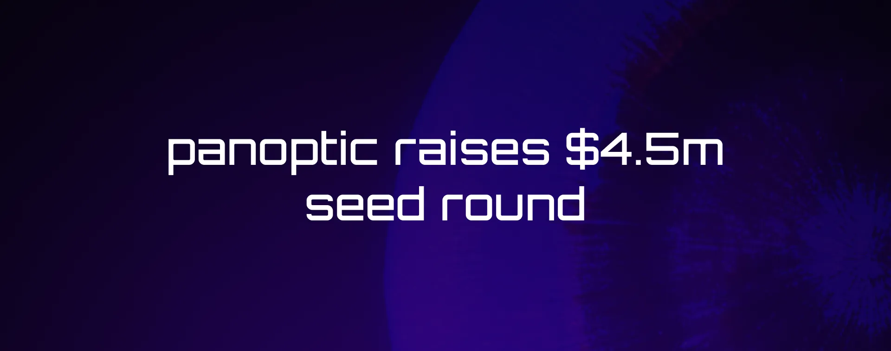

We are pleased to announce that the Panoptic team has raised $4.5M in seed funding!

The round is led by gumi Cryptos Capital (gCC), with significant contributions from Uniswap Labs Ventures, Coinbase Ventures, Jane Street, Blizzard (the Avalanche Ecosystem Fund), Zee Prime Capital, and many others, including strategic founders in the DeFi space.

<!--truncate-->

The Panoptic team has been building for the past six months to create an innovative perpetual options protocol.

Due for release in the first quarter of 2023, the Panoptic protocol will make it possible for anyone to trade options on any digital asset in a completely decentralized and permissionless manner. The Panoptic protocol builds on top of the ground-breaking Uniswap v3 automated market maker (AMM), which pioneered the idea of concentrated liquidity provisioning, to create a non-custodial “options clearing house” that features instant settlement, no counterparty risk, and no reliance on external oracles.

“We see Panoptic as a true 0-to-1 innovation for on-chain options”, said Guillaume, Founder and Chief Executive Officer of Panoptic. “The same way Uniswap revolutionized spot trading by making order books irrelevant, Panoptic will transform what it means to trade options by getting rid of the Options chain and enabling liquid markets without the need for intermediaries and centralized points of failure.”

“The collapse of FTX underscores the need for exchange markets that eliminate counterparty risk,” said Miko Matsumura, Managing Partner at gumi Cryptos Capital. “the Panoptic team, working closely with our co-investor Uniswap Labs Ventures, has the technical excellence to make fundamental and lasting improvements to the world’s financial infrastructure.”

Follow our socials to stay up to date:

- https://www.panoptic.xyz/
- https://twitter.com/Panoptic_xyz
- https://discord.gg/7fE8SN9pRT
- https://www.linkedin.com/company/panoptic-xyz
- https://github.com/panoptic-labs/research
- https://docs.panoptic.xyz/ for protocol documentation

Follow and star Panoptic Research at:
- https://github.com/panoptic-labs/research

Link to the original post on the Panoptic website announced on December 5, 2022:
- https://www.panoptic.xyz/blog-posts/seed-round