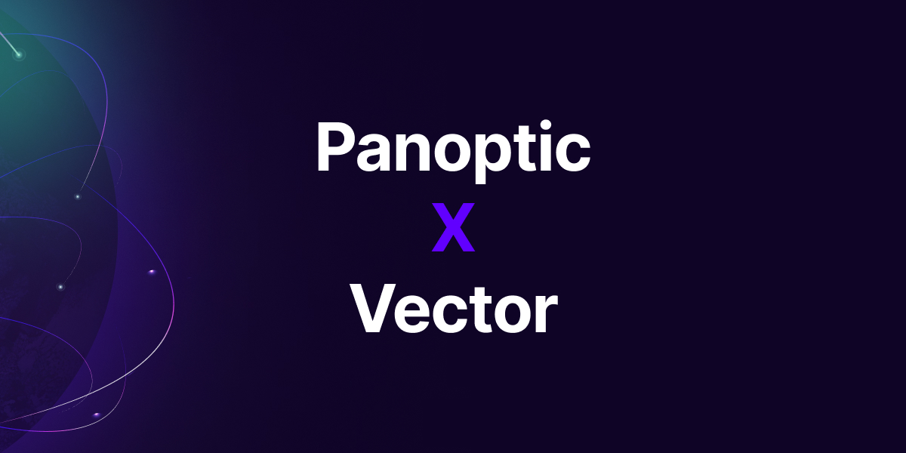

We are excited to announce that Panoptic and[ Vector DAO](https://vectordao.com/) will partner to develop the user interface (UI) and user experience (UX) of our decentralized application.‍

<!--truncate-->

Vector DAO is a community comprising the best 1% of designers, brand specialists, and creatives who are rebalancing the scales in favor of builders. Their expertise spans brand identification and strategy, marketing website design, and product design, among other areas.

> “We are thrilled to be accepted into the Vector DAO network and are eager to design the UI/UX from scratch in close collaboration with the highly experienced team. Designers in Vector DAO’s network have worked on numerous DeFi applications, including the design of Uniswap,” said COO Jesper Kristensen.

The design team has been assembled, and the development process is already underway. Following an extensive research and discovery phase, initial versions of wireframes are completed, and the team is currently working on higher-fidelity iterations.

We will share further updates through our [social media channels](https://links.panoptic.xyz/all), and we eagerly anticipate unveiling the finalized designs in the first quarter of the upcoming year.

To learn more about Panoptic, check out our [docs](https://panoptic.xyz/docs/intro) and head to our [website](https://panoptic.xyz/).

