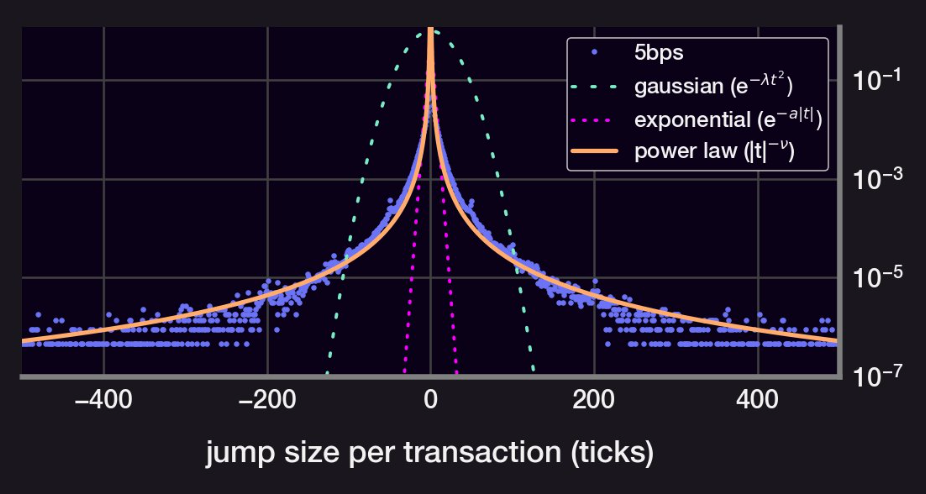
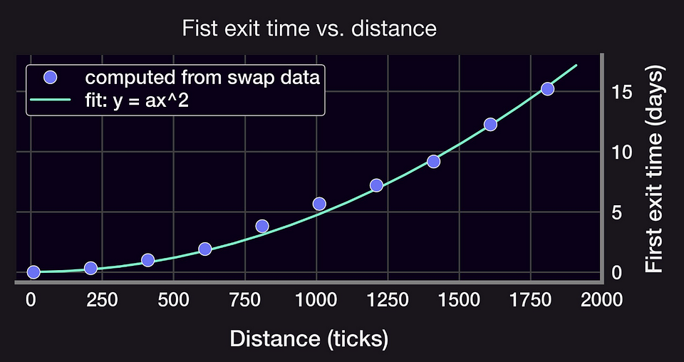
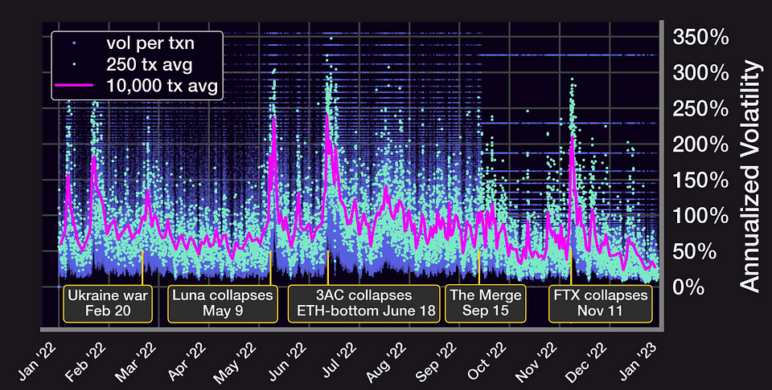
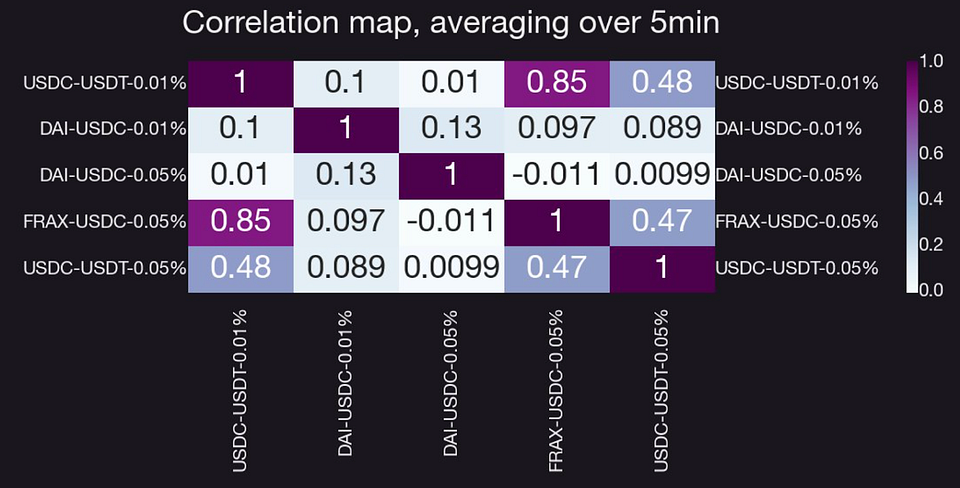
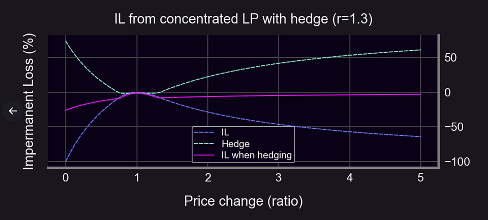
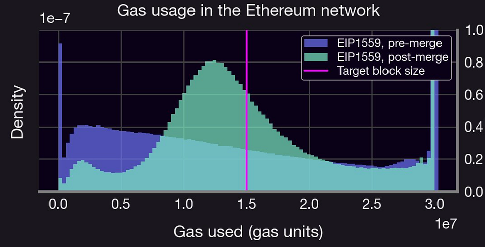
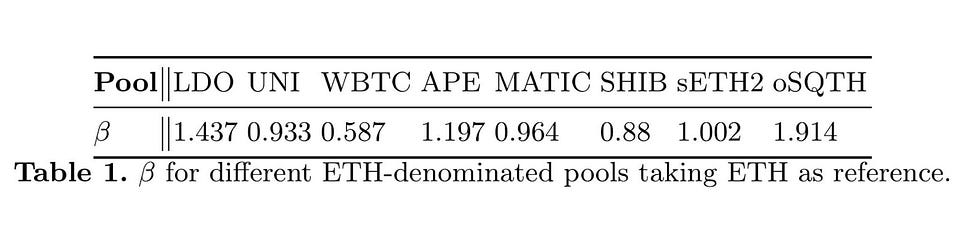
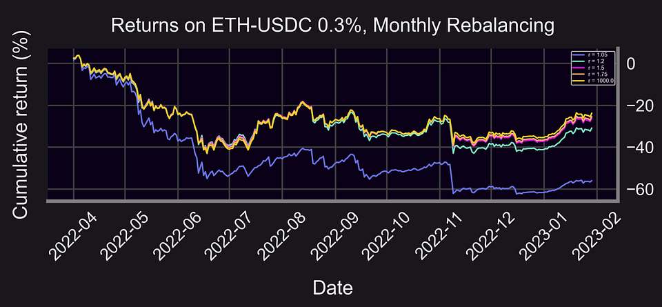

Research is at the heart of Panoptic. To build upon this focus, we [launched](https://panoptic.xyz/blog/panoptic-defi-options-research-launch) our Research Bites in January.

Panoptic Research is a publicly accessible, free-to-use collection of research analysis and corresponding code hosted on our [GitHub repository](https://github.com/panoptic-labs/research). Our research is oriented towards providing liquidity in Uniswap and more generally in concentrated liquidity automatic market makers (AMMs).

<!--truncate-->

Under the Research Bites initiative, we have two separate tracks: our main Research Bites and our Research Tutorials.

Here are the Research Bites we’ve published so far:

* [Jan. 5: Research Bite is published under the tag #ResearchBites](https://twitter.com/guil_lambert/status/1611151537039884290?s=20&t=_OOjlZUlTcfjOZVSdLfeMA)
* [Jan. 12: Panoptic’s Research is officially launched](https://twitter.com/Panoptic_xyz/status/1613496658070802433?s=20&t=_OOjlZUlTcfjOZVSdLfeMA)
* [Jan. 16: How to obtain historical UniV3 data? 🧵 ](https://twitter.com/Panoptic_xyz/status/1615373053705306112?s=20&t=_OOjlZUlTcfjOZVSdLfeMA)
* [Jan. 18: How do you LP on UniV3 with a ±% range?](https://twitter.com/Panoptic_xyz/status/1615816389490802689?s=20&t=pp6LefJX2MqBGvEe6C4NnQ)
* [Jan. 20: How long does the price remain within a given range on Uniswap?](https://twitter.com/Panoptic_xyz/status/1616518726282792960)
* [Jan. 23: The excitement behind stablecoin pools](https://twitter.com/Panoptic_xyz/status/1617628299542560769)
* [Jan. 25: How to hedge ANYTHING with options](https://twitter.com/Panoptic_xyz/status/1618353035138457600)
* [Jan. 26: Examine how The Merge impacted Ethereum's gas fee market](https://twitter.com/Panoptic_xyz/status/1618777173061668867)
* [Feb 1: Looking at different (financial) Greeks](https://twitter.com/Panoptic_xyz/status/1620829599402971136)
* [Feb 2: Analyzing simulated LP performance on ETH-USDC 0.3% pool](https://twitter.com/Panoptic_xyz/status/1621252130815483904)

**Disclaimer**: This is never financial advice, and you must always do your own research (DYOR). This content is provided free of charge and solely for educational reasons.

## Research Tutorials

The goal in launching our Research Tutorials is to make it easier for readers of our Research Bites to follow along and replicate our results.

Look for future tutorials to be posted to this [repo](https://github.com/panoptic-labs/research/tree/main/_research-bites/_tutorials), and let us know if you’d like to see a specific tutorial.

## Research Bites

The main track of our research is the Research Bites. [Here’s](https://github.com/panoptic-labs/research) where we do a deep dive into decentralized finance (DeFi) options, liquidity in Uniswap, and concentrated liquidity AMMs.

We’ve laid out a preview of some of our research bites for you below.

### Does the price of the most traded asset in Uniswap v3 follow a Geometric Brownian Motion (GBM)?

We looked at the ETH-USDC Uniswap v3 (UniV3) pools and discovered that the price fluctuates in a way that deviates significantly from a Gaussian distribution. It even deviates from an exponential pattern.

Upon exploration, we learned that the distribution more closely resembles a power law:

_Price jump size distribution. A power law best describes the empirical distribution._

The key insights are:

* The 5bps pool gets 90% of all USDC volume
* The 5bps pool likely follows the CEX price more closely due to its 0.05% arbitrage fee
* The distribution of price jumps does not follow a normal distribution
* The price jumps follow a power law distribution (!)

And we were left with a few open research questions:

* Can a GBM have a power law random process?
* What is the impact of a large kurtosis on price action?

Read the full Research Bite [here](https://twitter.com/guil_lambert/status/1611151537039884290?s=20&t=_OOjlZUlTcfjOZVSdLfeMA).

### How long does the price remain within a given range?

In our comprehensive analysis, we delved into the intricate connection between the range of deployed liquidity and the duration it takes to first exit that range. Our findings uncovered a compelling relationship that adheres to a quadratic law.

_First exit time versus distance away from the current price point._

This seems to follow from the price *ticks* moving as a GBM.

Delving deeper into this new territory, we derived a “per tx” volatility based on the exit times.

_The first known attempt at creating a volatility indicator for LPs._

Because significant occurrences have been flagged in this data, the volatility indicator (which is the average of several transactions) contains valuable information.

This research yielded several key insights, including:

* The average time spent within a range ±h scales as (h/σ)²
* E[first exit time] can be used to develop resilient and efficient volatility estimators (when on-chain σFTE ?)
* The volatility calculation in the ETH-USDC pool can highlight volatile macro events

There remain several open research questions that warrant further exploration:

* Does this still hold if price ticks are not a Brownian motion?
* What about 30bps and 100bps pools?
* Should the range be adjusted for different volatility environments?
* What’s the optimal range for a given σ?

Read more on this topic [here](https://twitter.com/Panoptic_xyz/status/1616518726282792960).

### How correlated are prices between stablecoin pools?

In another Research Bite, we looked at how different pools of stablecoins are linked together. If the behavior of stablecoin pools is understood, it makes it easier to forward test and model them  

Beta-trading methods, such as stat-arb, can be developed with the use of knowledge about inter-pool correlations. We analyzed USDC, USDT, DAI, and FRAX in this context.

According to the findings, the connection is:

_The correlation matrix of the largest stablecoin pools._

The key insights from this research were:

* The per-tx price is less stable than one would think!
* There is, on average, ~1 tx every 5 minutes across all pools
* Tx amount ~log-normal; time between txs ~exponential
* Price across some pools are weakly correlated, with Dai being the odd one out

Read more on the subject [here](https://twitter.com/Panoptic_xyz/status/1617628299542560769)

### How to hedge anything (including UniV3 LP positions) with Options

We [published](https://twitter.com/Panoptic_xyz/status/1618353035138457600) a bite on hedging strategies for all types of holdings and portfolios, including UniV3 LP positions.

Summarizing the key takeaways from our research:

1. Be aware of the impact that price fluctuations have on your position
2. Find an opposite reaction
3. Determine which investments will produce the opposite effect (your hedge)
4. Buy the hedge. Hint: you can use Panoptic!
5. Rest easy knowing you’re protected.

Then, we looked into hedging impermanent loss (IL) with a strangle.

_How to hedge impermanent loss using Panoptic_

Note that shorting LP positions cannot be done when interfacing with AMMs. This is possible only with Panoptic. In Panoptic, shorting LP positions is permitted for any asset and at any strike price.

Key insights:

* LP positions look like short puts → LPers are selling options
* The only way to fully hedge an LP position is to short it

In addition, hedging with traditional options can be costly in terms of time and money spent rolling positions. But these costs can be avoided by using Panoptic’s perpetual options (XPOs).

Read more of this research [here](https://twitter.com/Panoptic_xyz/status/1618353035138457600).

### How did ‘The Merge’ impact Ethereum’s gas fee market?

Optimizing gas usage in Solidity smart contracts is a complex problem. Our goal with this bite was to provide a high-level overview of the gas fee market and the factors that go into setting gas pricing.

We see that gas distributions shifted following ‘The Merge’ which made Ethereum a more stable and cost-effective network. It also made block time more predictable (almost always 12 seconds). Pre-merge, the block time was roughly exponentially distributed.

_The gas usage moved closer to the target block size post-merge. Other benefits are discussed in the bite_

Read more about this topic [here](https://twitter.com/Panoptic_xyz/status/1618777173061668867).

### How to Hedge using Beta

The beta (β) of an asset or portfolio is the ratio of its risk to that of a market index (M). Higher correlation and relative risk both increase beta (ratio of volatilities).

In this bite, we demonstrated how to calculate and evaluate beta for several different pools. Then, we showed how to protect yourself against the market’s and economy’s long-term structural risks.

Market risk can be eliminated from a portfolio S of value V by shorting V * β(S; M) units of the market index M.

Further, we compare the β of ETH to SPY (just for kicks) and then to several different stablecoin pools with concrete instances (more “apples to apples” comparison).

The beta values we obtain are:

In summary:

* β measures risk w.r.t. a market index M. Different markets = different β
* There is no SPY equivalent in DeFi which means that we’d need to construct a M when β-hedging cryptos
* Can also use β to hedge options, but it’s more complicated (more on this later!)
* β(oSQTH; ETH) = 2 β(ETH; ETH), i.e., oSQTH is twice as volatile as ETH (easy to generalize to other power perpetuals).

Read an overview of the subject [here](https://twitter.com/Panoptic_xyz/status/1620829599402971136).

### LP Performance Analysis

We took a look at how the ETH-USDC 0.3% pool would perform for a simple LP strategy.

We posed the following questions:

* How wide should your LP positions be for optimal returns?
* In this regard, is there a difference between a bear and a bull market?

We tested various range factors (widths of the LP positions). To maximize returns, we found that a narrower range was preferable in the bull market, but a wider range was better in the bear market.

We determined that cumulative returns to the backtested LP strategy were nearly 20 percent during the ten-month bull market period for most range factors.

_Bull market returns using monthly rebalancing of the ETH-USDC 0.3% pool using various widths (ranges, r) of deployed liquidity._

In the bear market, the cumulative returns would be negative — but not as negative as HODLing ETH.

_Bear market returns using monthly rebalancing of the ETH-USDC 0.3% pool using various widths (ranges, r) of deployed liquidity._

Caveats:

* Returns are overstated as they ignore gas & rebalancing fees
* Assumes fees/returns compound day-over-day
* Past performance is no guarantee of future results

Open questions:

* How would returns on other pools like UNI, WBTC, and SHIB compare?
* How does the optimal range factor compare for stablecoin pools?

Get the full view of our research on this subject [here](https://twitter.com/Panoptic_xyz/status/1621252130815483904).

Please get in touch with us if you have any questions or wish to contribute your own research. You can also clone, modify, and build upon our work. The goal of our work is to advance DeFi — and OpFi in particular.

Follow and star our [repository](https://github.com/panoptic-labs/research) to find to stay ahead of the curve on all of Panoptic’s latest research. Join the growing community of Panopticians and be the first to hear our latest announcements by following us on all [social media platforms](https://links.panoptic.xyz/all).  

