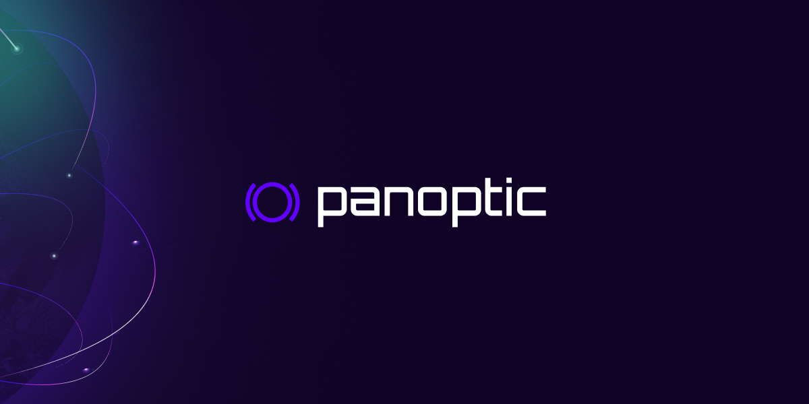
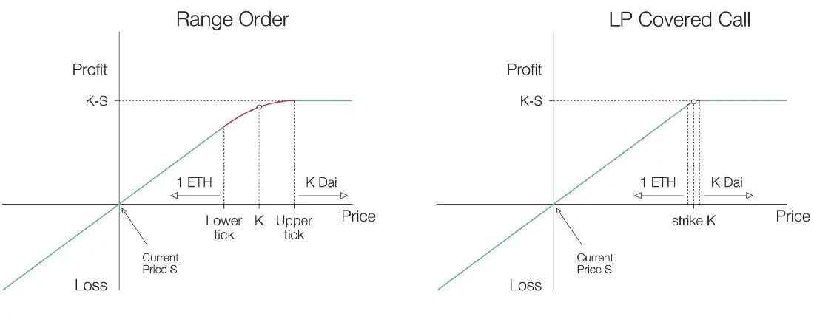
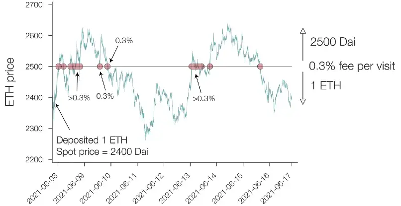
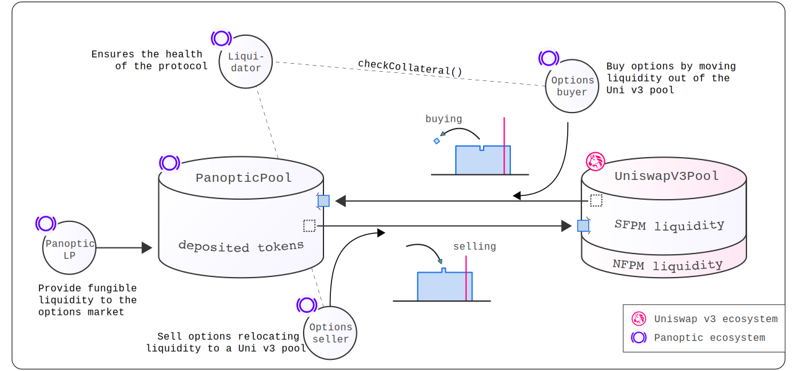
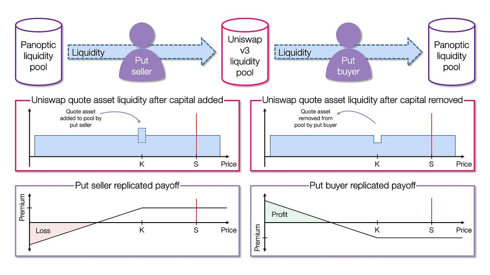
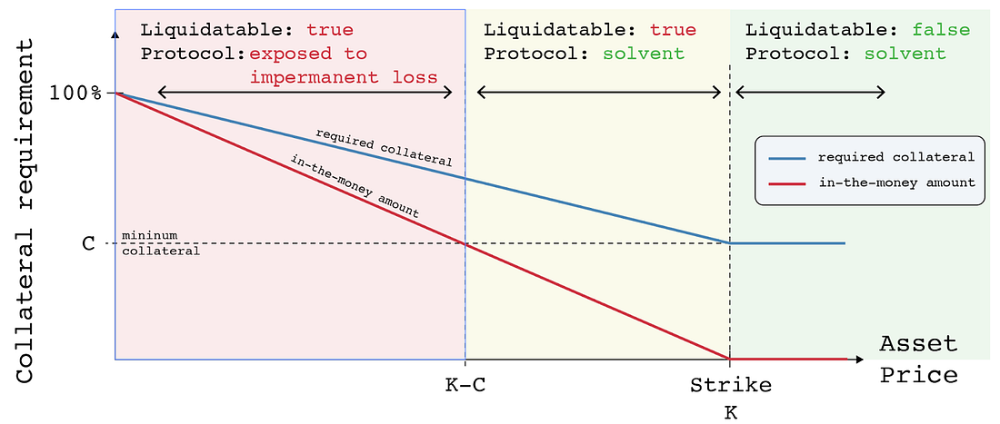

In this post, we aim to explain the reason for building Panoptic. We do so in great detail and cover exactly how it works with examples.
Let’s get started.

<!--truncate-->

---

On-chain options were first introduced a few years ago, and the landscape has grown rapidly ever since, with an abundance of new mechanisms created to facilitate trading.

However, until now, issues such as

- unsatisfactory liquidity provider (LP) returns,
- inefficient pricing,
- limited liquidity for a small set of underlying assets across a restricted range of strike prices and maturity dates,
- and burdensome user experience (UX)

have restrained adoption and capital from flowing into the space, especially on Ethereum mainnet.

In Traditional Finance (TradFi), the options market commands more capital than equities. This is currently not the case in crypto. This is due to the need for more infrastructure and the availability of working products.

In fact, crypto options trading pales in comparison to its spot market. The majority of crypto options trading is, at the time of writing, happening on one *centralized* exchange (CEX): Deribit.

According to Coinglass, the open interest for bitcoin (BTC) and ether (ETH) options on CEXs was ~$14,960m, of which Deribit had a ~89% share on the 22nd of February, 2023.

In comparison, as reported by DefiLlama, the total value locked (TVL) of all assets across option protocols was ~$160m on the same day, which can be used to approximate open interest. The average daily options volume for BTC and ETH on the largest CEXs was ~$1,266m month-to-date (MTD), according to The Block. **This represented ~3% of the average daily BTC, and ETH spot volume traded MTD as per data from CoinGecko**.

It is clear that the on-chain options space is still waiting for a _disruptive_ moment similar to when constant function market makers were established for decentralized finance (DeFi) spot trading.
This inspired us to develop an unparalleled on-chain options solution that will naturally solve the problems that the space has historically struggled with and will facilitate on-chain options penetration.

## **The state of crypto options**

On-chain options have historically been enabled mainly through three different designs: central limit order books (CLOBs), automated market makers (AMMs), and DeFi option vaults (DOVs). CLOBs are fairly simple to understand. An option is written by someone, normally against the collateral of the underlying asset, and then bought by another actor who pays a premium to the option writer. Trades are facilitated in two ways: on-chain, where order matching and trade settlement occurs on a blockchain, and hybrid, where order matching occurs off-chain and trade settlement on-chain.

- Contrastingly, option AMMs and DOVs are automated option writes. An LP deposits capital into a vault and the vault then uses the capital to sell options to buyers. AMMs continuously sell options, usually short-dated and close to in-the-money (ITM).
- At the same time, DOVs perform weekly batch auctions of options with weekly expiries and are far out-of-the-money (OTM) to professional off-chain market makers.

On a fundamental level, neither of these solutions facilitates an efficient options market. AMMs are seldom able to buy back options, and as such, buyers are locked into their positions until expiry, while options sold by DOVs cannot be accessed by regular traders — a necessary feature to have.

Interestingly, market participants have started pushing implied volatility (IV) lower in anticipation of DOVs’ weekly auctions, forcing DOVs to sell underpriced options. By studying hourly 1-week ETH-USD at-the-money (ATM) IV data from September 2021 to September 2022,[ Paradigm showed](https://www.paradigm.co/blog/paradigm-defi-options-vaults) that the IV around Fridays — when DOVs typically conduct auctions — has been up to 4 vols below the prior 24 hours on average. This approximately translates to 5.4% missed gains in APY for a 1-week 10 delta call option.

In other words, DOV LPs _could_ have earned an additional ~5% between September 2021, and September 2022 had the auctions not been front-run by the market.

Liquidity, in addition to efficient pricing, is arguably the most important aspect of an options protocol. Protocols have traditionally bootstrapped capital by boosting LP returns through emissions. As emissions decrease, funds flow elsewhere since LPs face high opportunity costs and returns become unsatisfactory. The design of on-chain CLOBs inherently fragments liquidity, and CEXs offer a better trading experience. This again deters traders from using CLOB-based protocols and, thus, additional liquidity from migrating into the system.

Meanwhile, providing liquidity to most AMMs and DOVs is problematic because LPs do not know beforehand for which strike prices and expiry dates their capital will be used, meaning that they cannot effectively, e.g., hedge their positions. The average returns from the more automated strategies do not compensate for the risk that LPs are taking since LPs are continuously exposed to unlimited downside in exchange for modest, limited upside. Some protocols have started delta hedging LP positions to alleviate this problem, but since a constant hedge is usually expensive to maintain, it has resulted in high taker fees.

Panoptic circumvents the issues discussed above, and many more, by building options on top of Uniswap v3 liquidity pools, enabling users to mint perpetual options that never expire.

To understand the protocol’s key mechanisms, let us first examine what supplying concentrated liquidity on Uniswap fundamentally means.

## **Providing concentrated liquidity or selling options?**

Deploying liquidity to a Uniswap v3 pool requires an LP to specify a range of prices for which the deployed capital is active in the pool. In comparison, the previous Uniswap versions functioned by evenly spreading liquidity between all possible prices, i.e., from zero to infinity. The v3 update’s purpose was originally to improve capital efficiency and give users granular control of their liquidity positions, but the new system also unintendedly generates liquidity positions that effectively mimic the payoff of two types of option positions: cash-secured puts (selling a put option and simultaneously setting aside enough cash to buy the underlying at the strike price) and covered calls (selling a call option on an underlying that is already owned). Due to[ put-call parity](https://www.cmegroup.com/education/courses/introduction-to-options/put-call-parity.html), the two types of positions have the same payoff diagrams.

The payoff profiles derive from the fact that v3 LPs can create range orders by providing a single asset as liquidity within a specific range outside the current price. As the price moves through the range, the supplied asset is swapped with the paired asset in the pool along a smooth function. The range of prices can be arbitrarily chosen and is defined by “ticks,” with fees earned on each trade that happens within the range. By decreasing the range to a single tick at price K, the supplied asset is completely swapped with the paired asset immediately when the spot price crosses K. This replicates the payoff of a cash-secured put/covered call with strike price K, depending on which side of the spot price liquidity is provided to.

To crystallize the idea, let us look at an example through an ETH-DAI pool, i.e., ETH is the base asset, and DAI is the quote asset. Imagine an LP supplies the base asset to the pool at a one-tick range above the spot price. As long as the spot price stays below the tick, the position will comprise 100% of the base asset, but immediately when the spot price exceeds the range, the base asset will be fully swapped against the quote asset. This replicates a covered call payoff on the base asset.

In contrast, if an LP supplies the quote asset at a one-tick range, the position will comprise 100% of the quote asset when the spot price is above the range. When the spot price decreases below the chosen tick, the quote asset is fully swapped against the base asset. This replicates a cash-secured put payoff on the base asset. It is noteworthy that Uniswap does not allow one-sided base asset liquidity to be provided at a range lower than the spot price because, as the spot price drops, the liquidity pool requires more of the quote asset instead of the base asset. The same logic prevents an LP from providing one-sided liquidity for the quote asset at a range above the spot price.

*LP range order payoff functions, excluding trading fees, as the range's width decreases. Here, one-sided liquidity for ETH is provided*

Since these payoffs are derived from liquidity pools through LP tokens, there are a few differences from traditional options.

- Firstly, the options have no expiration dates, and the underlying assets are automatically converted by trading activity.

- Secondly, the price of a conventional option, and thus the premiums a seller receives, can be derived using the Black–Scholes model.

In short, the price depends on the current spot price, the time to expiration, and the IV. In contrast, a Uniswap LP receives trading fees from the underlying liquidity pool.

> *These fees can be related to option premiums.*

As stated earlier, LPs generate fees when the spot price moves into the range that they have chosen. When the range’s width is a single tick, it can be assumed that the price will not dwell in the single-tick range for long, and therefore, premiums are effectively based on two factors:

- The number of times the price crosses the single tick

- and the underlying pool’s fee rate.

_Premiums earned on an LP covered call position with a single-tick range at $2,500_

Put differently, there is no upper limit on the amount of premium one can collect through a Uniswap v3 LP position.

As such, all Black–Scholes models break down since the concept of expiration does not exist.

## **Panoptic joins the battle**

To summarize, providing liquidity into a Uniswap v3 pool is akin to shorting an option.

Reversing the liquidity position creates a theoretical long-option payoff. However, implementing a structure that permits lending from an LP position is not feasible since each Uniswap position is unique and non-fungible.

This is where Panoptic comes in.

The protocol enables the creation of option-like payoffs by moving liquidity between ecosystem participants while collecting a commission fee for facilitating the transactions. If a token pair has a Uniswap v3 pool, Panoptic can create an options market on that pair. This starkly contrasts with CEXs and previous options protocols, which currently only offer options on a handful of whitelisted token pairs.

The mechanisms deployed by Panoptic naturally solve many of the issues that other DeFi option facilitators have struggled with. Pricing options correctly and efficiently has been challenging for many on-chain CLOBs and option AMMs, while DOVs suffer from misaligned incentives between off-chain market makers and vault depositors.

Since DOVs do not have a secondary market for offloading inventory, they are constrained to auctioning options to the highest bidding market makers. Price discovery is inefficient because there is a limited number of these buyers, leading to underpriced options.

Meanwhile, option AMMs and CLOBs utilize heavily modified Black–Scholes models to derive prices. This is problematic because blockchain technology is not developed enough to efficiently run these computationally intensive equations.

Inaccurate pricing introduces toxic flow, where takers, who can more precisely price options off-chain, exploit underpriced options, creating profits for themselves at the expense of LPs. To combat this, protocols have started introducing increasingly complicated models and compensation mechanisms, which may solve one problem but usually introduce another.

In contrast, because Panoptic’s options are built on top of LP tokens, the pricing is path dependent, and there is no need for Black–Scholes models. Another inefficiency with protocols that utilize Black–Scholes pricing is their reliance on _oracles_.[ Oracles are prone to price manipulation](https://medium.com/@jesperkristensen58/panoptic-elevating-defi-and-removing-oracles-5b31df1541dc) and are not suited for low-liquidity, long-tail tokens. Panoptic’s design enables it to accurately price options on any tokens with Uniswap v3 liquidity, completely circumventing the need for oracles.

Panoptic’s ecosystem comprises three main participants: liquidity providers whose capital is utilized by option sellers and who receive a yield from lending out their capital; option sellers who deposit collateral and use it to borrow capital from LPs to create short options by providing concentrated liquidity to Uniswap v3 pools; and option buyers who deposit collateral to pay for sellers’ potential premiums and who remove the capital deployed to Uniswap v3 pools by option writers, creating long positions. It is good to note that a specific option must be written through Panoptic by a seller before a long position can be opened.

However, since positions are fungible, the size of a long position does not have to match the size of a sold option. Instead, the option can be bought in fractions. If a trader wants to buy an option that is not yet supplied, they can create a buy signal by sending a transaction with a low base fee into the mempool. This design will further be built out in the future. Then, by bundling the buyer’s order with their transaction, an option seller may increase the returns for themselves and Panoptic LPs.

In other words, if the demand for a low-supply option is high, both LPs and option writers can benefit when the supply is increased.

_Panoptic’s ecosystem with its participants highlighted_

By separating LPs and option sellers, Panoptic creates roles with clearly defined risk and return profiles suited for different market participants, increasing capital efficiency, flexibility, and the availability of opportunities across all levels of investors. If there is enough capital in the Panoptic ecosystem, its participants can withdraw their funds whenever they want.

The protocol additionally ensures that LP and seller positions are liquid through two mechanisms:

- Firstly, the more available liquidity a buyer removes, the more premiums they pay. This disincentivizes a buyer from draining a large fraction of the accessible capital.

- Secondly, to release liquidity, any user can force a long option position far from its range to be exercised or closed against a small payment. When an option is far from its range, it does not generate fees for the seller. This also means that the option is far OTM or ITM; thus, the buyer gains very little from the option itself by holding it further. 

In contrast to Panoptic, option AMMs and DOVs bundle LPing and option selling together, generally leading to LP capital not being very liquid. This is because funds are usually locked for the duration of a vault’s epoch to ensure that the risk associated with outstanding liabilities is fairly distributed.

Each role across Panoptic’s ecosystem is distinctly incentivized to attract users and capital to the protocol. LPs are offered a straightforward process for earning low-risk, passive yield. Option sellers gain access to inexpensive leverage, and the UX is simplified compared to providing liquidity on Uniswap.

Furthermore, in addition to earning premiums on the written options, comparable to Uniswap LP fees, sellers also accumulate yield on their collateral. Option buyers can also easily leverage their positions and pay the same premiums as they would for a Black–Scholes priced option on average, but their positions are much more flexible.

In other words, Panoptic options provide more utility to buyers at the same price as traditional alternatives.

## **The recipe for Panoptic options**

To understand how Panoptic creates option-like payoffs through LP tokens, let us go back to the ETH-DAI liquidity pool example:

- Firstly, an option seller borrows capital deposited to Panoptic by a liquidity provider. In this case, K of the quote asset (DAI), which is then supplied to the Uniswap pool at a one-tick range at K (&lt; the spot price, S), creating a short OTM put position on ETH with a strike price K.

- After this, an option buyer can remove the liquidity from the Uniswap pool against collateral and transfer it to Panoptic’s pool, creating a long OTM put position on ETH with a strike price K. If the option stays OTM, the buyer may close the option by simply moving K of the quote asset back to the Uniswap pool at no cost. Conversely, if the option is ITM, the buyer can exercise the option by supplying 1 unit of the base asset (ETH) to Panoptic, to get K of the quote asset back. In other words, when the spot price is below the strike price, the put option guarantees that the buyer can sell 1 ETH for K DAI, regardless of how low the value of ETH is in terms of DAI. On the other hand, to close an ITM position, the option seller removes 1 unit of the base asset at strike price K from Panoptic by supplying K of the quote asset. In other words, when the spot price is below the strike price, the option seller is obligated to purchase 1 ETH for K DAI, irrespective of how low the value of ETH is in terms of DAI.

- Note that this process fully builds on a cash-secured put position that is created when concentrated liquidity is supplied for the quote asset below the spot price to a Uniswap liquidity pool. Alternatively, if an option writer wants to mint a put on ETH that is already ITM, the writer replicates a covered call payoff by borrowing the base asset from a Panoptic LP and supplying it as concentrated liquidity into a Uniswap pool above the spot price.

- Unsurprisingly, a buyer enters into a long ITM put position by moving the supplied liquidity back to Panoptic.

_Short and long OTM put positions are created by moving the quote asset between Panoptic and Uniswap v3 liquidity pools_

Even though supplying the base asset above the spot price to a Uniswap pool is similar to a covered call strategy, the process alone cannot create a vanilla short-call position.

Instead, Panoptic utilizes the relationship between a token pair and its inverted counterparty. On a fundamental level, a put position on the base asset in, e.g., an ETH-DAI pool is identical to a call position on the base asset when the token pair is inverted, i.e., in a DAI-ETH pool.

Therefore, a call on ETH at strike K (= ETH/DAI) in an ETH-DAI pool is identical to a put on DAI at strike 1/K (= DAI/ETH) in a DAI-ETH pool. A short put on DAI (short call on ETH) is created by supplying the quote asset, here ETH, at a single-tick range of 1/K (&lt; 1/S &lt; S &lt; K), i.e., the same process as described earlier but the token pair is inverted.

Finally, it is important to reiterate that a Panoptic liquidity provider owns the capital deployed to the underlying Uniswap pool, and an option seller/buyer is merely relocating funds.

When an option buyer removes the capital from the Uniswap pool, it is moved to the Panoptic liquidity pool. This ensures the protocol can access relocated funds and enables under-collateralized options writing.

## **Advantage of perpetual options**

What makes perpetual options so special?

One key advantage of creating perpetual options on top of LP tokens is that liquidity does not become *fragmented*. As no fixed expiration dates or pre-specified premiums exist, all option writers for the same underlying token pair sell identical option contracts across strike prices. Panoptic can be considered a *virtual liquidity manager for Uniswap v3 positions*.

Option buyers and sellers, during their trading, help reposition liquidity at various prices. The design is extremely beneficial since on-chain options liquidity is currently very limited, and most solutions can only offer options on a few underlyings with short expiration dates.

Thus, Panoptic will facilitate the adoption of on-chain options as they can more reliably be used as, e.g., a risk management tool.

Another advantage of perpetual options over the traditional alternative is the ability to alter an option’s payoff profile, and thus greeks, by changing its range. In other words, a Panoptic option writer is not forced to deploy liquidity in a single-tick range introduced above; through its UI, the protocol encourages users to write options with a width of >5%. For example, a strike price (K) of 100 and a width (W) of 10% equate to a range with a lower bound of ~91 and an upper bound of 110, i.e., the option’s width is bound by:

$\frac{K}{1+W} \text{ and } K\cdot(1+W)$

The size of a Panoptic option’s premium is based on the spot price’s proximity to the range of the option, meaning that the price of a Panoptic option is path-dependent.

When the range has a width of a single tick, the option’s price increases every time the spot price passes the range. In comparison, when the range’s width increases, the option’s price increases as the spot price is inside the range.

Increasing an option’s width means a seller earns fewer fees per tick when the spot price is in the range. This is because the provided liquidity is spread across a wider area, which leads to less capital accumulating fees for every tick. However, widening the range naturally increases the probability that the option accrues fees; therefore, continuing to widen an option’s range also smoothes out how quickly the price of an option increases over time.

It can be shown that the Gamma, which describes the rate of change in an option’s delta — change in an option’s value given a change in the underlying — given a change in the spot price, of an option can be capped by widening the range of the position, which in turn eliminates pin risk — uncertainty that arises to an option seller over whether an option will be exercised when the spot price is at or very close to the strike price when an option is approaching expiration.

_Showing how a panoption’s Delta and Gamma greeks behave_

An option’s width is comparable to a traditional option’s time to expiry. Increasing the width is equivalent to selling a longer-term option, while an option with a single-tick width is akin to a traditional option with less than one hour until expiry.

Simplifying, the price function of a traditional option with its expiry far away is smooth at the strike price because the option’s price consists of time value. As the option approaches its expiry, the time value decreases, and the price function begins to converge to a kink at the strike price because the underlying’s impact on the option’s price increases.

Due to the relationship between Panoptic and traditional options, option writers on Panoptic can easily tweak their positions’ greeks by changing the options’ widths, which enables unprecedented flexibility when it comes to selling options.

_The relationship between a Panoptic option’s width and a traditional option’s time to expiry_

As mentioned earlier, options built on top of LP tokens do not have an expiry date, so their prices cannot be derived through a conventional Black–Scholes model.

Consequently, Panoptic has developed a novel, oracle-free pricing concept called the *streaming premium*.

The price of a Panoptic option starts at zero and grows at each block based on the spot price’s proximity to the range of the option. In other words, the option’s price behaves similarly to how a Uniswap LP earns fees. The streaming premium formally corresponds to continuously integrating an option’s theta, the change in an option’s value with respect to time, i.e., time value.

While the Black–Scholes expression for theta follows a Gaussian distribution, the streaming premium model utilizes a rectangular function between the upper and lower bounds (the option’s range). Approximating the Gaussian distribution with the rectangular function enables the derivation of an “option-like” IV through earned fees.

Assuming a zero risk-free interest rate and that the underlying spot price is not constant, the price of a call option can be derived by integrating theta over the underlying’s stochastic price path (any variable that uncertainly changes over time follows a stochastic process, here, the price).

To crystallize this idea — since we know the change in an option’s value at a certain time in the past, which ultimately derives from the spot price, integrating over the path of the spot price tells us the net amount that the option’s value has changed over the specific price path.

Another way to think of the streaming premium is as a series of continuously expiring options that accumulate a premium at every time step, where the premium depends on the options’ theta. When the spot price is far away from the strike price (the option’s range), theta is small (zero). This is because the option is either worthless or “maximally valuable,” depending on whether the option is a call/put and whether the spot price is below/above the strike price. The impact that time has on the option’s value is therefore minimal and according to the streaming premium, no fees are accumulated. The contrary is true when the strike price is within the option’s range.

As a Panoptic option’s price depends on the time the spot price is within the option’s range, it is logical that a few extremal outcomes may emerge:

- First, if the spot price never enters the option’s price range, the option will cost nothing.
- Second, if the spot price is within the option’s range for an extended period of time, the option premium will increase and may become several times larger than the Black–Scholes premium.
- Interestingly, the average value of a Panoptic option converges to the Black–Scholes price when estimated through a Monte Carlo simulation based on Geometric Brownian Motion (type of stochastic process) and a holding period/days to expiration of 7 days is utilized. However, the price distribution of a Panoptic option — a Panoption — is quite wide, which makes sense since the option premium can be anything between zero and extremely high.

The streaming premium model is appealing from a practical perspective. It enables new financial products to be built and should change the way traders think about selling options.

Instead of betting on IV being overpriced by the market, a Panoption writer is forecasting volatility to stay in a certain range. Even though the options are perpetual, rational sellers will optimize the frequency at which they rebalance their positions to maximize their path-dependent fees.

If done accurately, as mentioned earlier, the premiums from selling a Panoptic option may vastly exceed those from a Black–Scholes option.

## **Improving the return on investment through capital efficiency**

Option protocols have historically required sellers to post full collateral.

Some protocols have recently introduced under-collateralization for special situations. In contrast, others have developed convoluted mechanisms that try to increase capital efficiency by reusing the capital posted as collateral.

In contrast, Panoptic will enable under-collateralized options by using built-in leverage, having similar margin account collateral requirements as those developed by traditional financial institutions. An option seller can write options with notional value (i.e., the amount of liquidity relocated to a Uniswap pool) circa five times larger than their collateral balance.

Moreover, Panoptic can reduce collateral requirements by combining many options into a single ERC1155 token to create defined-risk positions. Encoding information concerning up to four different options within the same pool allows the protocol to easily calculate the collateralization requirements of a set of interlinked options. This is especially important when creating multi-legged option positions with risk-defined profiles, even if each individual option may be exposed to infinite losses.

Collateralization can be considered an account’s buying power, which refers to the capital available to place a trade. Minting an option on Panoptic will reduce an account’s buying power depending on the following:

1. The notional value of the option,

2. the price of the underlying asset, and

3. the risks associated with trading the underlying asset

(1) and (2) are fairly straightforward, while (3) is evaluated by looking at the Uniswap pool utilization when the position is minted.

The logic behind this is that if an asset is in high demand, there will be a lot of trading activity, and most of the liquidity will not be accessible. Reduced liquidity implies that it is more difficult for traders to respond to market moves, which increases the risk for those specific pools. Therefore, increasing the collateral requirement for pools with high utilization helps mitigate risks associated with trading the underlying asset.

As an option goes from OTM to ITM, the collateral requirement for a seller increases, starting at 20%, and moves such that it is always higher than the amount of funds necessary to cover the option at a certain point in time. To determine whether an account is solvent, Panoptic computes and adds the collateral requirement for each account’s positions. Then, the total collateral requirement is compared against the amount of collateral deposited.

_The collateral requirement for a short put at strike K compared to the ITM amount_

There is a fourth participant in the Panoptic ecosystem that has not been mentioned until now. Namely, liquidators who ensure the health of the protocol by liquidating accounts whose collateral balance falls below the margin requirements.

By liquidating a position, liquidators receive a bonus which is determined by the distance between the strike price and the current price, and the amount of funds necessary to cover the option. Liquidation is performed by utilizing a liquidatee’s collateral to exercise ITM options and pay the liquidator. The goal of the liquidation system is to incentivize Panoptic LPs to operate as liquidators as well since a healthy liquidation system means that the protocol’s liquidity pools never incur a loss.

Panoptic’s liquidation system and clearly defined ecosystem roles enable under-collateralization. LPs earn a safe and automated yield on their funds, while collateral requirements for option sellers are minimized since they can tap into the protocol’s liquidity pools.

Furthermore, the utilized capital is always accessible by the protocol because it remains within the Panoptic-Uniswap ecosystem, which means that no bad debt can be accumulated.
These are huge improvements over traditionally utilized on-chain models, and Panoptic is already working on a wide array of new implementations to *further increase the protocol’s capital efficiency*.

Due to conventional option protocols bundling the LP and option seller positions together and relying on Black–Scholes pricing, it is extremely difficult for these protocols to build a proper margin system allowing users to take on leveraged positions.

Consequently, Panoptic options offer unprecedented capital efficiency, enabling the protocol’s users to attain a higher return on investment than anywhere else in the options space.

## **Summa summarum**

Until now, low liquidity together with inefficient and unsecure pricing have prevented on-chain options from reaching mass adoption.

Panoptic is set to change this while introducing mechanisms that have not been possible before. Perpetual options are extremely flexible and serve a purpose for a wide range of market participants, from sophisticated traders who can use the protocol to hedge risk in novel ways to traders who want to take on vast amounts of risk. Since options can be created on virtually any asset and liquidity is consolidated, Panoptic is well-positioned to establish an efficient options market.

Panoptic aims to facilitate composability and become the leading protocol in the options space by widening the options frontier.

There is still a lot to explore within the field of perpetual options, and our team is working hard to create a product that maximizes the utility for Panoptic users.

The goal is to exceed the expectations of every investor type by constructing an excellent UX/UI and enabling options that are fairly priced and have a high degree of capital efficiency.

Our testnet launch is scheduled for later this year — we could not be more excited!

Join the growing community of Panoptians and be the first to hear our latest updates by following us on our [social media platforms](https://links.panoptic.xyz/all). To learn more about Panoptic and all things DeFi options, check out our [docs](https://panoptic.xyz/docs/intro) and head to our [website](https://panoptic.xyz/).  

Thanks for reading!

> This post was written in collaboration with [Brick](https://twitter.com/0x___Brick) — follow him and check out his [substack here](https://thebrick.substack.com/).

