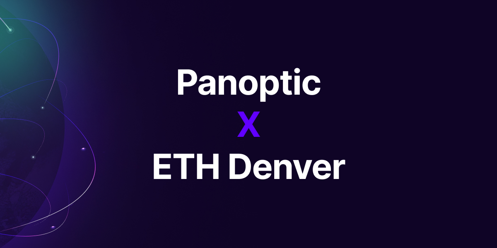
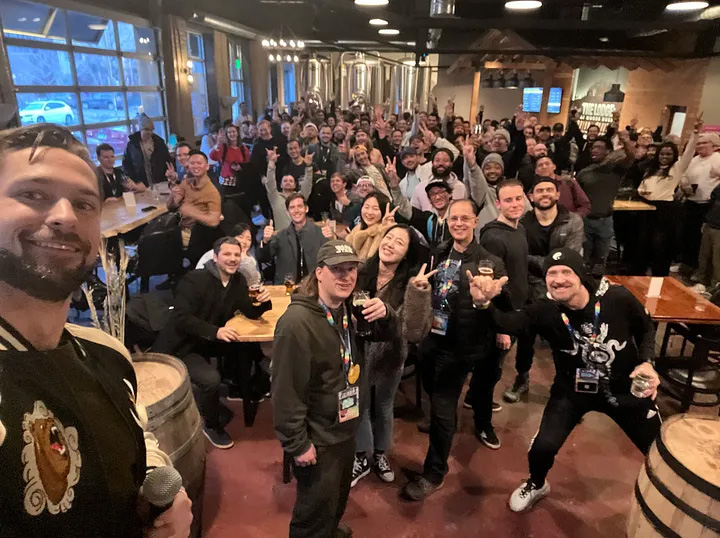
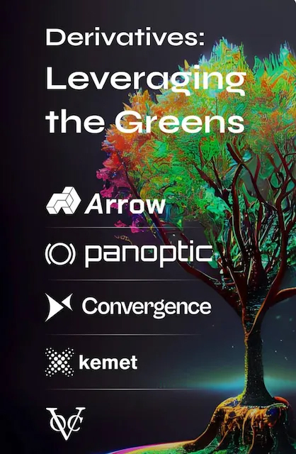
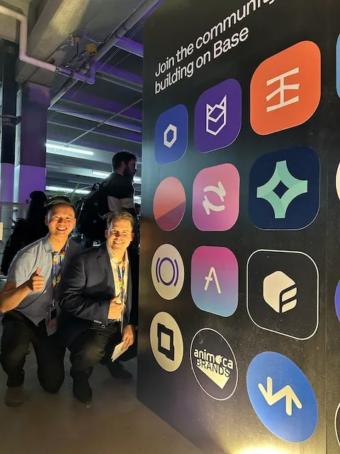

We are thrilled to share our experience at the ETH Denver 2023 Conference, where the Panoptic team recently spent an exciting and productive week. This event proved to be a remarkable platform for gaining fresh perspectives on the future of DeFi, while also forging invaluable personal connections with fellow participants.

<!--truncate-->

First and foremost, we would like to express our gratitude to the organizers of the conference for their incredible efforts in bringing this event to life. Without their dedication and hard work, such a successful and impactful gathering would not have been possible. We extend our heartfelt thanks to the entire team.

We would also like to take a moment to acknowledge and appreciate the unwavering support of our community throughout the conference. Your strong presence and enthusiasm were truly motivating, and we are grateful for your ongoing support.

Now, let's delve into our perspective and recap of the ETH Denver Conference:

### February 28

Jesper Kristensen, our COO, gave a presentation that ended with the first-ever live demo of the Panoptic protocol in a room full of DeFi enthusiasts.

<iframe width="560" height="315" src="https://www.youtube.com/embed/Dt5AdCNavjs" title="YouTube video player" frameborder="0" allow="accelerometer; autoplay; clipboard-write; encrypted-media; gyroscope; picture-in-picture; web-share" allowfullscreen></iframe>

This presentation came less than a year after our CEO, Guillaume Lambert, gave a [talk](https://panoptic.xyz/docs/faq/ask-the-founder#eth-denver-2022---riding-the-unicorn-uniswap-v3-as-a-perpetual-option-primitive) at ETH Denver 2022 on the initial idea underlying Panoptic.

In the time between presentations, we have achieved a number of significant milestones. These include successfully closing our seed round, building a highly competent team, and maintaining a laser-like focus on BUIDLing (building and contributing to the blockchain and cryptocurrency ecosystem) — resulting in a working model of our protocol.

The live demo of our product during this year's event marks a major milestone in our journey.

Reflecting on how far we’ve come, from early Desmos sketches to an operational product with payoff graphs run on bare-metal Javascript in less than a year, fills us with excitement and further motivates us.

View the slides from Jesper’s presentation [here](https://www.slideshare.net/Jesper34/panoptic-eth-denver-2023).

### March 1

We had the opportunity to explore various venues and engage with numerous builders and investors — including collaborators. While we cannot disclose all the specific details since some are part of our launch strategy; however, we can assure you that we have exciting plans in store.

We can say that we meet with the devs from [Gelato](https://www.gelato.network/), an organization we are building with. In total, our team collected more than 50 follow-ups from valuable connections, and we are currently sorting through them.

We thoroughly enjoyed attending the talks at the BUIDLhub venue and witnessing outstanding presentations from exceptional individuals.

Later, we went to the Bankless event. Can you spot the Panoptic team in this photo?

### March 2

We spent our time at the main event as it opened. The day offered a vast array of opportunities to explore and converse. Paradoxically, it was clear to see the energy in the prevailing bear market is extremely bullish.

Through our conversations, it became clear to see that a strong, passionate community is forming around Panoptic. This brought us a lot of joy, and we’re excited to stay in touch with the people we met.

Guillaume participated in a panel discussion titled "Future Finality: The Next Growthpole of DeFi.”

<iframe width="560" height="315" src="https://www.youtube.com/embed/Ash-91MIKb0" title="YouTube video player" frameborder="0" allow="accelerometer; autoplay; clipboard-write; encrypted-media; gyroscope; picture-in-picture; web-share" allowfullscreen></iframe>

Here, he showcased what we consider to be a crucial innovation required to propel DeFi to the next level — an advanced and robust DeFi-native derivatives infrastructure.

In the evening, we co-hosted an event called “Derivatives: Leveraging the Greens.” The event featured indoor golf simulators, an open premium bar, and great food. We had a fantastic time interacting with members of the DeFi and derivatives community, and we even conducted a simulated options trading competition, announcing the winners at the end of the evening.

The event's overwhelming turnout led us to extend the venue by an additional hour. We also had the opportunity to meet with other protocols and engage in discussions about various design choices and the exciting future of DeFi Options protocols.

Panoptic holds a unique position in the industry since it solves the critical liquidity issue. We serve as the derivatives infrastructure for the frontier of DeFi. Additionally, we are the first protocol to be fully integrated into the powerful "money legos" stack narrative, which we believe is a key value proposition for DeFi, creating a network effect in itself.

### March 3

On our fourth day at the conference, we went to see our good friends at Coinbase. Their Ventures arm participated in our [Seed Round](https://panoptic.xyz/blog/defi-options-protocol-seed-round), and we are partnering with them for their Base launch:

<blockquote class="twitter-tweet">
We&#39;re excited to be part of the <a href="https://twitter.com/hashtag/BuildOnBase?src=hash&amp;ref_src=twsrc%5Etfw">#BuildOnBase</a> DeFi ecosystem! <a href="https://t.co/qrgnb2TFV9">https://t.co/qrgnb2TFV9</a>
&mdash; Panoptic (@Panoptic_xyz) <a href="https://twitter.com/Panoptic_xyz/status/1632428712397516802?ref_src=twsrc%5Etfw">March 5, 2023</a></blockquote> 

It was great to see our logo among the key partners in the main Coinbase Base area.

We are thrilled and proud to partner with Coinbase on this and to be part of the Base DeFi ecosystem.

<blockquote class="twitter-tweet">
🔵 2.23.23 <a href="https://t.co/DRvvBS5y9v">pic.twitter.com/DRvvBS5y9v</a>
&mdash; Coinbase 🛡️ (@coinbase) <a href="https://twitter.com/coinbase/status/1628444495821012997?ref_src=twsrc%5Etfw">February 22, 2023</a></blockquote> 

### March 4

Outside of attending more talks, we continued to immerse ourselves in the conference atmosphere. In the early afternoon, we borrowed a whiteboard from the Chainlink team and delved into brainstorming sessions for our upcoming testnet launch.

We enthusiastically geeked out over derivatives math, explored our roadmap (Panoptic v2? What?), and even took the time to draw payoff curves because, well, why not?

As we utilize Chainlink's tools in our product, we also had the opportunity to talk with their developers, addressing any questions or concerns.

Throughout the conference, we had the pleasure of meeting many of our investors face-to-face for the first time. These personal interactions allowed us to deepen our relationships and explore potential opportunities with new investors.

Engaging with builders present at the ETH Denver venue was equally rewarding. Booths lined the walls and interior, offering assistance and guidance to anyone who stopped by. These interactions resulted in key connections that will play a crucial role in the development of our platform.

### March 6

We concluded the conference with a delightful team event—a dinner gathering at a popular local brewery in Denver. As a remote team, coming together in person holds great importance and value for us. It provided an opportunity to strengthen our bond and enhance team cohesion.

We have plenty of thrilling updates on the horizon, and we can't wait to share them with you. As we approach the completion of our final codebase audit with OpenZeppelin and prepare for the launch on testnet, we will keep everyone informed.

Back to BUIDLing Panoptic now.

Join the growing community of Panopticians and be the first to hear our latest updates by following us on our [social media platforms](https://links.panoptic.xyz/all). To learn more about Panoptic and all things DeFi options, check out our [docs](https://panoptic.xyz/docs/intro) and head to our [website](https://panoptic.xyz/).  

