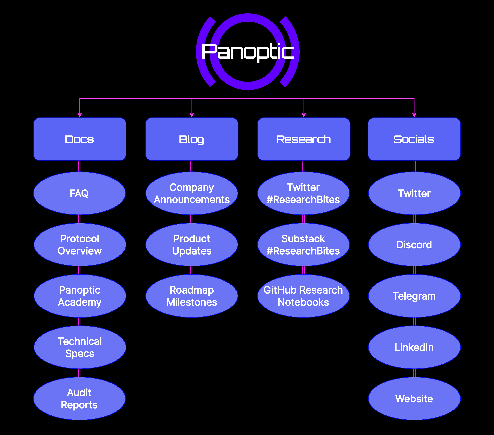

Panoptic is set to revolutionize decentralized finance (DeFi) with its permissionless, oracle-free perpetual options.

Now, we are thrilled to announce the official launch of [Panoptic Docs](https://panoptic.xyz/docs/intro), your go-to resource for understanding the intricacies of our innovative technology. With its release, you now have the opportunity to explore the inner workings of our protocol and delve into the realm of DeFi options trading.

<!--truncate-->

## Stay Up-To-Date With Panoptic

Panoptic Docs is just one part of our comprehensive set of resources designed to help you gain a deeper understanding of our platform. In addition to our documentation, we offer a dynamic blog, extensive research materials, and active social media channels to keep you informed and engaged.

Here’s a breakdown of the channels:

- [Panoptic Docs](https://panoptic.xyz/docs/intro): your comprehensive guide to the protocol—a living and breathing document built on the foundations of the original [whitepaper](https://paper.panoptic.xyz/).

- [Panoptic Blog](https://panoptic.xyz/blog): stay in the loop with the latest company announcements and updates.

- [Panoptic Research](https://panoptic.xyz/research): dive deep into educational resources on trading strategies, Panoptions, DeFi, and options finance (OpFi).

- [Panoptic Socials](https://links.panoptic.xyz/all): join the conversation and connect with like-minded traders and supporters on our official channels: [Twitter](https://twitter.com/panoptic_xyz), [Discord](https://discord.com/invite/7fE8SN9pRT), [Telegram](https://t.me/panoptic), and [LinkedIn](https://www.linkedin.com/company/panoptic-xyz).

## **Panoptic Docs**

1. [FAQ Section](https://panoptic.xyz/docs/faq): We’ve compiled answers to some of the most frequently asked questions about Panoptic and options trading. Whether you're a beginner or seeking clarification on specific aspects, this section is designed to guide you.

2. [Panoptic Protocol Overview](https://panoptic.xyz/docs/panoptic-protocol/overview): Demystify the workings of our permissionless, oracle-free perpetual options and explore how they can enhance your trading experience.

3. Panoptic Academy: *Coming Soon*

    Stay tuned for the launch of the Panoptic Academy, where we will offer an [options trading 101](https://panoptic.xyz/docs/trading/basic-concepts) course. Whether you're new to options trading or looking to refine your skills in perpetual options, this course will provide a solid foundation.

4. [Technical Specifications](https://panoptic.xyz/docs/developers/smart-contracts-overview): For more advanced users, we’ll provide detailed technical specifications of our protocol. Stay tuned for more updates on this section.

    We also understand the importance of data in the DeFi ecosystem. That’s why we’re working on providing subgraph details for our platform as well.

5. [Audit Reports](https://panoptic.xyz/docs/security/audits): To ensure the safety and security of our platform, we are in the process of finishing multiple audits. We’ll share these reports with the community as soon as they become available.

    Stay tuned for more updates as we continue to expand and refine our offerings.

## Panoptic Blog

Our blog is the perfect hub for staying up-to-date on the latest company announcements, product updates, and roadmap milestones. It's your go-to source for what's happening with Panoptic and the broader DeFi ecosystem.

Check out our blog [here](https://panoptic.xyz/blog) to stay in the loop.

## Panoptic Research

For those seeking a deeper understanding of the technical aspects, our research section is the ideal destination. It provides educational resources on options strategies and extensive research on various aspects of DeFi, allowing the community to actively contribute to our platform's development.

In the coming months, leading up to the Q3 test phase launch, we will focus our research efforts on Panoptic's groundbreaking perpetual options product. This includes comprehensive insights into its pricing mechanism, capital efficiency, associated risks, and trading strategies.

We are dedicated to transparency and collaboration, and our commitment is reflected in our open-source code and Jupyter Notebooks available on [GitHub](https://github.com/panoptic-labs/research).

To begin your exploration, visit our research section [here](https://panoptic.xyz/research).

## Panoptic Socials

Join the growing community of Panoptians and be the first to hear our latest updates by following us on our [social media platforms](https://links.panoptic.xyz/all).

To learn more about Panoptic and all things DeFi options, check out our [docs](https://panoptic.xyz/docs/intro) and head to our [website](https://panoptic.xyz).  
