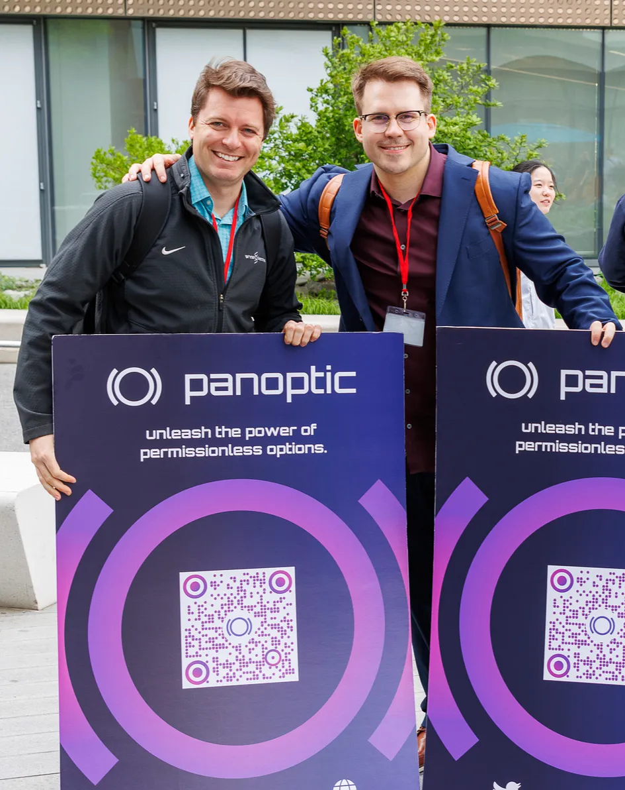
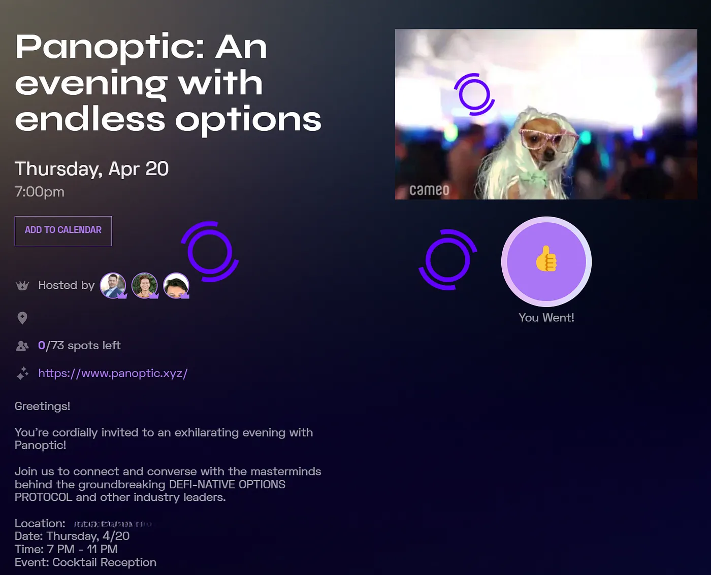
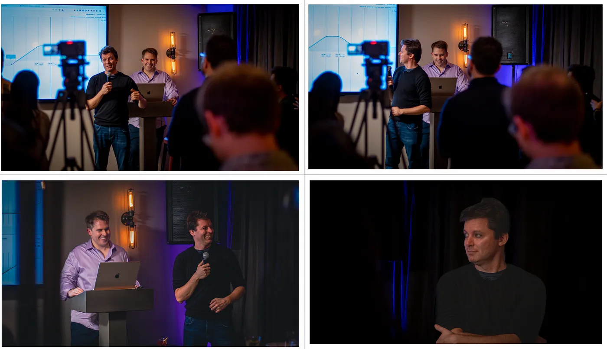
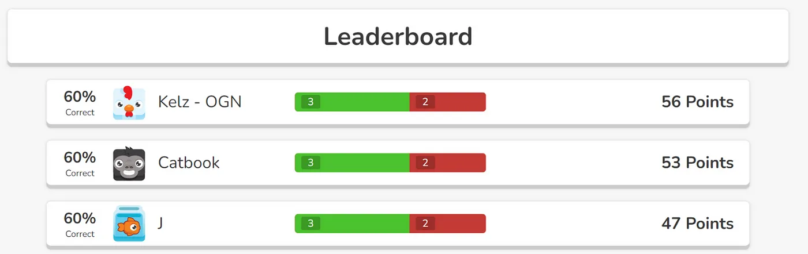
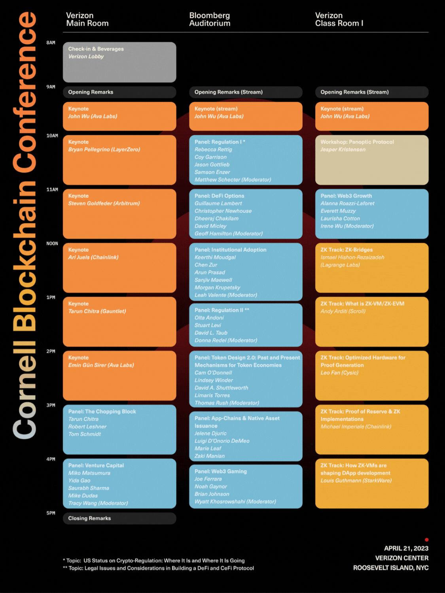
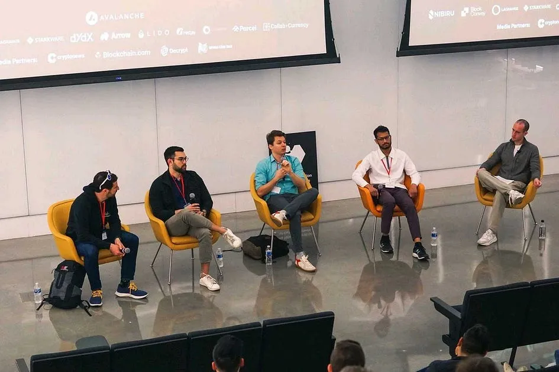

‍

The Panoptic team had a fantastic experience at the [2023 Cornell Blockchain Conference](https://www.cornellblockchainconference.com/) immersing ourselves in the vibrant atmosphere and actively engaging with our community. It was a valuable opportunity to establish meaningful connections with fellow DeFi organizations, fostering collaboration and shared insights.

This year's event witnessed unprecedented participation, with the venue selling out all 600 tickets. Despite the bear market, the conference had more attendees than last year’s event during the bull market, underscoring the remarkable growth and evolution of the industry.

<!--truncate-->

<blockquote class="twitter-tweet">
🎉CORNELL BLOCKCHAIN CONFERENCE TICKETS ARE SOLD OUT 🎉  We are ecstatic to welcome over 6⃣0⃣0⃣ <a href="https://twitter.com/hashtag/blockchain?src=hash&amp;ref_src=twsrc%5Etfw">#blockchain</a> lovers to Roosevelt Island this April 21. This is beyond our expectation and we are overwhelmed by the support and we thank you for joining the <a href="https://twitter.com/hashtag/web3?src=hash&amp;ref_src=twsrc%5Etfw">#web3</a> revolution with us… <a href="https://t.co/ZvHa8TESws">pic.twitter.com/ZvHa8TESws</a>
&mdash; Cornell Blockchain (@CUBlockchain) <a href="https://twitter.com/CUBlockchain/status/1648408677190193157?ref_src=twsrc%5Etfw">April 18, 2023</a></blockquote> 

Our CEO, Guillaume Lambert, and COO, Jesper Kristensen, have a strong connection to Cornell University. Guillaume is an assistant professor in the [AEP department](https://www.aep.cornell.edu/aep), and Jesper graduated with multiple masters and a Ph.D from the same department in 2015.

‍
_The Panoptic founders towards the end of a successfully completed conference day on the beautiful Roosevelt Island campus._

## **April 20**

We kicked off the conference weekend on Thursday by hosting “An Evening With Endless Options,” an event open to the public in Midtown Manhattan. The venue included a room to present our [product demo](https://youtu.be/deqbeqjyKgg) and an outdoor patio to take in the view of the city skyline. In light of the interest, we augmented the available slots the week leading to the event.

‍

Attendees enjoyed free hors d’oeuvres and cocktails served from an on-site bartender. The ambiance was elevated by the sounds of Erhling spun by the DJ.

‍

The "Panoptic Puzzler" challenged participants with questions about NYC and DeFi. We extend our congratulations to Kelz from Origin Protocol for securing the $100 prize!

‍

To hear about the next event, be sure to follow Panoptic on [Twitter](https://twitter.com/Panoptic_xyz).

## **April 21**

On Friday, we attended the Cornell Blockchain Conference. The turnout was beyond expectation, and the organizers did an exceptional job in orchestrating the event.

‍

It was an honor for us to be invited to participate in two significant events.

Jesper conducted a workshop on Panoptic, delving into the protocol's functionality, providing insightful examples, and delivering a live demo featuring the latest UI updates. The workshop was streamed live, allowing a broader audience to benefit from the session.

<blockquote class="twitter-tweet">
🎥LIVE: WORKSHOP ON <a href="https://twitter.com/Panoptic_xyz?ref_src=twsrc%5Etfw">@Panoptic_xyz</a> by <a href="https://twitter.com/cryptojesperk?ref_src=twsrc%5Etfw">@cryptojesperk</a> 🎥  📍 Panoptic use cases, live demo and code walkthrough to understand the cutting-edge decentralized options protocol Panoptic. <a href="https://t.co/YDLfstOo6l">pic.twitter.com/YDLfstOo6l</a>
&mdash; Cornell Blockchain (@CUBlockchain) <a href="https://twitter.com/CUBlockchain/status/1649422200884142082?ref_src=twsrc%5Etfw">April 21, 2023</a></blockquote> 

Guillaume participated in a panel discussion alongside esteemed industry experts, including David Micley from Wintermute, Christopher Newhouse from GSR, and Dheeraj Chakilam from Arrow Markets. Geoff Hamilton from Variant moderated the panel, facilitating a dynamic and informative conversation.

‍

Miko Matsumura, our lead investor and MP at gumi Cryptos Capital, was on an insightful panel on how to raise capital and the state of venture capital.

<blockquote class="twitter-tweet">
Cornell <a href="https://twitter.com/hashtag/Blockchain?src=hash&amp;ref_src=twsrc%5Etfw">#Blockchain</a> Conference 2023 will welcome Miko Matsumura (gumi Cryptos Capital), Yida Gao (Shima Capital), Saurabh Sharma (Jump Crypto) and Mike Dudas (6th Man Ventures) for the panel on <a href="https://twitter.com/hashtag/VentureCapital?src=hash&amp;ref_src=twsrc%5Etfw">#VentureCapital</a> 💸📈  🎟️ Tickets: <a href="https://t.co/UxebAtZRgy">https://t.co/UxebAtZRgy</a> <a href="https://twitter.com/hashtag/tech?src=hash&amp;ref_src=twsrc%5Etfw">#tech</a> <a href="https://twitter.com/hashtag/web3?src=hash&amp;ref_src=twsrc%5Etfw">#web3</a> <a href="https://twitter.com/hashtag/vc?src=hash&amp;ref_src=twsrc%5Etfw">#vc</a> <a href="https://t.co/9pL7GQIsAi">pic.twitter.com/9pL7GQIsAi</a>
&mdash; Cornell Blockchain (@CUBlockchain) <a href="https://twitter.com/CUBlockchain/status/1637483371122024449?ref_src=twsrc%5Etfw">March 19, 2023</a></blockquote> 

During the conference, we had the privilege of engaging with numerous builders, peers, and investors who share our passion for the industry. These interactions led to fruitful conversations and enabled us to establish meaningful connections with key players in the space.

We are now back to building and will keep you all posted as we prepare for our gated launch in early July — just one year after starting Panoptic!

To the organizers and to Cornell Blockchain:

> “*Thank you for making us feel at home and a part of the tight-knit Cornell community that is constantly innovating in the realm of Web3.*” — Jesper

Join the growing community of Panoptians and be the first to hear our latest updates by following us on our [social media platforms](http://links.panoptic.xyz/all). To learn more about Panoptic and all things DeFi options, check out our [docs](https://panoptic.xyz/docs/intro) and head to our [website](https://panoptic.xyz/).  

