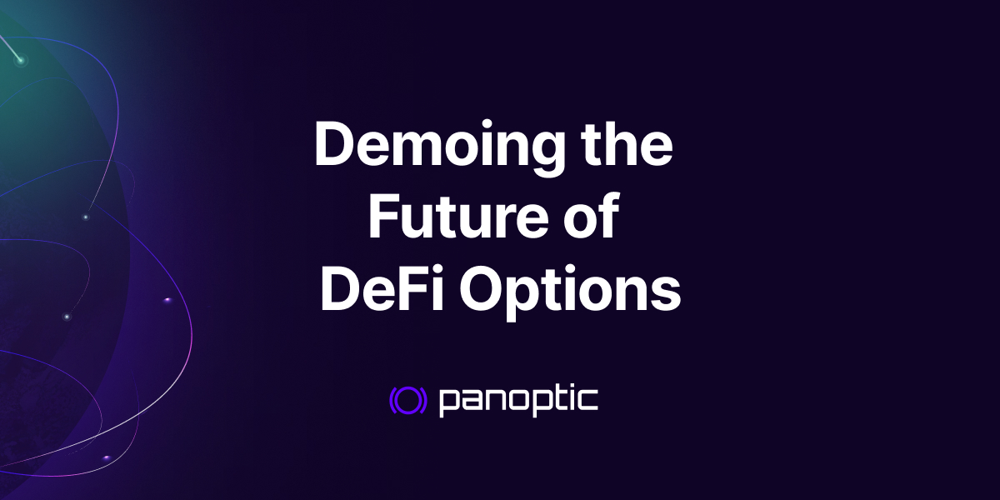
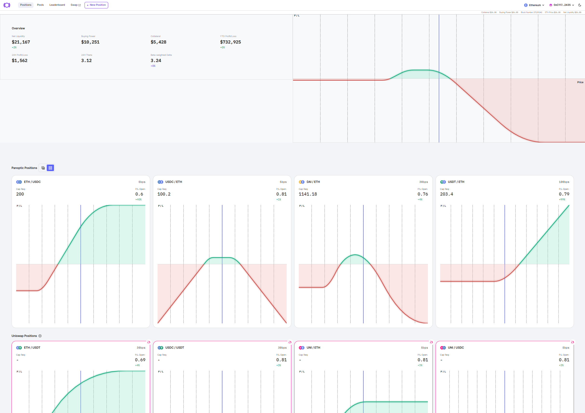
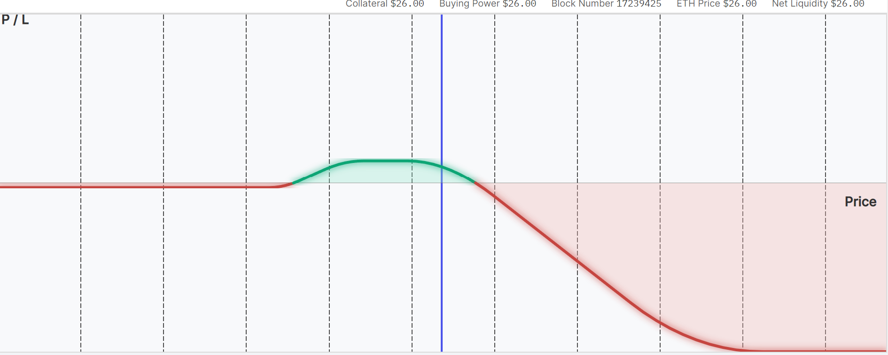
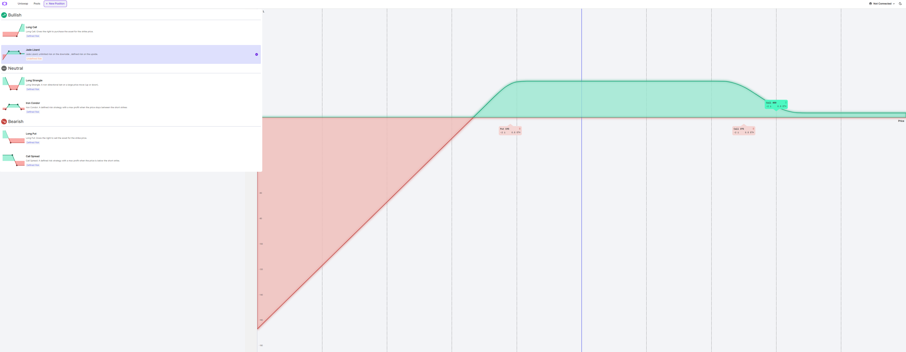

The evening before the 2023 Cornell Blockchain Conference, the Panoptic community gathered for food, drinks, and a live demonstration of our decentralized options trading protocol. With the gated launch fast approaching, the event attendees received an exclusive look at how Panoptic will revolutionize the way DeFi users trade options.

<!--truncate-->

The product demonstration showcased our platform’s user interface (UI). Because options can seem complicated, we made it a priority to ensure our UI is user-friendly, providing a seamless experience for all.

Our platform provides an easy way to view the status of your current positions. On the overview page, a bird’s-eye view of all your positions is shown in color. With this color-coordinated view, you can quickly visualize exactly where your positions are.

When you’re in the green part of the graph, you’re in the positive. When you’re in the red part of the graph, you’re in the negative.
The key point is that you can scan all of your charts quickly, identify the positions you think need management, and click on it directly to adjust. Our goal is to provide straightforward and responsive visual feedback.

On the Panoptic app, all of your positions are also shown in a single, beta-weighted profit-and-loss graph. With this combined graph, you can get a quick, up-to-date view of your entire options portfolio on the platform.

The Panoptic UI lets you easily create new options positions.

The Panoptic UI lets you easily create new option positions. Not only will Panoptic allow you to do simple calls and puts, but you will also be allowed to execute more advanced trades such as spreads, strangles, straddles, iron condors, jade lizards, and more! The ability to customize your trade to your desired options strategy is an integral part of our design.

Panoptic is built on top of [Uniswap V3](https://blog.uniswap.org/uniswap-v3), the world’s largest decentralized exchange (DEX). This allows our users to spin up an options market on top of any ERC20 tokens.

Watch the full walkthrough of the Panoptic Demo here:

<iframe width="560" height="315" src="https://www.youtube.com/embed/deqbeqjyKgg" title="YouTube video player" frameborder="0" allow="accelerometer; autoplay; clipboard-write; encrypted-media; gyroscope; picture-in-picture; web-share" allowfullscreen></iframe>

Panoptic CEO, [Guillaume Lambert](https://twitter.com/guil_lambert), and COO, [Jesper Kristensen](https://twitter.com/cryptojesperk), were at the event to connect with the community and showcase the latest update to the Panoptic UI. The event, aptly named A Night With Endless Options, provided a great opportunity to connect over options and martinis.

You can read about Panoptic’s full Cornell Blockchain Conference weekend [here](https://blog.panoptic.xyz/panoptic-at-cornell-blockchain-conference-2023-49f47c04aa44).

This summer, Panoptic will be rolling out its gated launch, allowing members of the community to have early access to the platform and compete in a trading competition. More details on this launch will be provided in the future.

Right now, the team at Panoptic is adding the fine-tuned details to the UI while [OpenZeppelin](https://panoptic.xyz/blog/openzeppelin-audits-panoptic-defi-options-protocol), the leading provider of crypto and cybersecurity technology and services, is performing an audit to ensure the security of the platform.

Stay up to date with all the latest happenings at Panoptic and learn how you can get early access to our options protocol gated launch.

Join the growing community of Panoptians and be the first to hear our latest updates by following us on our [social media platforms](https://links.panoptic.xyz/all). To learn more about Panoptic and all things DeFi options, check out our [docs](https://panoptic.xyz/docs/intro) and head to our [website](https://panoptic.xyz/).