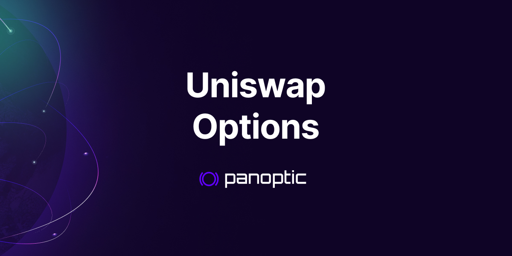

Uniswap concentrated-liquidity positions have option-like payoffs. Viewed in a chosen asset/numeraire frame, providing liquidity resembles selling a perpetual put: the LP collects fees while accepting downside exposure and a capped upside. Panoptic adds a market for borrowing and shorting LP liquidity, making both sides of that exposure tradable.

<!--truncate-->

This uncertainty arises from the difficulty in calculating LP positions' profit and loss (PnL). But here’s the exciting part: Guillaume Lambert, the mind behind Panoptic, [cracked the code](https://lambert-guillaume.medium.com/pricing-uniswap-v3-lp-positions-towards-a-new-options-paradigm-dce3e3b50125). He discovered that **LP** $\approx$ **options**. Here’s the core formula:

$$
LP = Option + \rho
$$

Where $\rho$ is the big formula below.

Yup, you read that right. Erf.

## So What’s the Big Deal?

We’ll skip the ρ part for now—it involves some heavy math. Let’s focus on understanding the link between LP positions and options trading. By recognizing this relationship, LPs can better understand how much they’re making (or losing), manage their positions, and potentially increase profits.

To illustrate, consider the payoff graph of an LP position compared to a put option (left side of the image below). Don’t they look strikingly similar?

This connection allows us to view LPing through the lens of options trading, and it opens up a whole new way to think about risk management and fee generation in Uniswap.

Let’s rewind a bit and start with the basics.

## Uniswap & AMMs: The Basics

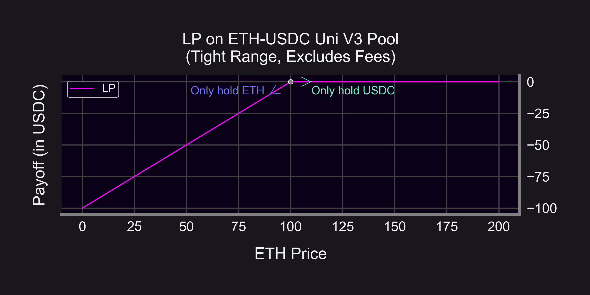

Uniswap is the leading decentralized exchange (DEX) that popularized the Automated Market Maker (AMM) model. AMMs replace traditional order books with liquidity pools, letting users trade against these decentralized pools. In Uniswap v3, LPs can provide concentrated liquidity, allowing them to allocate capital within specific price ranges for improved capital efficiency.

While this approach enhances returns, it also requires LPs to carefully manage their positions and set the right price ranges to avoid losses.

## Put Options: Risk Management Tools

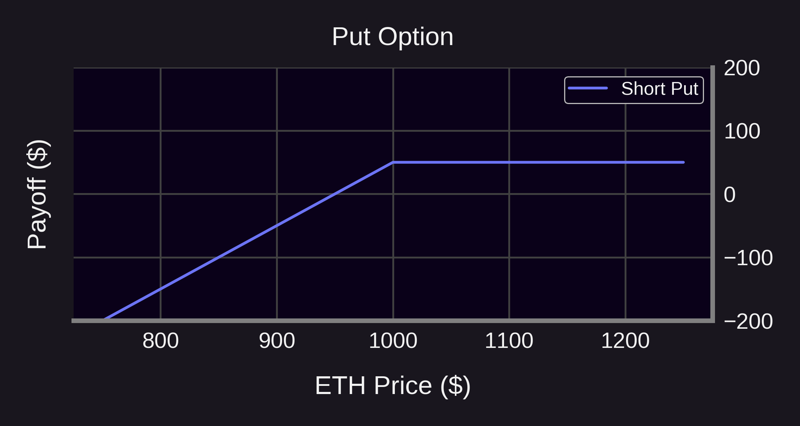

A put option gives the holder the right (but not the obligation) to sell an asset at a specific price (the strike price). For investors, this offers flexibility and a way to hedge against price declines.

When selling a put option, the payoff structure flips—limited profit potential on the upside with potentially significant downside risk. This is where the LP analogy comes in.

## LPs Are Options Sellers

The similarity between LP positions and selling put options is striking. Essentially, liquidity provision mimics selling exotic options (specifically perpetual options that never expire).

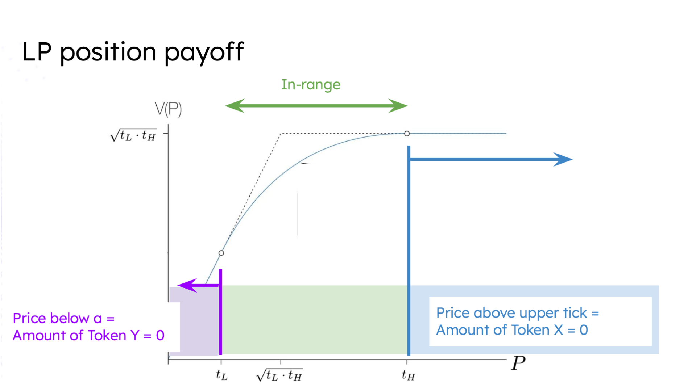

For example, if you're providing liquidity in the ETH/USDC pool:
-   If ETH’s price exceeds your upper range → your position converts to USDC.
-   If ETH’s price drops below your lower range → your position converts back to ETH.

This structure mirrors the payoff of a put option. In fact, a one-tick-wide LP position looks exactly like an expiring put option. The difference is that, in Uniswap, liquidity providers receive [continuous trading fees](https://panoptic.xyz/docs/product/streamia) in the form of spot trading fees, rather than upfront payments.

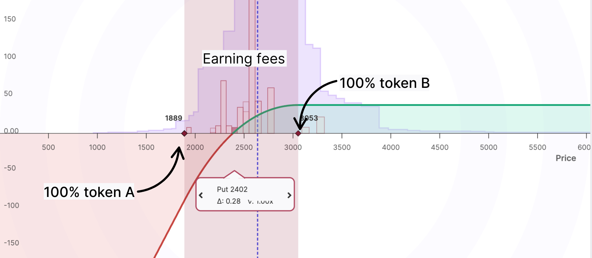

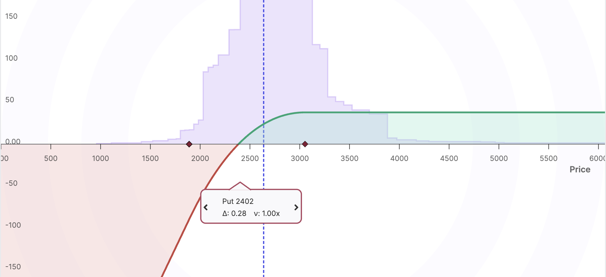

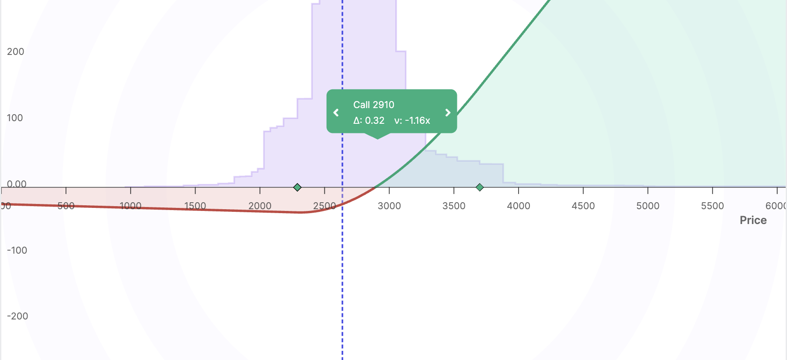

## The Future: Buying Options From Uniswap

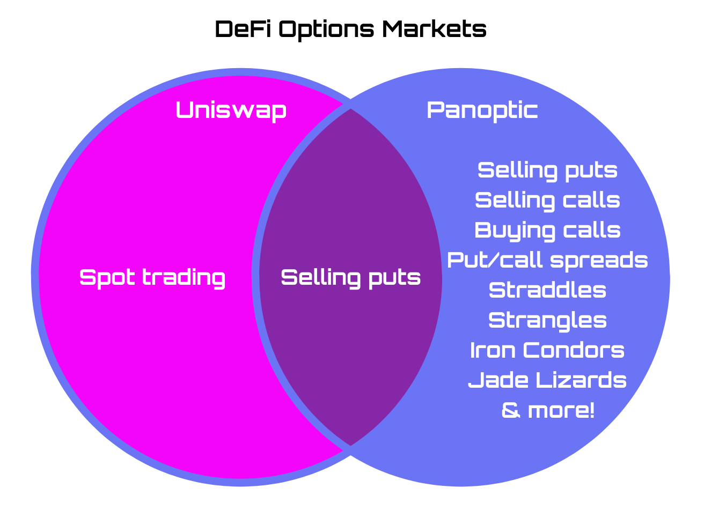

So, Uniswap allows you to sell puts (by providing liquidity), but what about buying puts or trading call options? Enter Panoptic.

With Panoptic, users can not only provide liquidity (i.e., sell puts) but also buy puts and calls for more advanced trading strategies. This unlocks the full potential of options trading, enabling a multitude of new strategies never before seen in DeFi:

-   Hedging downside risks with put options.
-   Capturing upside potential with call options.
-   Trading volatility with straddles and strangles.
-   [Synthetic perps](https://panoptic.xyz/docs/trading/multi-leg-strategies#synthetic-perps) with embedded leverage.
-   Spreads, iron condors, jade lizards, and [more](https://panoptic.xyz/research/essential-options-strategies-to-know)!

## Expanding the Options Ecosystem

Panoptic’s [perpetual options](https://panoptic.xyz/docs/trading/perpetual-options) offer unique features compared to traditional options:

1.  No expiration: Continuous trading without the hassle of rolling over positions.
2.  Real-time pricing: Derived from Uniswap's trading activity.
3.  Streamia (streaming premium): Streamia starts at zero and accumulates over each block.

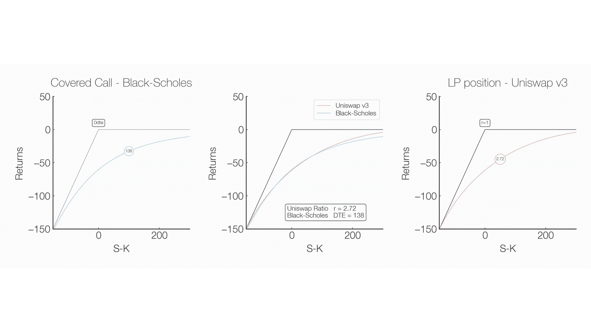

For LPs, this means that in addition to earning fees (akin to option premiums), they face similar risks to option sellers. However, these risks can be better managed thanks to the flexibility of perpetual options.

Panoptic is fully embracing the LP = Options concept, effectively transforming Uniswap into an options clearinghouse. Panoptic has even identified key metrics for LP positions, including an equivalent for [implied volatility](https://panoptic.xyz/research/new-formulation-implied-volatility), a [time-to-expiration (DTE)](https://panoptic.xyz/docs/product/timescales) counterpart, and a [vega-like Greek](https://panoptic.xyz/docs/product/spread)—redefining them as perpetual options.

*LP = Options* is more than a novel idea–it's the future of decentralized finance. By bridging these two concepts, Panoptic is creating a more efficient, flexible, and powerful trading ecosystem for all.

### How Does Panoptic Translate LP Widths into Option-Like Exposures?

-   **Narrow range = short-dated option**
-   **Wide range = long-dated option**

The positions don’t have expiration dates, but the virtual duration gives an approximation of fees and payoff.

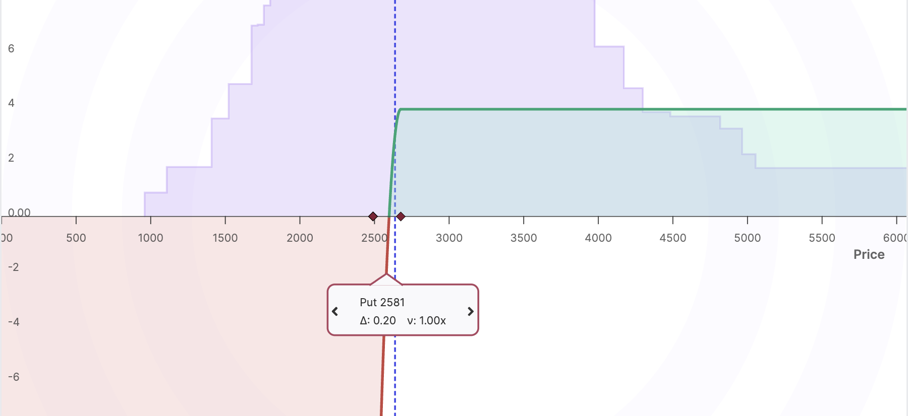
_One day option payoff ≈ ±%4 wide LP price range._

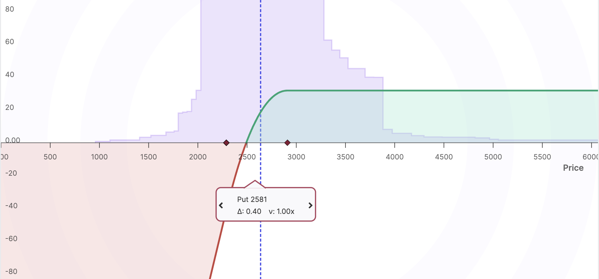
_One week option payoff ≈ ±13% wide LP price range._

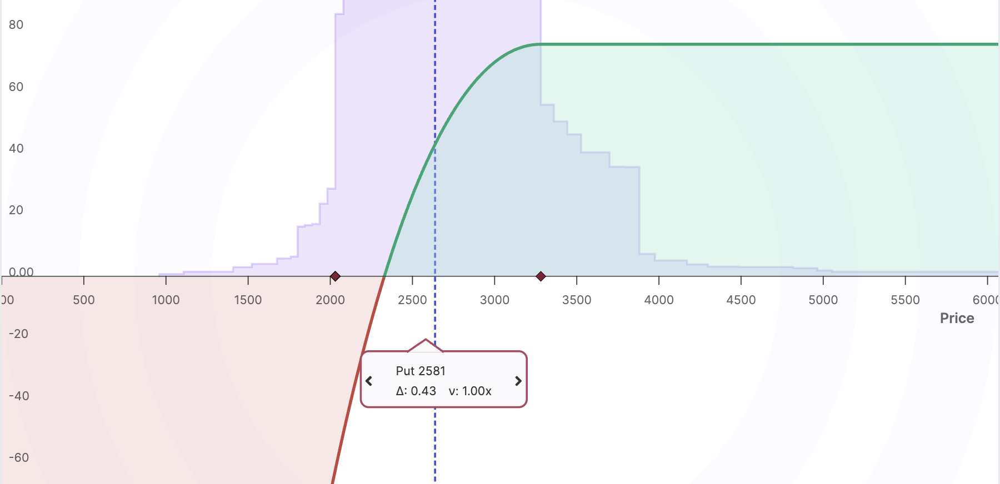
_One month option payoff ≈ ±27% wide LP price range._

### How Do the Fees from Uniswap Work with Options Streamia? {#how-do-the-fees-from-uniswap-work-with-options-premiums}

-   The streamia earned by an LP is the trading fees accumulated from in-range swaps
-   The streamia paid by a buyer includes those fees plus a spread (which scales based on liquidity demand)
-   Pricing is path-dependent and occurs per block, just like how volatility and returns are modeled in traditional options markets

Some LPs earn only Uniswap fees, others outperform Black-Scholes predictions by tapping into the Panoptic spread. The result is an organic, onchain implied volatility surface.
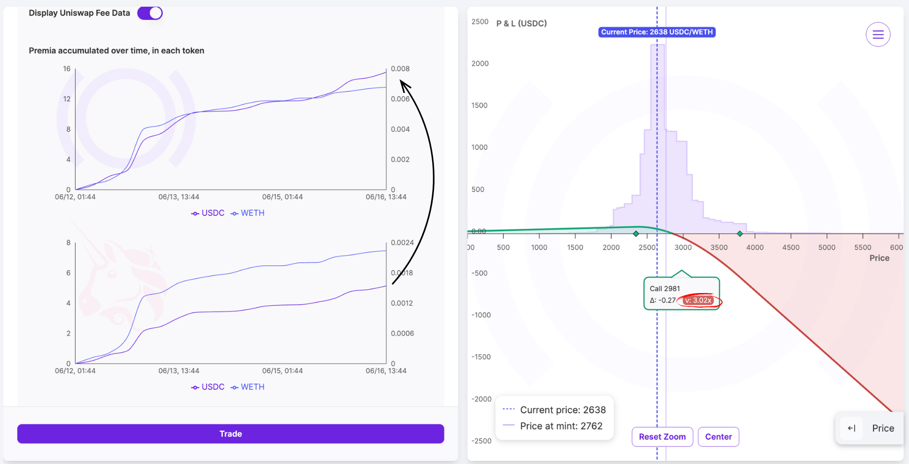

Here, a Panoptic LP is making 202% more than they would on Uniswap (v: 3.02x).

### How does Panoptic turn Uniswap LPs into Option Contracts?

Uniswap LP positions are NFTs. Panoptic wraps them into **ERC-1155 semi-fungible tokens,** so that:

-   Positions with the same strike and width (i.e. LP price range) become fungible
-   Traders can compose, bundle, and trade these options contracts seamlessly

This is what transforms **Uniswap into a true, decentralized options clearinghouse**.

## Lending, collateral and strategy construction

Panoptic’s passive liquidity providers supply either underlying token to a collateral market rather than choosing a concentrated-liquidity range. Their share-based deposits support borrowing by traders. This differs from owning an active LP position: lenders retain exposure to the deposited asset, protocol losses and withdrawal constraints. See [lending on Panoptic](/docs/getting-started/passive-lp).

Collateral allows traders to take positions whose notional value exceeds their deposit. That increases both capital efficiency and liquidation risk. Requirements depend on the pool, portfolio and protocol version; use the [capital-efficiency guide](/docs/trading/capital-efficiency) and the current [risk-engine reference](/docs/panoptic-protocol/V2/risk-engine-overview).

### Delta-Neutral and Advanced Option Strategies

With Panoptic, you’re no longer limited to static LP returns. Because you can short LP tokens, you unlock an entire spectrum of onchain options strategies, including:

-   **Delta-neutral LPing:** Hedge out market direction while earning consistent fees
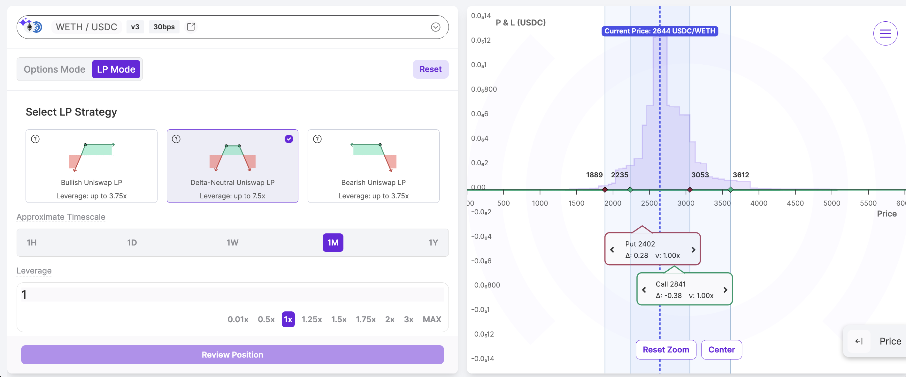

-   **Call spreads:** Buy and sell calls at different strikes to cap risk and cost
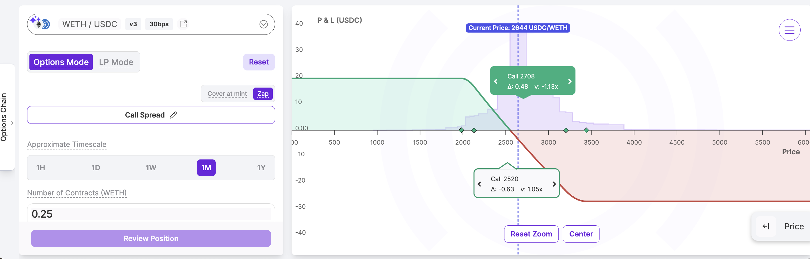

-   **Straddles and strangles:** Express volatility views with range-bound or breakout setups
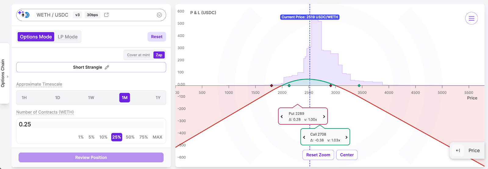

-   **Covered calls:** Earn extra streamia on top of directional holdings
 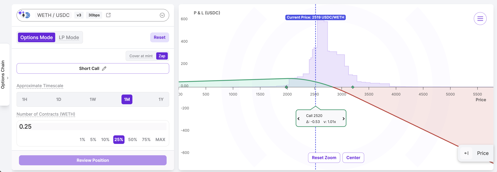

Panoptic doesn’t just integrate with Uniswap—it repurposes Uniswap as a permissionless, perpetual options clearinghouse.

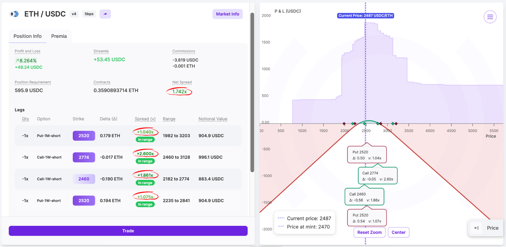

## Risks and historical examples

LP-as-options is a payoff relationship, not a promise of positive returns. Fees, streamia, borrowing costs, commissions and price movements all affect net performance. Selling options introduces short-convexity risk; an initially delta-neutral position can become directional as prices change. Borrowed liquidity may constrain exits or require an eligible [force exercise](/docs/product/force-exercise). The [audit reports](/docs/security/security_audits) document security reviews, not a guarantee against losses.

The width/payoff and 202%-additional-fee illustrations above are historical examples from 2025. They are not fixed current rates or universal mappings from width to elapsed time. The original adoption snapshot recorded over $15 million of trading volume, with Ethereum, Unichain and Base live; see the [historical analytics](https://dune.com/brandonly1000/panoptic) and [current deployment addresses](/docs/contracts/deployment-addresses) for their respective contexts.

Panoptic’s option pricing comes from AMM fee activity and liquidity demand. The [whitepaper](https://paper.panoptic.xyz/) develops its connection with conventional pricing; this is distinct from claiming that all protocol risk checks operate without price observations. See the [V2 oracle system](/docs/panoptic-protocol/V2/oracle-system).

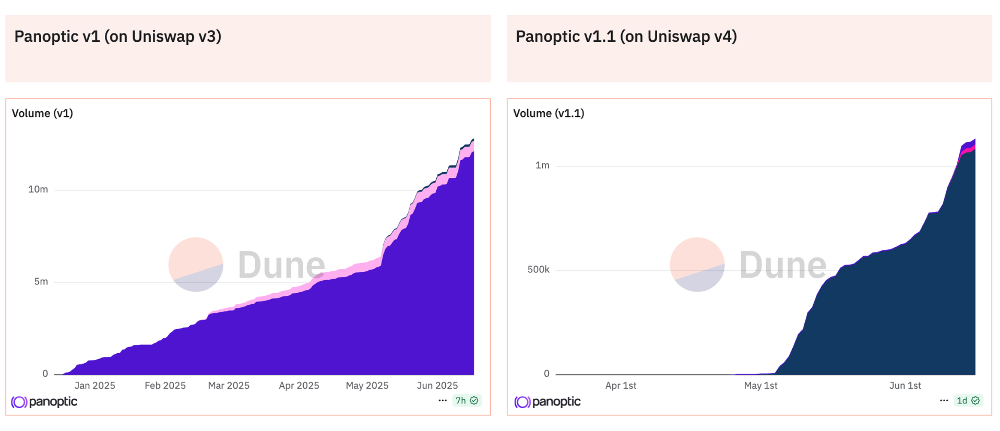

## Original LP-as-options references

The original explanation drew on [Uniswap v3](https://uniswap.org/) and the following 2023 technical threads:

- [LP payoff correspondence to options](https://twitter.com/Panoptic_xyz/status/1646917853755604993?s=20).
- [Strike prices for concentrated liquidity](https://twitter.com/Panoptic_xyz/status/1646917857362718720?s=20).
- [Effective time to expiration](https://twitter.com/Panoptic_xyz/status/1641108075833884673?s=20).
- [Concentrated-liquidity adoption across exchanges](https://twitter.com/Panoptic_xyz/status/1646917783144517632?s=20).
