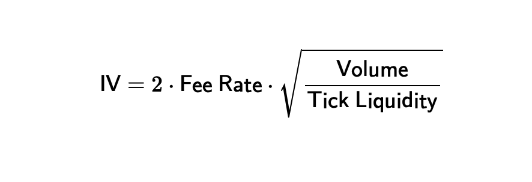
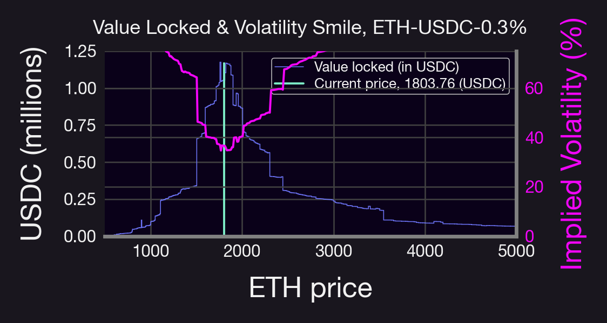

_Executive Summary_

In this second installment of our [three-part series](https://panoptic.xyz/blog/democratizing-defi-options-research-part-1) on Democratizing DeFi Research, Doctor C gives us a deep dive into the open-source Python script used for studying implied volatility and volatility smiles of Uniswap Liquidity Providers (LPs).

We aim to unpack these complexities, enabling you to understand and use our code more effectively. This blog post doesn't just offer insights — it gives you the tools to conduct your own DeFi research and contribute to our growing body of knowledge.

<!--truncate-->

_Objectives_
1.  Understand and pull from the Uniswap v3 subgraph
2.  Discover the relationship between LPs and implied volatility
3.  Create visual graphs of implied volatility smiles

_Prerequisites_
-   Basic coding knowledge
-   Basic familiarity with Python

As you gain a better understanding of how to use, replicate, and contribute to our open-source code, we hope you'll be empowered to run your own research and investigations.

----------

### Doctor C's Pick: Implied Volatility & Volatility Smile

#### Introducing the Script

This script is from our [Research Bite](https://twitter.com/Panoptic_xyz/status/1643282374934032384) on implied volatility and the volatility smiles. The script is particularly interesting because it extracts info from the Uniswap graph and demonstrates the relationship between implied volatility and LP sentiment.

In a nutshell, this code:

1.  Uses the Uniswap v3 subgraph to compute the amount of liquidity deployed to each tick in a given pool
2.  Converts the liquidity into a common currency (USDC, ETH, etc.)
3.  Computes the implied volatility based on the formula below




Implied volatility of a pool. Notice that this typically needs to be annualized (multiply by $\sqrt{365}$).

#### **Step By Step Breakdown**

Before starting, we recommend downloading the `gql` library and importing all these required libraries:

```
from gql import gql, Client  
from gql.transport.requests import RequestsHTTPTransport  
import math  
import sys  
import pandas as pd  
import numpy as np  
import matplotlib.pyplot as plt  
plt.style.use('panoptic-dark-16_9.mplstyle')
```

**Step 1:** Start by defining the pool you want to use. For example, use the `ETH-UNI-30bps` pool on the `POOL_ID` field, as defined below. You can find other pool addresses by clicking on the respective pool [here](https://info.uniswap.org/#/pools).

```
POOL_ID="0x8ad599c3a0ff1de082011efddc58f1908eb6e6d8"
```

**Step 2:** Define a GraphQL query named `pool_query`. This query is designed to fetch data about specific liquidity pools from the Uniswap v3 subgraph. The query requires one argument, `$pool_id`, which should be the unique identifier (ID) of the pool you're interested in.

Later, we will set this input argument to `POOL_ID.`

```
pool_query = """query get_pools($pool_id: ID!) {  
 pools(where: {id: $pool_id}) {  
    tick  
    sqrtPrice  
    liquidity  
    feeTier  
    volumeToken0  
    volumeToken1  
    token0 {  
      symbol  
      decimals  
    }  
    token1 {  
      symbol  
      decimals  
    }  
  }  
}"""
```

Here's a brief breakdown of what each part of the query is requesting:
-   `pools(where: {id: $pool_id})` is the main part of the query. It's asking the database to return data on the pool with the provided `pool_id`.
-   `tick`, `sqrtPrice`, `liquidity`, `feeTier` are fields requesting specific data on the identified pool. These include data such as the pool's current tick, square root price, liquidity, fee tier, and the trading volume of both tokens in the pool.
-   `token0` and `token1` are fields are requesting data on the two tokens traded in the pool. For each token, this query returns its symbol (e.g., ETH for ethereum), and the number of _decimals_ the token has (i.e., 18 for WETH, 6 for USDC, etc.). This information is useful when computing the liquidity in a common currency.

**Step 3:** Define another GraphQL query named `tick_query` which is designed to fetch specific data from the "ticks" associated with a particular liquidity pool in Uniswap v3. The `tick_query` accepts two parameters:
-   `$num_skip`: an integer that represents how many ticks should be skipped before starting to return the results. This is useful for implementing pagination.
-   `$pool_id`: the unique identifier of the pool from which you're interested in getting the ticks.

```
tick_query = """query get_ticks($num_skip: Int, $pool_id: ID!) { ticks(skip: $num_skip, where: {pool: $pool_id})   
{ tickIdx liquidityNet } }"""
```

Here's what the query is requesting:
-   `ticks(skip: $num_skip, where: {pool: $pool_id})`asks for the ticks associated with the specified pool, skipping a certain number of them as defined by `$num_skip`.
-   `tickIdx` and `liquidityNet`. For each tick, the query requests the tick index (`tickIdx`) and the net change in liquidity (`liquidityNet`) at that tick. The tick index refers to the specific price point that the tick represents, and the net liquidity represents how much liquidity was added or removed at that price point.

This is the script used to extract the liquidity on each tick in the pool.

**Step 4:** Define auxiliary functions to simplify some steps.

```
TICK_BASE = 1.0001  
def tick_to_price(tick):  
    return TICK_BASE ** tick  
# Not all ticks can be initialized.  
# Tick spacing is determined by the pool's fee tier.  
  
def fee_tier_to_tick_spacing(fee_tier):  
    return {  
    100: 1,  
    500: 10,  
    3000: 60,  
    10000: 200  
    }.get(fee_tier, 60)
 ```

**Step 5:** Now use the following Python script to submit our queries to the Uniswap v3 subgraph. First, it attempts to execute the `pool_query` (which is a GraphQL query we discussed earlier) using the client's `execute` method, passing in the query and the variables. Then, it checks the `response` for the requested pool data.

If the response doesn't contain any pool (i.e., the length of `response['pools']` is 0), it prints "pool not found" and exits with an error status. If the pool is found, it extracts the first pool from the response and assigns it to the variable `pool`. It then extracts the following pieces of data from the `pool` object:
-   `tick` _(int)_ Current tick of the pool (i.e., price)
-   `Liquidity` _(int)_ Liquidity in the pool
-   `FeeTier` _(int)_ Fee tier of the pool
-   `token0` _(str)_ & `token1` _(str)_ The symbol of each token
-   `decimals0` _(int)_ & `decimals1` _(int)_ The number of decimals for each token

If any error occurs during this process (e.g., the query fails, the pool ID is invalid, or the data can't be extracted from the response), it catches the exception, prints an error message along with the exception details, and exits with an error status.

```
# Connects to the UniV3 subgraph  
client = Client(  
    transport=RequestsHTTPTransport(  
    url='https://api.thegraph.com/subgraphs/name/uniswap/uniswap-v3',  
    verify=True,  
    retries=5,  
))  
# creates the pool dictionary  
try:  
    variables = {"pool_id": POOL_ID}  
    response = client.execute(gql(pool_query), variable_values=variables)  
    if len(response['pools']) == 0:  
        print("pool not found")  
        exit(-1)  
    pool = response['pools'][0]  
    current_tick = int(pool["tick"])  
    tick_spacing = fee_tier_to_tick_spacing(int(pool["feeTier"]))  
    token0 = pool["token0"]["symbol"]  
    token1 = pool["token1"]["symbol"]  
    decimals0 = int(pool["token0"]["decimals"])  
    decimals1 = int(pool["token1"]["decimals"])  
except Exception as ex:  
    print("got exception while querying pool data:", ex)  
    exit(-1)
```

**Step 6:** Once this data is computed, we query the liquidity on each tick in the Uniswap v3 pool of interest. It uses information such as the current tick, tick spacing, and the number of decimals each token uses obtained above.

This long script does several tasks:

**Task 1:** It initializes `liquidity` to 0, which is used to accumulate the total liquidity across all relevant ticks. It also initializes `total_amount0` and `total_amount1` to 0, which accumulates the total number of each token in the pool. Lastly, it calculates the minimum and maximum tick from `tick_mapping`, a dictionary that presumably maps each tick to the net change in liquidity at that tick.

```
def get_price_and_liq():  
    # Step 6.1  
    # Start from zero; if we were iterating from the current tick, would start from the pool's total liquidity  
    liquidity = 0  
    total_amount0 = 0  
    total_amount1 = 0  
    L=[]  
      
    # Find the boundaries of the price range  
    min_tick = min(tick_mapping.keys())  
    max_tick = max(tick_mapping.keys())
```

**Task 2:** It calculates the bottom tick of the current range by flooring the division of the current tick and the tick spacing, then multiplies the result by the tick spacing.

```
# Step 6.2 It calculates the bottom tick of the current range by flooring the division of the current tick and the tick spacing, then multiplying the result by the tick spacing.p 6.2  
# Compute the tick range. This code would work as well in Python: `current_tick // tick_spacing * tick_spacing`  
# However, using floor() is more portable.  
current_range_bottom_tick = math.floor(current_tick / tick_spacing) * tick_spacing
```

**Task 3:** It calculates the current price using the function `tick_to_price()` defined above, and adjusts it by dividing by `10 ** (decimals1 - decimals0)`.

```
# Step 6.3  
current_price = tick_to_price(current_tick)  
adjusted_current_price = current_price / (10 ** (decimals1 - decimals0))
```

**Task 4:** It decides whether to invert the price display based on the types of tokens and the adjusted current price. The goal is to display prices in terms of USD where possible.

```
# Sum up all tokens in the pool  
  
# Step 6.4  
# Guess the preferred way to display the price;  
# try to print most assets in terms of USD;  
# if that fails, try to use the price value that's above 1.0 when adjusted for decimals.  
stablecoins = ["USDC", "DAI", "USDT", "TUSD", "LUSD", "BUSD", "GUSD", "UST"]  
if token0 in stablecoins and token1 not in stablecoins:  
    invert_price = True  
elif adjusted_current_price < 1.0:  
    invert_price = True  
else:  
    invert_price = False  
  
# Iterate over the tick map starting from the bottom  
tick = min_tick  
ticks=[]
```

**Task 5:** It enters a loop to iterate over each tick from the minimum to the maximum tick. At each tick it calculates the liquidity, price, and amount of each token potentially in the range or actually in the range (if the tick equals the current range's bottom tick), and updates the total amounts of tokens accordingly.

```
# Step 6.5  
while tick <= max_tick:  
    liquidity_delta = tick_mapping.get(tick, 0)  
    liquidity += liquidity_delta  
  
    price = tick_to_price(tick)  
    adjusted_price = price / (10 ** (decimals1 - decimals0))  
    if invert_price:  
        adjusted_price = 1 / adjusted_price  
        tokens = "{} for {}".format(token0, token1)  
    else:  
        tokens = "{} for {}".format(token1, token0)  
  
    should_print_tick = liquidity != 0  
    #if should_print_tick:  
       # print("ticks=[{}, {}], bottom tick price={:.6f} {}".format(tick, tick + tick_spacing, adjusted_price, tokens))  
  
    # Compute square roots of prices corresponding to the bottom and top ticks  
    bottom_tick = tick  
    top_tick = bottom_tick + tick_spacing  
    sa = tick_to_price(bottom_tick // 2)  
    sb = tick_to_price(top_tick // 2)  
  
    if tick < current_range_bottom_tick:  
        # Compute the amounts of tokens potentially in the range  
        amount1 = liquidity * (sb - sa)  
        amount0 = amount1 / (sb * sa)  
  
        # Only token1 locked  
        total_amount1 += amount1  
        # step 6.5.1  
        if should_print_tick:  
            adjusted_amount0 = amount0 / (10 ** decimals0)  
            adjusted_amount1 = amount1 / (10 ** decimals1)  
            cp=1 / adjusted_current_price if invert_price else adjusted_current_price  
            print('current price')  
            print(cp)  
            #print("        {:.2f} {} locked, potentially worth {:.2f} {}".format(adjusted_amount1, token1, adjusted_amount0, token0))  
            L.append(adjusted_amount1*cp)  
    elif tick == current_range_bottom_tick:  
        # Always print the current tick. It normally has both assets locked  
        # Print the real amounts of the two assets needed to be swapped to move out of the current tick range  
        current_sqrt_price = tick_to_price(current_tick / 2)  
        amount0actual = liquidity * (sb - current_sqrt_price) / (current_sqrt_price * sb)  
        amount1actual = liquidity * (current_sqrt_price - sa)  
        adjusted_amount0actual = amount0actual / (10 ** decimals0)  
        adjusted_amount1actual = amount1actual / (10 ** decimals1)  
        L.append(adjusted_amount1actual*cp+adjusted_amount0actual)  
  
        total_amount0 += amount0actual  
        total_amount1 += amount1actual  
  
  
  
    else:  
        # Compute the amounts of tokens potentially in the range  
        amount1 = liquidity * (sb - sa)  
        amount0 = amount1 / (sb * sa)  
  
        # Only token0 locked  
        total_amount0 += amount0  
  
        if should_print_tick:  
            adjusted_amount0 = amount0 / (10 ** decimals0)  
            adjusted_amount1 = amount1 / (10 ** decimals1)  
            L.append(adjusted_amount0)  
            #print("        {:.2f} {} locked, potentially worth {:.2f} {}".format(adjusted_amount0, token0, adjusted_amount1, token1))  
    ticks.append(tick)  
    tick += tick_spacing
```

**Task 5.1:** Inside the loop, the function decides to print the tick information based on whether the liquidity at that tick is non-zero. Then, it adjusts the amounts of tokens and appends them to a list `L`.

```
# step 6.5.1  
if should_print_tick:  
    adjusted_amount0 = amount0 / (10 ** decimals0)  
    adjusted_amount1 = amount1 / (10 ** decimals1)  
    cp=1 / adjusted_current_price if invert_price else adjusted_current_price  
    print('current price')  
    print(cp)  
    #print("        {:.2f} {} locked, potentially worth {:.2f} {}".format(adjusted_amount1, token1, adjusted_amount0, token0))  
    L.append(adjusted_amount1*cp)
```

**Task 6:** After the loop, the function calculates the price at each tick and returns it along with the array version of the list `L`.

```
# Step 6.6  
price=1/(1.0001**np.array(ticks)*1e-12)  
  
return price,np.array(L)
```

This function is then used to understand the distribution of liquidity across different price points in a liquidity pool and to calculate how much of each token is locked at each tick.

With these tasks defined, one step remains.

**Step 7.** Lastly, we compute the liquidity at different prices (i.e., call the previous function), and we plot the liquidity as well as the Implied Volatility (IV) from the formula above.

```
VOL=10.7e6 # volume in 24h, can get from query or from info.uniswap  
BPS=10000  
current_price=1/(1.0001**current_tick*10**(decimals0-decimals1))  
lp=L[price[:-1]<1e4]  
pp=price[price<1e4]  
fee_tier=tick_spacing/(2*BPS)  
IV=2*fee_tier*(VOL/lp)**0.5*(365)**0.5  
  
# plots liquidity  
fig, ax1 = plt.subplots()  
  
ax1.stairs(lp/1e6,pp,label='Value locked (in USDC)')  
ax1.set_xlim([500,5000])  
plt.ylim([0,1.25])  
ax1.set_xlabel('ETH price')  
ax1.set_ylabel('USDC (millions)')  
ax1.vlines(current_price,0,np.max(lp)/1e6,label='Current price, {} (USDC)'.format(round(current_price,2)),color='C1')  
ax1.legend()  
ax1.set_title('Value Locked & Volatility Smile, ETH-USDC-0.3%')  
  
#plot IV on the right y-axis  
ax2 = ax1.twinx()  # instantiate a second axes that shares the same x-axis  
color='C2'  
ax2.set_ylabel('Implied Volatility (%)', color=color)  # we already handled the x-label with ax1  
ax2.plot(pp[:-1],IV*100, color=color) # multiply by 100 to get the %  
ax2.tick_params(axis='y', labelcolor=color)  
ax2.set_ylim([0,75])  
fig.tight_layout()  # otherwise the right y-label is slightly clipped  
plt.show()
```

Which should result in something like this:



You can play around with the code once all the scripts are pieced together.

### **Upcoming Articles in the Series**

In the [final part of our series](https://panoptic.xyz/blog/democratizing-defi-options-research-backtest), we'll guide you through a comprehensive exploration of the Panoption backtester, another instrumental tool in our open-source arsenal.

Join the growing community of Panoptians and be the first to hear our latest updates by following us on our [social media platforms](https://links.panoptic.xyz/all). To learn more about Panoptic and all things DeFi options, check out our [docs](https://panoptic.xyz/docs/intro) and head to our [website](https://panoptic.xyz/).

----------

**Disclaimer**: This is never financial advice, and you must do your own research at all times (DYOR). This content is provided free of charge and solely for educational reasons.

