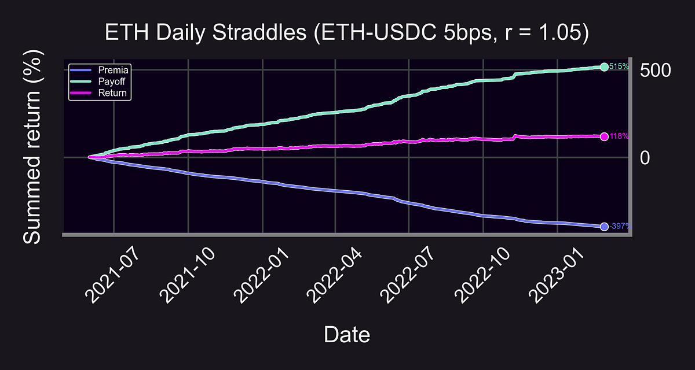

_Executive Summary_

To conclude our three-part Democratizing DeFi Research series, Brandon guides us through the Panoption backtester. This powerful tool plays a critical role in maximizing trading success by [simulating various perpetual options trading](https://panoptic.xyz/research/defi-option-straddle-backtest) and liquidity provider (LP) strategies. By the end of this article, you should be able to get started on running your own strategy backtests.

<!--truncate-->

_Objectives_

1.  Pull on-chain Uniswap data from Google Big Query (GBQ)
2.  Design and test a perpetual option or liquidity provider (LP) strategy
3.  Create visual graphs to measure strategy performance

_Prerequisites_

-   Basic coding knowledge
-   Basic Python knowledge

In the first two articles of the series, we've articulated [Panoptic's mission for open-source research](https://panoptic.xyz/blog/democratizing-defi-options-research-part-1) and explored the intricacies of [implied volatility on Uniswap](https://panoptic.xyz/blog/democratizing-defi-options-research-implied-volatility).

Our aim is not just to inform, but to equip and empower you. By providing these tools and insights, we hope to inspire you to conduct your own research, replicate our findings, and actively contribute to the open-source DeFi research community. Your involvement can drive the future of DeFi.

----------

### Brandon’s Pick: General Backtester for at-the-money (ATM) Panoptions

This notebook is the latest iteration of our generalized backtester for Panoptic perpetual options. Using the backtester, you can easily see how a perpetual options strategy might have performed on past on-chain data.

The backtester features customizable input parameters including:

-   Uniswap v3 Pool
-   Time Period
-   Range Factor ([width of a Uniswap v3 LP position](https://twitter.com/Panoptic_xyz/status/1641108066044346370?s=20))
-   Number of call & put legs

For example, let’s say I want to know how a simple DeFi options trading strategy — like an ETH straddle — would’ve performed over the past month.

**Step 1**: [Open](https://docs.jupyter.org/en/latest/running.html) the Jupyter Notebook for the [general backtester](https://github.com/panoptic-labs/research/blob/main/_research-bites/20230427/Panoptions_Backtester_v3.ipynb).

**Step 2**: Replace the `_load_pool_data_` function with your own Google Big Query (GBQ) credentials and data fetcher (tutorial [here](https://github.com/panoptic-labs/research/blob/JP/_research-bites/DataTutorial/tutorial.ipynb)). This allows you to obtain on-chain Ethereum data for Uniswap v3 swaps.

```
def load_pool_data(self):  
        """Loads Univ3 pool swap data"""  
        # Replace this function with your own GBQ data fetcher  
        # See: https://github.com/panoptic-labs/research/blob/JP/_research-bites/DataTutorial/tutorial.ipynb  
        print("Loading Data...")  
  
        SCOPES = [  
            'https://www.googleapis.com/auth/cloud-platform',  
            'https://www.googleapis.com/auth/drive',  
        ]  
  
        credentials = pydata_google_auth.get_user_credentials(  
            SCOPES,  
            auth_local_webserver=True,  
        )  
  
        query = f"""  
        SELECT DISTINCT *  
        FROM `arcane-world-371019.First_sync.1`  
        WHERE address = '{self.pool_address}'  
            AND block_timestamp >= '{self.start_t}'  
            AND block_timestamp < '{self.end_t}'  
        ORDER BY block_number, transaction_index  
        """  
        self.data = pandas_gbq.read_gbq(query, project_id = "arcane-world-371019", credentials=credentials)  
        self.transform_pool_data()
```

**Step 3**: Download and save the Panoptic [stylesheet](https://github.com/panoptic-labs/research/blob/main/stylesheet/panoptic-dark-16_9.mplstyle) to your desired local directory in order to produce beautiful dark-mode graphs.

**Step 4**: Replace `[YOUR_LOCAL_DIRECTORY_HERE/]` with the file directory where you want your results and graphs to save at. Replace `[YOUR_DIRECTORY_HERE]` with the directory where you saved the Panoptic stylesheet in step 3.

```
# Create as many strategies as you want!  
local_dir = '[YOUR_LOCAL_DIRECTORY_HERE/]' # notebook will save a bazillion (ok...<100) graphs/spreadsheets under this directory so be careful!  
# Alternatively you can comment out code for plots you don't care about  
# Or comment out plt.savefig(dir)!  
```
```  
# Use Panoptic stylesheet. See - https://github.com/panoptic-labs/research/blob/main/stylesheet/panoptic-dark-2_1.mplstyle  
plt.style.use('[YOUR_DIRECTORY_HERE]/stylesheet/panoptic-dark-16_9.mplstyle')
```

**Step 5**: Replace `strat_1` (strategy 1) with your desired parameter values.

```
strat_1 = LP_Rebalance(  
            token_0 = 'USDC',  
            token_1 = 'ETH',  
            fee = 5,  
            local_dir = local_dir,  
            start_t = '2021-06-01',  
            end_t = '2023-03-01',  
            range_perc = 5, # r = 1.05  
            col_ratio = 100, # fully-collateralized  
            com_ratio = 0, # no commission  
            PLP_annual_yield = 0, # no PLP yield  
            spread_mult = 1, # no spread multipilier  
            pool_data = None,  
            inverse_price = True,  
            legs = {'LONG_CALL': 1, 'LONG_PUT': 1},  
)
```

The above code snippet is testing:

-   Uni V3 Pool: ETH-USDC 5bps pool
-   Time Period: 2021–06–01 to 2023–03–01
-   Range Factor: r = 1.05
-   Number of call & put legs: 1 long ATM call and 1 long ATM put (a long straddle)

Note: The `_inverse_price_`  parameter should be set to `True` if you want `_token_0_` (in this case, USDC) to be your numeraire (a.k.a. quote token). If you want `_token_1_` to be your numeraire, then set `_inverse_price_` to `False`.

**Step 6:** Add as many additional strategies as you’d like, and make sure to include them in the `_strategies_`  dictionary as a key. The value should be a tuple of the rebalancing frequencies you are interested in backtesting.

```
'''  
Choose strategy rebalancing periods that you want to plot.  
You can update these later without having to re-run the strategies.  
  
'a' = all (daily, weekly, and monthly)  
'd' = daily  
'w' = weekly  
'm' = monthly  
'''  
strategies = {strat_1: ('d'),  
              strat_2: ('w'),  
              strat_3: ('m'),  
             }  
  
[x.run_strat() for x in strategies]
```

In the above example, we are testing a daily rebalanced ETH straddle (`_strat_1_`), a weekly rebalanced ETH straddle (`_strat_2_`), and a monthly rebalanced ETH straddle (`_strat_3_`).

**Step 7:** Run all the cells up to this point. The more strategies you test and the more popular the pools, the longer the backtest will take to run.

**Step 8:** Produce some plots.

```
# Plot rebalancing strategies  
     plot_summed_rets(rets = rets,  
          xlabel = 'Date',  
          ylabel = 'Summed return (%)',  
          title = f'ETH {period_label} Straddles (ETH-USDC 5bps, {strat_label_2(strat)})',  
          dir = f"{strat.raw_dir}{strat_label(strat, period_label)}"  
     )
```

Continuing running through the notebook cells, including this `_plot_summed_rets_` function. This should generate a nice graph of each strategy’s returns over time.



From here, you can continue running through the notebook to gain deeper insight into the premia, returns, performance metrics, and subsample analysis of each strategy.

Be sure to play around with the strategy builder and create your own strategies!

**Challenge:** How does buying a daily Shiba Inu straddle perform in the month of April 2023? How about selling?

### Final Takeaways

Research is at the heart of what we do at Panoptic. Guided by [three primary objectives](https://panoptic.xyz/blog/democratizing-defi-options-research-part-1#why-panoptic-research), validation, participation, and innovation, we want to engage a generation of contributors to the ever-growing resource that is DeFi research.

We encourage you to take what you've learned from this series, and apply it to your own research. We look forward to providing more resources and insights in the future.

Join the growing community of Panoptians and be the first to hear our latest updates by following us on our [social media platforms](https://links.panoptic.xyz/all). To learn more about Panoptic and all things DeFi options, check out our [docs](https://panoptic.xyz/docs/intro) and head to our [website](https://panoptic.xyz/).

----------

**Disclaimer**: This is never financial advice, and you must do your own research at all times (DYOR). This content is provided free of charge and solely for educational reasons.

