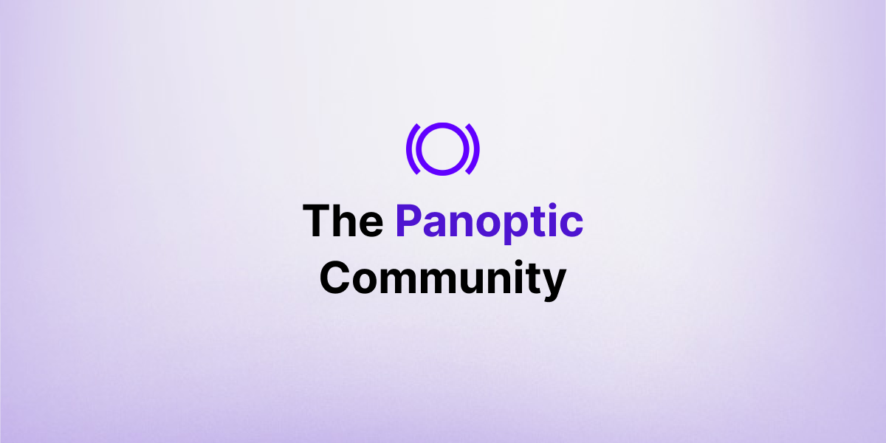

We are thrilled to announce the launch of our brand new community. This is your invitation to be a part of the future of decentralized options trading.  

Panoptic is building the world’s premier perpetual, oracle-free options protocol.

> Our goal: be the best *option* for options.

<!--truncate-->

The mission of our community is to bring together everyone who wants to learn, share and shape the future of Panoptic through meaningful dialogue and engagement. We welcome all those passionate about DeFi, trading, and options to join us as we mold a future filled with endless possibilities.

Join our community today.

## Where Our Community Lives

The Panoptic community has three main hubs: [Twitter](https://twitter.com/panoptic_xyz), [Telegram](https://t.me/panoptic), and [Discord](https://discord.com/invite/7fE8SN9pRT).  

[Twitter](https://twitter.com/panoptic_xyz) is our public-facing first point of contact. By following us on Twitter, you’ll receive a high-level overview of our day-to-day updates including new protocol developments, partnership announcements, and research bites which dive into trading strategies, Panoptions, DeFi, and Options Finance (OpFi). We’ll also host Twitter Spaces with leading experts in the industry.

Our [Telegram](https://t.me/panoptic) is temporarily paused to concentrate our resources on launching our protocol and other dynamic community spaces. Join us on Telegram (where alpha will be shared) in preparation for its relaunch!

[Discord](https://discord.com/invite/7fE8SN9pRT) is where our community lives. Here, you get the most access to our team and founders through discussion channels and AMAs. We also create spaces where like-minded DeFi enthusiasts and traders can share their thoughts on the latest strategies, ask questions to strengthen their knowledge base, and make suggestions on how to improve the Panoptic user experience.

## Our Discord Overview

The Panoptic Discord is an essential part of our community because it creates the most space for dialogue. Engaging in conversations about our cutting-edge technology is not just about clarifying details; rather, it's about creating a collaborative atmosphere where everyone contributes to the growth and refinement of Panoptic. This discourse is valuable in generating critical insights on how we can make Panoptic more effective for you. At Panoptic, we value your input and want to hear from you.

To help keep the conversation organized, we’ve broken down our Discord into multiple channels:
-   Announcements: Never miss an important update.
-   Community: Become an early contributor and participate in our regular activities.
-   Trading: Engage in conversations about markets, charts, and trading strategies.
-   Founder-Says: Where [Guillaume](https://twitter.com/guil_lambert) and [Jesper](https://twitter.com/cryptojesperk) share insights on the market, DeFi, and all things Panoptic.
-   Support: Ask questions, receive real-time assistance, and report any spam activities.
-   Status-Exchange: Get notified about updates on the status of our DEX.
-   Protocol: Propose partnerships, discuss Uniswap, and share feedback.
-   Global: Connect with Panoptic community members across the world in other languages.
    
At Panoptic, we aspire to build a welcoming, vibrant, and intellectually curious community. To that end, our Discord channels will be brimming with regular activities: AMAs with our founders and core team, trading livestreams, interactive games (with prizes), giveaways, celebrations, happy hours—the list goes on!

To participate in the activities, [join our Discord now](https://discord.com/invite/7fE8SN9pRT).

Over time, we look forward to hosting more events in person for the Panoptic community to build deeper connections. All those details will be shared across our community hubs.

## A Token of Appreciation

To celebrate the momentous launch of our community, we're delighted to announce exclusive rewards to our early contributors and users of the protocol. We value your support and involvement, and we want to extend our gratitude in a meaningful way.

Stay tuned for more details!

## Exclusive Gated Launch

Our gated launch is slated for Q3 of 2023. We can't divulge all the details yet; however, we assure you that it's something you won’t want to miss. Keep an eye out for the latest news about our gated launch by tuning in to the ‘community-announcements’ channel on [Discord](https://discord.com/invite/7fE8SN9pRT).

At Panoptic, we’re excited to build the next generation of DeFi products—and a community that stands unrivaled.

To continue learning more about Panoptic and all things DeFi options, check out our [docs](https://panoptic.xyz/docs/intro) and head to our [website](https://panoptic.xyz/).