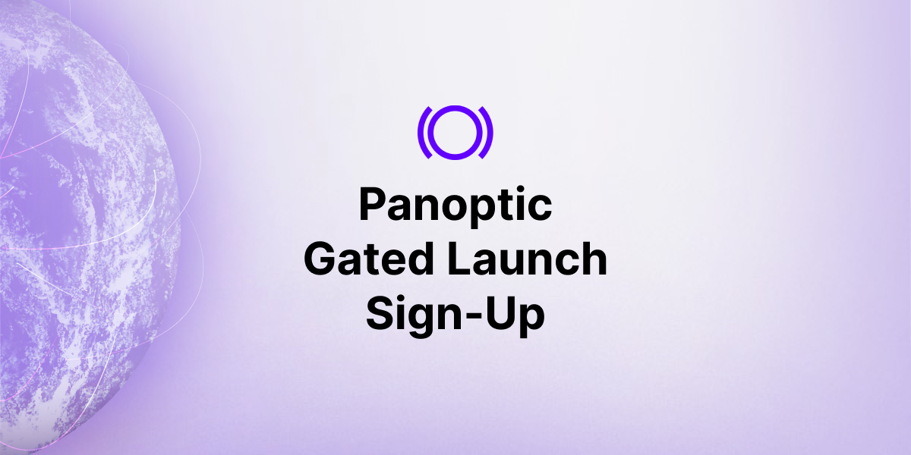

The dawn of a new era in DeFi options begins with Panoptic’s gated, beta launch.

<iframe width="560" height="315" src="https://www.youtube.com/embed/1wwF5_SH1Rc" title="YouTube video player" frameborder="0" allow="accelerometer; autoplay; clipboard-write; encrypted-media; gyroscope; picture-in-picture; web-share" allowfullscreen></iframe>

Become one of the first users to trade perpetual options on Panoptic by participating in our trading competitions where we’re offering $100,000 in prizes to the top performers.

[Sign up for our gated launch today.](https://signup.panoptic.xyz)

<!--truncate-->

## Our Gated Launch's Mission

The goal of our gated launch is to empower users to explore our platform and trade options through catered trading competitions on [Panoptic](https://panoptic.xyz/). Through these competitions, we will gain invaluable feedback and iterate the protocol with our community. 

Our gated launch is a beta launch meaning our protocol is still a work in progress. If errors occur, we’re relying on our participants to report them. Submitting bugs to our team will be rewarded because we value your input. 

With your help, rigorous testing will allow us to improve our platform to ensure that Panoptic delivers an unrivaled options trading experience upon our mainnet launch.

## The Details

Our gated launch will contain several epochs, or rounds, of trading competitions. In time, we will share a complete guide to our gated launch. For now, here’s a high-level overview:

### **Start Date**

Currently, we’re on track to begin our gated launch at the end of July 2023. However, unforeseen delays can occur when developing a new product.

We are presently in the middle of conducting an audit with [OpenZeppelin](https://panoptic.xyz/blog/openzeppelin-audits-panoptic-defi-options-protocol) and will open our gated launch after the audit is complete to ensure maximum security and functionality. If a delay occurs, we will notify the community.

### **Participants**

Participation is limited, so don’t wait to [sign up](https://signup.panoptic.xyz). Those who register earlier will be given priority to move off the waitlist.

The first epoch of the trading competition will be fairly small, but we will expand the participation pool in each consecutive round by taking people off the waitlist. Additionally, underperforming traders will be booted from the competition and replaced with those on the waitlist.

### **Trading Competitions Funds**

Each participant in the trading competition will trade real funds and can deploy up to the value of 200 USDC per epoch of their own assets. We will begin with the ETH-USDC pool before rotating to other pools such as BTC-ETH and SHIB-ETH in different rounds to demonstrate how Panoptic can be used to create perpetual options on any token. 

### **Epochs**

Each epoch will last several weeks. Similar to rotating among pools, we will rotate among scaling solutions including Arbiturm, Optimism, Polygon, Base, and other EVM chains for each round. 

By doing this, we not only ensure a seamless, high-speed trading experience, but we also substantially reduce the often prohibitive gas fees associated with DeFi transactions on Ethereum. 

## About the Trading Competition and Prizes

We’re offering $100,000 in prizes to participants in our gate launch. You can earn prizes in two ways:

### **Trading Competitions**

Our trading competition will allow you to compete with fellow traders in demonstrating your options trading prowess. More details about the reward categories will be released in our complete guide to our gated launch. 

### **Providing Feedback**

Your insights make a big difference in shaping the evolution of Panoptic and the broader DeFi ecosystem. To show our appreciation, we will be providing incentives for detailed and constructive feedback including Proof of Attendance Protocol (POAPs) mementos and priority access to the gated launch.

Priority access means you have a higher chance of being reinvited to join future trading competitions even if you are booted out of a prior epoch for underperforming.

It’s important to note that feedback is not restricted to gated launch participants. We welcome feedback from anyone in the community. 

We are incredibly excited about this chapter in our journey, and we invite you to join us. Let's make options trading better together. 

[Sign up for our gated launch today.](https://signup.panoptic.xyz)

_Join the growing community of Panotimists and be the first to hear our latest updates by following us on our [social media platforms](https://links.panoptic.xyz/all). To learn more about Panoptic and all things DeFi options, check out our [docs](https://panoptic.xyz/docs/intro) and head to our [website](https://panoptic.xyz/)._

