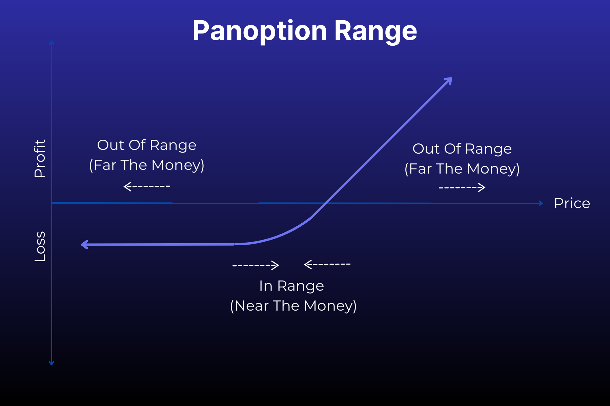
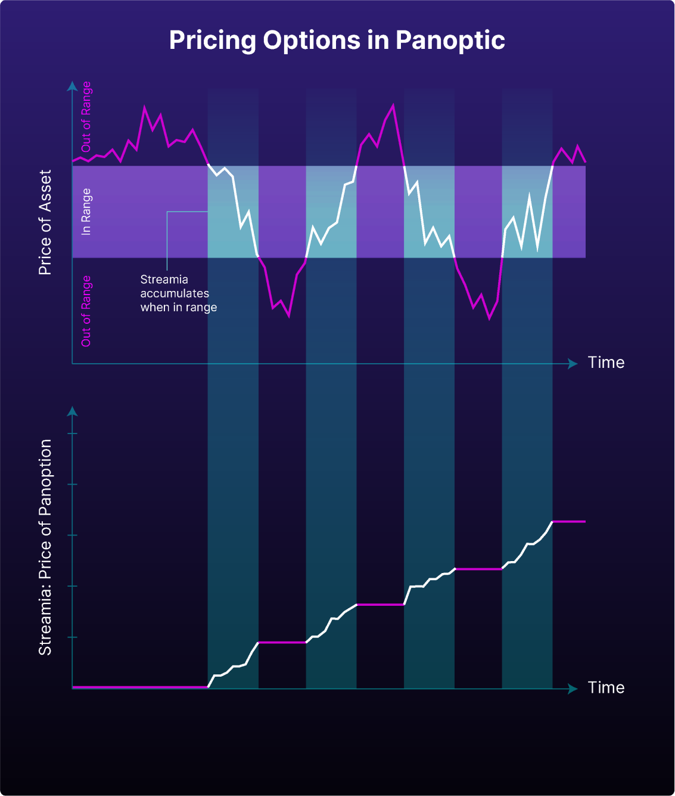

En route to creating a transformative DeFi options protocol, Panoptic has made several industry-altering inventions including streamia, the future of DeFi options pricing. 

As explained in a [recent article](https://panoptic.xyz/blog/black-scholes-streamia-defi-options-pricing-models), streamia builds upon previous option pricing models to create a more secure and cost-effective way to price a new type of options – perpetual options. Understanding the nuances of how streamia works is important to realizing its potential for shaping the future of options trading.

<!--truncate-->

## What is Streamia? 

<iframe width="560" height="315" src="https://www.youtube.com/embed/Gfl-_yPGZyU?si=ObqvyrZ9ROhlDLIv" title="YouTube video player" frameborder="0" allow="accelerometer; autoplay; clipboard-write; encrypted-media; gyroscope; picture-in-picture; web-share" allowfullscreen></iframe>

Streamia is the DeFi-native way to price perpetual options. The word derives its meaning from combining streaming and premia. 

Streaming refers to the continuous flow of payments made by the holder of a perpetual product such as a perpetual option. Premia is the plural of [premium](https://panoptic.xyz/docs/terms/premium) which, in the context of options trading, represents the prevailing market prices of option contracts and serves as the compensation received by the seller of the option from the buyer.

## Premia and the Value of Traditional Options

In traditional options, a number of factors influence premia including the value and volatility of the underlying asset as well as the strike price (the predetermined price at which the option can be exercised). Calculating a fair premia is complex and relies on pricing models such as the [Black-Scholes Model (BSM)](https://panoptic.xyz/blog/black-scholes-streamia-defi-options-pricing-models). 

The premia of an option is not intrinsically tied to the value of the options contract because premia refers to the fixed price paid for the right, but not obligation, to trade an asset at a guaranteed price. The value of a traditional option depends on whether the option is [in the money (ITM)](https://panoptic.xyz/docs/terms/in_the_money) or [out of the money (OTM)](https://panoptic.xyz/docs/terms/out_of_the_money). 

If a trader exercises an ITM option, it has intrinsic value and results in a profit. If an OTM option is exercised, it has no intrinsic value and results in zero profit. Moreover, if an option expires before it’s exercised, then the option has no value to the buyer.

In all three scenarios, ITM, OTM and expiration, the fixed premium is paid upfront by the option buyer to the seller. It doesn’t matter if the option never has any intrinsic value during the time of the contract. 

In traditional options, the amount of premium charged, assuming efficient markets, is dependent on the [probability of the option being ITM](https://panoptic.xyz/research/defi-option-strangle-straddle#delta-as-the-probability-of-being-itm). The higher the likelihood of the option being worth more money, the higher the premium charged to the buyer.

## Rangeness vs. Moneyness

Panoptic is not just an extension of the options trading market; it’s the arrival of the next chapter in options trading. Through Panoptic, users can trade perpetual options, more generally known as expirationless options (XPOs) in finance and more specifically referred to as Panoptions in the Panoptic protocol.

A simple way to conceptualize the streamia for Panoptions is to think of a continuous series of options that expire over a short period of time with the total premia gradually accumulating each time the option is [rolled](https://www.tastylive.com/definitions/rolling-options). 

To calculate when streamia should be accumulated, Panoptics pulls inspiration from the traditional option terms near the money and far the money.

### **[Near The Money](https://www.investopedia.com/terms/n/near-the-money.asp)**

A situation where the current market price of the underlying asset is very close to the strike price of an option. In other words, the option is neither deep ITM nor deep OTM.

### **Far The Money**

A situation where the current market price of the underlying asset is very far from the strike price of an option. In other words, the option is either deep ITM or deep OTM.

Panoptic’s counterparts to these terms are: 

### **[In Range (IR)](https://panoptic.xyz/docs/terms/in_range)**

A situation where the current market price of the underlying asset is between the Panoption's lower and upper price range. In other words, the option is near-the-money.

### **[Out of Range (OOR)](https://panoptic.xyz/docs/terms/out_of_range)**

A situation where the current market price of the underlying asset is above the Panoption's upper price range or below the Panoption's lower price range. In other words, the option is far-the-money. 

Overall, streamia depends on the rangeness of the Panoption.

## How Streamia Is Calculated

Unlike traditional options, there is no upfront cost to purchasing a Panoption. Streamia only starts to accumulate once a seller creates an option and the Panoption is IR. 

If no one opts to buy the Panoption, the assets remain in Uniswap and the seller earns rewards as if they are LPing on Uniswap. If someone chooses to buy the Panoption, the assets move from Uniswap to Panoptic. 

Once on Panoptic, the Panoption will accumulate streamia whenever a new block is created  (about every 12 seconds on Ethereum). When calculating whether to add streamia, two possibilities exist: 

1. No streamia is added because the Panoptian is OOR. Since the option is deep ITM or deep OTM, its future moneyness is more certain and no additional costs to the user is added. 

2. Streamia is added because the option is IR. Since the option is near-the-money, its future moneyness is uncertain, the likelihood of the option gaining value increases, and so does the streamia.

The accumulated streamia is directly correlated to the reward for liquidity providing (LPing) the asset in Uniswap. If the buyer utilizes a large proportion of the available liquidity for sold options, then an additional liquidity spread fee is added to the streamia.

Read more about exact calculations [here](https://panoptic.xyz/docs/panoptic-protocol/streamia).

## Streamia Accumulation Example

On Panoptic, say a seller creates a put Panoption on the USDC/ETH pair. The current market price of ETH is 1800 USDC, and the strike price of the Panopticon is 2000 USDC with a [width of 10%](https://panoptic.xyz/research/uniswap-lp-calculate-price-range). That means the upper bound of the range is $2200 and the lower bound of the range $1818. 

To create the put option, the seller can either borrow liquidity from the Panoptic pools provided by Panoptic liquidity providers (PLPs) or use their own funds to deposit the token pair in the corresponding Uniswap v3 pool. 

When a trader buys this put option, the funds for the option are moved from Uniswap to the corresponding Panoptic pool. The upfront cost to the buyer is zero dollars and the streamia will not start to accumulate until the Panoption is IR.

If the price of ETH never exceeds $1818 (the lower bound of the put option) while the buyer holds the contract, no streamia will accumulate because the Panoption is OOR.
 

If the price of ETH rises above $1818 (the lower bound) and remains below $2200 (the upper bound), then streamia will accumulate because the Panoption is IR. Learn more about the exact formula [here](https://panoptic.xyz/docs/panoptic-protocol/streamia).

If the price of ETH skyrockets past $2200 (the upper bound of the put option), also known as going deep ITM, then no streamia will accumulate because the option is no longer IR. 

Please note that the streamia is a fee paid by buyers to sellers. There are other fees associated with trading options on Panoptic outside of streamia which you can read more about [here](https://panoptic.xyz/docs/faq/#fees).

## Advantages of Streamia

Streamia has four distinct advantages for DeFi options:

1. If you hold an option that’s never IR, meaning the option stays far-the-money, then you owe zero fees in streamia. 

2. The streaming nature of premia accumulating over time is adapted to price options that do not expire.

3. The buyer can easily manage risk since total streamia owed accumulates gradually.

4. The buyer does not need to worry about rolling expiring options positions since the streamia automatically manages this.

[Research](https://paper.panoptic.xyz) shows that streamia-based perpetual options pricing converges to the fair, or Black Scholes Model (BSM), price of an equivalent traditional option. 

This means that streamia is not a divergent step away from the BSM, but rather an adaptation of traditional options pricing. In short, streamia is built for pricing perpetual DeFi options. 

_Join the growing community of Panoptimists and be the first to hear our latest updates by following us on our[ social media platforms](https://links.panoptic.xyz/all). To learn more about Panoptic and all things DeFi options, check out our[ docs](https://panoptic.xyz/docs/intro) and head to our[ website](https://panoptic.xyz/)._

