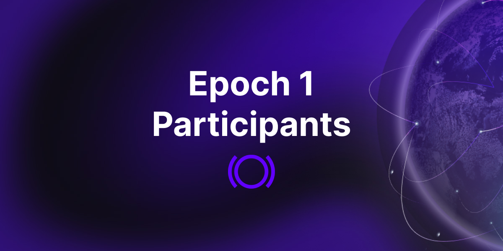
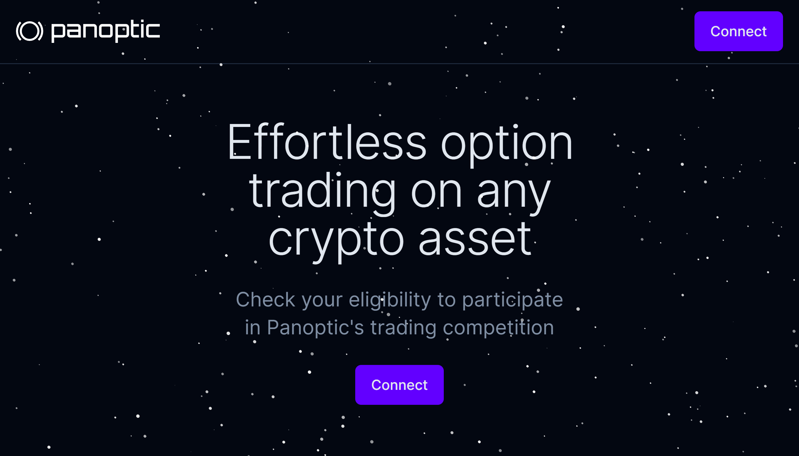

  

We are excited to announce the selection of participants for the first epoch of our [gated, beta launch](https://panoptic.xyz/blog/gated-launch-sign-up).

<!-- truncate -->

Our beta launch is structured as multiple epochs, or rounds, of trading competitions where participants use real assets to buy and sell DeFi-native options. In each epoch, the lowest ranking performers run the risk of being excluded from future competitions, and top performers will receive prizes. Throughout the beta launch we’re offering $100,000 in prizes.

## About Epoch 1

  

Epoch 1 is a "warm-up" epoch that’s meant to test the very basic functionality of the protocol. We are dedicated to launching a DeFi options trading platform of the highest quality and firmly believe that our step-by-step approach is crucial for achieving our goal.

  

During this phase, we will focus on validating fundamental actions such as depositing liquidity, selling options, buying options, and withdrawing funds.

  

Epoch 1 will consist of 32 users which have been selected from over 5,000 participants who registered through our [sign-up form](https://signup.panoptic.xyz/). Selection criteria encompasses factors such as time of sign up, Twitter engagement, possession of gas tokens, participation in other DeFi protocols, and other on-chain activity.

  

To show our appreciation for your engagement in Panoptic's inaugural phase, every participant of Epoch 1 will be awarded a special commemorative POAP. Additionally, you will automatically qualify for Epoch 2 of our trading competition, where we anticipate elevating the competition's stakes. Thank you for being a part of this journey with us!

  

Please note that this does not mean that we are limiting our entire gated launch engagement to 32 participants. In future epochs, we will be expanding to include more participants. The number of participants will significantly increase as we continue to progress and test the parameters of our platform.

  

## Checking Your Participation Status

  

For those who are eager to know whether they've made it to the epoch 1 whitelist, you can connect your wallet to our [site](https://access.panoptic.xyz/) to check your status.

  

If your wallet is eligible, you will need to confirm your participation before August 14, 2023, 16:00 UTC by following the instructions on the site.

  

If you haven't been included in this first epoch, don't worry! Make sure you are [signed up](https://signup.panoptic.xyz) for the beta launch and joined our [Discord](https://discord.com/invite/8sX5Af2KXG). By doing so, you may still be made eligible to participate at a future date or when the protocol is publicly launched.

  

## Looking Ahead

  

We are enthusiastic about the potential of Panoptic and the positive disruption we aim to bring to DeFi options. We value all of our community members and are eager to include as many of you as possible in our future testing phases.

  

We would like to express our heartfelt thanks for your patience and support throughout this process. Rest assured, our goal remains the same: create a platform that meets the needs of our users, providing them with a seamless and secure trading experience.

  

Stay tuned for more updates, and thank you for being a part of the Panoptic journey!

  

*Join the growing community of Panoptimists and be the first to hear our latest updates by following us on our [social media platforms](https://links.panoptic.xyz/all). To learn more about Panoptic and all things DeFi options, check out our [docs](https://panoptic.xyz/docs/intro) and head to our [website](https://panoptic.xyz/).*
