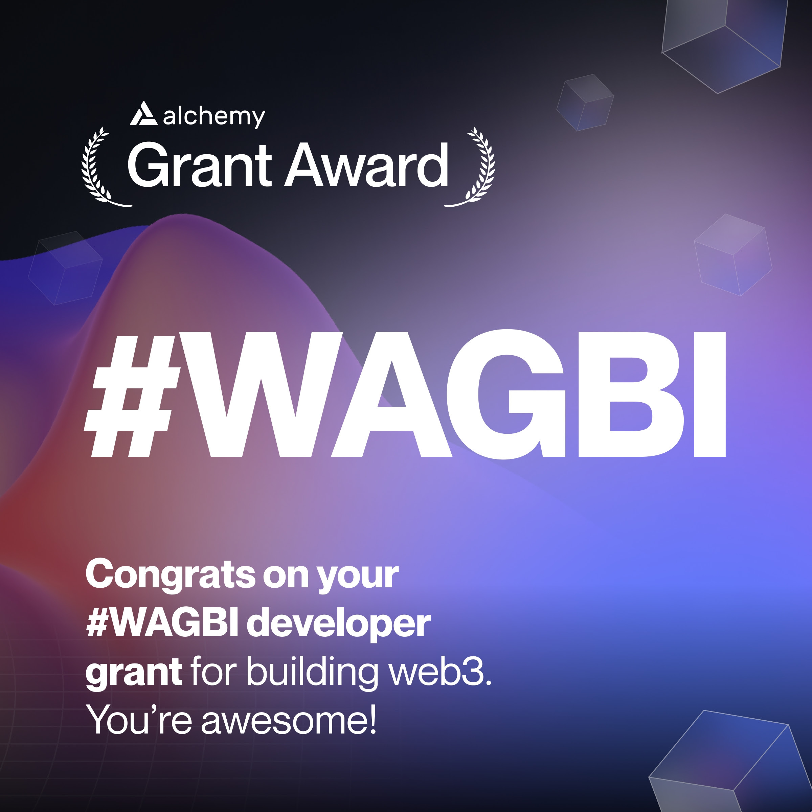

Panoptic is thrilled to announce that we have been awarded a grant as part of [Alchemy's WAGBI (We're All Gonna Build It 👷🛠️) developer program](https://www.alchemy.com/developer-grant-program). The grant acknowledges our persistent endeavors in the web3 domain, and Alchemy's endorsement marks a significant milestone in our journey.

<!-- truncate -->

# About Alchemy

Alchemy is a premier blockchain development platform, providing tools for software developers to build apps for blockchains.

  

The company’s mission is to leverage massively scalable infrastructure, AI, and blockchain to provide developers with the fundamental building blocks they need to create the future of technology. Its goal is to enable the global opportunity of blockchain - the next tectonic shift.

  

> *“We’re super inspired by Panoptic’s project and commitment to web3, and are beyond excited to help Panoptic continue building,”* said Shelley Tang, head of growth at Alchemy.

  

With a team rich in experience from tech giants like Google, Microsoft, and Facebook, and endorsements from Stanford University, Coinbase, and key industry leaders, Alchemy powers innovation across 197 countries and facilitates billions in transactions globally.

# About Panoptic

Panoptic is building the future of DeFi options by developing a seamless protocol that will allow anyone to permissionlessly trade options on any crypto token with no expiration date.

  

Currently, Panoptic is building on top of Uniswap v3, the world's largest decentralized exchange (DEX). Upon our mainnet launch, anyone will be able to manage portfolio risk, earn sustainable returns, and trade options in a decentralized manner.

  

> *"We are thrilled to announce our acceptance to Alchemy’s WAGBI developer program and receival of the developer grant. At Panoptic, we are focused on building through the bear market and are committed to delivering a crypto options platform that will revolutionize the DeFi options landscape,"* said Jesper Kristensen, COO and co-founder of Panoptic.
>
> *"Alchemy provides us with a solid blockchain development platform that will assist us in producing a robust perpetual options protocol to enable the effortless trading of any crypto asset. We’ll be using our grant to take Panoptic to the next level with support from Alchemy."*

  

We would like to share our immense gratitude towards Alchemy and our community. We are excited to have Alchemy’s support in continually improving Panoptic’s DeFi options platform, and look forward to sharing our progress in creating a more seamless and efficient decentralized finance landscape.

  

*Join the growing community of Panoptimists and be the first to hear our latest updates by following us on our [social media platforms](https://links.panoptic.xyz/all). To learn more about Panoptic and all things DeFi options, check out our [docs](https://panoptic.xyz/docs/intro) and head to our [website](https://panoptic.xyz/).*