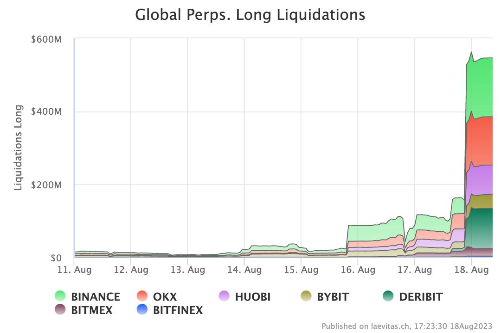
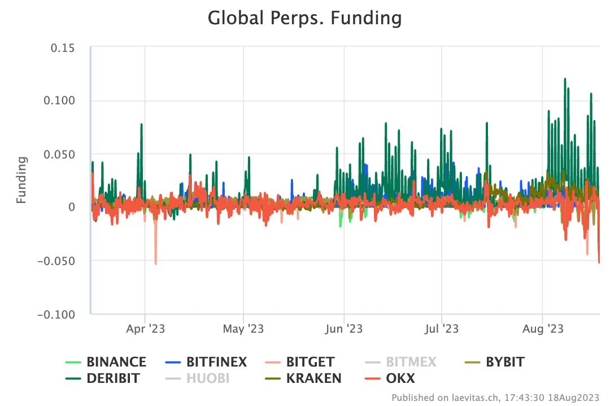
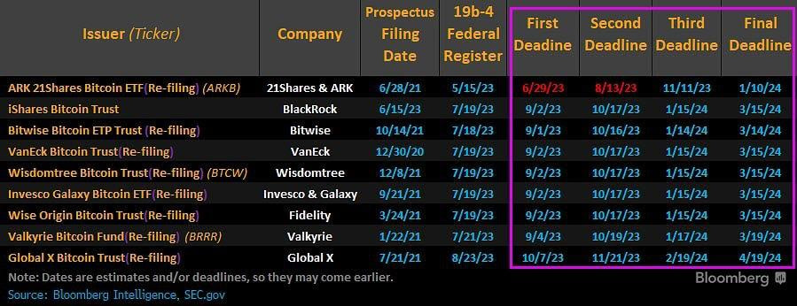
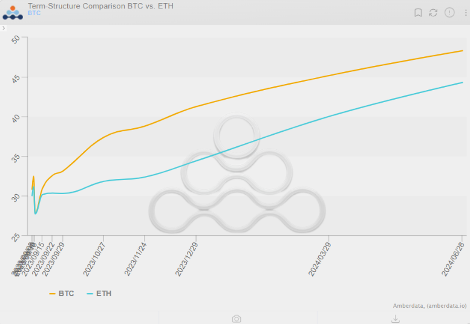
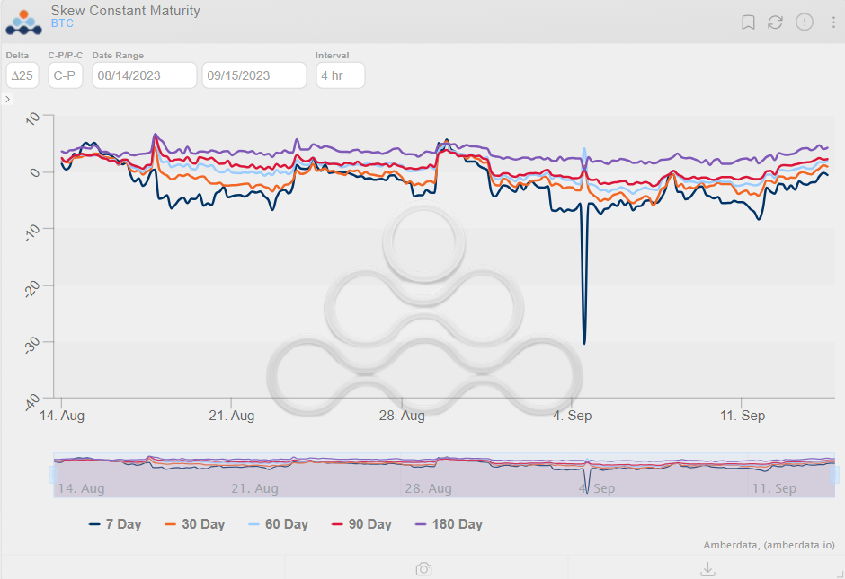

  

Welcome Panoptimists to the first edition of the Panoptic Newsletter where we provide industry insights, research recaps, and Panoptic-specific content to keep you updated on our DeFi-native options platform. 

If you’re interested in having future newsletters sent directly to your email, [sign up here](https://forms.gle/WUP7svCVfaLRGnQB8)! 

<!--truncate-->

## Market Overview: 

The first half of August yielded relatively uneventful market conditions. Volatility, both realized and implied, cratered as Bitcoin (BTC) traded in a range-bound pattern between [$29K-$30K](https://www.tradingview.com/x/Li9IGcCD/). 

  

Prices were consolidating for the previous few weeks, and without many near-term catalysts, exciting price action was scarce. This type of range-bound, consolidatory trading is typical of a market with low realized volatility and was last experienced during the lengthier pre-COVID cryptowinter of 2018-2019. 

In late August, the market experienced notable fluctuations in both price movements and implied volatilities. These fluctuations were in part due to a significant liquidation event, emphasizing the critical role of microstructure-specific events like cascading liquidations and dealer hedging especially during periods of low volatility. 

The liquidation event was driven by a large BTC and ETH liquidation on Deribit and OKX (this was one of the [largest Deribit liquidation](https://twitter.com/Gravity5ucks/status/1692415535525364163) events in the past few years). The disproportionate involvement of Deribit and OKX, despite Deribit having a relatively smaller share of the open interest in the futures markets, was quite noticeable as they contributed to over 50% of the total liquidation. 

  

This liquidation is speculated to have been initiated by a [WSJ piece](https://www.wsj.com/tech/behind-the-curtain-of-elon-musks-secretive-spacex-revenue-growth-and-rising-costs-2c828e2b) covering the SpaceX BTC write-down and led some market participants to speculate Tesla may have offloaded their BTC. 

Funding rates in the perpetual markets drove sharply negative, and BTC risk-reversals took a sharp move down, signaling a strong preference for downside protection.

Finishing off August with some bullish news, the courts ruled that the SEC’s rejection of Grayscale Bitcoin Trust (GBTC)’s Bitcoin spot ETF filing was "[arbitrary and capricious](https://www.ropesgray.com/en/newsroom/alerts/2023/09/court-grants-victory-to-grayscale#:~:text=Observing%20that%20the%20SEC's%20denial,%E2%80%9CGBTC%E2%80%9D%20shares%20on%20its)". This ruling compelled the SEC to reconsider the filing.

The market [reacted positively to the news](https://www.reuters.com/markets/currencies/bitcoin-hits-two-week-peak-after-grayscale-spot-bitcoin-etf-ruling-2023-08-29/) with a strong rally on August 29. However,  the SEC delayed its decision on all spot Bitcoin ETF applications, and the markets threw a fit retracing the upside after the Grayscale decision. 

As of the time of writing, BTC trades around $25,800, and ETH trades around $1,600. Term structure is upward sloping, as is typical in this market of few near-term events and steady price action. Skew (25D C-P) is positive across all rolling expiries other than the shorter-term 7-day expiry, signaling that calls are priced at a slight premium. 

## DeFi Markets News

### Curve's Crisis: Understanding the Vyper Exploit and its Domino Effect

Recently, [Curve](https://curve.fi/), a leading money market, faced an [exploit that drained  ~$70m in liquidity](https://blockworks.co/news/curve-suffers-exploit) from the decentralized exchange (DEX).

#### **The Catalyst: Vyper's Misstep**

A flaw in the implementation of a reentrancy lock in [Vyper](https://cointelegraph.com/news/curve-vyper-exploit-whole-story-so-far), a Python-based smart contract language used by the DEX, paved the way for malicious actors to exploit Curve. This type of vulnerability allows attackers to call a function repeatedly before its initial completion, leading to unintended consequences — such as the draining of funds.

#### **Immediate Aftermath**

The direct fallout was twofold: 

1. A significant liquidity drain from Curve’s pETH-ETH, sETH-ETH, and alETH-ETH pools as well as 32 million Curve DAO (CRV) tokens.

2. A sharp decline in the price of its native token, CRV, which dropped from the $0.70-$0.80 range to a low of approximately $0.08.

#### **The Ripple Effect: Egorov's Collateralized Loans**

Beyond these direct fallouts, Michael Egorov, founder of Curve, [holds loans backed by CRV](https://www.coindesk.com/business/2023/08/03/curve-founder-still-owes-80m-despite-raising-nearly-30m-in-past-two-days/). With the significant token price drop, these loans were at risk of becoming undercollateralized, which could trigger a cascade of liquidations.

Adding fuel to the fire, traders, spotting a price differential of CRV between various decentralized and centralized exchanges, jumped in to capitalize on these arbitrage opportunities which added to the price volatility.

#### **A Ticking Time Bomb: Fraxlend's Interest Rates**

Egorov's position with Fraxlend, a lending protocol with a time-weighted variable interest rate, posed a significant threat. If left unchecked, Egorov's already high interest rate of 81.2% could skyrocket to an astronomical [10,000% in just about 3.5 days](https://www.coindesk.com/markets/2023/08/01/curve-founder-deploys-new-liquidity-pool-to-address-frax-debt-situation/). Despite Egorov's attempts to stabilize his position, users began pulling out their liquidity.

#### **A Glimmer of Hope: OTC Deals to the Rescue**

In a strategic move, Egorov turned to over-the-counter (OTC) deals, [striking agreements with various organizations and individuals](https://finance.yahoo.com/news/week-defi-curve-founder-otc-110659871.html). These deals involved selling CRV at a discount which provided Egorov with the funds to address his debts. The counterparties stand to profit from this exchange if the CRV price rebounds.

#### **Analysis**

The Vyper exploit and its aftermath underscore the intricate interdependencies within the DeFi ecosystem. While Curve faced immediate challenges, the strategic responses, including  the OTC deals, highlight the community's resilience and belief in the protocol's long-term potential. 

As the dust settles, this event serves as a poignant reminder of the importance of robust technical infrastructure and the ever-evolving dynamics of the DeFi landscape.

### Balancer's v2 Pools Exploit: A Dive into the Vulnerability and its Implications

#### **Balancer's Crisis: Unraveling the v2 Pools Exploit**

On August 27th, the DeFi community was abuzz with news of an [exploit in Balancer's v2 pools](https://cointelegraph.com/news/balancer-exploited-900k-after-vulnerability-warning). The team had disclosed the critical vulnerability affecting its boosted pools on [August 22nd](https://forum.balancer.fi/t/vulnerability-found-in-some-pools/5102). The Balancer team was quick to acknowledge the situation and most funds in the affected pools were promptly withdrawn.

#### **The Catalyst: Balancer's Vulnerability**

Meir Dolev of blockchain security firm Cyvers.AI [reported](https://blockworks.co/news/balancer-exploit-vulnerability) that the attacker managed to secure a hefty $900k from the exploit. In response to the vulnerability's discovery, [Balancer urged](https://decrypt.co/154002/balancer-suffers-nearly-1m-exploit-team-urges-users-withdraw-funds) liquidity providers to make a proportional exit, ensuring a fair distribution of remaining funds. 

#### **Discrepancies in the Data: PeckShield's Analysis**

In Balancer’s [subsequent announcement](https://crypto-economy.com/balancer-recovers-97-of-funds-5m-still-at-risk/), the company noted that over 99.7% of the initially at-risk liquidity is now secure. However, contrary to Balancer's claim that only 0.08% of the TVL was still at risk, PeckShield, the blockchain security company, suggested that more than $2.1 million remained in the affected v2 pools, according to their analysis. PeckShield took to [Twitter](https://twitter.com/peckshield/status/1696185272445419961?ref_src=twsrc%5Etfw%7Ctwcamp%5Etweetembed%7Ctwterm%5E1696185272445419961%7Ctwgr%5Ebecd6276ac94f5aa7aa78bd5ca13df3cd3900924%7Ctwcon%5Es1_&ref_url=https%3A%2F%2Fblockworks.co%2Fnews%2Fbalancer-exploit-vulnerability), pointing out the potential miscalculation in Balancer's original estimate.

#### **Reflections and Lessons Learned**

While Balancer's prompt response to the exploit is commendable, the event underscores the importance of third-party verification and the complexities of the DeFi ecosystem. As the debate over the exact figures continues, it serves as a reminder of the challenges and vulnerabilities inherent in the world of decentralized finance.

## Panoptic Highlights 

### Ambassadors

This month we announced our new ambassadors! Our ambassadors hold key responsibilities within our organization and have the chance to contribute to the growth and development of Panoptic. Here’s a quick introduction to our ambassadors:

[0xbroze](https://twitter.com/Panoptic_xyz/status/1688550580615249921?s=20) is the co-founder of Dartmouth Blockchain and co-founder of [Anthias](https://www.anthias.xyz/). He also previously worked on design at [Primitive Finance](https://twitter.com/PrimitiveFi).

[Ali](https://twitter.com/Panoptic_xyz/status/1688920513392091137?s=20) comes from a crypto-VC background and is now a full-time independent researcher. 

[CryptoDeFiGuy](https://twitter.com/Panoptic_xyz/status/1689275385593090048?s=20) has previous trading experience at [GSR](https://twitter.com/GSR_io) and [Genesis Trading](https://twitter.com/GenesisTrading), specializing in options and derivatives. 

[Acseth2032](https://twitter.com/Panoptic_xyz/status/1689645285679759362?s=20) comes from a TradFi background and has several years of experience in investment banking and corporate finance.

### Gated Launch News

Picture this: a series of trading arenas, or 'epochs', where participants dive into the world of DeFi-native options, wielding real assets. But there's a twist! While the top performers bask in glory and prizes, those at the bottom might face the exit door. And speaking of prizes, we've got a whopping $100,000 up for grabs throughout our beta launch.

We're thrilled to [unveil the chosen participants](https://twitter.com/Panoptic_xyz/status/1689940047435632640?s=20) for the inaugural epoch of our gated, beta launch! 

## Research Bites

### Aug. 5 | [Demystifying IL, LVR, JIT, and MEV](https://panoptic.xyz/research/demystifying-IL-LVR-JIT-MEV)

In the realm of Liquidity Providing (LPing), several terms often mystify newcomers.This includes:

**Impermanent Loss (IL):** the temporary loss LPs experience when the price ratio of their provided assets diverges from the initial ratio; it's essentially the risk associated with the accelerating conversion of assets away from the starting balance. 

 **Loss-versus-rebalancing (LVR):** a metric that contrasts passive LPing with the active rebalancing of a two-asset portfolio, akin to the continuous hedging seen in options trading.

 **Just-in-time (JIT) Liquidity: **the act of providing substantial liquidity for a brief period, typically a single block, to accommodate a large trade, much like selling a put option that expires in seconds.

**Maximal Extractable Value (MEV):** pertains to the value that can be extracted by rearranging blockchain transactions within a block.

The public documentation of our CEO and cofounder, Guillaume Lambert’s, trades showcases the potential success of retail-level LPs when they approach LPing without sophisticated strategies. 

However, while IL, LVR, JIT, and MEV are significant, they aren't the primary barriers to retail adoption. The real challenges lie in the realms of user experience, capital efficiency, and risk management tooling.

Panoptic aims to address these issues, paving the way for a more streamlined and efficient LP experience.

### Aug. 21 | [Panoptic Options Trading Strategies Series: Part II — The Covered Call and Active Position Management](https://panoptic.xyz/research/panoption-trading-strategies-covered-call-rolling)

In the latest installment of our Options Trading Strategies Series, we delved deep into the world of covered calls and the art of actively managing options positions. At its core, a covered call strategy allows traders to earn income in flat markets, providing a buffer against potential price drops. 

In our exploration, we draw parallels between traditional finance (TradFi) and Panoptic's unique approach, highlighting the nuances and benefits of each. From the unlimited upside potential in Panoptic to the capped profits in TradFi, we uncover the intricacies of these strategies, equipping traders with insights to navigate the ever-evolving DeFi landscape.

## Panoptic in the Media

Panoptic was awarded a grant as part of Alchemy’s WAGBI [(We’re All Gonna Build It 👷🛠️) developer program.](https://www.alchemy.com/developer-grant-program) The grant acknowledges our persistent endeavors in the web3 domain, and Alchemy’s endorsement marks a significant milestone in our journey.

## Community Spotlights

<blockquote class="twitter-tweet">
The Money Lego: Liquidity Providing Derivatives (LDPfi)  Welcome to the new era of DeFi.  I saved you time by finding the stars in each category with great thread before you missed 🧵👇🏻 <a href="https://t.co/fn1v2URovW">pic.twitter.com/fn1v2URovW</a>
&mdash; Foxi.eth 🦊 (@Foxi_xyz) <a href="https://twitter.com/Foxi_xyz/status/1694680986179846403?ref_src=twsrc%5Etfw">August 24, 2023</a></blockquote> 

<blockquote class="twitter-tweet">
Panoptic optimizes liquidity for <a href="https://twitter.com/Uniswap?ref_src=twsrc%5Etfw">@Uniswap</a> v3 LPs 📈 Learn more in this short 🧵 on the topic by <a href="https://twitter.com/acseth2032?ref_src=twsrc%5Etfw">@acseth2032</a> <a href="https://t.co/dkIkJt6Uqe">https://t.co/dkIkJt6Uqe</a>
&mdash; Panoptic (@Panoptic_xyz) <a href="https://twitter.com/Panoptic_xyz/status/1694884801336287378?ref_src=twsrc%5Etfw">August 25, 2023</a></blockquote> 

<blockquote class="twitter-tweet">
🧵Quick thread about <a href="https://twitter.com/Panoptic_xyz?ref_src=twsrc%5Etfw">@Panoptic_xyz</a> 👇  Below i gathered all important information about the product from their litepaper, so you don&#39;t have to 🫡  Panoptic revolutionizes on-chain options, eliminating the need for expiries, oracles, intermediaries, counterparties, and order…
&mdash; Derteil (💎, 💎) (@derteil00) <a href="https://twitter.com/derteil00/status/1691455802647965696?ref_src=twsrc%5Etfw">August 15, 2023</a></blockquote> 

<blockquote class="twitter-tweet">
In our latest <a href="https://twitter.com/hashtag/Binance?src=hash&amp;ref_src=twsrc%5Etfw">#Binance</a> Research report, we take a closer look at one of DeFi&#39;s most promising areas: Derivatives.  We explore the state of on-chain perpetuals and options protocols, current market outlook and much more.  Have a read ⬇<a href="https://t.co/UnEcnWJQA8">https://t.co/UnEcnWJQA8</a>
&mdash; Binance Research (@BinanceResearch) <a href="https://twitter.com/BinanceResearch/status/1686727841054941184?ref_src=twsrc%5Etfw">August 2, 2023</a></blockquote> 

## Up Next

We’re fast approaching our gated, beta launch. With the team hard at work on getting everything ready, you can look forward to some major announcements soon. 

_Join the growing community of Panoptimists and be the first to hear our latest updates by following us on our [social media platforms](https://links.panoptic.xyz/all). To learn more about Panoptic and all things DeFi options, check out our [docs](https://panoptic.xyz/docs/intro) and head to our [website](https://panoptic.xyz/)._

