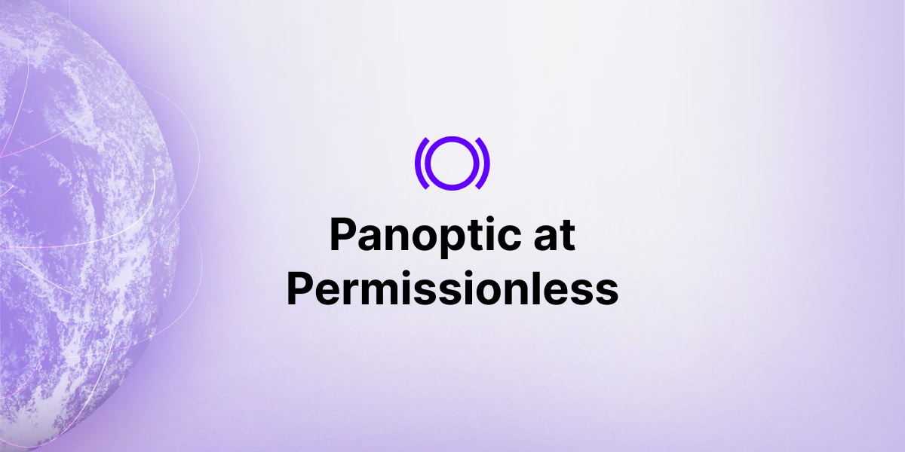
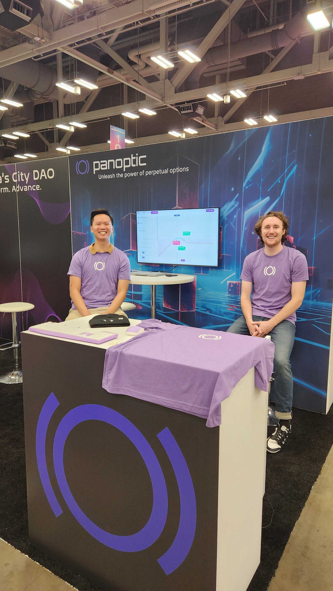

It's Monday in Austin, Texas. The heat is sweltering in triple digit humidity, but not inside the Austin Convention Center where over 5,000 crypto connoisseurs, hobbyists, and professionals will meet. The second [Permissionless](https://twitter.com/Permissionless) conference, hosted by [Blockworks](https://twitter.com/Blockworks_), brings together some of the most passionate decentralized finance (DeFi) and blockchain users.

<!-- truncate -->

The Panoptic team came prepared with an exhibition booth to meet conference attendees, a TV to showcase our DeFi options platform, and plenty of merch to give to Panoptimists.

  

  

Despite the current bear market, the conference was teeming with passionate crypto founders, VCs, builders, traders, and enthusiasts who visited our booth to be one of the first pioneers to try our platform and mint an option to celebrate the alpha launch of Panoptic's perpetual options platform. People were very excited to experience the options trading platform and couldn't wait to use it themselves to unlock the power of perpetual options.

  

## What are Perpetual Options?

  

The most frequently asked question by options traders and crypto users alike: what are perpetual options?

  
If you're an [option trader](https://panoptic.xyz/docs/getting-started/options-traders), then think of a 12 second expiring option rolled over and over again. For [perp traders](https://panoptic.xyz/docs/getting-started/perps-traders), think of a perp that can be traded on any token without liquidation risk. Or if you [provide liquidity](https://panoptic.xyz/docs/getting-started/liquidity-providers) on Uniswap, or other automated market maker (AMM), think of an LP token ([perpetual put](https://panoptic.xyz/docs/panoptic-protocol/design)), a delta neutral LP position (perpetual straddle), or shorting an LP token ([perpetual long option](https://panoptic.xyz/research/essential-options-strategies-to-know#1-put-%EF%B8%8F)).
  

Perpetual options are options that never expire and bring capital efficiency, flexibility, and risk managed trades to DeFi.

  

## So what is Panoptic?

  

Conference attendees were quick to understand the value of perpetual options, especially with the visual aid of their payoff graphs on [Panoptic’s platform](https://panoptic.xyz/blog/demoing-panoptic-defi-options-protocol). After all, these crypto people are no stranger to financial innovation.

  

The natural next question was, even if perpetual options could theoretically exist, how would they work in practice? To answer, we talked with attendees about how Panoptic was a completely permissionless platform built on top of Uniswap that enables perpetual options trading for any token, at any strike, of any size. Panoptic is built on Uniswap, and Uniswap is built on the blockchain which doesn't discriminate. That’s why, on Panoptic, anyone can create an options market for a token without needing permission.

  

## The Future of Finance

  

Options are an integral part of the existing traditional finance (TradFi) system, but they have yet to fully permeate into DeFi. The future of finance is financial instruments that reimagine the way we exchange — all the way down to its infrastructure.

  

*Join the growing community of Panoptimists and be the first to hear our latest updates by following us on our [social media platforms](https://links.panoptic.xyz/all). To learn more about Panoptic and all things DeFi options, check out our [docs](https://panoptic.xyz/docs/intro) and head to our [website](https://panoptic.xyz/).*