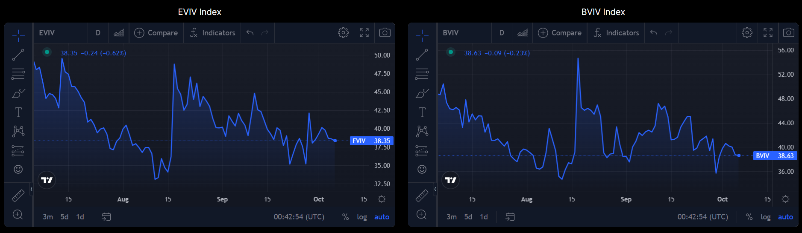
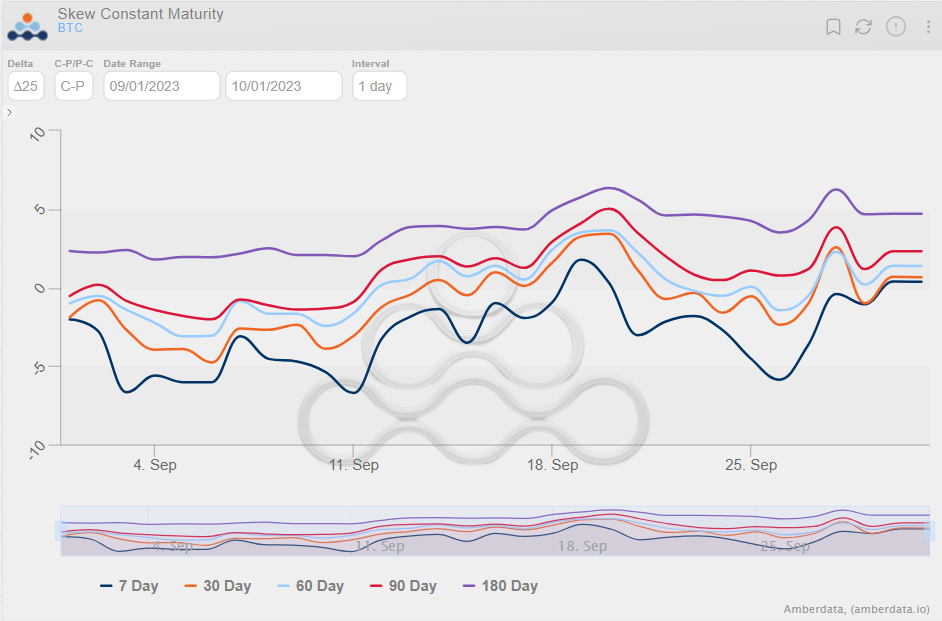
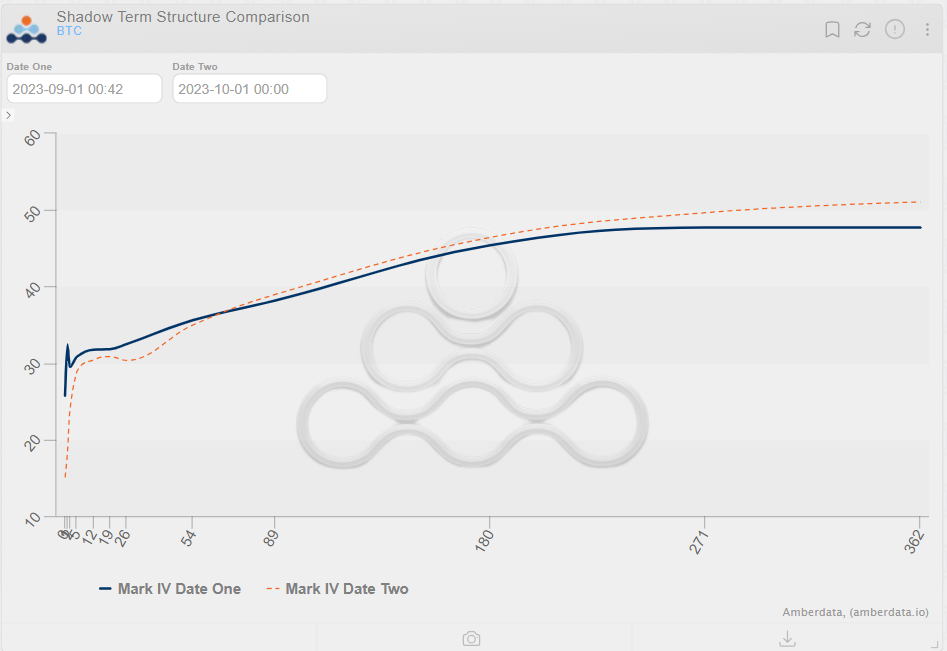

Welcome Panoptimists to the second edition of the Panoptic Newsletter where we provide industry insights, research recaps, and Panoptic-specific content to keep you updated on our DeFi-native options platform.

If you want future newsletters sent directly to your email, [sign up here](https://forms.gle/2CAA9hgVGwn2YdXP6)!
<!--truncate-->

## Market Overview

September was largely uneventful in terms of price action, with the market trading in an even tighter range-bound pattern than in previous months. As measured by the BVIV and EVIV indices, volatility saw a brief spike on Sept. 11 and 12 but quickly mean-reverted, closing the month similarly to where it started.

### **Notable Days in September:**

On Sept. 11, BTC and ETH were down to $25.1k and $1,555 respectively, with altcoins like XRP, SOL, DOT, and MATIC also experiencing declines. This occurred despite positive economic indicators in the U.S. The market was also awaiting the release of CPI inflation data, which traders were assessing for its potential impact on the Federal Reserve's rate decisions.

On the 12th, BTC and ETH recovered their losses, trading above $26.2k and $1.6k respectively. This recovery was attributed to a short squeeze, which led to a decline in open interest on platforms like Binance, OKX, and Deribit. The market was also eyeing the [potential sale of $3.4 billion worth of tokens by the bankrupt exchange FTX](https://decrypt.co/156498/ftx-gets-approval-to-sell-bitcoin-ethereum-solana), which could exert downward pressure on altcoins.

### **Federal Open Market Committee (FOMC) Week Commentary**

Leading up to the FOMC meeting, the S&P 500's VIX was in its longest streak of trading under 19 since 2020. Despite this, [expectations for further rate hikes by the FOMC were extremely low](https://www.forbes.com/sites/simonmoore/2023/09/18/no-change-in-rates-expected-at-feds-september-meeting/?sh=2ac56f5d347e), given the current inflationary pressures.

### **Post FOMC Meeting:**

The market remained stable even after [hawkish surprises from the FOMC Dots](https://www.bankrate.com/banking/federal-reserve/how-to-read-fed-dot-plot-explained/#key-benefits-of-reading-the-fed-s-dot-plot) and a [delay announcement by Mt. Gox](https://cointelegraph.com/news/mt-gox-bitcoin-repayment-delay). This stability was interpreted as a sign of light market positioning, reducing the likelihood of sharp near-term moves. However, key levels were broken in U.S. equity and rates markets, suggesting that bearish trends could seep into the crypto markets.

### **Market Indicators:**

### **Regulatory and Legal News:**

**[Gary Gensler Case:](https://www.coindesk.com/policy/2023/09/27/secs-gensler-throws-more-crypto-punches-in-congressional-hearing/)**

SEC Chair Gary Gensler continued his combative stance against the crypto industry in a congressional testimony. He criticized crypto companies for their management of customer assets and remained tight-lipped about the SEC's future actions regarding bitcoin ETFs.

**[Galaxy Expansion into Europe:](https://www.coindesk.com/business/2023/09/21/galaxy-digital-eyes-european-expansion-with-new-regional-ceo/)**

Galaxy Digital is looking to [expand its operations in Europe](https://www.reuters.com/technology/novogratzs-galaxy-digital-seeks-grow-critically-important-european-market-2023-09-21/), citing the region's commitment to creating necessary regulatory frameworks for the digital asset industry.

**[Coinbase's DC Push:](https://finance.yahoo.com/news/coinbase-ceo-brian-armstrong-leads-crypto-dc-push-for-new-rules-warning-jobs-will-go-overseas-213140099.html?guccounter=1)**

Coinbase CEO Brian Armstrong led a crypto industry push in Washington, warning lawmakers that without new industry-friendly regulation, jobs would move overseas. Armstrong criticized the SEC's approach to crypto regulation calling it hostile and unsustainable.

### **Current Market Conditions:**

As of the end of September, BTC was trading around $26,961 (now $27,468), and ETH was around $1,671 (now $1,616). The market was also closely watching oil prices, as a break of $100 could trigger a broader risk sell-off. [Rumors of a Mt. Gox delay to 2024 were cited as a reason for a market bounce](https://www.coindesk.com/business/2023/09/21/mt-gox-pushes-repayments-by-a-year/), although any such spikes were expected to quickly fade due to global risks weighing on crypto markets into Q4.

## DeFi Market Insights

### **[Staking Yields: The Pathway Back to True DeFi Decentralization](https://www.coindesk.com/consensus-magazine/2023/09/25/staking-brings-decentralization-back-to-defi/)**

The DeFi landscape has strayed from its original vision of decentralization, mainly due to the dominance of centralized stablecoins and the increasing use of real-world assets like U.S. Treasuries. However, the "post-Shapella" staking yields on the Ethereum network offer a promising solution.

By making staked Ether (stETH) a more liquid and attractive collateral option with competitive yields, DeFi protocols now have a decentralized, crypto-native asset to build upon. This development could steer DeFi back towards its foundational ethos of decentralization.

### **[Alpha Challenges Friend.tech's Dominance with Bitcoin-Based Social Token Network](https://cointelegraph.com/news/friend-tech-look-alike-alpha-bitcoin-network)**

A new decentralized social token platform called Alpha has emerged as a competitor to Friend.tech, but with a twist—it's built on the Bitcoin blockchain. Alpha aims to allow users to monetize their online persona and content, similar to Friend.tech. However, it distinguishes itself by using a layered architecture that includes the Bitcoin blockchain for finality, Polygon for data storage, and its scaling network, Trustless Computer.

The platform, [developed and launched in just 48 hours](https://decrypt.co/197867/bitcoin-alpha-social-token-friend-tech), aims to offer lower transaction fees and has a robust community-driven development approach. Friend.tech faces challenges, including a slump in key metrics and rumors of a data leak, and has announced punitive measures against users who switch to forked or copycat platforms.

### **[Linear Finance Hit by LUSD Token Attack, Liquidity Completely Drained](https://cryptopotato.com/defi-protocol-linear-finance-suffers-liquidity-drain-in-lusd-token-attack/)**

Linear Finance, a DeFi protocol known for cross-chain liquidity and synthetic asset trading, has suffered a significant security breach. The attacker exploited the system by minting an unlimited supply of LAAVE tokens, which were then traded for Linear's stablecoin, LUSD.

This led to a complete depletion of LUSD liquidity on PancakeSwap and Ascendex, causing the stablecoin's value to collapse. Despite the attack, Linear Finance's native governance token, LINA, remains stable, and the protocol's total value locked is around $8 million.

In response, the Linear Finance team has paused all protocol contracts related to token minting and trading, disabled the Linear bridge contract for LUSD, and enlisted a security team to investigate the incident.

## Panoptic Highlights

In September, the Panoptic team was represented at both the Permissionless and Token2049 conferences! At [Permissionless](https://panoptic.xyz/blog/panoptic-at-permissionless-ii), our team had an exhibition booth to meet conference attendees, a TV to showcase our DeFi options platform, and plenty of merch to give to Panoptimists.

Despite the current bear market, the conference was teeming with passionate crypto founders, VCs, builders, traders, and enthusiasts who visited our booth to be one of the first pioneers to try our platform and mint an option to celebrate the alpha launch of Panoptic's perpetual options platform.

Our alpha platform is undergoing rigorous testing on Sepolia, and we're pleased to announce that it has matured sufficiently to be upgraded to beta status soon!

Reaching this milestone, our beta launch is set to kick off shorty. This gated launch is designed to refine the Panoptic platform further as participants partake in trading competitions. Those interested in joining our [beta launch](https://panoptic.xyz/docs/gated-launch/launch-roadmap) can sign up at [signup.panoptic.xyz](http://signup.panoptic.xyz).

## Research Bites

### **[Sept. 7 | Introducing Panoptic’s Smart Contracts](https://panoptic.xyz/research/introducing-panoptic-smart-contracts)**

In this post, we provide a comprehensive overview of our protocol’s general architecture. You’ll also learn how to install the codebase and mint your first option on Panoptic. Whether you're a seasoned developer or a retail trader, we’re certain you'll find something valuable here!

## Panoptic in the Media

### **[How Panoptic is Taking DeFi Options To The Next Level with Guillaume Lambert](https://flywheeldefi.com/article/how-panoptic-is-taking-defi-options-to-the-next-level-w-guillaume-lambert-flywheel-68)**

Panoptic’s CEO, [Guillaume Lambert](https://twitter.com/guil_lambert), was featured on the Flywheel Podcast last month. While speaking with the podcast’s hosts, he unearthed some game-changing insights that will be showcased in the upcoming release of Panoptic’s platform.

## Community Spotlights

<blockquote class="twitter-tweet">
.<a href="https://twitter.com/Uniswap?ref_src=twsrc%5Etfw">@Uniswap</a> 🦄  The preeminent DEX, with $3B in TVL.   It’s backbone?   Liquidity providers that are getting wrecked by impermanent loss.   But <a href="https://twitter.com/Panoptic_xyz?ref_src=twsrc%5Etfw">@Panoptic_xyz</a> can fix that. 🧵 <a href="https://t.co/v7zLhvmI2f">pic.twitter.com/v7zLhvmI2f</a>
&mdash; Joshua | Contango Digital (@contangojosh) <a href="https://twitter.com/contangojosh/status/1699191336480452806?ref_src=twsrc%5Etfw">September 5, 2023</a></blockquote> 

<blockquote class="twitter-tweet" data-conversation="none">
📌 <a href="https://twitter.com/Panoptic_xyz?ref_src=twsrc%5Etfw">@Panoptic_xyz</a>  Panoptic is an Option trading protocol similar to <a href="https://twitter.com/hashtag/Dopex?src=hash&amp;ref_src=twsrc%5Etfw">#Dopex</a>, but with a focus on Perps Options.  Traders can trade Long-Short Options with unlimited leverage up to x10, similar to Long-Short Crypto Asset.  🧵20/ <a href="https://t.co/LGgyE6qC89">https://t.co/LGgyE6qC89</a> <a href="https://t.co/kmKB4F1Z70">pic.twitter.com/kmKB4F1Z70</a>
&mdash; andrew.moh (@0xAndrewMoh) <a href="https://twitter.com/0xAndrewMoh/status/1704425107878469952?ref_src=twsrc%5Etfw">September 20, 2023</a></blockquote> 

<blockquote class="twitter-tweet">
Here are the narratives, key, and emerging players you should keep your eyes on until the bull market.  🔹️LSD = <a href="https://twitter.com/LidoFinance?ref_src=twsrc%5Etfw">@LidoFinance</a> = <a href="https://twitter.com/staderlabs_eth?ref_src=twsrc%5Etfw">@staderlabs_eth</a>  🔹️LSDFI = <a href="https://twitter.com/LybraFinance?ref_src=twsrc%5Etfw">@lybrafinance</a> = <a href="https://twitter.com/pendle_fi?ref_src=twsrc%5Etfw">@pendle_fi</a>  🔹️LPDFI = <a href="https://twitter.com/logarithm_fi?ref_src=twsrc%5Etfw">@logarithm_fi</a> = <a href="https://twitter.com/Panoptic_xyz?ref_src=twsrc%5Etfw">@Panoptic_xyz</a>/<a href="https://twitter.com/LimitlessFi_?ref_src=twsrc%5Etfw">@LimitlessFi_</a>  🔹️LRT = <a href="https://twitter.com/eigenlayer?ref_src=twsrc%5Etfw">@eigenlayer</a> =… <a href="https://t.co/ogQpYHvk07">pic.twitter.com/ogQpYHvk07</a>
&mdash; DeFI Saint 🦇🔊 (@TheDeFISaint) <a href="https://twitter.com/TheDeFISaint/status/1701974927643918630?ref_src=twsrc%5Etfw">September 13, 2023</a></blockquote> 

## Up Next

On the horizon is Panoptic’s beta, gated launch. Keep a lookout for all the details on how you can win exclusive NFTs and monetary prizes by partaking in the trading competitions within our gated launch.  

Thank you for staying tuned, and we look forward to keeping you updated with more insights and developments!

_Join the growing community of Panoptimists and be the first to hear our latest updates by following us on our [social media platforms](https://links.panoptic.xyz/all). To learn more about Panoptic and all things DeFi options, check out our [docs](https://panoptic.xyz/docs/intro) and head to our [website](https://panoptic.xyz/)._
