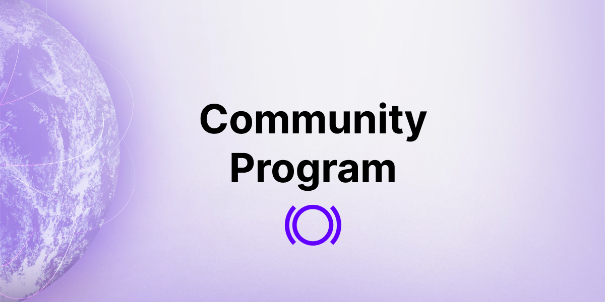

Community lies at the heart of DeFi and Panoptic. Panoptimists are helping launch a DeFi options revolution. To foster and find a new way to say thank you for your loyal support, we are proud to launch our [community program](https://galxe.com/panoptic). 

<!-- truncate -->

Through the program, Panoptimists can accumulate points for their everyday actions, such as liking and retweeting [our posts](https://twitter.com/Panoptic_xyz), visiting our [beta app](https://beta.panoptic.xyz/), and attending our Option Hour AMAs on [Discord](https://discord.com/invite/7fE8SN9pRT). By earning points and completing tasks, you can unlock prizes from the Panoptic team.

## Our First Community Campaign

To become a part of our community program, log in to Galxe and head to our [space](https://galxe.com/panoptic). Once you've logged in, click the "follow" button to subscribe to our space, then navigate to our campaign titled "[Panoptic Beta Launch Epoch 1](https://galxe.com/panoptic/campaign/GCTuXUM9xv)". 

As the name implies, this first campaign aligns with [Epoch 1](https://panoptic.xyz/blog/panoptic-beta-launch-epoch-one) of our beta launch, running from Oct. 13 to Oct. 20. Within this period, you can earn up to 58 points by completing tasks and 15 points for referring a friend to join the campaign. 

For those who accumulate at least 45 points during this one-week timeframe, you can [enter our raffle](https://galxe.com/panoptic/campaign/GCCyNUMgdZ) to win exclusive Panoptic merch. 

## The Future of Our Community Program

With the success of this campaign, we have plans to introduce more opportunities for our community members to earn points and receive rewards in the future. Points stay with your account forever &mdash; even after each campaign ends. This means that the earlier you join and begin participating in our community program, the more points you can accumulate and the greater your chances of receiving prizes in upcoming events.

Whether you are involved in the first round of our [trading competition](https://panoptic.xyz/blog/panoptic-beta-launch-epoch-one) or not, this campaign is the perfect way to get involved with Panoptic. Equally important, it's a way for us to thank you for supporting our work. We are immensely grateful for the community we've built and look forward to enabling everyone to permissionlessly trade perpetual options. 

_Join the growing community of Panoptimists and be the first to hear our latest updates by following us on our [social media platforms](https://links.panoptic.xyz/all). To learn more about Panoptic and all things DeFi options, check out our [docs](https://panoptic.xyz/docs/intro) and head to our [website](https://panoptic.xyz/)._  
