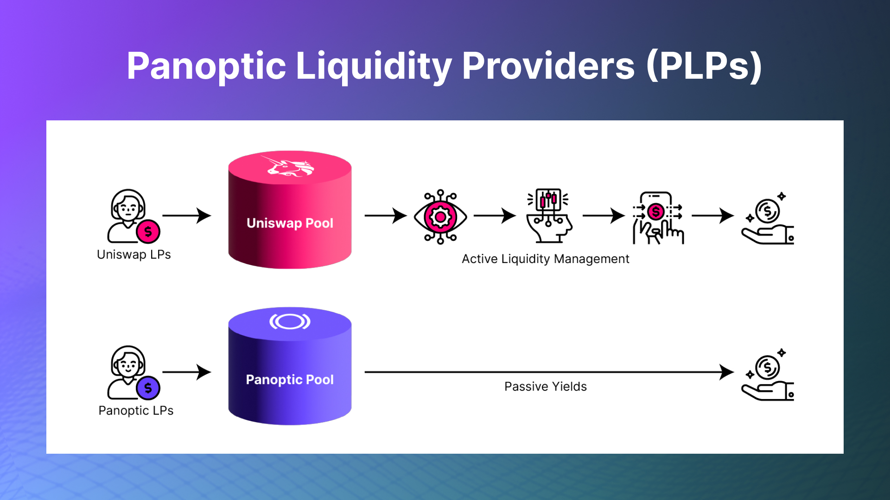

Liquidity providing, or LPing, has become increasingly popular in recent years with the rise in traction of decentralized exchanges (DEXs). People are motivated to provide liquidity for several reasons.

  

Some people provide liquidity to earn passive income, while others do it to support the growth of their favorite DEXs or tokens. LPing can be a very profitable way to earn income, but it is important to note that it’s not without risk.

  

LPing might not be as profitable anymore due to several factors including a transition away from liquidity mining incentives, the presence of just-in-time (JIT) liquidity, and an oversupply of liquidity on Uniswap v3. Fortunately, Panoptic is here to provide a solution to help liquidity providers (LPs) earn more passive income.

## Understanding LPing on Uniswap v3

To understand the benefits of LPing on Panoptic, it’s helpful to first understand how LPing works on DEXs currently in the market. Panoptic has a symbiotic relationship with Uniswap v3; therefore, it’s a great point of comparison.

  

Uniswap v3 uses a [concentrated liquidity model](https://docs.uniswap.org/concepts/protocol/concentrated-liquidity), which means their LPs can concentrate their liquidity within a specific price range. This benefits LPs because they earn more fees on trades that occur within a specific price range than they would if they provided liquidity for token pairs across the entire price range.

  

The process to LP on Uniswap is:  
  

1.  Select a token pair to provide liquidity for
    
2.  Select a fee tier to earn fees for providing liquidity
    
3.  Choose a price range to provide liquidity within
    
4.  Deposit (usually) both tokens of the token pair into the liquidity pool
    

  

LPs do not earn fees if they provide liquidity outside of the price range they provided liquidity for because their liquidity is not being used to facilitate trades. That means there’s a fifth step to LPing on Uniswap:

  

5.  Actively manage your position to maximize earnings.
    

  

This fifth step removes some of the passiveness of earning yield that originally attracted people to LPing.

  

## Understanding LPing on Panoptic

LPing on Panoptic, or being a Panoptic Liquidity Provider (PLP), introduces several distinct advantages over LPing on traditional DEXs such as Uniswap v3. There’s a three step process to LP on Panoptic:  
  

1.  Select a token pair to provide liquidity for
    
2.  Select a fee tier
    
3.  Deposit either token (you don’t have to deposit both!) into a Panoptic liquidity pool
    

  

Panoptic Liquidity Providers earn fees for their liquidity being utilized by traders to buy and sell options. The best part: PLPs earn yield by contributing to the Uniswap LP ecosystem without having to actively manage positions or suffer impermanent loss.

  

  

## The Benefits of LPing on Panoptic

**Single-sided Liquidity** 

Uniswap concentrated liquidity pools aren’t built for depositing single-sided liquidity. Panoptic is. Being a single-sided PLP keeps the process simple and lowers the barrier of entry to earn yield.

**No Impermanent Loss**

Impermanent loss (IL) is often described as the percentage loss an LP experiences from a change in the price of one asset relative to the other asset in an (automated market maker) AMM liquidity pool. IL is calculated by comparing the value of your position in the AMM pool to the value of your position if you had held the two assets separately.  
  
Panoptic’s reintroduction of passive, single-sided liquidity means no IL for PLPs. While changing prices means that the amount of tokens an LP holds will change in Uniswap v3, changing prices do not affect the amount of tokens a PLP holds in Panoptic. This is because options traders borrow tokens from PLPs and must return the exact amount of borrowed tokens back to PLPs. Instead of experiencing IL compared to simply holding your assets, or HODLing, PLPs get their original assets back plus extra yield.

**Truly Passive**

PLPs don’t have to choose a price range and actively manage their position to maximize their yield. They can simply deposit and earn.

**Increased Yield**

Thanks to Panoptic’s symbiotic relationship with Uniswap, PLPs help support Uniswap v3 liquidity indirectly through Panoptic’s DeFi-native options markets. PLPs lend out funds to options traders who deposit liquidity into Uniswap v3 to sell options or remove liquidity from Uniswap v3 to purchase options. PLPs are not required to participate in options trading, and do take on the risks associated with options.

PLPs' earnings are directly tied to the options trading volume on Panoptic. Each time a trader buys or sells an option on Panoptic, the trader pays a commission fee proportional to the size of the option. All of these commission fees flow directly to PLPs. Hence, the greater the volume of options trading, the higher the yield that PLPs can expect to earn.

**Simplicity**

Compared to the more involved steps of LPing on Uniswap plus actively managing your position, earning yield on Panoptic from providing liquidity is simple.

**Flexibility**

Being built on top of Uniswap v3, PLPs can provide liquidity in Panoptic for any ERC-20 token.  

*Join the growing community of Panoptimists and be the first to hear our latest updates by following us on our [social media platforms](https://links.panoptic.xyz/all). To learn more about Panoptic and all things DeFi options, check out our [docs](https://panoptic.xyz/docs/intro) and head to our [website](https://panoptic.xyz/).*