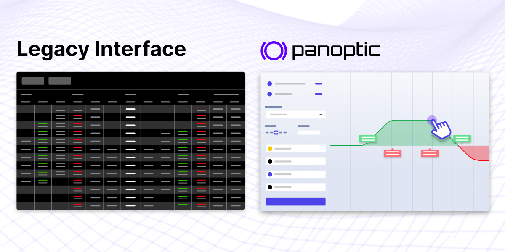
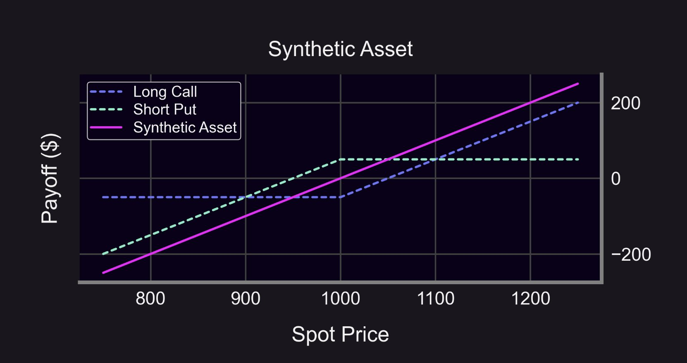

---
slug: case-against-perpetual-futures
title: "The Case Against Perpetual Futures"
tags: [Perps Traders, Perps, Perpetual Future, Leverage, Liquidation]
image: /img/banners/perps-and-panoptic-banner.png
description: "Exploring the limitations of perpetual futures in DeFi and how Panoptic's perpetual options present a more adaptable and efficient alternative for traders."
---  

  

Apologies for the clickbait-y title Panoptimists; we’re not looking to necessarily disparage perps here. They are an incredibly important tool when it comes to creating a balanced portfolio, speculating, or running a strategy (no matter how complex or simple).

  

Perps are one of the few verticals in DeFi that have achieved an actual product-market fit in their current state. However, like most things in crypto, they fall short of being a perfect product. Perp decentralized exchanges (DEXs) frequently overlook problems and weaknesses that we’re actively addressing at Panoptic with the perpetual option contract.

  

## Advantages of Perps

  

Perpetual futures are simple, familiar, and effective. Being able to hop on any perp DEX, drag a slider to select leverage, and click long or short will always have its place in DeFi. Especially when it comes to trading with a directional bias and leverage on a large-cap asset, few options come close to perps in terms of effectiveness.

  

Even though perps are relatively simple at face value, they are also very approachable when it comes to developing more complex strategies. Any user can create a more complex cash-and-carry or funding rate farming strategy with just a base level understanding. More sophisticated actors like market makers can collect spreads to generate revenue and increase liquidity for a given perp DEX.

  

In addition, the perp DEX space is vast and ever-growing. Both old and new teams are constantly iterating on previous designs and trying out new ones which are creating models with better capital efficiency, lower latency, more trading pairs, and a sleeker UX.

  

## Disadvantages of Perps

  

Now for the ugly — perp DEXs aren’t perfect. The number of markets offered by most DEXs are limited, ranging from less than 10 and up to 90. While over 90 markets is great, it’s still quite limited, especially when it comes to trading whatever the new big thing is. Tokens fall in and out of favor weekly in crypto, and when it takes a perp DEX weeks (minimum!) in order to add a new asset, users don’t get to leverage trade these new assets as they’d like to.

  

Another big problem with perps is liquidation. If you’re “wrong” enough about your trade, you’ll have your collateral liquidated. This is reasonable, but the problem is that price can often print an incredibly volatile wick, either by natural price action or by fault of an oracle, and a position can be instantly (and sometimes wrongfully) liquidated before moving back to a healthy price.

  

Lastly, while perps are simple, they’re also limited. Most users won’t use them for anything besides a naked long/short position. A more savvy trader may use them as a hedge against an existing position or as a way to arbitrage funding rate between platforms, but the possibilities just about end there. While simple long/short bets are enough for some crypto users, there has been a proven need for greater complexity and customizability of strategies in traditional finance (TradFi). DeFi users are always looking for new ways to make money, and the flexibility of options to meet that need have not been successfully implemented on-chain.

  

## What is a Better Option?

  

Panoptic is the solution to creating a DeFi-native, fully permissionless, perpetual options trading platform. Perpetual options on Panoptic (Panoptions) don’t necessarily outperform perps in every scenario, but there are a couple of key ways that Panoptions create a better option for perps traders. Let’s look at some of the key disadvantages of perps and how Panoptions remedy them.

  

  

### Low Number of Assets Offered

Market support is a big feature that Panoptic excels at. Opposed to needing to go through governance approval and implementation (market making, LP support, etc.) to offer a new asset, Panoptic can offer trading on any ERC-20 token from day one.

  

The underlying mechanism that allows Panoptic to offer options trading requires only the lending/borrowing of a Uniswap v3 LP position. So as long as a Uniswap v3 pool exists for a given token pair, you can trade options on that token pair on Panoptic.

  

### Liquidation

  

Liquidation occurs when a perp trader is long (or short) with leverage and the price moves down (or up) to a certain predetermined liquidation price. Given how volatile crypto asset prices are, this can be a common occurrence for traders, especially when trading with high leverage. When you include oracle inefficiencies, you can end up with wrongfully liquidated positions that happen too fast for a trader to reasonably react.

  

Purchased options on Panoptic are still exposed to liquidations, but the liquidations are not price-based. A trader pays a [premium on the position](https://panoptic.xyz/blog/streamia-defi-native-options-pricing) that accumulates value so long as the underlying LP position is in range. If the user's collateral cannot cover this premium, the user is liquidated. However, a purchased option will never be liquidated by price, meaning option buyers don’t have to worry about crazy wick scenarios instantly liquidating them.

  

To put the cherry on top, Panoptic is oracle-free. Neither pricing nor settlement in Panoptic relies on Chanlink oracles; rather, the price of the underlying Uniswap v3 pool is used instead. The price of this pool is generally responsible for price discovery of most long-tail assets, so you’d be getting the most accurate price action possible.

  

### Limited Strategies

  

Options are notorious for being more complex. The upside to this is that options enable much more complex strategies. Users can go long or short volatility, generate income on existing positions, create bull or bear spreads with capped losses, and more. Panoptic improves upon the trading UX by making advanced, multi-legged strategies easier to deploy through its [novel UI](https://panoptic.xyz/blog/demoing-panoptic-defi-options-protocol). Traders can run options strategies with up to four legs just by clicking different price points on a chart.

  

  

As an added bonus, you can also [model long and short perps](https://panoptic.xyz/docs/trading/multi-leg-strategies#synthetic-positions) with Panoptions. By purchasing a call and selling a put you end up with a synthetic long perp, a strategy with an identical payoff to that of a long perp (or sell a call and buy a put for a synthetic short perp). This way, you can essentially trade perps on any ERC-20 token without risk of price-based liquidation.

  

  

## So What Happens Next?

  

There’s no doubt that perps will continue to have their own space within crypto. Many users will continue to opt for the most popular perp DEXs for quite some time — and ideally those perp DEXs will gain more market share from centralized exchanges.

  

But for those seeking a more secure, customizable, and trader-friendly derivatives experience against a wider range of assets, Panoptic will soon be in the picture. At this point, the opportunities available to perp traders will vastly increase, and Panoptions will soon establish their own place in a power trader’s portfolio in a similar way perpetual futures have.

  

*Join the growing community of Panoptimists and be the first to hear our latest updates by following us on our [social media platforms](https://links.panoptic.xyz/all). To learn more about Panoptic and all things DeFi options, check out our [docs](https://panoptic.xyz/docs/intro) and head to our [website](https://panoptic.xyz/).*