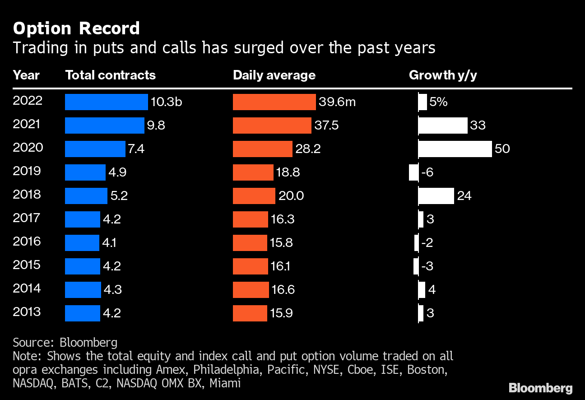
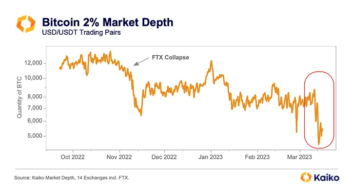

  

Options are the Swiss Army knives of the financial world, allowing traders to hedge and speculate on asset price direction. So what are they exactly, how have options evolved today, and where do we go from here? Let’s take a look at the basics and future of options on-chain.

  

<!-- truncate -->
  

## Options 101

  

Traditional options are financial contracts that provide the holder with the right, but not the obligation, to buy or sell a specified underlying asset at a predetermined price, known as the strike price, within a set time period before the expiration date.

  

An option’s strike price is a fixed price at which an option holder can buy or sell the underlying asset. Assume a call option has a strike price of $50. This grants the holder the right to buy the underlying asset at $50, irrespective of its current market price.

  

On the flip side, a put option with a strike price of $50 allows the holder to sell the underlying asset at $50, regardless of its market price. Call options are typically purchased with the expectation that the underlying asset's price will rise, while put options are acquired with the anticipation that the price will fall.

  
  

What is an option's core allure? Traders can speculate or hedge on the movement of the market and only risk the amount paid for the option, known as the premium.

  

For instance, if an investor anticipates a stock's price will rise, they can purchase a call option to buy that stock at today's price. This would allow them to benefit from the price increase while risking only the premium paid. Conversely, if they anticipate a price decline, they may purchase a put option to sell the stock at today's price – positioning them to profit from a potential price decrease.

  

## Options Today

  

Today, the options landscape has evolved into a value machine, with many exchanges growing every year as proof of its success. Platforms like the Chicago Board Options Exchange (CBOE) – the Wall Street equivalent of DeFi's Uniswap – have served as traditional finance’s (TradFi’s) solution for providing options.

  

  

Just like how DeFi lets you hedge against market storms or speculate on crypto winds, options are the traditionalist's hedge against price swings. Hedging involves taking the opposite side of a particular trade to cancel out some of the risk if the trade goes south.

  

At the heart of it all is the marketplace, similar to crypto's decentralized exchanges (DEXs). The CBOE is a hub for options traders, providing standard contracts and ensuring fair play. Just as DEXs support crypto experts with tools and analytics, exchanges provide investors with tools to handle their options trades effectively.

  

Besides the CBOE, there are other options exchanges and online brokerage platforms that provide venues for trading options. These platforms often provide real-time price quotes, analytical tools, and other resources to assist investors in making informed trading decisions.

  

Through these trading platforms, investors can access a wide range of options contracts on various underlying assets, allowing them to execute numerous trading strategies based on their market outlook and risk tolerance. The conventional setting of these platforms provides a standardized approach to options trading, ensuring a level of consistency and reliability for investors engaging in options transactions. However, like all good things, options also come with baggage.

  

## The Roadblocks

  

Options are complex financial products that require a counterparty, which holds risks. Options markets are typically fragmented and have limited supported assets. Much like how the crypto space felt the tremors from centralized finance’s (CeFi's) collapse, liquidity changes frequently, influencing price and trade ease.

  

If there's sufficient liquidity, expect smooth trades with tight spreads. If there's low liquidity, brace for less attractive pricing. This liquidity puzzle challenges investors, forcing them to strategize expiration dates, weighing their market vision against the liquidity backdrop.

  

It's clear: mastering the options market isn't just about price predictions; it's about dancing with liquidity.

  

 
  

## Crypto and Options: Panoptic’s Play

  

Enter Panoptic's perpetual options, known as Panoptions. These aren't your grandpa's options – Panoptic is a DeFi-native, on-chain options protocol.

  

Panoptions offer the classic options payoffs of capped losses and unlimited gains while doing away with predetermined expiry dates, giving investors the flexibility to exercise the option whenever they see fit. This contrasts with traditional options, which become worthless after a specific expiration date.

  

Eliminating an expiration date in perpetual options alleviates the pressure of time decay, a significant factor that erodes the value of traditional options as they approach expiry. Panoptic’s model, due to its perpetual nature, provides a unique opportunity for investors to trade on favorable market movements or to hedge against adverse ones at any given time.

  

The additional value of Panoptions lies in their permissionless nature – as the first DeFi-native options built on-chain that enables options trading on any ERC-20 token at any strike and any size. Panoptic enables DeFi-native options through its novel pricing mechanism: streamia.

  

Instead of a one-time premium, Panoptic's [streamia](https://panoptic.xyz/blog/streamia-defi-native-options-pricing) (streaming premia) model has traders pay as they go, keeping their positions alive. These perpetual options trade on decentralized exchanges, mirroring the transparency and reduced counterparty risk that DEXs brought to the crypto space.

  

The liquidity fragmentation headache of traditional options disappears here. Unlike the old-school CBOE, these options enjoy the transparency of decentralized exchanges where every trade is recorded, and centralized intermediaries are eliminated. Panoptic's options streamline liquidity by consolidating expiry dates into a single perpetual product. Panoptic presents a new type of option: an oracle-free, perpetual option, which means they don't rely on external data or have a set expiry.

  

With Panoptic, it's not just about introducing a fresh derivative; it's about reshaping the financial landscape, steering it towards openness, fairness, and decentralization. With our [educational primers](https://panoptic.xyz/research/panoption-trading-strategies-covered-call-rolling), permissionless liquidity integrated with Uniswap v3, and oracle-free integrations on an active community underway, Panoptic promises a long-term perspective on the market.  
  
*Check out our [whitepaper](https://assets.website-files.com/6386d9f380ac551cf9495f22/63fbb72c9ee69fe525e02108_Panoptic_whitepaper_v1.3.pdf) for more information about Panoptic and perpetual options. If you have any additional questions, please get in touch with us on [Twitter](https://twitter.com/Panoptic_xyz) or drop by our [Discord](https://discord.gg/8sX5Af2KXG).*