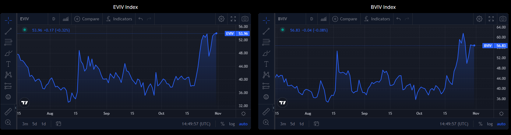

  

Welcome Panoptimists to the third edition of the Panoptic Newsletter, where we provide industry insights, research recaps, and Panoptic-specific content to keep you updated on our DeFi-native options platform.

If you want future newsletters sent directly to your email, [sign up here](https://forms.gle/2CAA9hgVGwn2YdXP6)!

## Market Overview

  

October was one of the most exciting opportunities for trading in quite some time. We saw gamma perform, volatility increase, and directional moves take place. [The primary catalyst of most of these outsized movements was related to a spot ETF](https://www.forbes.com/sites/digital-assets/2023/10/29/why-is-bitcoins-price-surging/?sh=45b43c675368).

  

On October 16, we saw our first sign of higher prices as [CoinTelegraph tweeted out news about an early approval of the Blackrock Spot ETF](https://twitter.com/Cointelegraph/status/1713925876969017792). This news was quickly found to be false, and the breakout move higher toward $30K quickly reversed to a low of $27.9K.

  

One week later, on October 23, another move catalyzed by ETF-related news took place as Twitter users quickly discovered that a ticker for the Blackrock spot ETF was published on the DTCC website. [Ironically, this fact had been true since August](https://www.coindesk.com/business/2023/10/25/blackrock-bitcoin-etf-has-since-august-been-on-dtcc-site-that-moved-markets-this-week/), but the move in price had already happened and saw no signs of reversing.

  

  

### Notable Days in October

  

The two most noticeable days in October were the two breakouts on October 16 and a week later on October 23rd. Both of these, as stated previously, were catalyzed primarily by tweets and the subsequent demand. Both volatility and gamma started to perform, and we broke out to [new local highs not seen for over a year and a half.](https://www.livemint.com/market/cryptocurrency/bitcoin-soars-to-one-and-a-half-year-high-on-etf-bets-11698110805073.html#:~:text=Bitcoin%2C%20the%20world's%20largest%20cryptocurency,exchange%2Dtraded%20fund%20(ETF)&text=Bitcoin%20has%20soared%2011.86%20percent,%2434%2C322.47%2C%20as%20per%20CoinMarketCap%20data.)

  
  

### Market Indicators

  

Skew on these recent moves has driven sharply toward calls for all listed expiries. With implied volatility historically elevated compared to previous months, call spreads are attractive. To take advantage of the current spot/vol correlation, risk reversals (sell a put and buy a call) are also becoming attractive.

  

Implied volatility across the board over the past few days has declined compared to the highs made on the breakout move. We see weekly ATM’s down around 6 points, with longer-dated expiries picking up interest. Call open interest is massively up, as [Paradigm saw new all-time highs in trading volume.](https://x.com/tradeparadigm/status/1716647468471881838?s=20)

  

  

### Current Market Conditions

  

As of the end of October, BTC was trading around $34,440 (now $34,495), and ETH was around $1,808 (now $1,805). The market was primarily focused on ETF-centric catalysts, and speculation on other factors, such as [dealer gamma positioning, started to take place on Twitter.](https://x.com/CryptoDeFiGuy/status/1719002326315180096?s=20) We have not traded at these levels for over a year and a half, so new levels of support and resistance should be expected to form here. Liquidations, spot demand, and other potential catalysts will be primary drivers of price from here on.

## Panoptic Highlights

On October 10, 32 lucky community participants partook in [Epoch 1](https://panoptic.xyz/blog/panoptic-beta-launch-official) to help us test the basic functionalities of our protocol. As we progress into future epochs, the pool of participants and testing goals will be expanded. As highlighted in our [blog post](https://panoptic.xyz/blog/panoptic-beta-launch-epoch-one), feel free to look at some of the goals and parameters we set for this initial launch! For participants and winners of the competition, you can claim your POAP by following the steps outlined [here](https://panoptic.xyz/blog/panoptic-beta-launch-epoch-one-closed).

You can find Panoptic's offical POAP collections on our [website](https://www.panoptic.xyz) under "Join the conversation".

Several rounds of trading, referred by us as epochs, will conclude with up to $100,000 in prizes to the top traders, bug finders, and participants. Underperforming traders run the risk of being removed from future epochs, encouraging everyone to try their best.

  

Community lies at the heart of DeFi and Panoptic, and to say thank you for your loyal support and for fostering new friendships and discussions, we are happy to announce the launch of our [community program](https://panoptic.xyz/blog/panoptic-community-program).

  

Panoptimists can accumulate points for everyday actions, such as liking and tweeting our posts, visiting our beta app, and attending our Option Hour AMAs on [Discord](https://discord.com/invite/8sX5Af2KXG). By earning points and completing tasks, you can unlock prizes from the Panoptic team.

  

Congratulations to X (formerly Twitter) user @khaled05013, the winner of our community program's first raffle! We're excited to release new and exclusive merch for upcoming quests as part of our community program!

## Research Bites

### [How does LPing in Uniswap V3 compare to selling options in Panoptic?](https://panoptic.xyz/research/uniswap_vs_panoptic)

  

In this post, we walk users through LPing on Uniswap v3 and the technical aspects of our protocol. We talked about how we’ve taken the Black-Scholes Model and related it to Uniswap and discussed topics such as fee collection in Uniswap V3 Pools.

  

### [0DTEs on Uniswap - Insights from On-Chain LP Data](https://panoptic.xyz/research/zero-dtes-on-uniswap)

  

In this post, we talk about the initial launch of Uniswap as a spot marketplace, and discuss how the properties of liquidity provision mimic that of an option. We talk about the patterns that Uniswap LPs follow and focus on specific parameters such as holding time and width that align with option expiry behavior.

## Panoptic in the Media

### [Uniswap-Based “Perpetual Options Protocol Tests Liquidity Waters”](https://blockworks.co/news/liquidity-perpetual-options-trading-uniswap)

  

Take a look at our feature in Blockworks’ article! We talk about the growth of the options and derivatives markets, highlight perpetual futures, and explain more about our DeFi primitive — the perpetual option.

## Community Spotlights

<blockquote class="twitter-tweet">
🧵1/ Exciting updates from the MH Ventures portfolio!📖  Spotlighting <a href="https://twitter.com/Panoptic_xyz?ref_src=twsrc%5Etfw">@Panoptic_xyz</a>, a groundbreaking protocol that&#39;s revolutionizing options trading!  Let&#39;s dive in and see what sets them apart!🧐👇 <a href="https://t.co/WjRUBwTyxS">pic.twitter.com/WjRUBwTyxS</a>
&mdash; MH Ventures (@MH_Ventures) <a href="https://twitter.com/MH_Ventures/status/1716772918133153932?ref_src=twsrc%5Etfw">October 24, 2023</a></blockquote> 

<blockquote class="twitter-tweet">
I&#39;m currently diving into derivative protocols built on top of Uniswap V3.  It seemed too complicated at first, but once you fully comprehend how a CLAMM works and what an option is, it becomes easier.  It&#39;s fascinating what <a href="https://twitter.com/Panoptic_xyz?ref_src=twsrc%5Etfw">@Panoptic_xyz</a> is developing. You&#39;re probably familiar… <a href="https://t.co/jyL0q65EqH">pic.twitter.com/jyL0q65EqH</a>
&mdash; Voxam 🎈(🇮🇹) (@Cryptovoxam) <a href="https://twitter.com/Cryptovoxam/status/1711824287181472057?ref_src=twsrc%5Etfw">October 10, 2023</a></blockquote> 

<blockquote class="twitter-tweet" data-conversation="none">
6/14 It&#39;s no coincidence that sophisticated products like <a href="https://twitter.com/Panoptic_xyz?ref_src=twsrc%5Etfw">@Panoptic_xyz</a> , <a href="https://twitter.com/dopex_io?ref_src=twsrc%5Etfw">@dopex_io</a>  V2, and <a href="https://twitter.com/GammaSwapLabs?ref_src=twsrc%5Etfw">@GammaSwapLabs</a> are starting to gain significant traction and hype, while their products are not even in full production, the demand for hedging tools in DeFi is real.
&mdash; Or_Grix (@Or_Grix) <a href="https://twitter.com/Or_Grix/status/1708023393226743820?ref_src=twsrc%5Etfw">September 30, 2023</a></blockquote> 

## Up Next

We’ve hit over 11,000 signups for our beta launch! Thank you to our incredible community for your support!

We’ve finished Epoch 1 and highlighted the winners’ wallet addresses in our latest blog posts. Anyone who participated can claim their POAP by following the [instructions in our post](https://panoptic.xyz/blog/panoptic-beta-launch-epoch-one-closed).

We've been continually implementing the feedback we've received from Epoch 1, and are excited for the next trading competition during [Epoch 2](https://panoptic.xyz/blog/panoptic-beta-launch-epoch-two). Thank you for staying tuned, and we look forward to keeping you updated with more insights and developments!

*Join the growing community of Panoptimists and be the first to hear our latest updates by following us on our [social media platforms](https://links.panoptic.xyz/all). To learn more about Panoptic and all things DeFi options, check out our [docs](https://panoptic.xyz/docs/intro) and head to our [website](https://panoptic.xyz/).*