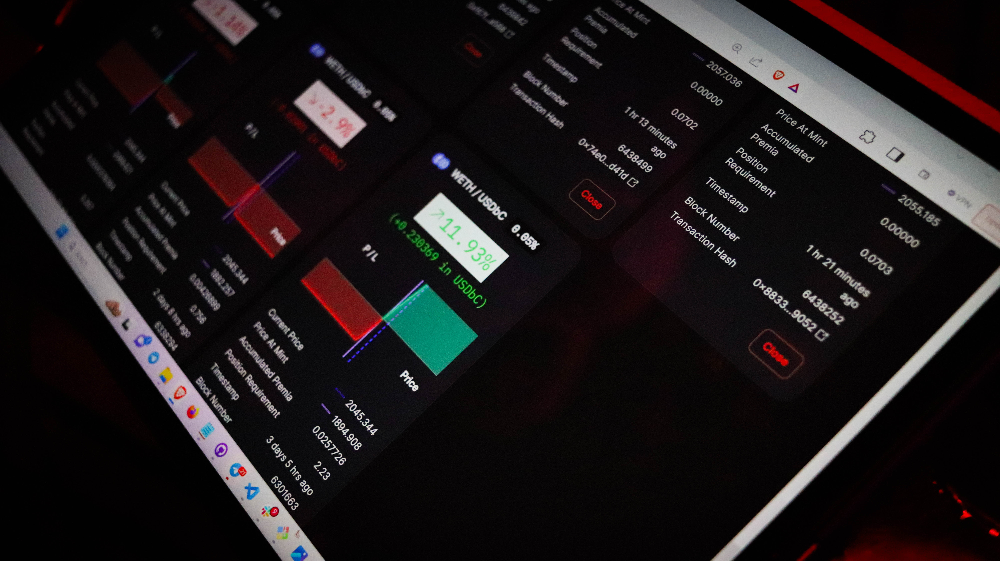
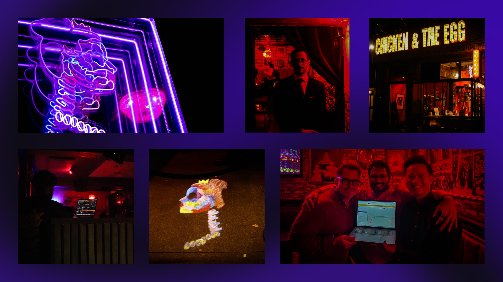

This past Friday night, in the middle of [Epoch 2](https://panoptic.xyz/blog/panoptic-beta-launch-epoch-two), Panoptimists gathered in New York City’s East Village to network, meet the team, and celebrate Panoptic’s success to date. The night was met with free food, an open bar, and a DJ playing at Sincerely, Ophelia, a speakeasy tucked behind Chicken and the Egg. 

<!-- truncate -->

In the midst of mingling, attendees had an opportunity to experience Panoptic’s platform and win prizes. In order to participate, participants scanned a QR code, followed our [social media accounts](https://linktr.ee/panopticxyz), and used the [demo version](https://demo.panoptic.xyz/) of our beta platform. 

The mini-trading competition that started at this event will close Wednesday, Nov. 15, at 5pm EST. The user with the best performing position at the time of the competition’s closing will win a Panoptic beanie and $50 worth of ETH.

In addition to giveaways, key members of the Panoptic team were in attendance to not only connect with the community, but to also answer questions about our product. From introductions to in-depth explanations, robust conversations mixed with music were the sounds of the night. 

Having an opportunity to connect with our community while building a new DeFi derivative is important to the Panoptic team. We love to get to know those who support us and those who will use our platform to create options that can grow their portfolio and hedge against risks.

We extend our heartfelt gratitude to everyone who made the Panoptic Perpetual Mixer a night to remember. Your enthusiasm and engagement make events like these truly special. If you’d like to join us at our next event, be sure to follow us on [Twitter](https://twitter.com/panoptic_xyz) and [Discord](https://discord.com/invite/7fE8SN9pRT) to get all the latest updates on where we’ll be next. 
 

_Join the growing community of Panoptimists and be the first to hear our latest updates by following us on our [social media platforms](https://links.panoptic.xyz/all). To learn more about Panoptic and all things DeFi options, check out our [docs](https://panoptic.xyz/docs/intro) and head to our [website](https://panoptic.xyz/)._

