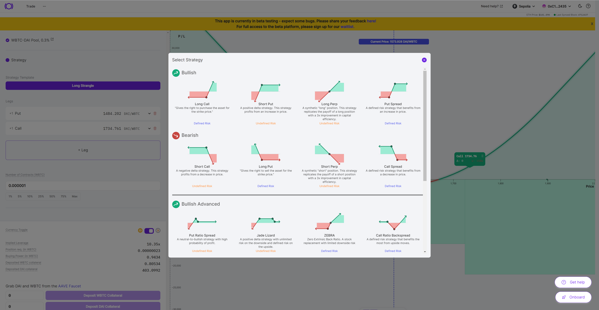
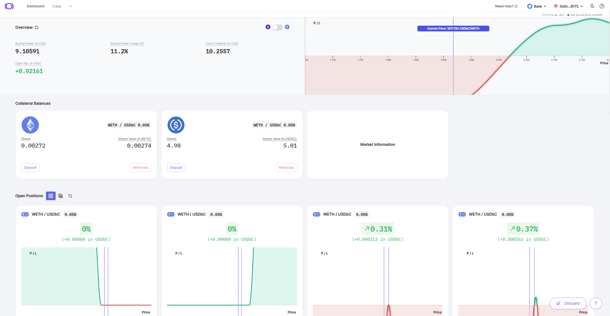

  

With Panoptic’s beta launch in full swing, we invite every current and future option trader to experience how perpetual options will revolutionize the future of finance on our [demo platform](https://demo.panoptic.xyz/).

  

Our demo is a risk-free learning and trading environment that provides an ideal space to develop and expand your perpetual options trading skills. As people explore our demo, they can earn points through our [community program](https://galxe.com/panoptic) to gain access to exclusive prizes.

  

## About Our Demo

  

Panoptic’s demo is hosted on the Ethereum test network [Sepolia](https://www.alchemy.com/overviews/sepolia-testnet), and replicates the conditions of trading actual perpetual options. In short, Panoptic's demo is a paper trading version of our platform that ensures a secure and efficient trial environment for users to experiment and learn.

  

By utilizing testnet tokens to mint positions, users can engage in risk-free practice, refining strategies and exploring the functionalities of Panoptic's platform.

  

## How To Use The Panoptic Demo

  

To start practicing buying and selling Panoptions, visit our [demo website](https://demo.panoptic.xyz/). Upon arrival, a pop-up window will guide you through obtaining testnet tokens and depositing liquidity. Connect your wallet to the platform to paper trade options. For a comprehensive guide on creating and trading options on Panoptic, refer to our tutorials on our [YouTube playlist](https://www.youtube.com/watch?v=iVfeZUVBN7E&list=PLB5qwiSwzT_rgH-HvQtDaWTe48xPaF6se).

  

  

The Panoptic platform simplifies trading by offering one-click options, ranging from simple to complex positions. After selecting your general strategy, fine-tune your position to your preference. Once you've opened a trade, you can monitor your positions, collateral, and profit and loss through Panoptic’s user-friendly platform.

  

  
  

## Panoptic Community Quest

The launch of our demo aligns with the commencement of our second community event. This quest follows our [Epoch 1 event](https://panoptic.xyz/blog/panoptic-community-program) which saw more than 6,000 people participate.  
  
To partake in this event, head over to our community [space](https://galxe.com/panoptic). Earn points by completing active quests related to our demo platform, including depositing and trading an option, trading a multi-leg option, closing a trade, and more. Accumulate enough points in this quest to enter for a chance to win a Panoptic merch box featuring monetary prizes, exclusive merch, and more!

The quest commences on 11/20/2023 at 17:00 UTC and concludes a month later on 12/20/2023 at 17:00 UTC. After the event's conclusion, winners will be announced and contacted via email to claim their prizes.

The Panoptic community quest complements our demo platform, creating a learn-and-earn opportunity for all Panoptimists. We are thrilled to give back to our community and look forward to helping you develop your options trading expertise through our demo platform.

  
*Join the growing community of Panoptimists and be the first to hear our latest updates by following us on our [social media platforms](https://links.panoptic.xyz/all). To learn more about Panoptic and all things DeFi options, check out our [docs](https://panoptic.xyz/docs/intro) and head to our [website](https://panoptic.xyz/).*