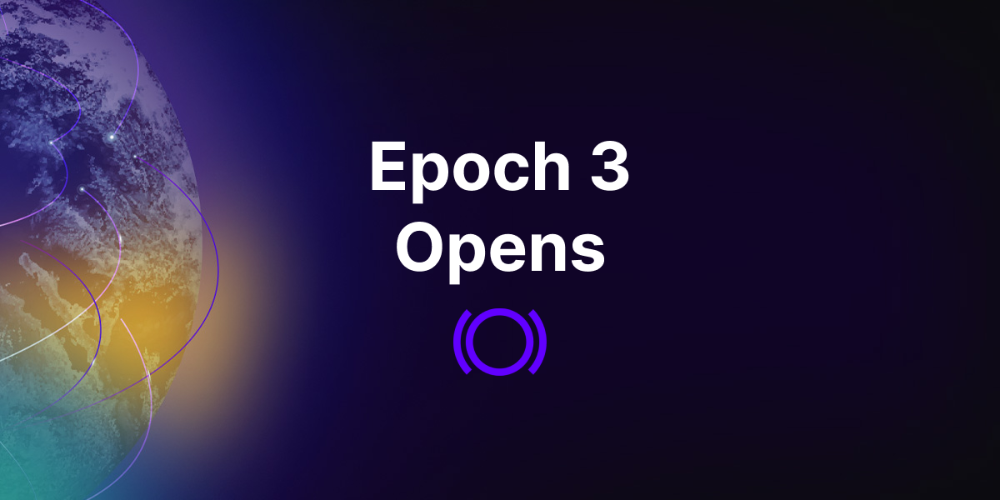

Next Tuesday, November 28, Panoptic is rolling out Epoch 3 with some changes that will spice up our trading competition. Most notably, we’re increasing access, doubling the available markets to trade on, and giving out more money.

  

In the past we’ve limited our Epochs to a select number of individuals, but this time we’ve expanded access to 5,000 users. However, there’s a catch. Only the first 100 people who deposit funds on the protocol once the Epoch opens will be able to participate in the trading competition.

  
To check if you’re one of the 5,000 people whitelisted to deposit, head to our [wallet checker](https://access.panoptic.xyz/). If you’ve been selected, keep reading to learn how you can be ready to deposit.

  

## About Our Beta Launch

  

Panoptic’s [beta launch](https://panoptic.xyz/blog/gated-launch-sign-up) is structured as multiple rounds of trading competitions called epochs. In the epochs, participants use real, albeit capped, assets to buy and sell DeFi-native options.

  

In each round of the trading competition, the lowest-ranking performers run the risk of being excluded from future epochs, and top performers receive prizes. Throughout the beta launch, we’re offering exclusive NFTs and up to $100,000 in monetary prizes.

  

## Epoch 3 Overview

  

As previously stated, we’re excited to expand the trading competition to 5,000 users who previously [signed up](https://signup.panoptic.xyz/); however, only 100 depositors will be allowed to trade in the competition. Participation is on a first-come-first-serve (FCFS) basis.

  

For the third epoch, we’ve set the parameters to be more capital efficient and to test the margin and liquidations of our protocol.

  

### Epoch 3 Goes Multi-Market

  

Epoch 3 introduces a dual-market trading experience. Participants now have the opportunity to trade in two distinct markets: ETH options and BALD options. Each market offers rewards, with $400 in monetary prizes allocated to the top three traders in each market, for a total prize pool of $800.

  

In addition to the monetary prizes, exclusive NFTs will be awarded to the top five traders in both markets.

  

### Participation
    Number of whitelisted participants: 5,000
    Max number of depositors (FCFS): 100

  

To see if you’ve made the list, visit our wallet checker [here](https://access.panoptic.xyz/).

  

If you were not selected for this epoch, you may still be chosen for the future rounds of our trading competitions. Sign up for the waitlist [here](https://signup.panoptic.xyz/).

  

### Timeline
    Start Date: November 28, 17:00 UTC
    End Date: December 11, 17:00 UTC

  

### Prizes

  

The top 3 qualifying traders of each market will receive:

WETH-USDbC 0.05%:

    1st Place: $250 USDbC
    2nd Place: $100 USDbC 
    3rd  Place: $50 USDbC
    
BALD-WETH 1%:

    1st Place: $250  USDbC
    2nd Place: $100  USDbC
    3rd Place: $50  USDbC
    
To qualify, participants must place a minimum of three (3) trades, open a new position on at least three (3) different days (24 hour periods), and have positive profit and loss (PnL) at the end of the snapshot.

For Epoch 3, all participants will receive an Epoch 3 POAP that is custom designed by the Panoptic team. The top five traders of each market will also receive an additional Top Trader POAP.
  

The ranking metrics are based on profit and loss (PnL) calculated in terms of the account's value at the end of the epoch.

Remember: traders at the bottom of the competition are at risk of being excluded from future epochs.

  

### Technical Details

    Chain: Base

    Pool 1: WETH-USDbC, 0.05%
    Deposit Amount: 5 USDbC and 0.0025 WETH.

    Pool 2: BALD-WETH, 1%
    Deposit Amount: 300 BALD and 0.0025 WETH.

Please note that you must deposit the required amount to participate, and that the exact amount can be found on the onboarding modal of the [app](https://beta.panoptic.xyz/) at the start of the competition.

### Feedback

  

Feedback is an essential part of our beta launch. If you encounter any bugs or have ideas on how to improve our platform, submit them [here](https://feedback.panoptic.xyz/).

  

### Seeking Uniswap LPs, Market Makers, and Traders

Are you a Uniswap LP, market maker, or experienced trader? If so, you might qualify for VIP access to our beta platform for trading DeFi options.

To apply, fill out our form [here](https://forms.gle/urdAPEmRid7zzz3T7).

  
  

## How to Participate in Epoch 3

If you’ve been selected to participate in Epoch 3, and confirmed it with our [wallet checker](https://access.panoptic.xyz/), here are the steps you need to take to join the competition:

  

1.  Navigate to the beta version of the [Panoptic app](http://beta.panoptic.xyz/)
2.  Connect your wallet to [Base mainnet](https://base.org/). If you’re unfamiliar with how to do this, follow the instructions [here](https://docs.base.org/using-base/).
3.  You may participate in either or both of the WETH-USDbC or BALD-WETH markets. To begin trading ETH options, follow these steps:

    Deposit required funds on Panoptic’s WETH-USDbC pool by following the onboarding instructions on the [Panoptic app](http://beta.panoptic.xyz/). You will need ETH, WETH and USDbC.
        
    Obtaining ETH on Base: Send ETH directly from a Coinbase account to your wallet on Base mainnet or by [bridging](https://coinmarketcap.com/academy/article/how-to-bridge-to-base-mainnet) ETH from Ethereum mainnet.
        
    Obtaining WETH on Base: Wrap your ETH on Base. You will need to first connect your wallet to [Uniswap](https://app.uniswap.org/swap/) before proceeding to [wrap](https://app.uniswap.org/swap?inputCurrency=ETH&outputCurrency=0x4200000000000000000000000000000000000006&chain=base) your ETH on Base.
        
    Obtaining USDbC on Base: Send USDC directly from a Coinbase account to your wallet on Base mainnet and then [swap](https://app.uniswap.org/swap?outputCurrency=0xd9aaec86b65d86f6a7b5b1b0c42ffa531710b6ca&chain=base) USDC for USDbC.
    
4.  To begin trading BALD options, follow these steps:

    Deposit required funds on Panoptic’s BALD-WETH pool by following the onboarding instructions on the [Panoptic app](http://beta.panoptic.xyz/). You will need ETH, WETH and BALD.
        
    Obtaining ETH on Base: Send ETH directly from a Coinbase account to your wallet on Base mainnet or by [bridging](https://coinmarketcap.com/academy/article/how-to-bridge-to-base-mainnet) ETH from Ethereum mainnet.
        
    Obtaining WETH on Base: Wrap your ETH on Base. You will need to first connect your wallet to [Uniswap](https://app.uniswap.org/swap/) before proceeding to [wrap](https://app.uniswap.org/swap?inputCurrency=ETH&outputCurrency=0x4200000000000000000000000000000000000006&chain=base) your ETH on Base.
        
    Obtaining BALD on Base: [Swap](https://app.uniswap.org/swap?outputCurrency=0x27D2DECb4bFC9C76F0309b8E88dec3a601Fe25a8&chain=base) some of your ETH for BALD.
    
5.  Buy or sell options between November 28 (17:00 UTC) and December 11 (17:00 UTC). Check out our [leaderboard](https://beta.panoptic.xyz/leaderboard) to see where you stand in comparison to other traders.
    

Winners will have their prizes distributed at the end of the competition period.

Learn how to deposit liquidity, trade an option, and more through our YouTube videos:

<iframe width="560" height="315" src="https://www.youtube.com/embed/videoseries?si=oeSJONnOeGPukUXO&amp;list=PLB5qwiSwzT_rgH-HvQtDaWTe48xPaF6se" title="YouTube video player" frameborder="0" allow="accelerometer; autoplay; clipboard-write; encrypted-media; gyroscope; picture-in-picture; web-share" allowfullscreen></iframe>

  

## Additional Information

  

In preparation for the trading competition, traders can familiarize themselves with the protocol and associated fees by reading through our [documentation](https://panoptic.xyz/docs/intro).

  

As part of our multi-epoch beta launch, we will be testing various combinations of these pool parameter values to assess their safety, robustness, and fairness for a variety of tokens and market conditions.

  

We outline the pool parameter values for Epoch 3 below. For further explanation of how these parameters affect users in Panoptic, please see our pool parameters [guide](https://panoptic.xyz/blog/gated-launch-parameters).

### Fees

|              Fees             |                             Value                             |                                                                                                                                                                                                                                     Example                                                                                                                                                                                                                                    |
|:-----------------------------:|:-------------------------------------------------------------:|:------------------------------------------------------------------------------------------------------------------------------------------------------------------------------------------------------------------------------------------------------------------------------------------------------------------------------------------------------------------------------------------------------------------------------------------------------------------------------:|
| Commission fee                | 10 bps (0.10%)                                                | Buying/selling a 1 ETH put will incur a 0.001 ETH commission fee                                                                                                                                                                                                                                                                                                                                                                                                               |
| Forced exercise cost          | As high as 5.12%                                              | [Forcing](https://panoptic.xyz/docs/panoptic-protocol/forced-exercise) an option buyer to close an at-the-money 1 ETH put will incur a 0.0512 ETH fee on the force exercisor. Deeper in-the-money and out-of-the-money options will incur lower fees.                                                                                                                                                                                                                                                                                         |
| In-the-money (ITM) spread fee | 20 bps (0.20%)                                                | Buying/selling an ITM 1 ETH put at a 2000 strike price with current ETH price being 1900 USDbC (intrinsic value of put option = 100 USDbC) incurs a 0.20 USDbC fee. Buying/selling an at-the-money or out-of-the-money option will not incur any ITM spread fee.                                                                                                                                                                                                               |
| Vegoid                        | 1x - 3.25x spread (1.25x spread at 50% liquidity utilization) | Buyers pay sellers anywhere from [1x to 3.25x](https://www.desmos.com/calculator/lo2qsg77im) the amount of Uniswap LP fees, depending on the available liquidity of the option.  Examples: 1) If a sold option is not purchased, it will earn the Uniswap LP fees (1x spread). 2) If half of the sold options are purchased, buyers pay sellers an additional 25% of Uniswap LP fees (1.25x spread). 3) If 90% of the sold option has been purchased, buyers pay sellers an additional 225% of Uniswap LP fees (3.25x spread). |
  

### Collateral Requirements

  
|      Pool Parameter     |       Value       |                                                             Example                                                            |
|:-----------------------:|:-----------------:|:------------------------------------------------------------------------------------------------------------------------------:|
| Sell Collateral Ratio   | 20% (5x leverage) | Maintaining a 1 ETH short put position would require at least 0.2 ETH in collateral.                                          |
| Buy Collateral Ratio    | 10% (10x leverage) | Maintaining a 1 ETH long put position would require at least 0.1 ETH in collateral.                                           |
| Mint Buffer Requirement | 1.1x             | Suppose the buy collateral ratio is 10%. Buying a 1 ETH put would require at least 0.11 ETH in collateral (0.11 = 1.1 x 10%). |

  

### Pool Utilization (PU)

|       Pool Parameter       | Value |                                                                                Example                                                                               |
|:--------------------------:|:-----:|:--------------------------------------------------------------------------------------------------------------------------------------------------------------------:|
| Target Pool Utilization    | 50%   | Half of all the Panoptic pool liquidity has been used to sell options. The protocol uses collateral requirement incentives to target this amount.                    |
| Saturated Pool Utilization | 75%   | Three-quarters of all the Panoptic pool liquidity has been used to sell options. The protocol uses collateral requirement incentives to avoid exceeding this amount. |  

## Disclaimer

During Panoptic’s beta launch, the protocol is still in an experimental state, and trading activities involve inherent risks. Engaging in the competition may lead to a loss of funds due to the inherent nature of trading assets and the experimental nature of the protocol. Participants are encouraged to exercise caution and conduct their due diligence before making any financial decisions.

  

Join the growing community of Panoptimists and be the first to hear our latest updates by following us on our [social media platforms](https://links.panoptic.xyz/all). To learn more about Panoptic and all things DeFi options, check out our [docs](https://panoptic.xyz/docs/intro) and head to our [website](https://panoptic.xyz/).
