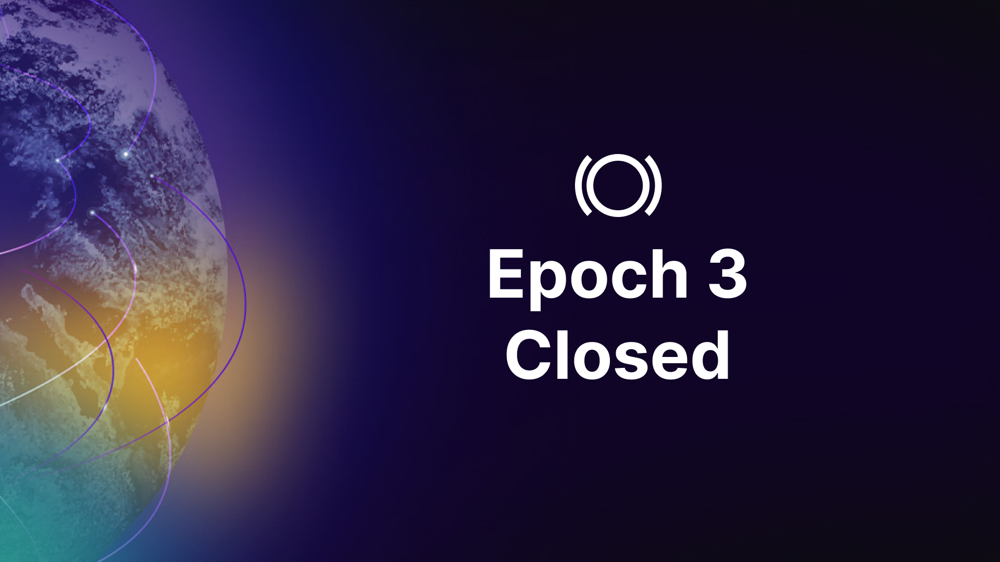
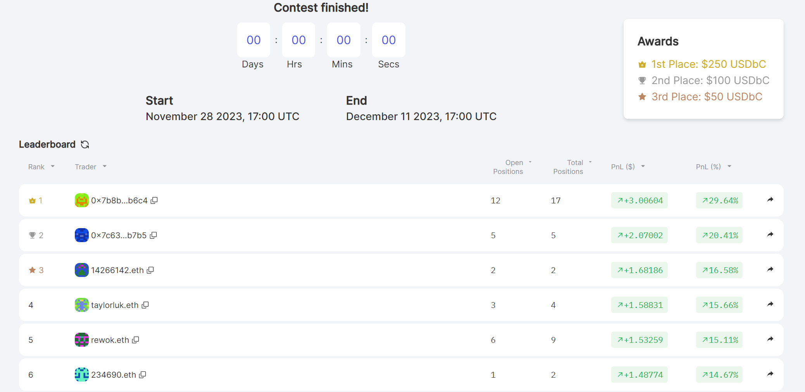
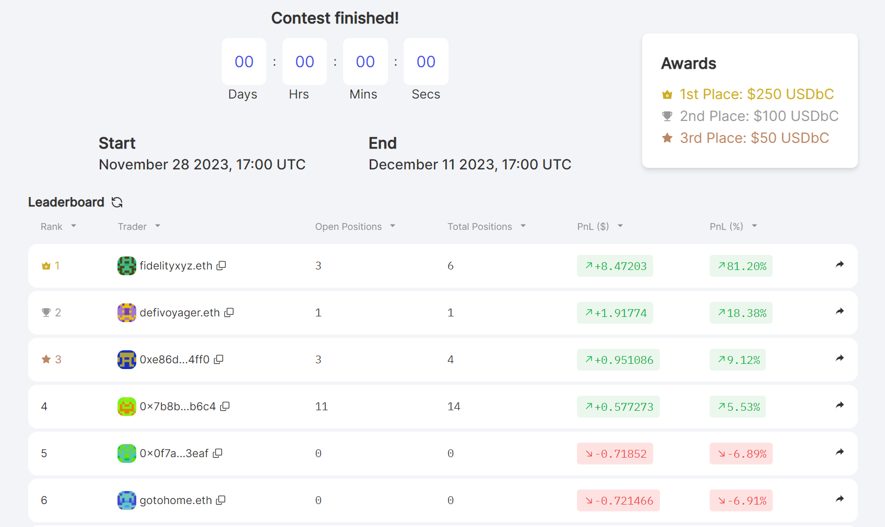

As Epoch 3 of Panoptic's beta launch draws to a close, we reflect on an invigorating two-weeks of trading DeFi options. Our gratitude goes out to every participant who contributed to this epoch's success. Your active participation is pivotal in shaping the DeFi options trading landscape!

Following our [earlier announcement](https://panoptic.xyz/blog/panoptic-beta-launch-epoch-three), this conclusion marks a planned transition. The valuable insights gathered propel us towards continual refinement and enhancement of the trading experience for Epoch 4.

### 📅 Save the Date!
Epoch 4 launches on December 18, 2023, at 17:00 UTC. Brace yourselves for exciting updates, including new blockchains, more pools, and an array of prizes! Subscribe to our [socials](https://linktr.ee/panopticxyz) for further updates.

### Engage Now

Don't hold off until Epoch 4! Participate in our [community quest](https://panoptic.xyz/blog/panoptic-demo-launch) now. Experiment with paper trading perpetual options on our demo platform and reap rewards, including cash prizes and exclusive merchandise! Discover more [here](https://galxe.com/panoptic/campaign/GCV1QUn1KW).

## Epoch 3's Winners

We're thrilled to announce the winners of our [Epoch 3 trading competition](https://panoptic.xyz/blog/panoptic-beta-launch-epoch-three). A total of $800 in monetary prizes will be distributed to the best traders, with the top three traders of each contest receiving $250 for first place, $100 for second, and $50 for third. Additionally, the top five traders will each receive the prestigious Top Trader POAP.

Congratulations to these traders who showcased their incredible talent!

### ETH Options Contest
-   🥇 1st Place: 0x7b8bf62b5ae9955df0c09716d32735b9fd82b6c4 ($250 + Top Trader POAP)
-   🥈 2nd Place: 0x7c632b90cc7698f6dc9e3aab900a62b30da4b7b5 ($100 + Top Trader POAP)
-   🥉 3rd Place: 14266142.eth ($50 + Top Trader POAP)
-   4️⃣ 4th Place: taylorluk.eth (Top Trader POAP)
-   5️⃣ 5th Place: rewok.eth (Top Trader POAP)

### BALD Options Contest
-   🥇 1st Place: fidelityxyz.eth ($250 + Top Trader POAP)
-   🥈 2nd Place: defivoyager.eth ($100 + Top Trader POAP)
-   🥉 3rd Place: 0xe86d4e36124ecc84760cdc2eb2e0e7c9728c4ff0 ($50 + Top Trader POAP)
-   4️⃣ 4th Place: 0x7b8bf62b5ae9955df0c09716d32735b9fd82b6c4 (Top Trader POAP)
-   5️⃣ 5th Place: 0x0f7a5ac69921e92a408d4bd03c53f56cdd503eaf (Top Trader POAP)

    

Winners, claim your POAP [here](https://poap.delivery/panoptic-epoch-3-top-trader)! Additionally, all Epoch 3 participants can grab their Epoch 3 POAP [here](https://poap.delivery/panoptic-epoch-3).

*Note: All POAPs will be available for claiming once they are fully processed by the POAP team. This process may take several days.*

  

## What's Next?
The Panoptic team is already incorporating your feedback from Epoch 3 and prepping for Epoch 4. Stay tuned to our [social media](https://linktr.ee/panopticxyz) channels for upcoming competition details!

_Join the growing community of Panoptimists and be the first to hear our latest updates by following us on our [social media platforms](https://links.panoptic.xyz/all). To learn more about Panoptic and all things DeFi options, check out our [docs](https://panoptic.xyz/docs/intro) and head to our [website](https://panoptic.xyz/)._
