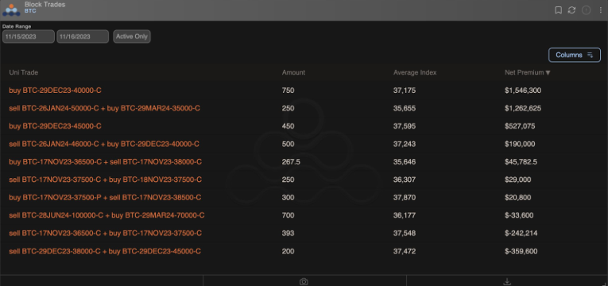
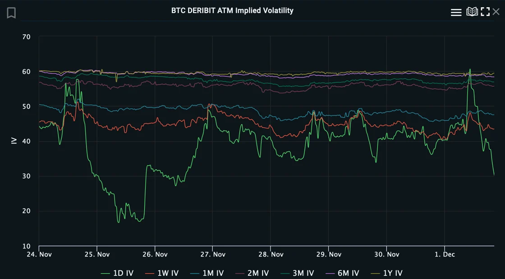
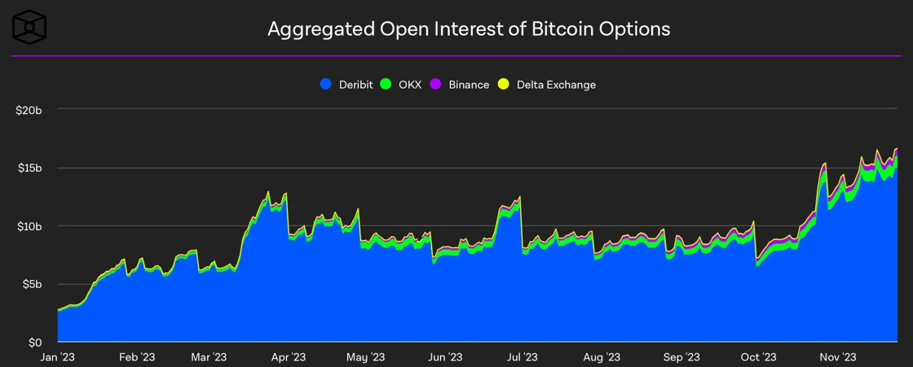
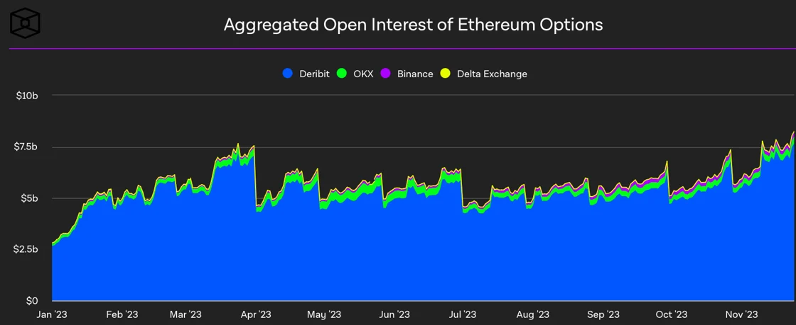
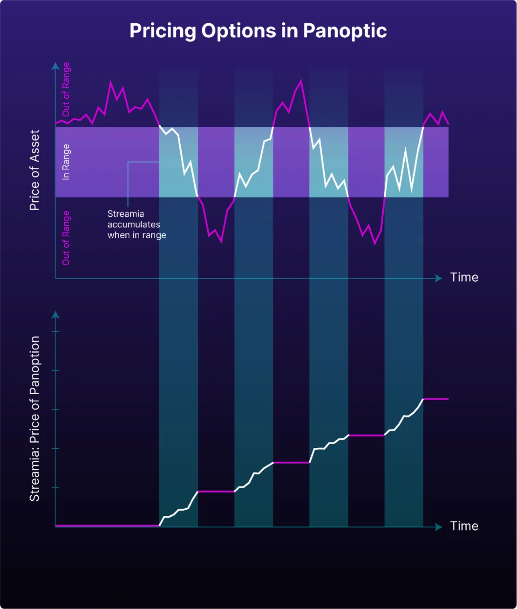

Welcome Panoptimists to the December edition of the Panoptic Newsletter, where we provide industry insights, research recaps, and Panoptic-specific content to keep you updated on our DeFi-native options platform.

<!-- truncate -->

If you want future newsletters sent directly to your email, signup on our [website homepage](https://panoptic.xyz/).

### About Panoptic

Discover the future of trading with Panoptic, your gateway to perpetual options in DeFi. Our cutting-edge platform empowers you to manage risk efficiently and trade with unprecedented flexibility. Join us and be part of a secure, decentralized revolution in options trading, tailored for both crypto newcomers and experienced traders.

## Panoptic Highlights

### Epoch 2 Highlights

[Epoch 2](https://panoptic.xyz/blog/panoptic-beta-launch-epoch-two?utm_source=hs_email&utm_medium=email&_hsenc=p2ANqtz--7DQcEIkGN2cQgcvwtWsIjdZnbMzSoKefB2N3PaZ_C72YmpLuxVD4iW8oOR-bsfWFvsEsf), the second round of Panoptic's trading competition and beta launch, came to a close. This event provided a valuable opportunity for traders to test their skills in our perpetual options environment and for us to refine the platform and its advanced trading features.

The competition ended on November 20, and the [Epoch 2 leaderboard](https://beta2.panoptic.xyz/leaderboard?tokenId=0x4c36388be6f416a2&utm_source=hs_email&utm_medium=email&_hsenc=p2ANqtz--7DQcEIkGN2cQgcvwtWsIjdZnbMzSoKefB2N3PaZ_C72YmpLuxVD4iW8oOR-bsfWFvsEsf) displays the top performers. The best trade in our recent competition was a well-executed [bull put spread](https://panoptic.xyz/research/essential-options-strategies-to-know?utm_source=hs_email&utm_medium=email&_hsenc=p2ANqtz--7DQcEIkGN2cQgcvwtWsIjdZnbMzSoKefB2N3PaZ_C72YmpLuxVD4iW8oOR-bsfWFvsEsf) on ETH, achieving a 36% profit. This strategy involved selling a put at the $2,048 strike and buying at the $2,043 strike. 

 
The position maximized profits primarily through ETH's price appreciation while incurring minimal streamia on the long leg. The trader's success was amplified by Panoptic's capital-efficient dynamics, allowing for higher leverage (approximately 4x). This strategic approach not only capitalized on market movements but also highlighted the advantages of Panoptic's unique leverage and pricing features.

Another notable strategy was a [long synthetic perp position](https://panoptic.xyz/docs/trading/multi-leg-strategies?utm_source=hs_email&utm_medium=email&_hsenc=p2ANqtz--7DQcEIkGN2cQgcvwtWsIjdZnbMzSoKefB2N3PaZ_C72YmpLuxVD4iW8oOR-bsfWFvsEsf#synthetic-positions), securing a 14% profit. This was executed by trading a $1,886 strike call and put option, demonstrating another effective use of Panoptic’s platform to bet on large directional moves. 

Congratulations to our top traders and a big thank you to all participants for making Epoch 2 a success! 

## Epoch 3

Following the successful completion of Epoch 2, Panoptic has [launched Epoch 3](https://panoptic.xyz/blog/panoptic-beta-launch-epoch-three?utm_source=hs_email&utm_medium=email&_hsenc=p2ANqtz--7DQcEIkGN2cQgcvwtWsIjdZnbMzSoKefB2N3PaZ_C72YmpLuxVD4iW8oOR-bsfWFvsEsf). With an increased prize pool of $800, this phase offers participants another opportunity to engage in strategic trading and compete for rewards. This next chapter in our trading competition builds on the valuable experiences and insights gained from the previous epochs.

## Market Overview

### Crypto Trends

The [90-day change](https://twitter.com/WClementeIII/status/1723340365749493822) in stablecoin supplies has turned positive for the first time in eighteen months, signaling net capital inflows to stablecoins and potentially indicating a shift in investor sentiment and market activity after a prolonged bear market. This trend has continued to accelerate through November, with stablecoins playing a crucial role as a gateway for capital inflows.

BlackRock, the world's largest asset manager, has recently filed an S-1 form with the U.S. Securities and Exchange Commission (SEC) for an iShares Ethereum Trust, aiming to create a [spot Ether ETF](https://www.coindesk.com/policy/2023/11/16/blackrock-files-application-for-spot-ether-etf/?utm_source=hs_email&utm_medium=email&_hsenc=p2ANqtz--7DQcEIkGN2cQgcvwtWsIjdZnbMzSoKefB2N3PaZ_C72YmpLuxVD4iW8oOR-bsfWFvsEsf). This step came shortly after Blackrock registered the spot Ether ETF's name and Nasdaq requested the SEC to approve the ETF.

Coinbase has introduced [a new offering](https://twitter.com/dunleavy89/status/1725532249284591907?utm_source=hs_email&utm_medium=email&_hsenc=p2ANqtz--7DQcEIkGN2cQgcvwtWsIjdZnbMzSoKefB2N3PaZ_C72YmpLuxVD4iW8oOR-bsfWFvsEsf) allowing users to earn a 6% yield on their USDC holdings, a move that enhances the attractiveness of holding this stablecoin on their platform. This development provides an enticing opportunity for investors looking for stable returns in the volatile cryptocurrency market.

## Option & Defi Trends

Recent market activity indicates that significant 'whale' investors are making substantial bets on Bitcoin's price increase by the end of the year with massive investments in naked call options targeting $40k and $45k Bitcoin prices. These investors are showing remarkable conviction, evidenced by their willingness to pay around [$25k in daily theta,](https://twitter.com/hansolar21/status/1725071412124402110?s=20&utm_source=hs_email&utm_medium=email&_hsenc=p2ANqtz--7DQcEIkGN2cQgcvwtWsIjdZnbMzSoKefB2N3PaZ_C72YmpLuxVD4iW8oOR-bsfWFvsEsf) the cost of holding the options, for these high-stakes positions.

The gamma exposure for Bitcoin has seen a [dramatic rise](https://twitter.com/kellyjgreer/status/1725526681299886094?utm_source=hs_email&utm_medium=email&_hsenc=p2ANqtz--7DQcEIkGN2cQgcvwtWsIjdZnbMzSoKefB2N3PaZ_C72YmpLuxVD4iW8oOR-bsfWFvsEsf) by nearly tripling to necessitate a buying or selling of around $60 million in BTC for each 1% price fluctuation as it approaches the peak gamma point. This increased market sensitivity sets a new focal price level at $38,000, a significant shift from the previous benchmark of $30,000, stirring speculative interest in Bitcoin's potential to reach this new target.

### Current Market Conditions

Bitcoin options trading has seen a [significant surge](https://www.coindesk.com/markets/2023/11/20/bitcoin-options-open-interest-climbs-to-record-15b-on-crypto-exchange-deribit/?utm_source=hs_email&utm_medium=email&_hsenc=p2ANqtz--7DQcEIkGN2cQgcvwtWsIjdZnbMzSoKefB2N3PaZ_C72YmpLuxVD4iW8oOR-bsfWFvsEsf), with the notional open interest in BTC options recently reaching a record high of $15 billion, more than doubling since late September. This increase surpasses the previous peak during the 2021 bull market and reflects a growing preference among traders to use options for strategic positioning, hedging, or leveraging volatility. 

The burgeoning interest in BTC options, evident from large block trades and bullish options flow, indicates a maturing and increasingly sophisticated cryptocurrency market. 

## Panoptic Insight

### Shallow Dive | How Does Streamia Work on Panoptic?

Streamia, pioneered by Panoptic, marks a transformative leap in DeFi options pricing, uniquely blending streaming payments with premium pricing to manage perpetual options. This innovation deviates from traditional pricing models like the Black-Scholes Model (BSM) which relies on fixed premiums determined by factors such as asset volatility and strike price. In contrast, streamia introduces a dynamic, ongoing fee accumulation system, aligning seamlessly with the perpetual nature of the options it handles.

At the core of streamia's functionality is the concept of 'rangeness' – categorizing options as 'In Range' (IR) or 'Out of Range' (OOR). This classification is analogous to traditional 'near the money' and 'far the money' terms but is specifically adapted for Panoptic's perpetual options.

Fees, or 'streamia', start accumulating when an option becomes IR, mirroring scenarios where the asset's market price falls within a predefined range. This method effectively eliminates the need for upfront premiums and the rolling over of expiring options, offering a more fluid trading experience.

For more information, check out our previous blog post on [streamia pricing](https://panoptic.xyz/blog/streamia-defi-native-options-pricing). 

### Streamia vs. BSM

In our latest [deep dive](https://panoptic.xyz/research/streamia-vs-black-scholes?utm_source=hs_email&utm_medium=email&_hsenc=p2ANqtz--7DQcEIkGN2cQgcvwtWsIjdZnbMzSoKefB2N3PaZ_C72YmpLuxVD4iW8oOR-bsfWFvsEsf), we compared Panoptic's streamia pricing model with the traditional BSM across various Uniswap v3 pools. Our findings revealed that positions with higher volatility and a more concentrated range generally yield higher returns with streamia. We highlight streamia's effectiveness versus other models, especially in scenarios where moderate option buying demand, offering a more dynamic and potentially lucrative alternative for options traders in the DeFi space.

## Panoptic in the Media 

### Panoptic Raises $7 Million!

Exciting news from Panoptic! We've [raised $7 million](https://www.theblock.co/post/263771/panoptic-raises-7-million-to-build-perpetual-options-platform-for-defi?utm_source=hs_email&utm_medium=email&_hsenc=p2ANqtz--7DQcEIkGN2cQgcvwtWsIjdZnbMzSoKefB2N3PaZ_C72YmpLuxVD4iW8oOR-bsfWFvsEsf) in a seed round led by Greenfield Capital, boosting our efforts to develop our perpetual options platform. This funding, part of our total $11.5 million raised to date, is a significant step towards our upcoming Ethereum mainnet launch.

### gumi Cryptos Explains Panoptic’s Immense Impact on On-chain Options

[The recent article](https://blog.gumi-cryptos.com/vc/why-gcc-invested-in-panoptic-twice?utm_source=hs_email&utm_medium=email&_hsenc=p2ANqtz--7DQcEIkGN2cQgcvwtWsIjdZnbMzSoKefB2N3PaZ_C72YmpLuxVD4iW8oOR-bsfWFvsEsf) on Panoptic sheds light on our innovative approach to on-chain options. By utilizing [Uniswap v3's concentrated liquidity](https://twitter.com/Panoptic_xyz/status/1729657390130471174?s=20&utm_source=hs_email&utm_medium=email&_hsenc=p2ANqtz--7DQcEIkGN2cQgcvwtWsIjdZnbMzSoKefB2N3PaZ_C72YmpLuxVD4iW8oOR-bsfWFvsEsf), we've created a platform for perpetual options without expiry, streamlining the trading process and eliminating the need for bootstrapping liquidity. This development positions Panoptic at the forefront of redefining options trading in the DeFi space.

## Spotlights

**Check Out Panoptic’s Defi Options Masterclass **

Panoptic hosted a DeFi Options Masterclass Twitter Space with [@tastycrypto](https://twitter.com/tastycrypto) and hundreds of listeners tuned in. Take a [listen to the recording](https://twitter.com/i/spaces/1MnxnMBDjEeJO?s=20)! 

**[Growing Anticipation for Panoptic’s Novel Features](https://twitter.com/banditx0x/status/1728861594921369875?s=20) **

<blockquote class="twitter-tweet">
Really looking forward to <a href="https://twitter.com/Panoptic_xyz?ref_src=twsrc%5Etfw">@Panoptic_xyz</a> which will allow you to short LP positions.  I can finally bet large amounts of money on a longstanding belief that providing liquidity on Uniswap v3 is massively -EV
&mdash; Whitehat Bandit (@banditx0x) <a href="https://twitter.com/banditx0x/status/1728861594921369875?ref_src=twsrc%5Etfw">November 26, 2023</a></blockquote> 

**[How Panoptic is Evolving the LPing Landscape](https://twitter.com/L1Digital_/status/1726684311716553099?s=20)**

<blockquote class="twitter-tweet">
1/ A (short) thesis on Panoptic: Years ago our industry adopted the phrase &quot;impermanent loss&quot; - a phenomenon that occurs to passive liquidity providers. As the space matured, LPs came to understand that the term &quot;impermanent loss&quot; was simply a gentler term for &quot;unrealized loss&quot;. <a href="https://t.co/mfFk5I6Cgh">https://t.co/mfFk5I6Cgh</a>
&mdash; L1D (@L1Digital_) <a href="https://twitter.com/L1Digital_/status/1726684311716553099?ref_src=twsrc%5Etfw">November 20, 2023</a></blockquote> 

## Up Next

We’ve hit over 11,000 signups for our beta launch! Thank you to our incredible community for your support! 

Epoch 3 is now underway, and we're already planning for Epoch 4. We'll have some big announcements on that coming out soon, so stay tuned!

_Join the growing community of Panoptimists and be the first to hear our latest updates by following us on our [social media platforms](https://links.panoptic.xyz/all). To learn more about Panoptic and all things DeFi options, check out our [docs](https://panoptic.xyz/docs/intro) and head to our [website](https://panoptic.xyz/)._
