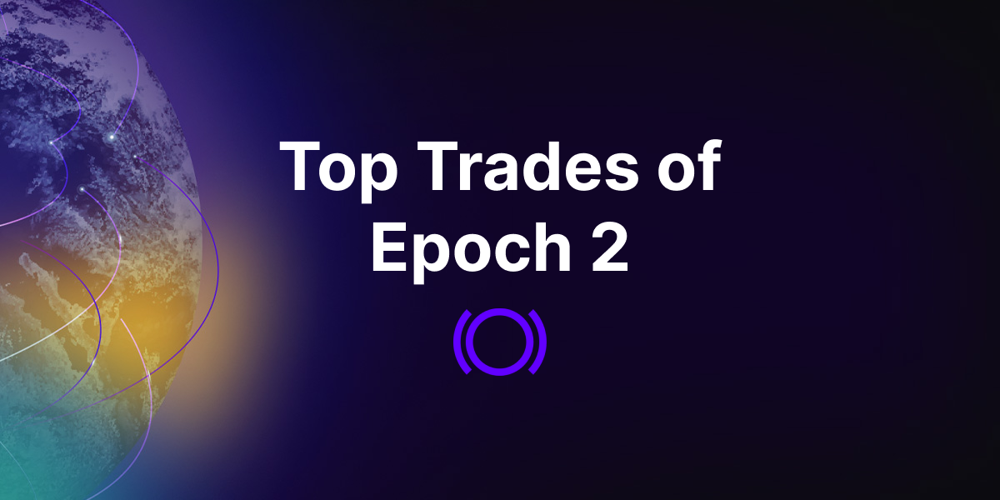
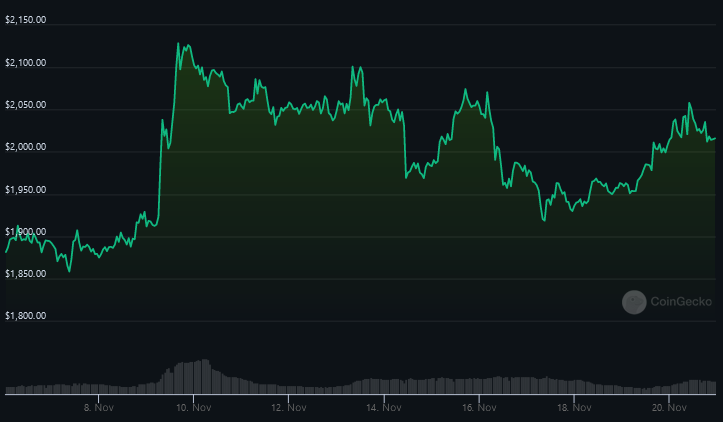
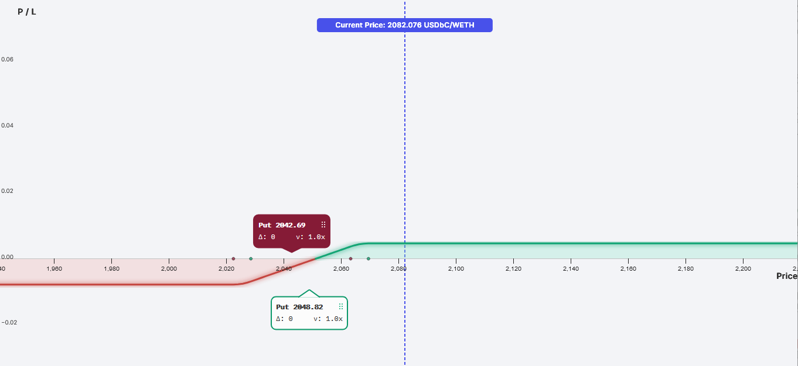
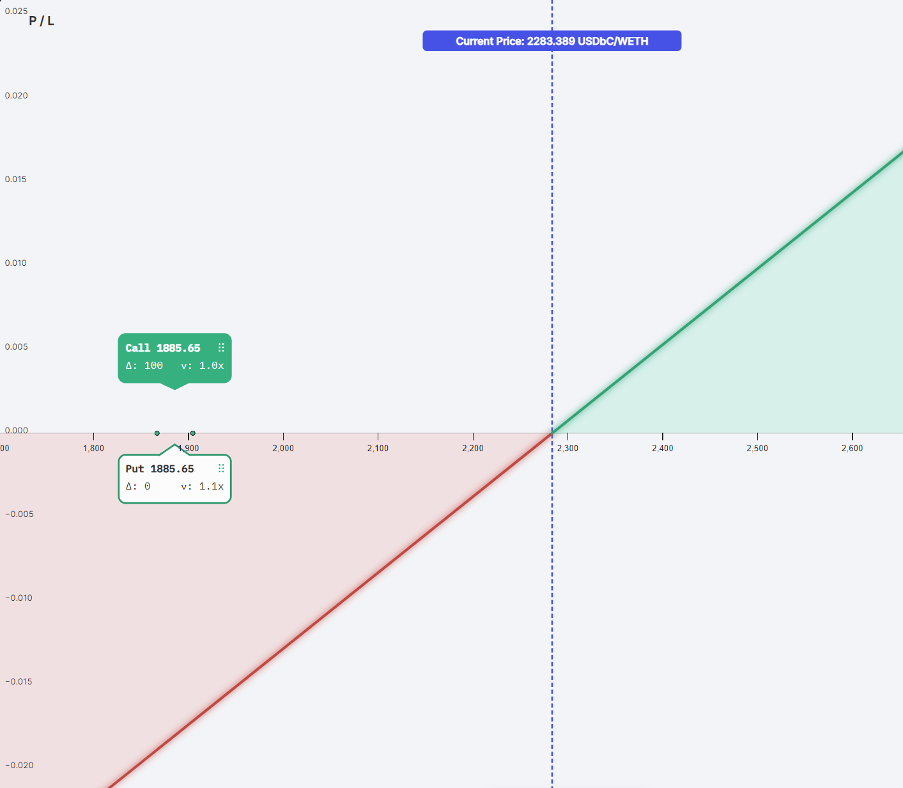

At Panoptic, we want our users to experience all the benefits of trading options, including leverage, hedging, and the potential for gains. With our [beta launch](https://panoptic.xyz/blog/gated-launch-sign-up) underway, we’re now generating real user data and can see exactly how people are putting their strategies into effect.

<!--truncate-->
 
[Epoch 2](https://panoptic.xyz/blog/panoptic-beta-launch-epoch-two) started on November 6, 2023 and closed on November 20, 2023. The team at Panoptic has taken the time to analyze some of the top trades from that round of our trading competition.

## Market Backdrop

Traders were able to buy and sell ETH options during Epoch 2. The price of ETH at the start of the competition was $1,895 and appreciated to $2,014 (+6%) by close. The press release of [Blackrock’s Ethereum ETF filing](https://www.forbes.com/sites/digital-assets/2023/11/09/blackrocks-ethereum-etf-filing-has-big-implications-for-investors/?sh=7dd1c0276b0c) caused the price of ETH to shoot up sharply shortly after trading started.

Traders who were able to take advantage of this price movement in the most capital-efficient ways were able to profit significantly, putting them in a strong position to [win the trading competition](https://panoptic.xyz/blog/panoptic-beta-launch-epoch-two-closed).

## Top Trades and Strategies

The highest-grossing [trade](https://beta.panoptic.xyz/new-position?tokenId=0x14fcf27a202014fcf25c7024c36388be6f416a2) from the round was a [bull put spread](https://panoptic.xyz/research/essential-options-strategies-to-know#put-spread-%EF%B8%8F) that netted the trader a profit and loss (PnL) of +36%. The trade was constructed by selling a $2,048 strike put option and buying a $2,043 strike put option. 

In terms of fees, this means the trader would pay [streamia](https://panoptic.xyz/blog/streamia-defi-native-options-pricing) if the price of ETH hovered between $2,022 and $2,063 and earn streamia if the price of ETH hovered between $2,028 and 2,069. 

This strategy not only took advantage of the price increase in ETH but also took advantage of the capital efficiency dynamics of the protocol. The trader was able to put on this trade with higher amounts of leverage relative to other positions (such as a short put) since put spreads have capped downside risk. 

Most of the traders' PnL came from the price appreciation of ETH, while they paid a negligible amount of streamia on the short leg of the trade. By correctly predicting the ETF-induced price pump and taking full advantage of leverage on Panoptic, this savvy trader was able to hit a home run.

The second, third, and fourth most profitable trades were also bull put spreads with different strikes and entry/exit points. Traders were able to identify and take advantage of the capital efficiency afforded to them by spreads.

The next most profitable strategy was a long [perp](https://www.tastycrypto.com/defi/crypto-perpetuals/) position that earned one trader a 14% profit. [This strategy](https://beta.panoptic.xyz/new-position?tokenId=0x14fcef3c502014fcef3c2024c36388be6f416a2) was constructed by buying and selling the $1,886 strike call and put. 

The payoff is similar to taking a long position on a perpetual futures contract. Similar to the funding rate, this synthetic long perp position earns or owes streamia if the price of ETH hovered between $1,867 and $1,905. Through the Panoptions’ built-in leverage, the trader was able to take full advantage of the price increase in ETH and outperform the market.

Options are a powerful financial primitive. Traders can use options to create positions with various risk-reward tradeoffs and express nuanced views on the direction of the market. 

We are glad to see traders take full advantage of perpetual options in Panoptic to make outsized returns. Billions of dollars in options liquidity are sitting idle in [Uniswap v3](https://panoptic.xyz/docs/getting-started/liquidity-providers), and we hope that by unlocking this market we can bring on-chain options trading to the mainstream.

_Join the growing community of Panoptimists and be the first to hear our latest updates by following us on our [social media platforms](https://links.panoptic.xyz/all). To learn more about Panoptic and all things DeFi options, check out our [docs](https://panoptic.xyz/docs/intro) and head to our [website](https://panoptic.xyz/)._

