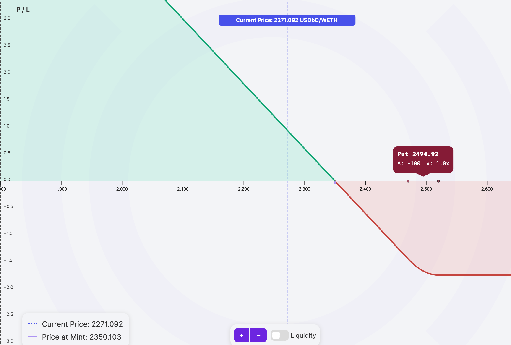
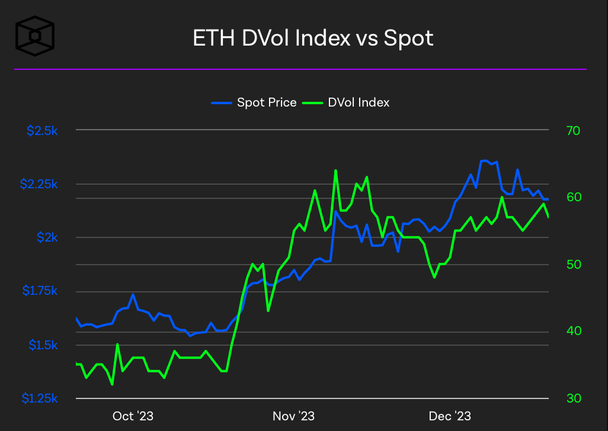
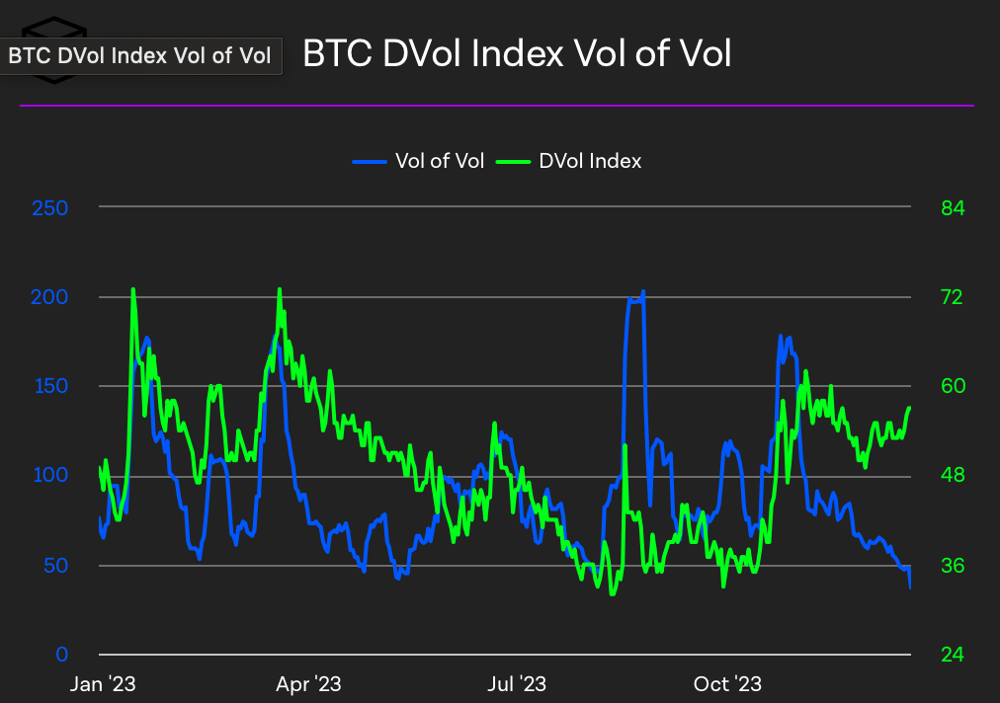
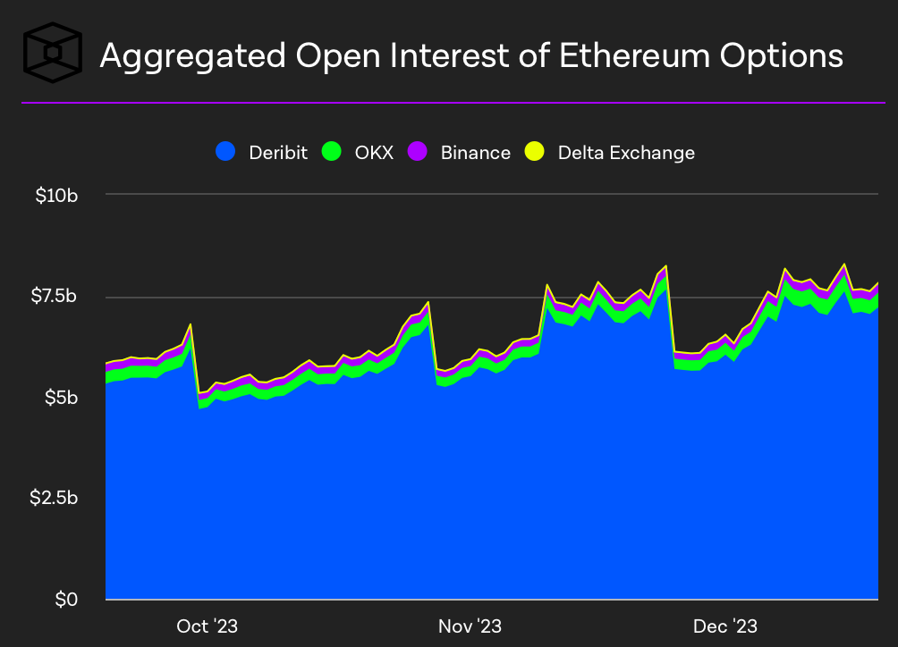
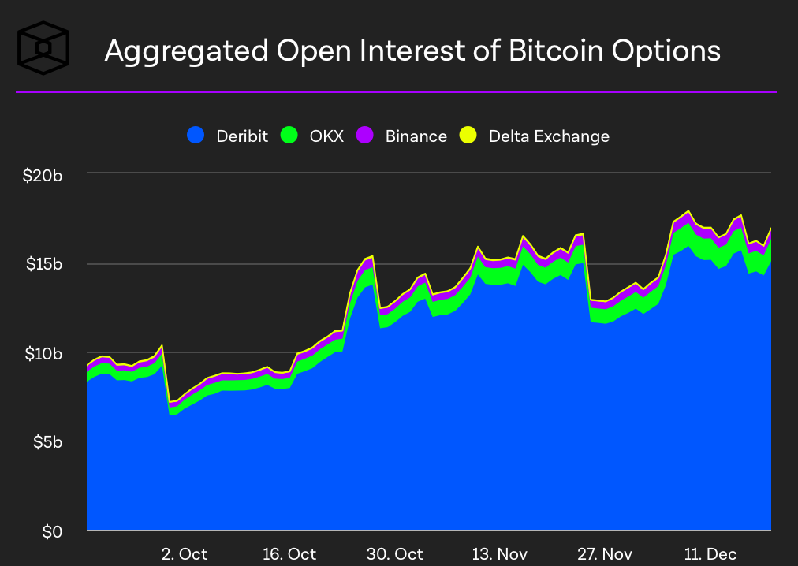
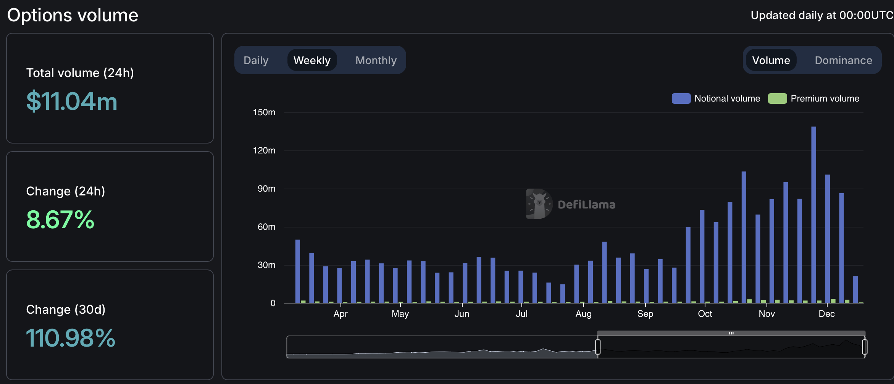

---
slug: panoptic-newsletter-january
title: "Panoptic Insights: January Newsletter"
tags: [Newsletter, Trading Competition, Trade Analysis]
image: /img/banners/newsletter-banner.webp
description: "Explore the top trading strategies and gains on Panoptic’s DeFi options platform. We highlight Panoptic’s trading competitions, DeFi and options trends, and our media recap."
--- 

Welcome Panoptimists to the January edition of the Panoptic Newsletter, where we provide industry insights, research recaps, and Panoptic-specific content to keep you updated on our DeFi-native options platform.

  

If you want future newsletters sent directly to your email, signup on our [website](https://panoptic.xyz/).

  
  

### About Panoptic

Discover the future of trading with Panoptic, your gateway to perpetual options in DeFi. Our cutting-edge platform empowers you to manage risk effectively and trade with unprecedented flexibility. Join us and be part of a secure, decentralized revolution in options trading, tailored for both crypto newcomers and experienced traders.

  

## Panoptic Highlights

### Epoch 3 Highlights

As we wrap up [Epoch 3](https://panoptic.xyz/blog/panoptic-beta-launch-epoch-three-closed) of our beta launch, we're grateful to every participant for their vital role in shaping the future of DeFi options trading. The insights and experiences from this exciting two-week competition are instrumental in refining our platform for Epoch 4. The anticipation for Epoch 4 is building, with the competition opening up to everyone. This upcoming trading competition will bring DeFi options to a new chain with expanded pools and $1,000 in prizes. In the interim, we invite Panoptimists to engage with ongoing activities, like our [holiday trading competition](https://panoptic.xyz/blog/december-nutcracker).

  

In Epoch 3, the top trade was a long ETH put. The price of ETH fell for 7 days during the duration of the position, earning it a remarkable 138% profit. This top-performing strategy showcased that sometimes the best strategy is as simple as a capital-efficient put.

  

#### WETH/USDbC Pool Top Trade

During Epoch 3, another trade in the BALD/WETH pool stood out. A long put secured over a 225% profit (in WETH), thanks to the BALD price dropping relative to the WETH price.

### Community Quest

Recently, traders had the opportunity to paper trade perpetual options on Panoptic's [demo platform](https://panoptic.xyz/blog/panoptic-demo-launch). Over 500 Panoptimists participated in our [community quest](https://galxe.com/panoptic) with three lucky winners receiving a merch box of $50 and an exclusive Panoptic beanie. This hands-on experience provided a risk-free environment on the Ethereum test network, Sepolia.

  

### December Nutcracker Trading Competition 🎄

  

Panoptic is thrilled to unveil the [December Nutcracker](https://panoptic.xyz/blog/december-nutcracker) perpetual options trading competition on Base, which launched on December 19. Blending the excitement of the festive season with the thrill of trading, this event invites participants to claim tokens daily and compete for prizes. The competition involves acquiring December and Nutcracker tokens by claiming, swapping, depositing, and trading on Panoptic’s platform. Stay tuned for more details on the prizes and get ready to join the festive trading spirit!​​​​

### Shallow Dive - Synthetic Perpetual Futures 

In the evolving landscape of decentralized finance (DeFi), Panoptic stands out with its innovative approach to [perpetual futures](https://panoptic.xyz/research/introduction-synthetic-perps), commonly known as 'perps'. Our [synthetic perps](https://x.com/Panoptic_xyz/status/1676976497909993473?s=20), a unique feature within the Panoptic protocol, offer a distinct perspective compared to traditional perps, leveraging the strengths of decentralized exchanges. These [synthetic perps](https://x.com/KyleSamani/status/1260353166425522176?s=20) allow for indefinite duration, providing traders with new ways to leverage market movements without the constraints of traditional expiration-based contracts.

  

Panoptic's synthetic perps diverge from conventional perps by not relying on a standard funding rate mechanism. Instead, they utilize a dynamic fee system called 'streamia', which aligns costs more closely with real-time market conditions and trading activity on Uniswap V3. This approach not only simplifies the trading process but also enhances transparency and fairness in pricing. Additionally, the perpetual nature of these contracts, combined with Panoptic's seamless integration with existing liquidity pools, presents traders with continuous and flexible trading opportunities.

### Long Perp

  

Trading synthetic perps on Panoptic is streamlined and accessible, thanks to our intuitive platform design and strategic trading tools. Traders can easily create synthetic perps by combining different options strategies, such as going long or short on a perp through a combination of at-the-money call and put options. This flexibility, coupled with Panoptic's emphasis on user-friendly interfaces and educational resources, makes it an attractive platform for both seasoned traders and those new to the world of DeFi and derivatives trading. With Panoptic, the complex world of perps becomes a more navigable and lucrative landscape for diverse trading strategies.

  
  
  

## Market Overview

  
  
  
  
  
  
  

### Crypto Inscription Craze

  

December witnessed a notable inscriptions craze within the crypto space, marking a significant contrast between Ethereum rollups as they underwent a real-world test of usage. Zero-knowledge proof-based rollups like zkSync, StarkNet, and Polygon’s zkEVM showcased their ability to handle increased transaction volumes effectively, with their unique ability to amortize the cost of generating validity proofs across many transactions. As activity surged across most networks, these rollups demonstrated they could become cheaper to use at scale, offering a stark contrast to traditional blockchain costs and efficiency.

  
  

### BTC and ETH Options DVol and OI

  

In December, the cryptocurrency market witnessed a significant uptick in both volume and open interest (OI) for Bitcoin and Ethereum derivatives, as evidenced by the images below depicting this rise. The aggregated open interest across various platforms showed a marked increase, indicating a heightened level of trading activity and market participation. Concurrently, derivative volatility (DVOL) also rose and even outpaced spot markets, suggesting a growing interest in future price movements of crypto assets. This trend reflects an expanding derivatives market and illustrates traders' rising appetite for risk and speculation in the crypto space during the month.

  

## Option & Defi Trends

  

The [DeFi options](https://defillama.com/options) market is experiencing a remarkable surge, with a month-to-month increase of over 110%, predominantly driven by the significant contributions of Dopex and Lyra. This impressive growth highlights the burgeoning interest and trust in decentralized finance, signaling a shift in the trading landscape where DeFi options are becoming increasingly mainstream and preferred by traders for their innovative and flexible trading solutions.

### Options Volumes

  

Uniswap V3's impressive growth, exemplified by the [WETH-USDC](https://dune.com/gammastrategies/Uniswap-v3-Volume-and-Fees-Collected) pool amassing over $1.6 billion in volume during the last week of December, is a testament to the platform's robust liquidity framework, which Panoptic leverages for its trading activities. This thriving ecosystem of Uniswap pools ensures a steady and reliable source of liquidity, crucial for the efficient operation of Panoptic's trades and the accrual of fees. The vitality of Uniswap V3 pools significantly bolsters the overall DeFi trading landscape, offering enhanced opportunities and stability for platforms like Panoptic.

  

  

## Panoptic in the Media

  

Tune into the [latest episode](https://twitter.com/100xPodcast/status/1734999336335921633) of the 100x podcast to hear from the founder of Panoptic, where we explore how Panoptic is revolutionizing the DeFi options space with our unique approach to perpetual options!

**<blockquote class="twitter-tweet" data-media-max-width="560">
The Missing Pillar of DeFi  Is <a href="https://twitter.com/Panoptic_xyz?ref_src=twsrc%5Etfw">@Panoptic_xyz</a> upending options as we know them?  -- Perpetual options -- Completely Oracle free? -- Permissionless passive income -- any token, any size, forever  Listen &amp; see why Coinbase &amp; Uniswap backed them👀 <a href="https://t.co/Ym1870G7T7">pic.twitter.com/Ym1870G7T7</a>
&mdash; The 100x Podcast (@100xPodcast) <a href="https://twitter.com/100xPodcast/status/1734999336335921633?ref_src=twsrc%5Etfw">December 13, 2023</a></blockquote> **

  

On the [Ava Labs](https://www.youtube.com/watch?v=ikV4nKlW8pc) podcast, Panoptic's co-founder highlighted the platform's unique perpetual options and its seamless integration with Uniswap liquidity pools, offering insights into how Panoptic is shaping the future of DeFi trading. This discussion underscored the innovative strategies and user-centric approach that define Panoptic's presence in the decentralized finance landscape.

**<iframe width="560" height="315" src="https://www.youtube.com/embed/ikV4nKlW8pc?si=FSUV1S5G_XcdwV2B" title="YouTube video player" frameborder="0" allow="accelerometer; autoplay; clipboard-write; encrypted-media; gyroscope; picture-in-picture; web-share" allowfullscreen></iframe>**
  

## Spotlights

  

TKX Capital's recent article provides an [insightful exploration](https://tkxcapital.medium.com/panoptic-perpetual-options-realized-tkx-weekly-1a0ba471041d) of Panoptic's innovative approach to perpetual options in the DeFi space. Highlighting Panoptic's unique integration with Uniswap v3 and its user-friendly UI/UX, the piece delves into how we're simplifying options trading. Panoptic makes it accessible and profitable, particularly with our oracle-free, perpetual options model.

  

[A recent tweet](https://twitter.com/0xBobdbldr/status/1734950198776873294) sheds light on how Uniswap liquidity providers (LPs) can utilize Panoptic to create options markets. It highlights the innovative ways LPs can replicate calls and puts and even measure their implied volatility. This approach exemplifies the flexibility and depth of opportunities available in the evolving DeFi landscape, especially with Panoptic's platform.

<blockquote class="twitter-tweet" data-conversation="none">
..expected returns of their positions.  I think by now you should know that Univ3 LPs can mimic short calls/puts at a certain price range, and we saw that some fascinating protocols are leveraging this into creating options markets such as : <a href="https://twitter.com/Panoptic_xyz?ref_src=twsrc%5Etfw">@Panoptic_xyz</a> <a href="https://twitter.com/SmileeFinance?ref_src=twsrc%5Etfw">@SmileeFinance</a> <a href="https://t.co/hsLXqBgmh5">pic.twitter.com/hsLXqBgmh5</a>
&mdash; bobdbldr (@0xBobdbldr) <a href="https://twitter.com/0xBobdbldr/status/1734950198776873294?ref_src=twsrc%5Etfw">December 13, 2023</a></blockquote> 

  

## Up Next

  

Panoptic's beta version is set to open up soon, extending access to all traders eager to explore our perpetual options trading platform. Thank you to our incredible community for your support!

  

Epoch 3 is now completed, and we are excited for traders to participate in the ongoing December Nutcracker Trading Competition. Stay tuned for more announcements regarding our upcoming trading competitions.

  
  

*Join the growing community of Panoptimists and be the first to hear our latest updates by following us on our [social media platforms](https://links.panoptic.xyz/all). To learn more about Panoptic and all things DeFi options, check out our [docs](https://panoptic.xyz/docs/intro) and head to our [website](https://panoptic.xyz/).*
