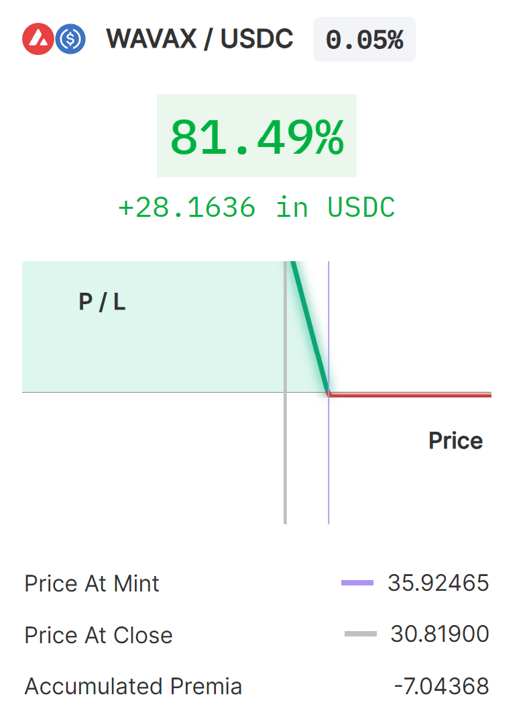
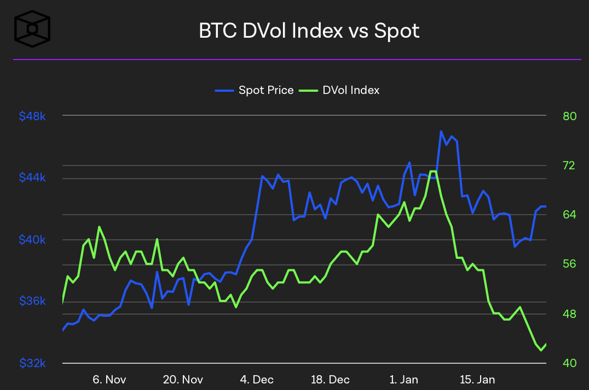
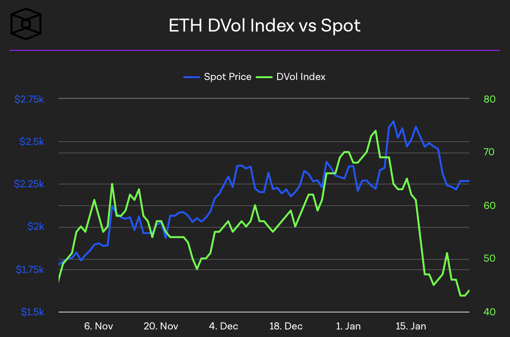
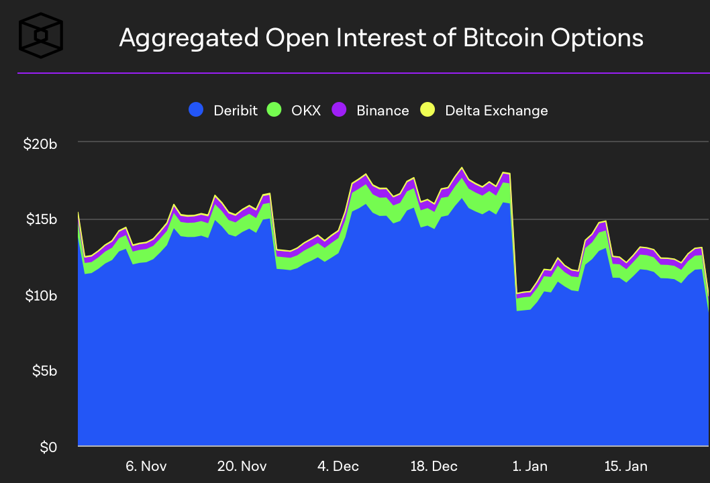
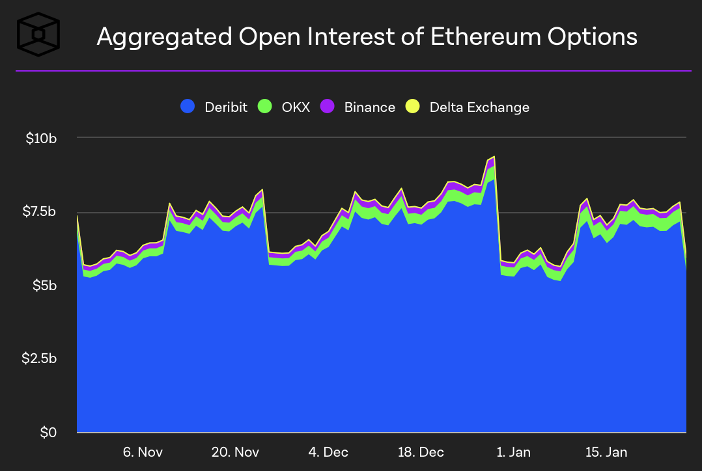

Welcome Panoptimists to the February edition of the Panoptic Newsletter, where we provide industry insights, research recaps, and Panoptic-specific content to keep you updated on our DeFi-native options platform.

  
If you want future newsletters sent directly to your email, signup on our [website](https://panoptic.xyz/).

  

### About Panoptic

Discover the future of trading with Panoptic, your gateway to perpetual options in DeFi. Our cutting-edge platform empowers you to manage risk effectively and trade with unprecedented flexibility. Join us and be part of a secure, decentralized revolution in options trading, tailored for both crypto newcomers and experienced traders.

  

## Panoptic Highlights

### Epoch 4 Highlights

#### Top Trade in Epoch 4

In the recent trading epoch, savvy traders capitalized on the bearish market mood triggered by the post-ETF announcement sell-off. By strategically employing puts and straddles, they not only navigated through the downturn but also accrued [streamia](https://panoptic.xyz/blog/streamia-defi-native-options-pricing), enhancing their profits.

The epoch's [top trader](https://beta4.panoptic.xyz/positions/0x14fc548c302fae3f424a0a47706?view_as=0x376f59d57c4db76e0da71e9952898cce419d05fc&block_number=40786727) achieved an impressive 81.49% profit by astutely timing the market—entering a put option position when AVAX was around $35.90 and exiting as the price dipped to $30 a week later. Despite the successful trade, the trader incurred $7.04 in streamia, a small price for the substantial returns garnered during this volatile period.

#### Epoch 4 Rewards

As we closed the chapter on Epoch 4 of Panoptic's beta launch, we extend our heartfelt thanks to each participant whose dedication has been instrumental in refining the DeFi options trading experience. With the conclusion of this epoch, we have already started Epoch 5. Epoch 5 is hosted on Optimism and Base, with OP and Threshold Bitcoin (tBTC) markets available for trading and a [$2,000 prize pool](https://panoptic.xyz/blog/panoptic-beta-launch-epoch-five) for top performers. Congratulations to the [victors of Epoch 4](https://panoptic.xyz/blog/panoptic-beta-launch-epoch-four-closed), who have demonstrated exceptional skill and strategy in the markets!

  

### December Nutcracker Trading Competition 🎄

The curtain rises on the highly anticipated [December Nutcracker](https://x.com/Panoptic_xyz/status/1747694450544111768?s=20) event prizes, and Panoptic is proud to reveal an array of NFT rewards! Join the competition on Base at [beta.panoptic.xyz](http://beta.panoptic.xyz), engage in perpetual options trading, and stand a chance to win a part of the over $10,000 NFT treasure trove, including illustrious pieces from Milady, Lil Pudgy, and mfer collections. Don't miss your shot!

  

### Shallow Dive — Leverage on Panoptic

​​Leverage on Panoptic opens up [powerful opportunities](https://panoptic.xyz/research/panoptic-leverage) for traders, enabling them to control a greater value of assets than the collateral they provide. By depositing a fraction of the asset's value, traders can engage in options trading with up to 10x leverage when buying options, and up to 5x when selling, depending on market liquidity. This system, supported by passive liquidity providers (PLPs), ensures a stable and efficient trading environment where advanced strategies can be employed for even higher capital efficiency, all with the added security of collateral backing each position.

  

## Market Overview

### BTC ETF

The BlackRock iShares Bitcoin ETF (IBIT) recently marked a significant milestone, surpassing $2 billion in assets under management, a feat that highlights the growing investor interest in crypto-based ETFs. Following this achievement, attention is now turning towards the potential launch of an Ethereum ETF, with approval deadlines as early as May. This is around the same time as the anticipated Bitcoin halving event, which historically has impacted market dynamics.

  

## Option & Defi Trends

  

Following the announcement of the Bitcoin ETF, derivative volatility (DVOL) for both Bitcoin and Ethereum experienced a notable downturn, with spot prices echoing this decline. Open interest (OI) for Bitcoin fell below $8 billion, marking its first such dip in over six months, while Ethereum's OI demonstrated stability, maintaining around $7.5 billion with minimal impact from the ETF news, highlighting the market looking towards a potential ETH Spot ETF arrival in May.

  

#### Lyra is growing exponentially

The DeFi options market is experiencing substantial growth, as evidenced by the 327% Month-over-Month increase in notional volume within the [Lyra protocol](https://defillama.com/options/lyra). Lyra’s rapid growth is largely due to ETH options and perpetual futures launching on their new product, Lyra V2. The rise in volume within protocols like Lyra indicates a heightened demand for advanced financial instruments in the decentralized space.

  

#### Bitcoin Steadies Amid U.S. Economic Growth Surge

Bitcoin maintained stability as the U.S. economy reported a stronger than expected 3.3% GDP growth in Q4, surpassing estimates and signaling a near match to the December inflation rate. Despite a slowdown from Q3's 4.9% growth, robust consumer and government spending fueled the economy. Amidst this, Bitcoin oscillated around the $40,000 mark with significant trading volumes, while the crypto market braces for the expiration of billions in BTC and ETH options, hinting at an active rollover of positions and an eventful end to a tumultuous month marked by the launch of multiple Bitcoin ETFs and notable shifts in the Grayscale Bitcoin Trust.

  

## Panoptic in the Media

  

### Spotlights

#### Panoptic's innovative perpetual options

A DeFi threadoor shared a tweet detailing how Panoptic’s peer-to-pool model enables leverage options buying and selling.

<blockquote class="twitter-tweet" data-conversation="none">
18/35  5️⃣ <a href="https://twitter.com/Panoptic_xyz?ref_src=twsrc%5Etfw">@Panoptic_xyz</a>  Panoptic is a perpetual, oracle-free, instant-settlement options trading protocol  ✅ Oracle free Options based on UNI v3 LP pools ✅ Options never expire and are perpetual ✅️ Re-creates options like payoffs in a peer-to-pool model
&mdash; slappjakke.eth 🦇🔊 (@Slappjakke) <a href="https://twitter.com/Slappjakke/status/1620437015228456961?ref_src=twsrc%5Etfw">January 31, 2023</a></blockquote> 

#### Code4rena audits Panoptic’s semi-fungible position manager (SFPM)

The [Code4rena audit](https://x.com/code4rena/status/1743502806399733796?s=20) of Panoptic’s position manager has concluded, with $75,500 in rewards distributed to the top Wardens. Stay tuned for the next upcoming Code4rena contest where Wardens will have the chance to comprehensively audit the entirety of Panoptic’s smart contract codebase.
  

## Up Next

### Epoch 5

Epoch 5's Trading Competition has kicked off! Hosted on the Optimism and tBTC markets, the competition is open for participation. With a prize pool of $2,000 up for grabs and special POAP rewards for the top traders and early depositors, it's an event you won't want to miss. Gear up for some intense trading action and join us in the quest for top honors!

### December Nutcracker

The December Nutcracker trading competition extends until February 22. To encourage adversarial behavior for protocol robustness testing, we have created a “naughty/nice” system of rewards. There are prizes for nice users that adhere strictly to fair play: a Lil Pudgy for the best performer and a mfer for the best option seller. For naughty accounts, the reward is a Milady. Learn more [here](https://panoptic.xyz/blog/december-nutcracker#naughty-or-nice)!

  

*Join the growing community of Panoptimists and be the first to hear our latest updates by following us on our [social media platforms](https://links.panoptic.xyz/all). To learn more about Panoptic and all things DeFi options, check out our [docs](https://panoptic.xyz/docs/intro) and head to our [website](https://panoptic.xyz/).*