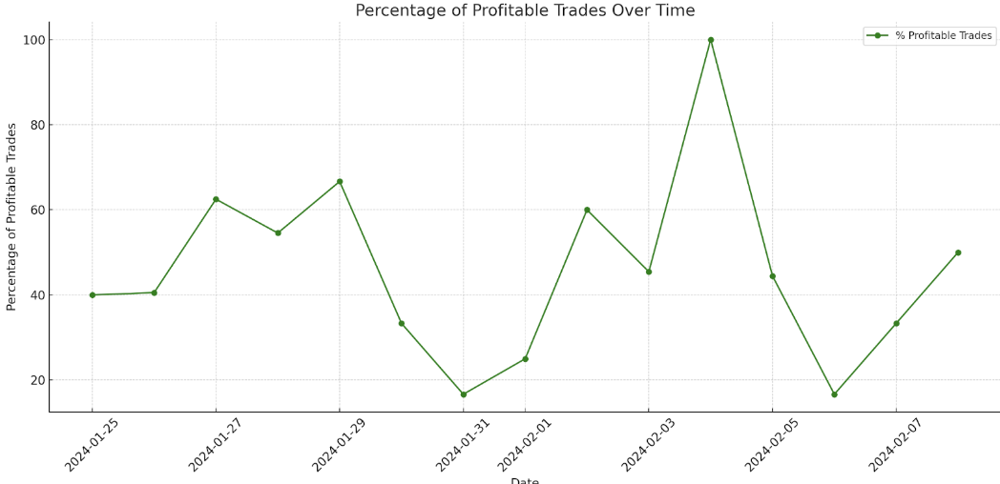

Welcome Panoptimists to the March edition of the Panoptic Newsletter, where we provide industry insights, research recaps, and Panoptic-specific content to keep you updated on our DeFi-native options platform.

  

If you want future newsletters sent directly to your email, signup on our [website](https://panoptic.xyz/).

  

### About Panoptic

Discover the future of trading with Panoptic, your gateway to perpetual options in DeFi. Our cutting-edge platform empowers you to manage risk effectively and trade with unprecedented flexibility. Join us and be part of a secure, decentralized revolution in options trading, tailored for both crypto newcomers and experienced traders.

  

## Panoptic Highlights

### Epoch 5

#### Top tBTC Trader

Bitcoin’s price declined post-ETF approval as FTX unwound its GBTC position, but rebounded again as sell pressure subsided. Using a well timed call option, the top tBTC trader capitalized on the rebound in Bitcoin price by buying the bottom of the FTX selloff, netting 38% in profits.

#### Top OP Trader

The top trader in the OP options market during Epoch 5 employed a strategic and high conviction approach to trading OP by closely monitoring and leveraging the correlation with Bitcoin's price movements. This trader executed a long position on OP using a synthetic perp—a type of derivative that mimics the price movement of the underlying asset without actual ownership. By holding onto this position for 12 days, the trader was able to capitalize on a significant uptrend in OP's price, realizing a profit of 36%.

  

This achievement was accomplished with minimal cost, as the trader incurred only $0.05 in streamia, which refers to the funding rate or fee paid for holding the synthetic perp. This low fee underscored the effectiveness of the trader's strategy, highlighting their ability to maximize returns while minimizing costs.

  

#### Profitable Trades Over Time

Overall, the profitability of OP trades was highly correlated to the price of OP itself, with the majority of positions entered into being long calls.

  

### Epoch 6

[Epoch 6](https://panoptic.xyz/blog/panoptic-beta-launch-epoch-six-closed) witnessed a competitive trading competition on MATIC options, concluding with a prize pool of $1,000, rewarding the ingenuity of participants. The top five traders were honored with a 'Top Trader POAP', a digital badge of distinction for Panoptimists. Dominating the epoch, the leading trader executed a total of 68 trades, employing diverse strategies that culminated in 62% returns. The trader that placed second in Epoch 6 employed a particularly savvy trade by selling an in-the-money (ITM) put, delivering an impressive 70% profit. This gain was bolstered by lending out the user’s position as a Uniswap Liquidity Provider (LP) token to earn an additional $16.40 in streamia.

### Panoptic’s DeFi Derivatives Summit

The [DeFi Derivatives Summit](https://defisummit.panoptic.xyz), hosted by Panoptic during ETH Denver, was a resounding success, drawing industry pioneers from across the globe. This event showcased the leading minds in the DeFi derivatives sector, including notable speakers from dYdX, Aevo, Wintermute, GSR, zkSync, and others. They delved into critical discussions on the future of decentralized derivatives, perps vs. options, real world asset derivatives, and VC perspectives. Recordings of the talks and panels will be made available on our [YouTube channel](https://www.youtube.com/@Panopticxyz). The success of the summit highlighted the burgeoning interest in the DeFi derivatives space!

### Shallow Dive — The Liquidity Spread

The concept of spread is crucial to understanding the dynamics of Panoptic's perpetual options market. In traditional finance, the spread represents the difference between the bid and ask prices, providing insight into market liquidity and trading costs. Panoptic innovatively adapts this concept to the decentralized finance (DeFi) realm by integrating a liquidity-based spread into its pricing algorithm. This liquidity spread adjusts the option prices to balance demand and supply, offering a real-time reflection of market sentiments and trading activity. The spread is not just a marker of cost but a critical element of price discovery, adapting to the constant shifts within the DeFi markets and ensuring that the cost of an option remains fair and responsive to changes in liquidity and volatility.

  

  

In Panoptic, the spread is dynamically calculated and is a key component that interacts with the base price of options, which is rooted in realized volatility. While the base price reflects historical price movements, the spread is indicative of the market's forecast of future volatility, or implied volatility (IV), bringing an additional layer of depth to pricing. For Uniswap Liquidity Providers (LPs), the spread translates into an extra source of yield when they lend out their LP tokens, which is equivalent to selling a perpetual option. This innovative feature turns the spread into a mechanism that not only serves the purpose of balancing market dynamics but also incentivizes liquidity provision, enhancing LPs' returns. For traders, understanding the spread is essential, as it directly impacts the pricing of options they are looking to buy or sell, and thus influences their trading strategies and potential profitability. For more information, check out our [deep dive](https://panoptic.xyz/research/liquidity-spread).

  

## Market Overview

### BTC ETF Inflows

On February 26th, ETFs purchased 9,163 Bitcoin, far exceeding the approximately 900 new Bitcoin mined that day. With the Bitcoin halving less than 50 days away, this disparity underscores a strong demand that, coupled with the upcoming reduction in new Bitcoin supply, could lead to a price surge due to increased scarcity.

## Options & DeFi Trends

### Continued Growth in DeFi Options Volume

Lyra has experienced a surge in monthly volume, with an increase of nearly 36%, marking a period of sustained growth over the past two months since migrating to its own rollup chain.

  

### DeFi Continues Accumulating TVL

The total value locked (TVL) in DeFi protocols has been on an uptrend, nearly hitting the $90 billion mark. This growth signals sustained and increasing interest in the DeFi sector.

  

## Panoptic in the Media

### Spotlights

#### Community member highlights Panoptic’s capital efficiency and leverage

A tweet by a Panoptic community member showcases the strategic advantage of risk reversals on the platform. By selling a put and buying a call at different strikes, the trader illustrates how asymmetric gains can be made while hedging against downward price movement.

<blockquote class="twitter-tweet">
why <a href="https://twitter.com/Panoptic_xyz?ref_src=twsrc%5Etfw">@Panoptic_xyz</a> is a game changer especially if you don&#39;t trade options in <a href="https://twitter.com/hashtag/crypto?src=hash&amp;ref_src=twsrc%5Etfw">#crypto</a>. Say you want to buy 100 matic. Today that cost about $100.  Here, I sell a put and buy a call. I put in 23 matic or dollars.  If the price goes down 50%: - $3 If the price goes up 50%: +$50 <a href="https://t.co/lvlavJ4cYT">pic.twitter.com/lvlavJ4cYT</a>
&mdash; L7 (@L7cubed) <a href="https://twitter.com/L7cubed/status/1760754762050326685?ref_src=twsrc%5Etfw">February 22, 2024</a></blockquote> 

#### Panoptic is filling an unmet need for Uniswap LPs

This tweet highlighted the friction between the DeFi community's demand for convenient liquidity provision and the operational complexity of managing concentrated liquidity pools. Panoptic stands out as a liquidity management tool for active LPs to better manage their positions, understand their expected payoffs, and gain additional yield from lending out their LP tokens.

<blockquote class="twitter-tweet">
concentrating liquidity. However, in that case we are talking about volatile assets so it is hard to avoid the conclusion that one needs either to become a dedicated LPer like <a href="https://twitter.com/Panoptic_xyz?ref_src=twsrc%5Etfw">@Panoptic_xyz</a> which use V3 pools to offer their own version of crypto options. Another possibility
&mdash; Ig Mos PhD (ℵ)/acc 🔀 (@IgMosqueira) <a href="https://twitter.com/IgMosqueira/status/1760150413939269845?ref_src=twsrc%5Etfw">February 21, 2024</a></blockquote> 
  

*Join the growing community of Panoptimists and be the first to hear our latest updates by following us on our [social media platforms](https://links.panoptic.xyz/all). To learn more about Panoptic and all things DeFi options, check out our [docs](https://panoptic.xyz/docs/intro) and head to our [website](https://panoptic.xyz/).*
