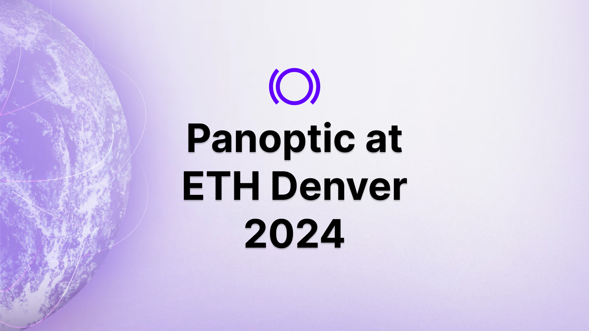
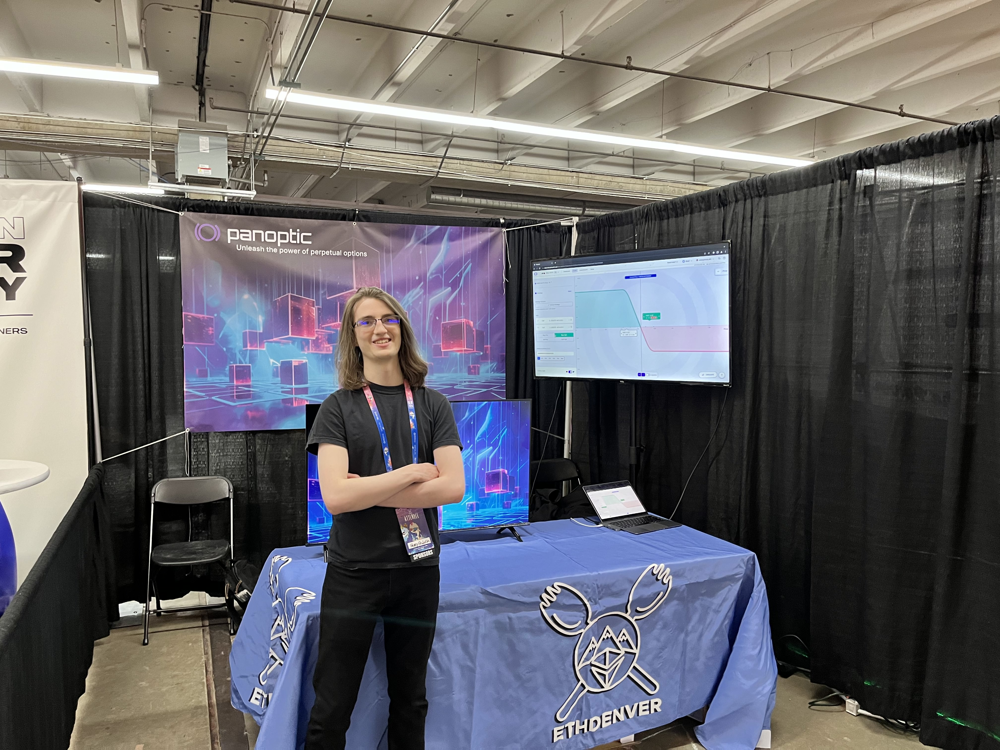
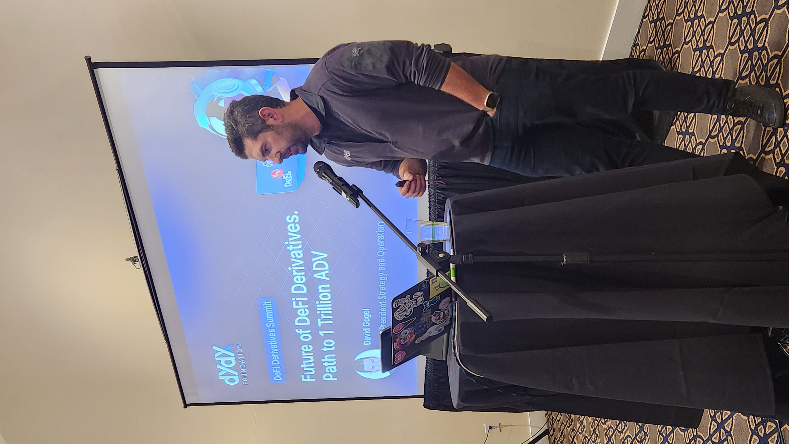

During the last week of February, Denver became the epicenter for over tens of thousands of crypto enthusiasts, professionals, and traders, all congregating for the largest Ethereum conference of the year. Amidst the recent bull market following Bitcoin's ETF launch, the excitement and anticipation among attendees were unmistakable.

The Panoptic team met hundreds of crypto enthusiasts, traders, and developers each day at its booth. The day was filled with product demos, answering questions, and merch giveaways.

## Wen Mainnet?
After seeing our [product demo](https://beta.panoptic.xyz), users were excited about the opportunity to earn extra yield on their Uniswap LP tokens and create options strategies with the click of a button. Attendees were especially excited to start lending out their own LP tokens and begin trading longtail options.

One of the most commonly asked questions from excited product demo watchers was when our mainnet launch would be made available. While no official date has been announced, the Panoptic team is anticipating launching around the summer of 2024. Our main priority is to build a safe and secure platform, for which we have been beta testing and undergoing multiple security audits with [ABDK](https://panoptic.xyz/blog/abdk-audit-completion), [OpenZeppelin](https://panoptic.xyz/blog/openzeppelin-audits-panoptic-defi-options-protocol), and [Code4rena](https://panoptic.xyz/blog/panoptic-code4rena-audit) before launching.

Our beta testing has seen seven trading competitions launched across four different chains with over $25,000 in prizes distributed to participants including rewards from the Milady, Lil Pudgy, and mfer collections.

## DeFi Derivatives Summit

Panoptic hosted the [DeFi Derivatives Summit](https://defisummit.panoptic.xyz/) on March 1st along with its sponsors PredX and Gauntlet. The event drew a large crowd of derivatives traders and builders, with more than 200 attendees hearing directly from industry leaders like dYdX, Aevo, Wintermute, GSR, zkSync, and others.

They delved into critical discussions on perps versus options, real world asset derivatives, VC perspectives, and the future of decentralized derivatives. 

Subscribe to our [YouTube](https://www.youtube.com/@Panopticxyz) channel, where you will be able to access all the insightful sessions from the DeFi Derivatives Summit.

*Join the growing community of Panoptimists and be the first to hear our latest updates by following us on our [social media platforms](https://links.panoptic.xyz/all). To learn more about Panoptic and all things DeFi options, check out our [docs](https://panoptic.xyz/docs/intro) and head to our [website](https://panoptic.xyz/).*
