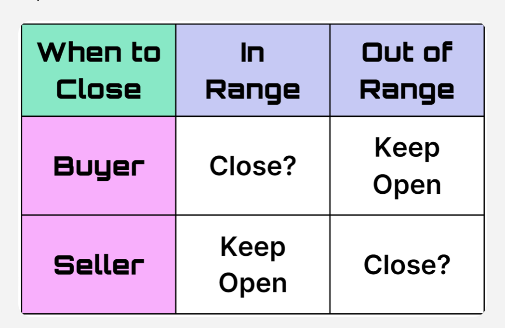
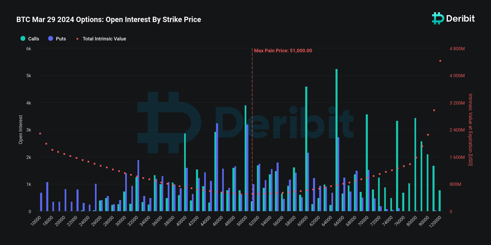
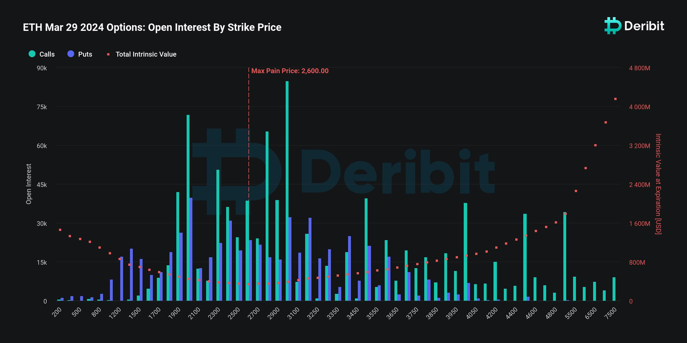

Welcome Panoptimists to the April edition of the Panoptic Newsletter, where we provide industry insights, research recaps, and Panoptic-specific content to keep you updated on our DeFi-native options platform.

  

If you want future newsletters sent directly to your email, signup on our [website](https://panoptic.xyz/).

  

### About Panoptic

Discover the future of trading with Panoptic, your gateway to perpetual options in DeFi. Our cutting-edge platform empowers you to manage risk effectively and trade with unprecedented flexibility. Join us and be part of a secure, decentralized revolution in options trading, tailored for both crypto newcomers and experienced traders.

  

## Panoptic Highlights

### December Nutcracker Trading Competition 🎄

The December Nutcracker trading contest [results](https://panoptic.xyz/blog/december-nutcracker-contest-winners) are out. Clinching the title of 'Best Naughty Trader,' one savvy participant employed an aggressive series of long options coupled with strategic price manipulation, while the 'Best Nice Trader' commendation went to a trader who adeptly handled the sale of multiple puts and calls amidst the resultant market volatility. The competition's narrative was rich with tales of strategic maneuvering, particularly highlighting how some traders maximized their gains through swift action and market savvy, reflecting the depth and adaptability of crypto traders.

  

### Shallow Dive — Position Management

In Panoptic's platform, [position management](https://panoptic.xyz/research/position-management) for options traders hinges on a keen understanding of streaming premia (streamia) and its relationship to in-range and out-of-range options. Buyers must watch the streamia accrued on in-range positions, as it can erode the profitability of an option over time, prompting a strategic exit. Sellers, conversely, benefit from keeping in-range positions open to continue earning streamia but should be ready to close out-of-range positions which no longer earn streamia income.

The delicate balance of maintaining optimal buying power to avoid liquidation is a critical aspect of trading on Panoptic. Traders must regularly assess their positions to ensure their buying power usage doesn't reach perilous levels, which could lead to liquidation. Adjusting positions by either closing them or topping up collateral can protect a trader's portfolio, allowing for sustained participation in the DeFi options market while managing risk effectively.

  

### Delta Risk

Delta risk is a fundamental aspect of options trading which quantifies the sensitivity of an option's value to shifts in the underlying asset. On Panoptic, traders harness this metric to fine-tune their exposure to market movements and maintain control over their portfolio's directional exposure. Learn more in our [tutorial](https://panoptic.xyz/research/understanding-delta-risk) article.

  

### Panoptic at ETH Denver

The Panoptic team was at ETH Denver in full force, check out our intern’s recap video.

<blockquote class="twitter-tweet">
We came, we saw, we <a href="https://twitter.com/hashtag/BUIDL?src=hash&amp;ref_src=twsrc%5Etfw">#BUIDL</a>&#39;d   Until next year <a href="https://twitter.com/EthereumDenver?ref_src=twsrc%5Etfw">@EthereumDenver</a> ✌️ <a href="https://t.co/YRIYpUo645">pic.twitter.com/YRIYpUo645</a>
&mdash; Panoptic Intern (@panopticintern) <a href="https://twitter.com/panopticintern/status/1768494234867306957?ref_src=twsrc%5Etfw">March 15, 2024</a></blockquote> 

  

Panoptic’s [DeFi Derivatives Summit](https://panoptic.xyz/blog/panoptic-at-eth-denver-2024) drew a large crowd of derivatives traders and builders, with more than 200 attendees hearing directly from industry leaders like dYdX, Aevo, Wintermute, GSR, zkSync, and others. To catch panel discussions and talks on topics such as "Are Perps the New Options?" or "RWA Derivatives", head over to our [YouTube channel](https://www.youtube.com/@Panopticxyz).

  

## Market Overview

### Ethereum Upgrade

Following the [Dencun hard fork](https://blockworks.co/news/vitalik-buterin-disusses-post-dencun-ethereum-future), Ethereum has made significant strides in scaling and efficiency. The update introduces proto-danksharding and blob transactions, aimed at improving data handling and reducing transaction costs. These changes signify a shift towards a scalable infrastructure, facilitating a lower-cost environment for rollups and enhancing network capabilities. The Dencun upgrade, embodying the shift from a layer-1 to a layer-2-centric ecosystem, sets the stage for further advancements like data availability sampling and PeerDAS.

## Option & Defi Trends

### Major Expirations and Open Interest

On March 29th, the DeFi options market saw the expiry of approximately $15.16 billion in crypto options. Bitcoin options, with a notional value of $9.53 billion and a put-call ratio of 0.84, reached a max pain point at $51,000. Ethereum options added $5.63 billion to this, with a put-call ratio of 0.63 and a max pain point at $2,600.

  

April 26th emerges as a key date for the broader crypto options markets, already showing a [substantial open interest (OI)](https://metrics.deribit.com/options/BTC) with notional value of calls at $242 million and puts at $63 million. This date is significant as market participants anticipate the mid-April Bitcoin halving to potentially spark large market shifts.

  

  

### SEC Weighs Introduction of BTC ETF Options for Institutions

The SEC is considering introducing options on Bitcoin ETFs, a move that could substantially impact institutional investors. These options, serving as potential hedging instruments, follow the SEC's earlier approval of spot bitcoin ETFs and are backed by proposals from major exchanges like Cboe, Nasdaq, and NYSE.

  

This development follows a [12% uptick](https://blockworks.co/news/sec-options-spot-bitcoin-etfs) in ETF options trading volume from the previous year. Analysts suggest that the introduction of these options could facilitate a new layer of liquidity and risk management for institutional portfolios, signaling a robust integration of traditional finance mechanisms with the evolving crypto markets. The decision [deadline](https://cointelegraph.com/news/sec-delays-spot-bitcoin-etf-options-trading-decision) for the SEC to approve or reject Bitcoin ETF options is April 24.

  

## Panoptic in the Media

## Spotlights

### ATX DAO Podcast

Tune in to the ATX DAO Podcast for an enlightening conversation with Guillaume Lambert, CEO and founder of Panoptic, as he delves into the fusion of physics and finance. Discover how applying the foundational principles of physics has innovated trading on the blockchain.

<blockquote class="twitter-tweet">
Check out the our recent ATX DAO Podcast where we explore the groundbreaking world of DeFi with <a href="https://twitter.com/guil_lambert?ref_src=twsrc%5Etfw">@guil_lambert</a> from <a href="https://twitter.com/Panoptic_xyz?ref_src=twsrc%5Etfw">@Panoptic_xyz</a>  Learn how Pantopic is transforming options trading on Ethereum, providing insights into the evolving landscape of DeFi<a href="https://t.co/MN6V1GKGQX">https://t.co/MN6V1GKGQX</a> <a href="https://t.co/Np0X31EmiE">pic.twitter.com/Np0X31EmiE</a>
&mdash; ATX DAO (@ATXDAO) <a href="https://twitter.com/ATXDAO/status/1774805416469319963?ref_src=twsrc%5Etfw">April 1, 2024</a></blockquote> 
  

## Up Next

### Code4rena Audit

Panoptic’s competitive audit of the Panoptic V1 protocol launches on April 1 and runs until April 22. Help secure the DeFi options protocol by signing up on [code4rena](https://code4rena.com/audits/2024-04-panoptic#top) to audit the platform. A prize pool of $120,000 awaits.

  

*Join the growing community of Panoptimists and be the first to hear our latest updates by following us on our [social media platforms](https://links.panoptic.xyz/all). To learn more about Panoptic and all things DeFi options, check out our [docs](https://panoptic.xyz/docs/intro) and head to our [website](https://panoptic.xyz/).*
