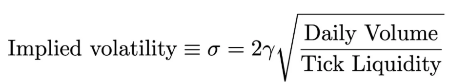
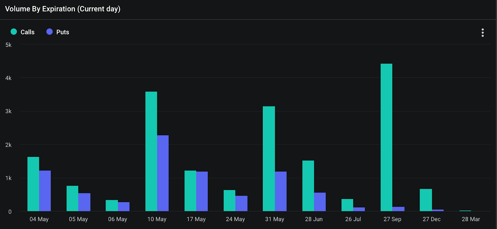

Welcome Panoptimists to the May edition of the Panoptic Newsletter, where we provide industry insights, research recaps, and Panoptic-specific content to keep you updated on our DeFi-native options platform.

If you want future newsletters sent directly to your email, signup on our [website](https://panoptic.xyz/).

### About Panoptic

Discover the future of trading with Panoptic, your gateway to perpetual options in DeFi. Our cutting-edge platform empowers you to manage risk effectively and trade with unprecedented flexibility. Join us and be part of a secure, decentralized revolution in options trading, tailored for both crypto newcomers and experienced traders.

  

## Panoptic Highlights

### Shallow Dive – Implied Volatility (IV) from Uniswap Liquidity

If liquidity providers (LP) tokens are actually options, what is their IV? Guillaume Lambert, founder of Panoptic, formulates a [method](https://lambert-guillaume.medium.com/on-chain-volatility-and-uniswap-v3-d031b98143d1) for extracting IV from Uniswap pools using Uniswap-specific metrics. It turns out that by using volume and liquidity data, options traders can calculate the volatility implied by Uniswap LP positions, providing a clear indication of market expectations. By focusing on these metrics, Lambert's approach offers a practical application in decentralized finance (DeFi) that merges with principles from traditional financial markets.

In practical terms, understanding the IV of Uniswap pools allows LPs to more strategically manage their positions. IVs can assist LPs to determine the most profitable pools to participate in.
  
Furthermore, this mathematical framework also helps LPs assess whether it is more beneficial to hold liquidity positions or to short them as options based on the computed IV. On-chain IVs facilitate a deeper understanding of Uniswap pool dynamics, check them out [here](https://info.yewbow.org/#/tokens)!

### Master Your Market Exit

[Closing positions](https://panoptic.xyz/research/closing-a-position) in trading involves more than just locking in gains or minimizing losses–it requires strategic decision making and precise timing. Understanding the optimal moment to exit, guided by factors like range, buying power, and profit and loss (PnL), is crucial for maintaining profitability. This guide simplifies the process, detailing how traders can effectively manage their positions. Whether it's monitoring for potential liquidation or assessing the range of your position, each aspect is tailored to help traders make informed decisions.

### Securing the Protocol

Panoptic's competitive audit with Code4rena concluded on April 22, and we extend our gratitude to the Wardens for their efforts in enhancing protocol security, sharing in a prize pool of $120,000. Meanwhile, we are undergoing a further audit with Trail of Bits in preparation for Panoptic’s mainnet launch.

  

### Explore the Future of Decentralized Derivatives

If you missed the pivotal DeFi Derivatives Summit, don't worry—the entire event is now accessible on our [YouTube channel](https://www.youtube.com/playlist?list=PLB5qwiSwzT_rQbTW9Rm75dnKqbKt4iGVf). Dive into the world where derivatives meet decentralization with comprehensive discussions covering innovation, mass adoption, and risk management. Experience insights from leading minds from the dYdX Foundation, Nascent, Aevo, and more discussing topics such as ‘perps vs. options’ and real world assets (RWAs).

  
  

## Market Overview

### Bullish Surge in Options Market Signals Confidence in Late-Year Gains

In early May, the options market is showing robust [bullish BTC activity](https://x.com/GreeksLive/status/1786342236676096280), highlighted by significant trades in call options. Notably, there were two large trades involving 65,000 calls set to expire in September and December, with the September expiration’s notional value already over $270 million. This transaction is intriguing as the open positions decreased, suggesting that a large player may have closed an existing position to take on these calls. Additionally, a complex call ratio spread for September was executed, involving the purchase of a 60,000 call and the sale of two 90,000 calls, resulting in a net outflow of around $2.7 million. This strategy, indicative of very bullish sentiment, aligns with the current market's low IV and the recent pullback, presenting a potentially lucrative opportunity for strategic call buying in the latter half of the year.

  

### Derivative Downturn: Over $1 Billion in Crypto Derivative Liquidations on April 13th

In a [dramatic turn](https://coinmarketcap.com/community/articles/661a634adc26ce639dbdbfe5/) of events within the crypto markets, liquidations soared near the $1 billion mark as major tokens witnessed a precipitous drop in a rapid flash crash. The sell-off, which swept across the market, saw Bitcoin, Ethereum, and Solana's prices plunge, contributing to a staggering twenty-four-hour cascading liquidation that has affected over a quarter of a million traders. While the catalyst for this downturn remains speculative, its coincidence with geopolitical tensions has market participants on high alert. Exchange and industry-related stocks like Coinbase and MicroStrategy also took significant hits, reflecting the broader market's distress.

### Options Expiry Volatility Post-Halving: Bitcoin Nears Max Pain as Markets Test Resilience

On April 26, the cryptocurrency markets underwent [significant volatility](https://www.theblock.co/post/291110/bitcoin-options-in-line-with-previous-halvings-and-bullishly-pricing-calls-higher-than-puts-analyst), influenced by the expiration of a substantial volume of Bitcoin and Ethereum options. More than 96,000 Bitcoin options, worth roughly $6.2 billion, and 990,000 Ethereum options, valued at about $3.1 billion, reached their expiry. This led Bitcoin to approach its max pain price of $61,000, confirming analysts' predictions of a potential price pullback on the expiry day. As the price neared this critical level, many long positions were liquidated, while those holding put options found their bearish bets rewarded.

  

## Panoptic in the Media

## Spotlights

### Panoptic Uses Uniswap to Bootstrap Options

Panoptic is utilizing Uniswap V3 liquidity pools to bootstrap its options markets. Even without buyers, options sellers can still earn streaming premia (streamia) through Uniswap.

<blockquote class="twitter-tweet" data-conversation="none">
7/  Panoptic<a href="https://twitter.com/Panoptic_xyz?ref_src=twsrc%5Etfw">@Panoptic_xyz</a> utilizes Uniswap V3 LP to bootstrap liquidity for option buyers and sellers, earning commissions by providing credit assets in the Panoptic pool. <a href="https://t.co/0KdVtRRyEg">pic.twitter.com/0KdVtRRyEg</a>
&mdash; DeFI Saint 🦇🔊 (@TheDeFISaint) <a href="https://twitter.com/TheDeFISaint/status/1777687005788270888?ref_src=twsrc%5Etfw">April 9, 2024</a></blockquote> 

### The ‘Gold Standard’ for Smart Contract Documentation

A security researcher highlighted the visually intuitive documentation for Panoptic’s smart contract code. During a recent competitive Code4rena audit, this comprehensive documentation helped alleviate the learning curve for code auditors.

<blockquote class="twitter-tweet">
Setting the gold standard for docs, <a href="https://twitter.com/Panoptic_xyz?ref_src=twsrc%5Etfw">@Panoptic_xyz</a> continues to impress with their amazing work 🔥 <a href="https://t.co/XNtaqS0Puy">pic.twitter.com/XNtaqS0Puy</a>
&mdash; Tigran Piliposyan (@tpiliposian) <a href="https://twitter.com/tpiliposian/status/1778441790204309527?ref_src=twsrc%5Etfw">April 11, 2024</a></blockquote> 

## Up Next

Panoptic will be launching on Ethereum mainnet followed by EVM-compatible chains this summer. Subscribe so you don’t miss any future announcements!

*Join the growing community of Panoptimists and be the first to hear our latest updates by following us on our [social media platforms](https://links.panoptic.xyz/all). To learn more about Panoptic and all things DeFi options, check out our [docs](https://panoptic.xyz/docs/intro) and head to our [website](https://panoptic.xyz/).*
