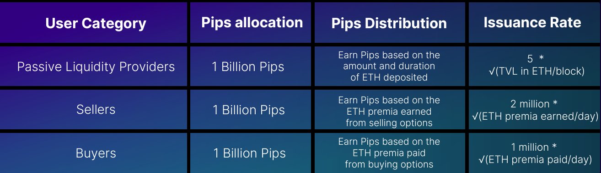
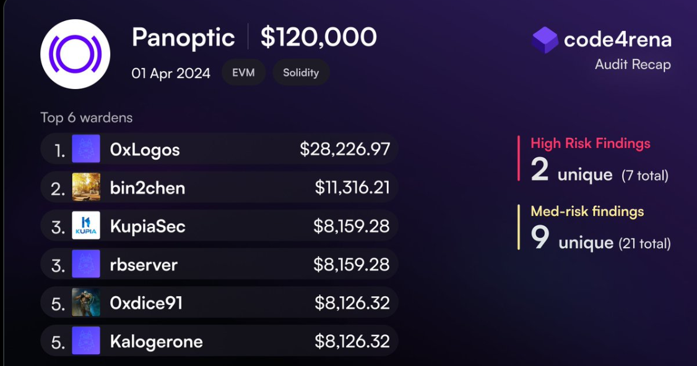
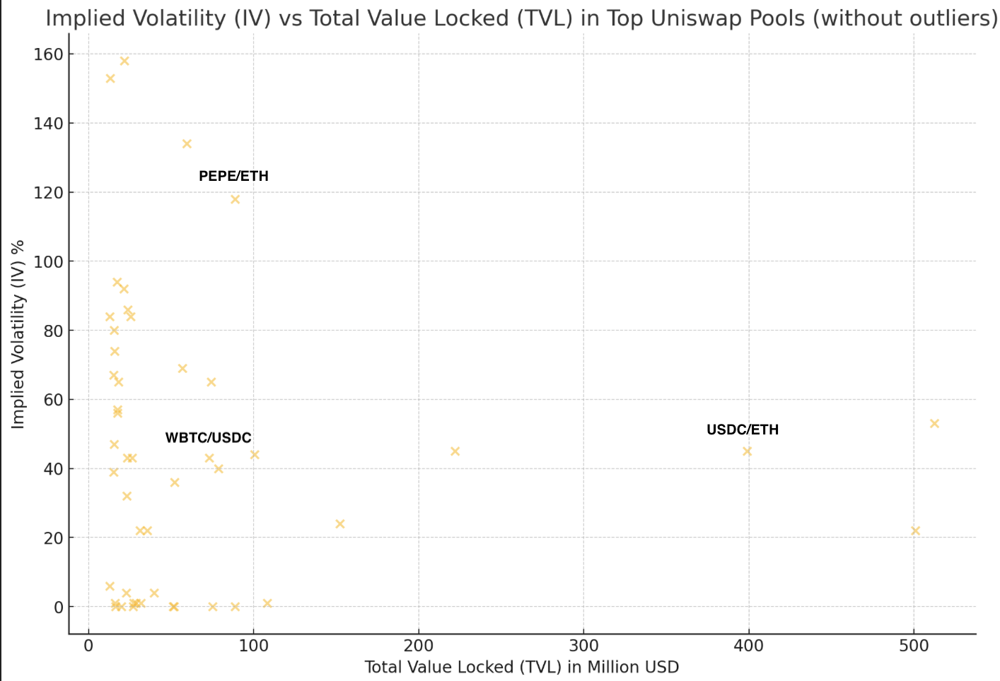
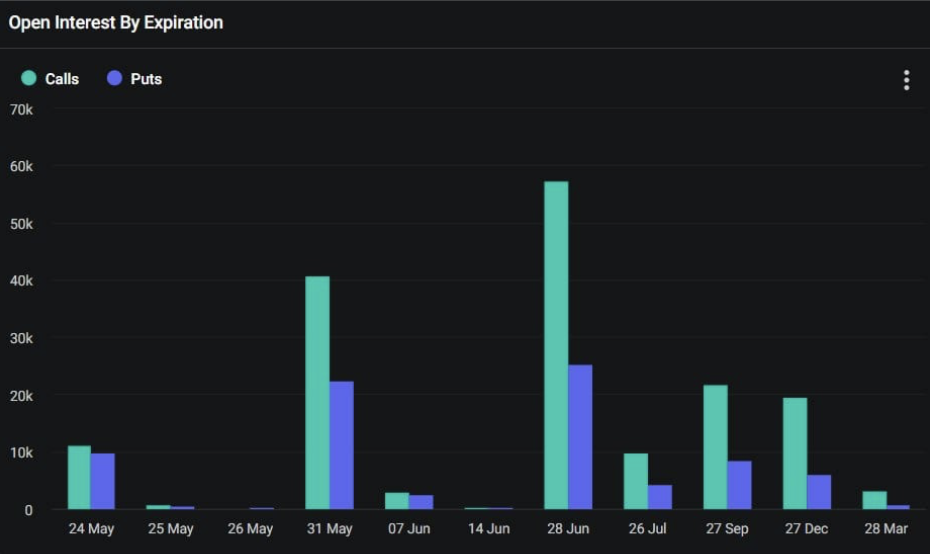
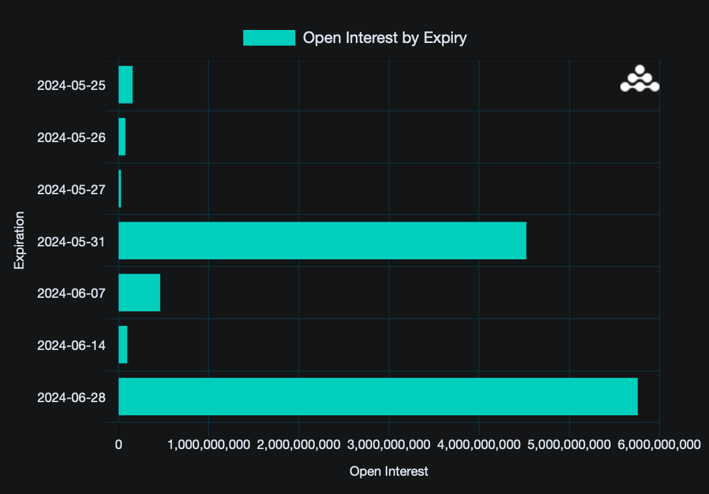

Welcome Panoptimists to the June edition of the Panoptic Newsletter, where we provide industry insights, research recaps, and Panoptic-specific content to keep you updated on our DeFi-native options platform.

  

If you want future newsletters sent directly to your email, signup on our [website](https://panoptic.xyz/).

  

## About Panoptic

Discover the future of trading with Panoptic, your gateway to perpetual options in DeFi. Our cutting-edge platform empowers you to manage risk effectively and trade with unprecedented flexibility. Join us and be part of a secure, decentralized revolution in options trading, tailored for both crypto newcomers and experienced traders.

  

## Panoptic Highlights

### Introducing the Panoptic Incentive Points (Pips) Program

Panoptic is seeking feedback on its points ([Pips](https://t.co/Z3WXrnhGLZ)) program which aims to enhance user engagement, liquidity, and exploration of DeFi options by rewarding users for their participation within the Panoptic ecosystem. Users can earn Pips through passive liquidity provision by depositing ETH and by trading options. The program ensures fair distribution by allocating points across three user categories: Passive Liquidity Providers (PLPs), Options Sellers, and Options Buyers. Early users of Panoptic and Uniswap protocols can receive multiplicative boosts to their Pips earnings, with Panoptic beta testers receiving a 1.75x boost, Uniswap V3 LPs a 1.5x boost, and Uniswap V2 LPs a 1.25x boost. Initially launching on Ethereum mainnet, the Pips Program will feature ETH/USDC and ETH/WBTC markets, with additional markets added over time.

  

A total of three billion Pips will be distributed, with one billion Pips allocated to each user category. The distribution rates are designed to promote liquidity and active participation, with PLPs earning Pips based on the total value locked (TVL) in ETH per block, Options Sellers based on the ETH premia earned, and Options Buyers based on the ETH premia paid. Your feedback on the program is requested. To participate in the discussion, please join us on our Discord [forum](https://discord.gg/eskHUzPw7r). Access is granted upon submitting a short [form](https://forms.gle/5tpR61HmLpgRYoYw5), where you can share your initial ideas.

### Panoptic Discusses Options Model at Columbia DeFi Conference

At The Latest in DeFi Research (TLDR) Conference at Columbia University, Guillaume Lambert presented Panoptic's innovative [approach](https://x.com/Panoptic_xyz/status/1790437529868530034) to repurposing the LP side of CLAMMs as an options clearinghouse. By framing LP positions as equivalent to short put options, Panoptic offers a novel perspective on liquidity provision and derivatives trading in the DeFi space.

### Code4rena Audit Results Are In

After a successful competitive audit hosted on Code4rena from April 1 to April 22, we have our results! Congratulations to 0xLogos for securing first place in the $120,000 Panoptic competitive audit. Full details and the top Wardens can be found [here](https://x.com/code4rena/status/1790146434991522204)!

### Navigating Liquidity on Panoptic

[Liquidity](https://panoptic.xyz/research/navigating-liquidity-in-panoptic) in Panoptic comes from passive and active sources. Passive liquidity providers deposit tokens, earning a percentage of trading volume as options traders leverage their funds. Active liquidity involves option sellers borrowing from passive LPs to create positions in Uniswap v3, mimicking options due to their payoff structures. Users can view liquidity distribution through the liquidity toggle, displaying data on calls and puts across various strike prices and timescales.

  

## Market Overview

### Understanding Uniswap Pools: Extracting Implied Volatility from On-Chain Data

The implied volatility (IV) of Uniswap v3 pools can be [extracted](https://panoptic.xyz/blog/panoptic-newsletter-may-2024#shallow-dive--implied-volatility-iv-from-uniswap-liquidity) from volume and liquidity data. IV reflects the expected movement in an asset's price, and can be calculated from Uniswap v3 liquidity providers by measuring the daily volume and liquidity at the current price in the pool, adjusting for each pool’s fee tier. This approach aligns with the efficient-market hypothesis, suggesting that on-chain IV, separate from traditional financial indicators, can provide a unique perspective on market expectations about asset volatility.

​​

  

The scatter plot above illustrates the relationship between the Total Value Locked (TVL) in millions of USD and the Implied Volatility (IV) percentage for the top Uniswap [pools](https://yewbow-info.vercel.app/#/) on May 31, 2024. Pools range from near-zero IVs, primarily in [stablepools](https://panoptic.xyz/research/stablecoin-pools), to triple digit IVs in memecoin pairs like PEPE/ETH. The IVs of majors ETH/USDC and WBTC/USDC were below 50%, with TVL in ETH/USDC nearly four times larger than that of WBTC/USDC.

  

The correlation between TVL and IV is nearly non-existent, with a correlation coefficient of -0.071, indicating a very weak inverse relationship. The coefficient of determination (R²) of approximately 0.005 suggests that only about 0.5% of the variability in IV can be explained by the TVL. This outcome is expected, and underscores that IV is influenced by a multitude of non-size related factors such as market sentiment, external economic events, and the uncertainties around new technologies.

### Crypto Policy Shift: A Month of Milestones

This week has been monumental for the crypto space with three significant developments: the passing of the FIT21 bill by Congress, the approval of an Ethereum ETF by the SEC, and a House ban on CBDCs that saw a surge in USDC. The FIT21 bill's passage with strong bipartisan support signals a positive policy shift, setting the stage for future crypto regulations. The Ethereum ETF approval marks a dramatic regulatory shift likely to encourage institutional on-chain engagement, and spotlighting potential opportunities for other crypto ETFs. However, non-staking ETFs might reduce direct ecosystem interaction, affecting inflow rates and total value locked (TVL) on chain.

  
  
  

On May 24, 2024, 21,000 contracts of BTC options and 350,000 contracts of ETH options [expired](https://x.com/GreeksLive/status/1793898486305550415), with a put-call ratio of 0.88 for BTC and 0.58 for ETH. The max pain points were $67,000 for BTC and $3,200 for ETH, with notional values of $1.4 billion and $1.3 billion, respectively. The divergence between BTC and ETH market sentiments, inspired by the ETF approval, highlights ETH's bullish outlook. This evolving policy landscape will likely influence trading strategies, making call and put spreads increasingly relevant as traders navigate these changes.

### BTC June Expiration Signals Bullish Sentiment

BTC options show [substantial open interest](https://www.deribit.com/statistics/BTC/options-data) for the June 28 expiry, with a total notional value exceeding $5.7 billion. This includes 57,758 contracts for call options with a notional value of approximately $4 billion and 25,725 contracts for put options totaling nearly $1.8 billion. The put-call ratio, calculated from these figures, stands at approximately 0.445, indicating a significant bullish sentiment in the market. The pronounced skew towards calls suggests that traders are heavily favoring appreciation in BTC's price leading up to this expiration. This positioning underscores a robust market expectation for BTC to gain value in the near term.

  

## Panoptic in the Media

## Spotlights

### Panoptic Awarded Innovation Grant from Uniswap Foundation
We're excited to announce that we've been selected for an innovation grant from the Uniswap Foundation to build a platform for passive liquidity providers and token launchers on Uniswap v4!

<blockquote class="twitter-tweet">
We&#39;re excited to announce that we&#39;ve been selected for an innovation grant from the Uniswap Foundation!  Join us for the <a href="https://twitter.com/UniswapFND?ref_src=twsrc%5Etfw">@UniswapFND</a> community call on May 30 where we&#39;ll be announcing our new initiative. <a href="https://t.co/L9HWnqDSNP">https://t.co/L9HWnqDSNP</a>
&mdash; Panoptic (@Panoptic_xyz) <a href="https://twitter.com/Panoptic_xyz/status/1795551626553614336?ref_src=twsrc%5Etfw">May 28, 2024</a></blockquote> 

### Taking DeFi Options to the Next Level

Panoptic is designed to overcome existing on-chain option protocols' technical limitations and obstacles.

<blockquote class="twitter-tweet">
1/ Introducing Panoptic Protocol: Taking <a href="https://twitter.com/hashtag/DeFi?src=hash&amp;ref_src=twsrc%5Etfw">#DeFi</a> Options to the Next Level<a href="https://twitter.com/Panoptic_xyz?ref_src=twsrc%5Etfw">@Panoptic_xyz</a> is a novel <a href="https://twitter.com/hashtag/Ethereum?src=hash&amp;ref_src=twsrc%5Etfw">#Ethereum</a> blockchain-based perpetual options protocol designed to overcome existing on-chain option protocols&#39; technical limitations and obstacles. Read on below🧵 <a href="https://t.co/GbyutvXKzN">pic.twitter.com/GbyutvXKzN</a>
&mdash; Bing Ventures ✈️ Consensus2024 (@BingVentures) <a href="https://twitter.com/BingVentures/status/1795999753647599683?ref_src=twsrc%5Etfw">May 30, 2024</a></blockquote> 

### DeFi Researcher Highlights Panoptic in Emerging Narratives Piece

DeFi Saint highlights Panoptic as a key player in the emerging Liquidity Provider DeFi (LPDFI) narrative. Panoptic allows options sellers and buyers to access deep liquidity via Uniswap, solving the chicken-and-egg problem.

<blockquote class="twitter-tweet">
🐔 Crypto options have a chicken-and-egg dilemma:  ➡️ Without sellers, there can&#39;t be any buyers ➡️ Without buyers, no one will want to sell ​ Here&#39;s how we&#39;re solving the issue 👇  By using <a href="https://twitter.com/Uniswap?ref_src=twsrc%5Etfw">@Uniswap</a> to bootstrap our options prices and premia, sellers can earn premia without…
&mdash; Panoptic (@Panoptic_xyz) <a href="https://twitter.com/Panoptic_xyz/status/1795863360376025240?ref_src=twsrc%5Etfw">May 29, 2024</a></blockquote>  

  

## Up Next

Panoptic will be launching on Ethereum mainnet followed by EVM-compatible chains this summer. Subscribe so you don’t miss any future announcements!

*Join the growing community of Panoptimists and be the first to hear our latest updates by following us on our [social media platforms](https://links.panoptic.xyz/all). To learn more about Panoptic and all things DeFi options, check out our [docs](https://panoptic.xyz/docs/intro) and head to our [website](https://panoptic.xyz/).*
