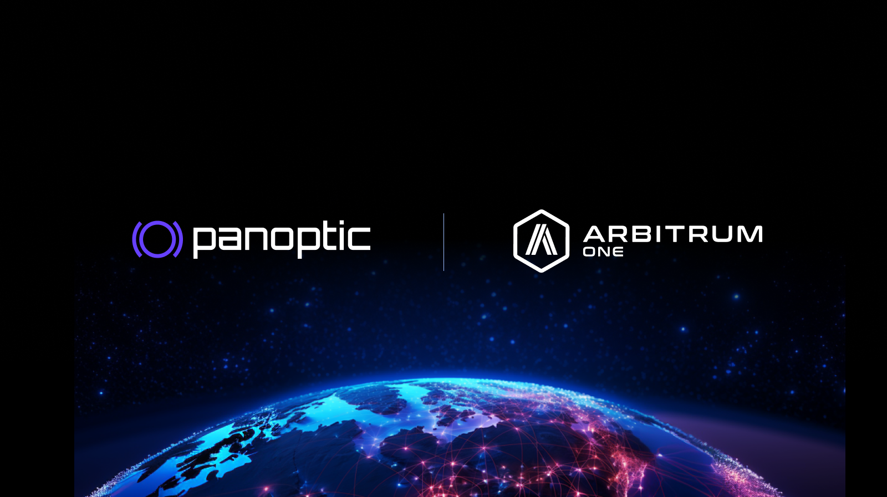

Panoptic is excited to announce that we have been awarded a grant as part of the [Arbitrum Foundation Grant Program](https://arbitrum.foundation/grants). The grant acknowledges our persistent endeavors in DeFi, and Arbitrum’s endorsement marks a significant milestone in our journey.

## About Arbitrum

[Arbitrum](https://docs.arbitrum.io/welcome/arbitrum-gentle-introduction) is a layer-two solution designed to enhance Ethereum's capabilities. Utilizing optimistic rollups, it significantly boosts transaction speed, scalability, and cost-efficiency while inheriting Ethereum-level security. Arbitrum enables users to interact with the Ethereum ecosystem, from deploying smart contracts to using Web3 applications, offering faster and more affordable transactions.

## About Panoptic

[Panoptic](https://panoptic.xyz) is a DeFi-native, permissionless options protocol. Our protocol supports options trading on any token, with any strike price, and in any size, featuring perpetual options that never expire.

  

Key benefits of Panoptic include:

-   Opening options and perp markets for a wide range of DeFi assets
    
-   Reviving passive, single-sided liquidity provision without the risk of impermanent loss
    
-   Boosting returns for Uniswap liquidity providers through new income streams
    

  

We would like to thank the Arbitrum Foundation for selecting us for this grant with which we will bring permissionless options, perps, and passive liquidity provision to Arbitrum.

  

We are excited to have the Arbitrum Foundation’s support in providing traders and liquidity providers with efficient and versatile trading opportunities. We look forward to contributing to the Arbitrum ecosystem and keep pushing the boundaries of what's possible in DeFi.

  
*Join the growing community of Panoptimists and be the first to hear our latest updates by following us on our [social media platforms](https://links.panoptic.xyz/all). To learn more about Panoptic and all things DeFi options, check out our [docs](https://panoptic.xyz/docs/intro) and head to our [website](https://panoptic.xyz/).*