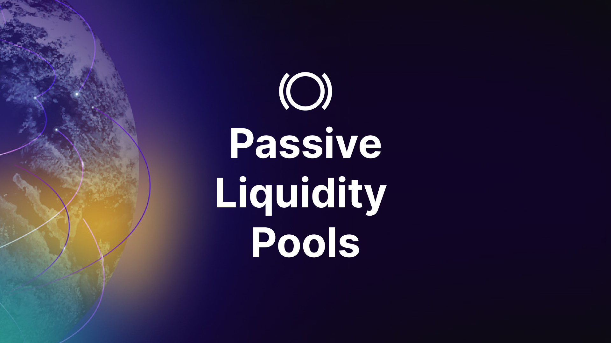
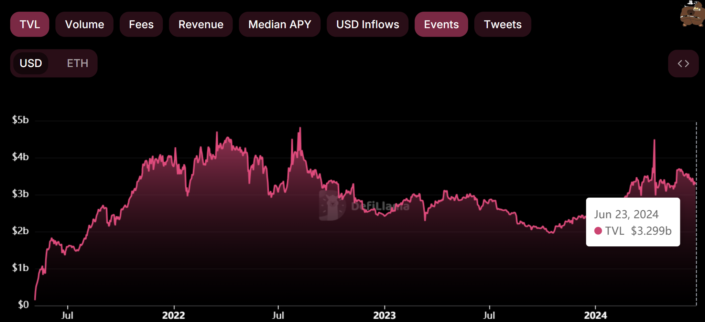
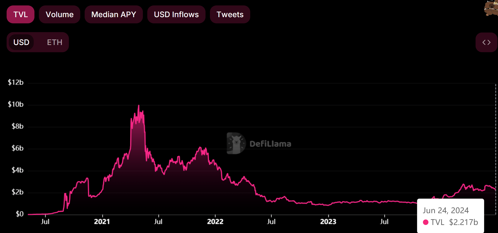
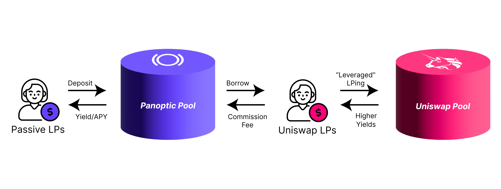

With the release of Uniswap V3, many liquidity providers (LPs) moved their positions from V2 to V3. The concentrated liquidity model of V3 offers increased yield potential, making it more attractive. However, some LPs prefer to stay on V2 because V3 positions require more active management.

Panoptic aims to offer the best of both worlds with its passive liquidity pools. Naturally, LPs might ask how exactly Panoptic achieves this.

### Questions We’ll Answer

-   What are the advantages of Uniswap V3?
    
-   Why do some LPs prefer Uniswap V2 over V3?
    
-   How can LPs get the best of both?
    
-   What are Panoptic’s passive liquidity pools?
    

## Advantages of Uniswap V3

Uniswap V3 offers significant advantages over V2. The most significant change in V3 allowed LPs to concentrate their capital within specific price ranges. This improved capital efficiency has led to Uniswap V3 becoming the most [popular](https://defillama.com/protocol/uniswap-v3#information) decentralized exchange (DEX).

LPs can earn significantly more fees with the same amount of capital compared to V2 due to liquidity being concentrated within their chosen price range. LPs in Uniswap V3 have more control over their risk-reward profile and can customize their positions to match their market views and risk tolerance.

## Why Some LPs Prefer Uniswap V2 over V3

While Uniswap V3 introduces powerful features for LPs, V2 retains a [strong appeal](https://defillama.com/protocol/uniswap-v2#information) due to its simplicity. Unlike V3, V2 pools only allow for full-range liquidity which covers the entire price range. This minimizes the need for active management or monitoring of LP positions since LPs don't have to worry about their liquidity going out-of-range.

Uniswap V2, being full-range by default, makes it easier for LPs to participate and for token launchers to bootstrap new pools. V2 pools are an attractive option for LPs who prefer a set-and-forget approach to providing liquidity.

## Passive Liquidity is the Solution

A perfect liquidity platform would minimize the need for active management and monitoring of positions (such as in Uniswap V2) while efficiently providing liquidity for traders (such as in Uniswap V3).

Panoptic’s passive liquidity pools are the ideal solution for LPs. Let's explore how they combine the best of both Uniswap V2 and V3.

## Exploring Passive Liquidity Pools

Passive liquidity pools promote an easy and efficient way to provide liquidity. These pools ensure that provided liquidity cannot be deployed anywhere besides Uniswap.

Passive liquidity pools achieve passive yield in two ways:

1.  Active LPs can shift liquidity from the passive pool into specific Uniswap pool price ranges, paying a fixed fee to passive LPs.
    
2.  Traders who want to buy options can take the other side by borrowing LP tokens from active LPs in Uniswap. The LP tokens are burned and the underlying assets are returned to Panoptic’s passive liquidity pool. These traders also pay a fixed fee to passive LPs for doing so.

This continuous cycle of liquidity moving to and from Uniswap generates income for passive LPs. The fee paid to passive LPs is proportional to the amount of liquidity moved, so that larger positions and more frequent movement increases the yield earned by passive LPs.  

Passive liquidity pools are a great option for LPs seeking to earn passively and efficiently in the Uniswap Ecosystem.

## Advantages of Passive Liquidity Pools

Passive liquidity pools offer four clear advantages:

1. Active LP Fees: By supporting active LPs with capital to deploy into specific price ranges on Uniswap V3, the passive pool earns fees from active LPs.
    
2. Option Buyer Fees: Option buyers who borrow LP tokens provide another income stream for the passive pool.
    
3. Streamlined Liquidity Provisioning: Passive pools simplify the complex process of managing concentrated liquidity positions on Uniswap V3.
    
4. Passive  Income  Focus: LPs are provided with passive yield opportunities, making it attractive for investors who want to earn without the hassles of active management.
 
  
*Join the growing community of Panoptimists and be the first to hear our latest updates by following us on our [social media platforms](https://links.panoptic.xyz/all). To learn more about Panoptic and all things DeFi options, check out our [docs](https://panoptic.xyz/docs/intro) and head to our [website](https://panoptic.xyz/).*
