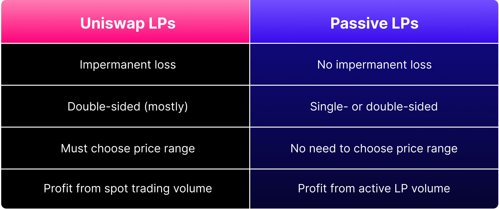
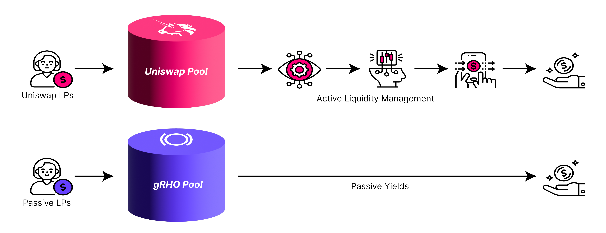
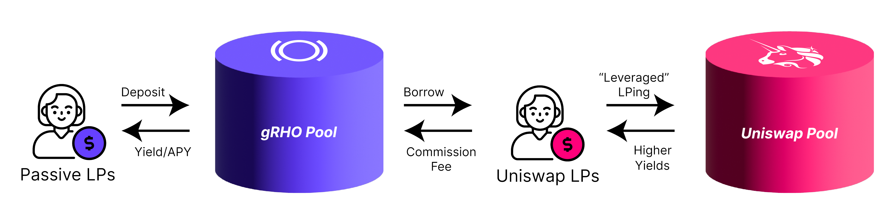

  

_Panoptic is thrilled to announce our selection as a grant recipient by the [Uniswap Foundation](https://www.uniswapfoundation.org/). This grant will go toward a platform to ‘grow’ your portfolio by providing passive liquidity on Uniswap v4, the [upcoming iteration](https://x.com/UniswapFND/status/1758146187318669666) of the Uniswap Protocol._

## The gRHO Platform

The gRHO platform (pronounced "grow") is an open-source, forkable interface for passive liquidity providers (LPs) and token launchers on Uniswap v4. The name "gRHO" reflects its purpose of providing LPs with an opportunity to earn interest, as "rho" is the options Greek related to interest rates.

The platform will simplify LPing for everyone, allowing users to earn yield passively. It will also aid token launchers in creating pools, bootstrapping markets, and managing liquidity for their token.

>_"We are thrilled to support Panoptic in their mission to revolutionize liquidity provisioning on Uniswap with the ‘gRHO’ platform,"_ says Aaron Lamphere, Grants Lead at the Uniswap Foundation.
>  
>_"This grant represents our commitment to fostering innovation and simplifying the user experience for liquidity providers. By enabling passive liquidity provision, Panoptic’s open-source gRHO platform will open new doors for LPs, making DeFi more accessible and rewarding for everyone involved."_

<!-- For more details about the gRHO platform and Uniswap Foundation grant, check out our full proposal. -->

## Bringing Passive LP to Uniswap

The gRHO platform will bring passive LPing to Uniswap. This is an easier way to LP than on Uniswap v2 and v3 with no impermanent loss.

LPs on Uniswap v3 must actively create and manage their LP position. The amount of choices and monitoring that is required to earn yield and avoid losses is overwhelming for many LPs. For example, active LPs on Uniswap v3 must deposit the correct ratio of two tokens, choose a price range, monitor their position to ensure it stays in range, and rebalance when going out of range if they want to earn yield. When faced with so many choices and upkeep, LPs are discouraged from contributing their liquidity.

Passive LPs will be able to earn without the hassles faced by active LPs. Passive LPing is easy: users deposit single-sidedly without having to select a price range, rebalance their positions, or suffer impermanent loss. Passive LPs will no longer have to deal with the intricacies of how to successfully deploy liquidity. Passive liquidity is made available for active LPs to borrow and create positions in Uniswap v4, for which passive LPs are compensated.

It may never be possible to satisfy both active and passive LPs. Each one is a very clear use case of automated market makers (AMMs) and requires distinct ways of participation. The gRHO platform will bring passive liquidity back to Uniswap v4.

## About the Uniswap Foundation

The Uniswap Foundation is committed to fostering an open, equitable, and decentralized financial (DeFi) landscape. The Uniswap Foundation's mission includes supporting the expansion and evolution of the DeFi ecosystem, encouraging inventive solutions and achievements within DeFi, and promoting responsible management and development of DeFi projects.

## About Panoptic

Panoptic is pioneering the next frontier in DeFi with its groundbreaking options protocol, empowering users to seamlessly engage in permissionless on-chain options trading on any token, any strike, and any size. Panoptic aspires to create a governance-minimized protocol that eliminates liquidity fragmentation, ensuring a seamless trading experience for all.

>_"We are immensely grateful to receive this grant from the Uniswap Foundation. This grant not only fuels our 'gRHO' platform but also reaffirms our commitment to making DeFi more accessible for everyone,"_ says Guillaume Lambert, CEO and founder of Panoptic.
>
>_"With work supported by a grant from the Uniswap Foundation, we are set to revolutionize the way liquidity is provided by bringing passive liquidity provisioning back to Uniswap through what we call active-passive LP separation. The gRHO platform is making it simpler for passive users to earn yield while rewarding more sophisticated users that want to actively manage their positions."_

Built on top of Uniswap, the largest decentralized exchange, Panoptic is honored to be the recipient of this grant, propelling its mission to redefine the boundaries of DeFi.

*Join the growing community of Panoptimists and be the first to hear our latest updates by following us on our [social media platforms](https://links.panoptic.xyz/all). To learn more about Panoptic and all things DeFi options, check out our [docs](https://panoptic.xyz/docs/intro) and head to our [website](https://panoptic.xyz/).*
