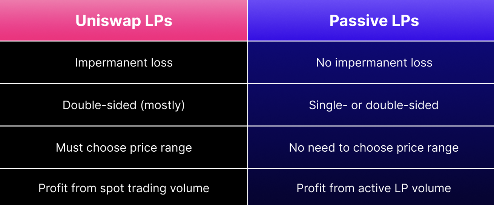
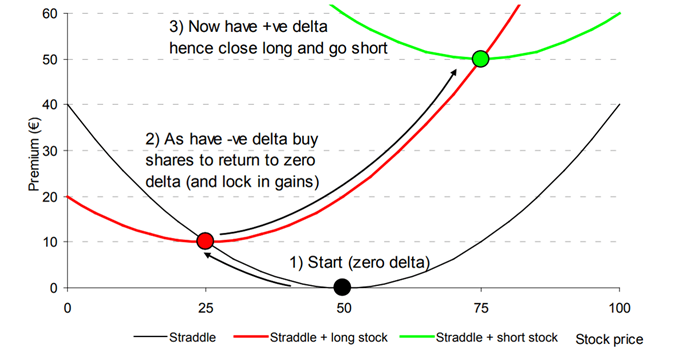
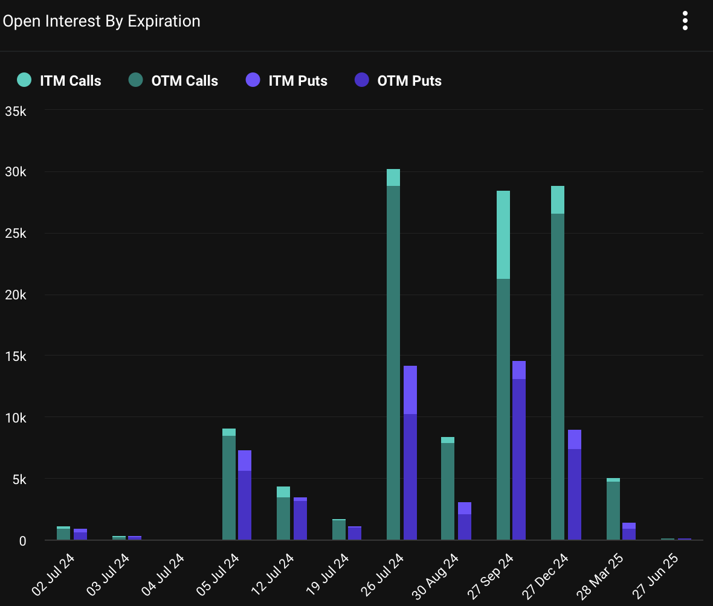
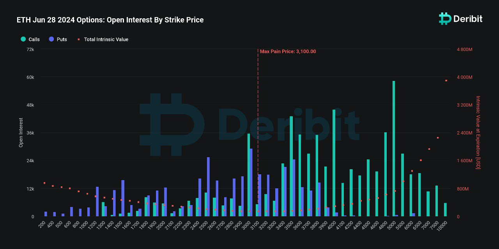
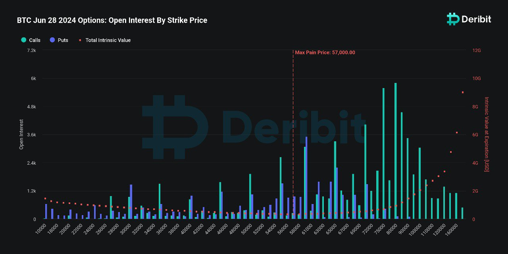

Welcome Panoptimists to the July edition of the Panoptic Newsletter, where we provide industry insights, research recaps, and Panoptic-specific content to keep you updated on our DeFi-native options platform.
 

If you want future newsletters sent directly to your email, signup on our [website](https://panoptic.xyz/).  

## About Panoptic

Discover the future of trading with Panoptic, your gateway to perpetual options in DeFi. Our cutting-edge platform empowers you to manage risk effectively and trade with unprecedented flexibility. Join us and be part of a secure, decentralized revolution in options trading, tailored for both crypto newcomers and experienced traders.

## Panoptic Highlights

### Panoptic Awarded Grant from Uniswap Foundation for ‘gRHO’ platform

Panoptic is excited to announce that we have been awarded an innovation [grant](https://panoptic.xyz/blog/panoptic-awarded-uniswap-foundation-grant) by the Uniswap Foundation to develop the gRHO platform. This funding will drive the creation of a user-friendly interface for passive liquidity providers (LPs) on Uniswap v4. The gRHO platform (pronounced "grow") is designed to streamline liquidity provisioning, enabling LPs to earn interest effortlessly. By simplifying the process and reducing the complexities associated with active LPing, gRHO aims to make DeFi more accessible and rewarding.

  
The gRHO platform is a game-changer for passive LPs, allowing them to provide liquidity without the need to manage their positions actively. This contrasts sharply with the current challenges faced by active LPs on Uniswap v3, who must monitor and adjust their positions continuously to avoid losses and maximize yield. gRHO eliminates these hurdles by enabling single-sided deposits, removing the need for price range selection, rebalancing, and mitigating impermanent loss. This passive liquidity can then be utilized by active LPs to create positions, fostering a more efficient DeFi ecosystem. With the support of the Uniswap Foundation, Panoptic is poised to revolutionize liquidity provisioning and make DeFi participation more straightforward and beneficial for all users.

  

### Panoptic Publishes Audit Reports from Leading Security Firms

  

Panoptic has undergone extensive economic and security reviews [conducted](https://panoptic.xyz/docs/security/security_audits) by leading firms. Smart contract audits include comprehensive reviews by Code4rena, Trail of Bits, OpenZeppelin, and ABDK, with the latest Code4rena audit concluding on June 10, 2024, revealing no High or Medium severity issues. Stay tuned for our upcoming bug bounty program!

  

### Panoptic Awarded Grant from Arbitrum Foundation

  

Panoptic is thrilled to share that we have received a [grant](https://panoptic.xyz/blog/panoptic-awarded-arbitrum-foundation-grant) from the Arbitrum Foundation Grant Program, marking a significant milestone in our DeFi journey. This grant endorses our efforts to innovate in the space, supporting our mission to bring permissionless options, perps, and passive liquidity provisioning to Arbitrum. With Arbitrum's advanced layer-two solutions enhancing scalability and transaction efficiency, Panoptic is poised to offer traders and liquidity providers more efficient and versatile trading opportunities. We are eager to contribute to the Arbitrum ecosystem and continue pushing the boundaries of decentralized finance.

  

### Gamma Scalping Deep-Dive

  

Gamma scalping, a vital [technique](https://panoptic.xyz/research/gamma-scalping) for options market makers, is designed to leverage market volatility by buying gamma while continuously delta-hedging. This strategy allows traders to profit from choppy, whipsawing market conditions. By maintaining delta neutrality, gamma scalpers can capitalize on short-term price movements of the underlying asset. When the price rises, they sell the underlying asset, and when it falls, they buy it back. This contrarian approach enables them to lock in profits through repeated buying low and selling high, effectively offsetting theta decay—the time value loss of options. Successful gamma scalping hinges on the sufficient price action of the underlying asset to counterbalance the premium costs and theta decay.

  

  
  

In the Panoptic context, gamma scalping adapts to the unique dynamics of DeFi. Panoptions introduce the concept of "rangeness" to replace traditional moneyness, where premia (streamia) is paid only when an option is in-range. This innovative mechanism allows for tailored gamma exposure and dynamic hedging using perps. A prospective gamma scalper on Panoptic would benefit from a scenario where the underlying asset starts in-range and eventually moves out-of-range, maximizing the convexity of the payoff curve. This approach not only highlights the flexibility and potential of gamma scalping in decentralized finance but also underscores its ability to harness realized volatility for substantial gains.

  

  

## Market Overview

  

### Volatility Persists Amid Market Uncertainty with Major December 27 Expiration

  

Over the past month, significant market [volatility](https://www.deribit.com/statistics/BTC/metrics/options) has been driven by the movement of seized BTC and the approaching Mt. Gox distribution. Despite these jitters, over [85,000](https://x.com/DeribitInsights/status/1806991210210295899) December and March ‘25 call option contracts were purchased, indicating a bullish sentiment. Bitcoin's price challenged the $60,000 mark, yet implied volatilities (IVs) continue to drift lower. Notably, for the December 27, 2024 expiration, there is substantial open interest with ITM calls totaling 2,263.8 contracts valued at $142.6 million, while OTM calls dominate with 26,606 contracts worth $1.68 billion. ITM and OTM puts also show significant activity, contributing to a total notional value of $2.39 billion for this expiration, underscoring the intense market activity amid ongoing volatility.

  
  
  

  

### $10 Billion of Crypto Options Expired on June 28

  

The highly [anticipated](https://x.com/GreeksLive/status/1806594061580804259) crypto options expiry event on June 28 saw over $10 billion in BTC and ETH options contracts come to a close, marking a significant milestone in the derivatives market. With ~108,000 BTC options contracts and 1.04 million ETH options contracts expiring, the market faced a put-call ratio of 0.50 and 0.59, respectively, and a max pain point of $57,000 for BTC and $3,100 for ETH. Despite the bearish sentiment leading up to the expiry, where both BTC and ETH prices hovered near their max pain points, the actual event resulted in a positive market shift. Bitcoin's price surged by $3,000 since June 28. The lack of significant rise in implied volatility (IV), with BTC below 50% and ETH below 60% for all major terms, suggests that the market absorbed the expirations without excessive turbulence.

  

  

  

  

The market's resilience during this volatile period indicates strong underlying support, especially with over 25% of the expiring options being profitable, amounting to more than $2.7 billion of notional value. This optimism is further fueled by the anticipation of ETH ETF trading set to launch in early July, which is expected to drive bullish momentum. Additionally, traders have noted higher premiums on near-term and long-term call options compared to puts, reflecting a positive outlook. As the ETH ETF news becomes clearer next month, IV is predicted to face downward pressure, making it an opportune time for investors to consider call options while volatility remains low. The overall sentiment in the crypto market is cautiously optimistic, with traders eyeing potential price gains for BTC by mid-July and ETH by early July.

  

  

## Panoptic in the Media

  

## Spotlights

  

### Uniswap Foundation Highlights Panoptic in Grant Announcement

  

Panoptic has been awarded an innovation grant by the Uniswap Foundation to develop the gRHO platform. This new interface will simplify passive liquidity provision on Uniswap v4, making it easier for users to grow their portfolios without the complexities of active management.

<blockquote class="twitter-tweet">
🎊 Announcing $379,000 Grant to <a href="https://twitter.com/Panoptic_xyz?ref_src=twsrc%5Etfw">@Panoptic_xyz</a> for the gRHO Platform!  We are thrilled to announce our latest grant allocation to Panoptic for the development of a v4 Liquidity Interface: the gRHO platform, intended to simplify passive liquidity provision on Uniswap v4. <a href="https://t.co/ubUrrWFabw">https://t.co/ubUrrWFabw</a>
&mdash; Uniswap Foundation (@UniswapFND) <a href="https://twitter.com/UniswapFND/status/1807845457881976961?ref_src=twsrc%5Etfw">July 1, 2024</a></blockquote> 

### Panoptic Incentive Points (Pips) Program FAQs

Thank you for the incredible response to our new Panoptic Incentive Points (Pips) program. Here are answers to some of the most commonly asked questions we've received!

<blockquote class="twitter-tweet">
We&#39;re grateful for the responses to our newly introduced Panoptic incentive points (Pips) program.  Here&#39;s some of the most commonly asked questions we&#39;ve received 👇
&mdash; Panoptic (@Panoptic_xyz) <a href="https://twitter.com/Panoptic_xyz/status/1800647196397777369?ref_src=twsrc%5Etfw">June 11, 2024</a></blockquote> 

### Podcast Deep Dive on Panoptic

Our very own [Brandon Ly](https://twitter.com/brandonly1000) joins [thefett](https://www.youtube.com/@themandalore9) to discuss Panoptic’s upcoming launch. Learn how we’re leveraging Uniswap’s liquidity for dynamic pricing, eliminating the need for external oracles. Check out the whiteboard deep dive [here](https://t.co/vvV81ODzTw)! 
<iframe width="560" height="315" src="https://www.youtube.com/embed/iOqGjZQPwEI?si=6EiaSN8gnO6r5S72" title="YouTube video player" frameborder="0" allow="accelerometer; autoplay; clipboard-write; encrypted-media; gyroscope; picture-in-picture; web-share" referrerpolicy="strict-origin-when-cross-origin" allowfullscreen></iframe>

  

  

## Up Next

  

Panoptic is headed to Brussels for EthCC! We will be hosting a special, invite-only side event—Bytes & Brews: Liquidity Hour—with Spearbit and L1D. Seats are limited, so reach out to our Head of BD, [Isabela Bagi](http://linkedin.com/in/isabela-bagi-4b868b100), for an invite or to connect with the team.

  

Panoptic will be launching on Ethereum mainnet followed by EVM-compatible chains this summer. Subscribe so you don’t miss any future announcements!

  
  

*Join the growing community of Panoptimists and be the first to hear our latest updates by following us on our [social media platforms](https://links.panoptic.xyz/all). To learn more about Panoptic and all things DeFi options, check out our [docs](https://panoptic.xyz/docs/intro) and head to our [website](https://panoptic.xyz/).*
