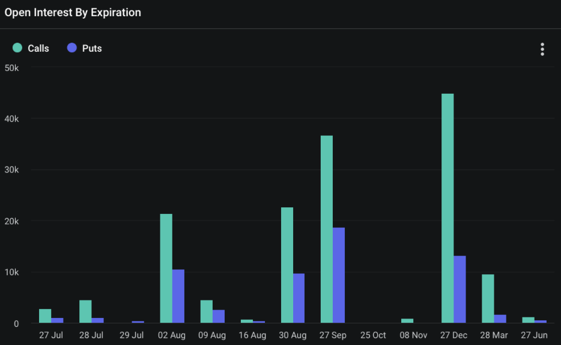

Welcome Panoptimists to the August edition of the Panoptic Newsletter, where we provide industry insights, research recaps, and Panoptic-specific content to keep you updated on our DeFi-native options platform.

If you want future newsletters sent directly to your email, signup on our [website](https://panoptic.xyz/).
 

## About Panoptic

Discover the future of trading with Panoptic, your gateway to perpetual options in DeFi. Our cutting-edge platform empowers you to manage risk effectively and trade with unprecedented flexibility. Join us and be part of a secure, decentralized revolution in options trading, tailored for both crypto newcomers and experienced traders.

## Panoptic Highlights

### Panoptic at EthCC

A huge thank you to our co-hosts Spearbit and L1D and everyone who attended our Bytes & Brews event at EthCC in Brussels. It was fantastic meeting so many builders and users in the space! We're excited to connect with more innovators at the upcoming Token2049 conference in Singapore and Permissionless conference in Salt Lake City.

### From CEX to DEX: How Decentralization is Revolutionizing Options

In the evolving [landscape](https://panoptic.xyz/research/from-centralized-to-decentralized-exchanges-options-pricing) of cryptocurrency trading, the shift from centralized exchanges (CEX) like Binance and Coinbase to decentralized exchanges (DEX) such as Uniswap is reshaping the options market. CEXs offer deep liquidity, user-friendly interfaces, and various order types, but users face custodial risks and potential security vulnerabilities. Market maker activities on CEXs can also lead to concerns about front-running. In contrast, DEXs operate on a permissionless basis, allowing users to retain full control over their assets and enable instant token listings. However, DEXs often encounter challenges in achieving consistent liquidity.

The transformation brought by DEXs is evident in their use of Automated Market Makers (AMMs) to facilitate trading. Unlike CEXs, which rely on order books, DEXs like Uniswap use AMMs where prices are determined by a formula based on the ratio of assets in liquidity pools. This model allows for continuous price updates and instant trading without centralized oversight. Additionally, Panoptic’s innovative options pricing on Uniswap introduces a perpetual model without expiration dates, providing continuous liquidity and flexibility. This approach not only mitigates risks of market manipulation but also aligns with the decentralized ethos, enhancing the efficiency and accessibility of options trading in the DeFi ecosystem.

### Harnessing Volatility: A Deep Dive into Reverse Gamma Scalping in DeFi

In the world of decentralized finance (DeFi), Panoptic's perpetual options offer unique opportunities for market makers through strategies like [reverse gamma scalping](https://panoptic.xyz/research/reverse-gamma-scalping). This approach involves selling gamma, typically by shorting an at-the-money (ATM) straddle, while continuously hedging the delta to mitigate risks. The goal is to profit from theta decay, particularly when implied volatility (IV) exceeds realized volatility (RV), known as the Variance Risk Premium (VRP). This strategy is effective in stable market conditions, where price movements are minimal, allowing for steady yield generation.

Reverse gamma scalping on Panoptic leverages Uniswap's liquidity pools. By selling perpetual straddles on tokens expected to remain within a specific price range, market makers can capitalize on the consistent collection of fees from theta decay. This strategy, however, requires continuous rebalancing to maintain delta neutrality, which can ironically increase realized volatility. Despite the inherent risks, including negative convexity, Panoptic incentivizes liquidity providers and option sellers with supplemental earnings from a liquidity spread, enhancing the profitability of this nuanced DeFi strategy. This ongoing analysis will further explore the intersection of traditional options strategies and DeFi innovations in upcoming research pieces.

### Upcoming Deep Dives

Stay [tuned](https://panoptic.xyz/research) for more AMM and option related deep dives. Upcoming articles will feature topics such as a new formula for implied volatility in DeFi and solving loss-versus-rebalancing (LVR).

## Market Overview

### Volatility Persists Amid Market Uncertainty with Major December 27 Expiration

The December 27 expiration date for BTC options is [significant](https://metrics.deribit.com/options/BTC), with 45,004 calls worth over $3.19 billion and 13,224 puts worth over $937 million, totaling nearly $4.13 billion in notional value. The put-call ratio of 0.29 indicates an extremely strong bullish sentiment among traders.

### August 2 Expiration: Bullish Sentiment Dominates

On August 2, a substantial amount of 7,235 BTC options expired. The max pain point was initially expected to be $66,000, but this changed as market sentiment dove and equities simultaneously tanked. The BTC price on August 2 was ~$63K.

The put-call ratio was approximately 0.91, indicating a slight bearish sentiment among traders. Specifically, there were 3,793 calls and 3,442 puts. The notional value for calls stood at over $256 million, while puts totaled over $232 million. This significant volume of nearly $490 million in expiring options underscored the potential for notable market movement and volatility on this date.

The recent underperformance of US stocks, combined with risks of war escalation, delayed rate cuts, and general uneasiness, contributed to the market's uncertain outlook. As of now, there are no positive catalysts sufficient to support the market, and it may have to wait another month or two for more stability.

## Panoptic in the Media

## Spotlights

### Twitter Space with Stryke, Kwenta, and Panoptic

The Twitter Space hosted by TastyCrypto with Stryke, Kwenta, and Panoptic was an insightful conversation discussing derivatives, on-chain options, and American vs. European options.

<blockquote class="twitter-tweet">
THE COUNTDOWN IS ON 🍒   Going live with <a href="https://twitter.com/stryke_xyz?ref_src=twsrc%5Etfw">@stryke_xyz</a>, <a href="https://twitter.com/Kwenta_io?ref_src=twsrc%5Etfw">@Kwenta_io</a>, and <a href="https://twitter.com/Panoptic_xyz?ref_src=twsrc%5Etfw">@Panoptic_xyz</a> at 10:30 am CST on the 12th!   Set your reminders, we’ll see you there👇🏻<a href="https://t.co/VkSQ99jIo3">https://t.co/VkSQ99jIo3</a> <a href="https://t.co/e0ZzGRbgpO">pic.twitter.com/e0ZzGRbgpO</a>
&mdash; tastycrypto (@tastycrypto) <a href="https://twitter.com/tastycrypto/status/1810735545909399564?ref_src=twsrc%5Etfw">July 9, 2024</a></blockquote> 

### From Small Grant to Major Impact: Panoptic's Journey with Uniswap Grants

A small grant from Uniswap was the catalyst for Guillaume Lambert to create Panoptic, an application that significantly enhances liquidity provision on Uniswap. Today, we are proud to continue developing public goods that support and empower the broader LP community.

<blockquote class="twitter-tweet">
Even before I co-founded the <a href="https://twitter.com/UniswapFND?ref_src=twsrc%5Etfw">@UniswapFND</a>, <a href="https://twitter.com/guil_lambert?ref_src=twsrc%5Etfw">@guil_lambert</a> &amp; <a href="https://twitter.com/Panoptic_xyz?ref_src=twsrc%5Etfw">@Panoptic_xyz</a> has been one of the main success stories I will talk about when I talk about Uniswap grants   A small grant to Guillaume from <a href="https://twitter.com/nkennethk?ref_src=twsrc%5Etfw">@nkennethk</a> a few years ago led to him founding <a href="https://twitter.com/Panoptic_xyz?ref_src=twsrc%5Etfw">@Panoptic_xyz</a>, an app facilitating… <a href="https://t.co/C7EV4pIOSt">https://t.co/C7EV4pIOSt</a>
&mdash; Devin Walsh (@devinawalsh) <a href="https://twitter.com/devinawalsh/status/1811756545077555590?ref_src=twsrc%5Etfw">July 12, 2024</a></blockquote> 

### Panoptic Redefines DeFi Options with Innovative Approach

In a recent Twitter thread, we highlighted the limitations of traditional options in DeFi, emphasizing the need for complex off-chain infrastructure and higher costs. They showcased how Panoptic’s perpetual options offer seamless integration, lower costs, and increased flexibility without expirations. Additionally, Panoptic’s approach eliminates the risks of front-running and the need for market makers and oracles, enabling options trading on any token.

<blockquote class="twitter-tweet">
In Panoptic, we DON&#39;T use traditional option pricing 🌟✨  Why?   <a href="https://twitter.com/hashtag/Blockchain?src=hash&amp;ref_src=twsrc%5Etfw">#Blockchain</a> <a href="https://twitter.com/hashtag/DeFi?src=hash&amp;ref_src=twsrc%5Etfw">#DeFi</a> <a href="https://twitter.com/hashtag/Options?src=hash&amp;ref_src=twsrc%5Etfw">#Options</a> <a href="https://twitter.com/hashtag/CryptoRevolution?src=hash&amp;ref_src=twsrc%5Etfw">#CryptoRevolution</a> <a href="https://twitter.com/hashtag/Trading?src=hash&amp;ref_src=twsrc%5Etfw">#Trading</a> <a href="https://t.co/v4SH7n88qH">pic.twitter.com/v4SH7n88qH</a>
&mdash; Panoptic (@Panoptic_xyz) <a href="https://twitter.com/Panoptic_xyz/status/1813984136320917929?ref_src=twsrc%5Etfw">July 18, 2024</a></blockquote> 

  

## Up Next

The Panoptic team will be in Quebec this month for their annual meetup enjoying some Canadian pastimes. Panoptic will be launching on Ethereum mainnet followed by EVM-compatible chains this summer. Subscribe so you don’t miss any future announcements!

  
*Join the growing community of Panoptimists and be the first to hear our latest updates by following us on our [social media platforms](https://links.panoptic.xyz/all). To learn more about Panoptic and all things DeFi options, check out our [docs](https://panoptic.xyz/docs/intro) and head to our [website](https://panoptic.xyz/).*
