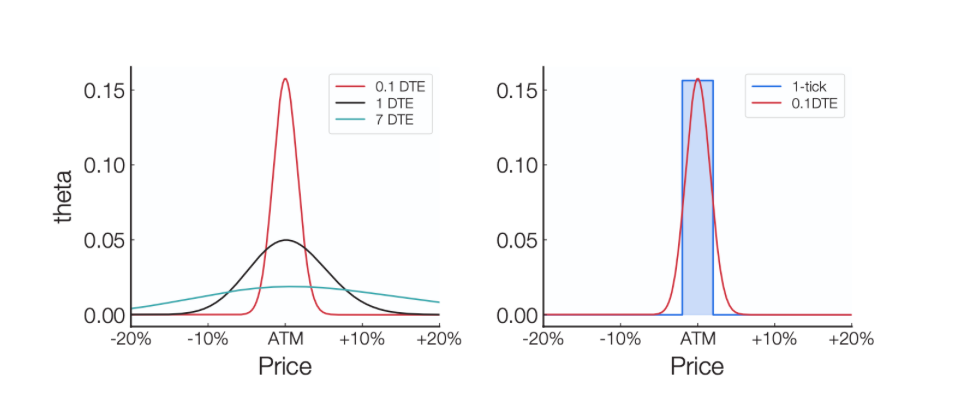
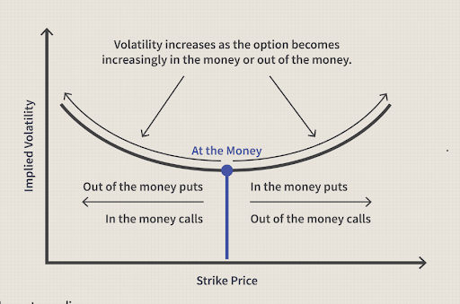
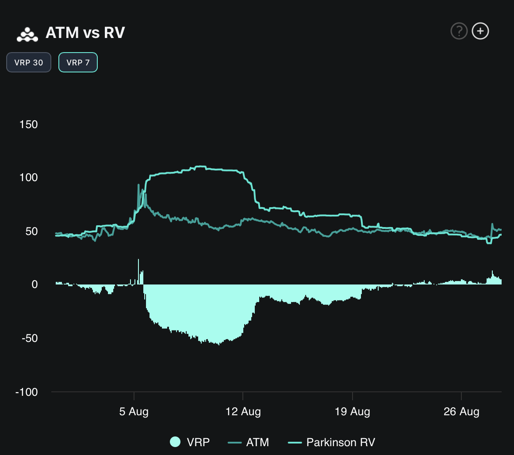
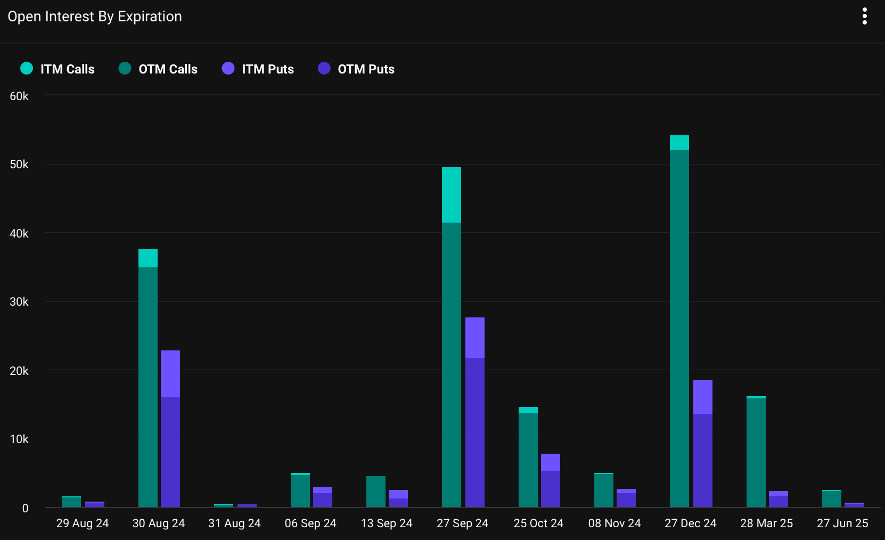

Welcome Panoptimists to the September edition of the Panoptic Newsletter, where we provide industry insights, research recaps, and Panoptic-specific content to keep you updated on our DeFi-native options platform.

  

If you want future newsletters sent directly to your email, signup on our [website](https://panoptic.xyz/).

  

## About Panoptic

Discover the future of trading with Panoptic, your gateway to perpetual options in DeFi. Our cutting-edge platform empowers you to manage risk effectively and trade with unprecedented flexibility. Join us and be part of a secure, decentralized revolution in options trading, tailored for both crypto newcomers and experienced traders.

  

## Panoptic Highlights

### Implied Volatility: Uniswap V3’s Impact on DeFi Markets

In the decentralized finance (DeFi) landscape, Uniswap V3 is revolutionizing the way we [calculate](https://panoptic.xyz/research/new-formulation-implied-volatility) implied volatility (IV). Traditional methods depend on data from order books and metrics like vega, but in DeFi, we rely on the fees collected by liquidity providers (LPs) to estimate IV.

  

LP positions on Uniswap, where liquidity is concentrated within specific price ranges, mimic exotic options. By leveraging this analogy, a new formula for IV is derived, reflecting the unique dynamics of DeFi markets. Here, IV is not determined by the upfront option price but by the continuous fees generated from liquidity provision, effectively transforming Uniswap's LP positions into a decentralized measure of market volatility.2

  

This approach marks a significant shift from centralized exchanges (CEX) to decentralized exchanges (DEX). Uniswap’s model allows LPs to allocate their capital within a specific price range, making capital deployment more efficient and enabling a more precise IV calculation. Mathematically, this involves equating the cumulative premia—derived from the theta function approximation in traditional options—to the actual fees collected by LPs.

  

This formulation not only adapts to the absence of order books and bid-ask spreads in DEXs but also provides a practical method for understanding volatility in a decentralized environment, capturing the evolving nature of the DeFi ecosystem.

  

### Shallow Dive: Why We Need Options

 In the rapidly evolving landscape of decentralized finance (DeFi), options serve as critical tools for both risk management and speculative opportunities, offering traders unparalleled flexibility in how they approach the market. Unlike traditional trading, where strategies are often limited to buying and selling assets directly, options provide a spectrum of possibilities tailored to various market conditions—whether it's a bullish, bearish, or even a neutral environment. This flexibility is essential in navigating the often volatile crypto markets.

Moreover, options enable traders to gain exposure to assets with significantly lower capital requirements compared to outright purchases, making them accessible even for those with limited resources. This leverage, combined with the ability to write options to generate income through strategies like covered calls or cash-secured puts, creates a robust framework for both risk management and income generation, which is especially crucial in the unpredictable world of crypto.

Furthermore, the introduction of on-chain options, particularly through innovative models like those developed by Panoptic, enhances market efficiency and liquidity. By providing more layers of liquidity, options contribute to tighter spreads, which is a key indicator of market depth and health. They also offer predictive insights into market sentiment, as the pricing and trading volume of options can signal potential future movements of underlying assets.

Options don't just serve as financial instruments—they become a vital component of a sophisticated trading strategy that can smooth volatility and support more accurate price discovery. The significance of these features cannot be overstated in a market that operates 24/7, where traditional boundaries and trading hours do not apply, making options indispensable for any serious trader in the DeFi space. Read more [here](https://panoptic.xyz/research/reasons-why-options-important-in-crypto-market).

  

## Market Overview

### BTC’s Volatile Journey Amid Shifting Market Dynamics

Bitcoin’s [recent](https://insights.deribit.com/industry/volatile-round-trip-in-btc/) price action (August 21-27) showcases the asset’s vulnerability to external influences. After breaking through the $62k price mark to touch $65k, BTC faced a swift reversal, erasing all gains accumulated over the past week. This volatility was triggered by Powell’s Jackson Hole speech, which hinted at a possible 50 bps rate cut in September, sparking initial optimism.

  

However, the failure of BTC price to hold $62k suggests a cautionary stance from leveraged traders, indicating potential continued choppiness. The upcoming Trump-Harris debate on September 10 and the ongoing shift toward more crypto-friendly political backing could set the stage for a bullish Q4, aligning with BTC’s historically strong performance in the final quarter of the year.

  

The crypto volatility landscape is shifting as realized volatility dropped to the mid-40s, pulling front-end implied vols down. With the US election and the September 10th debate approaching, traders are increasingly focused on potential volatility plays, especially with the ongoing shift toward more crypto-friendly political backing.

### BTC Traders Bet Big on Year-End Rally with Calls Dominating December Expiry

Analyzing the December 27 [expiration](https://www.deribit.com/statistics/BTC/metrics/options) reveals significant activity, especially in out-of-the-money (OTM) calls and puts, reflecting strong market sentiment surrounding this date. The total notional value for calls reaches an impressive $3.2 billion, with $3.08 billion attributed to the 52,062 OTM call contracts, representing 96% of the call volume. In contrast, in-the-money (ITM) calls account for just 2,227 contracts, with a notional value of $132 million.

  

On the put side, there’s a more balanced distribution between ITM and OTM positions. ITM puts stand at 4,902 contracts, with a total notional value of $290 million, while OTM puts account for 13,713 contracts, totaling $811 million.

  

The put-call ratio for this expiration is approximately 0.34, indicating a strong preference for calls over puts. The combined notional value of ITM and OTM options exceeds $4.3 billion, with 90% of this value concentrated in OTM positions, underscoring the market’s expectation for substantial movement in BTC’s price by year-end.

  

Skew analysis shows a clear preference for calls across all future dates, highlighting a positive skew that aligns with market anticipation of a potential bullish trend. This is particularly relevant as we approach key events like the Trump-Harris debate in September and the US election in November. The dominance of call options, the pronounced skew, and the low put-call ratio suggest traders are positioning for a possible breakout, with macroeconomic factors and political developments playing crucial roles in shaping BTC’s trajectory.

  

  

## Panoptic in the Media

### Three Sigma Releases Engagement Report on Panoptic's DeFi Options Trading Optimization

<blockquote class="twitter-tweet">
Our engagement report with <a href="https://twitter.com/Panoptic_xyz?ref_src=twsrc%5Etfw">@Panoptic_xyz</a> is now live!  Our simulation services offer groundbreaking insights into optimizing <a href="https://twitter.com/hashtag/DeFi?src=hash&amp;ref_src=twsrc%5Etfw">#DeFi</a> options trading. The results? Game-changing adjustments to enhance liquidity and stability.  Discover more on the tweet below ⬇️ <a href="https://t.co/KOx4eWLKhp">pic.twitter.com/KOx4eWLKhp</a>
&mdash; Three Sigma (@threesigmaxyz) <a href="https://twitter.com/threesigmaxyz/status/1830977467278103039?ref_src=twsrc%5Etfw">September 3, 2024</a></blockquote> 

We’re thrilled to share the results of our recent engagement with Three Sigma, where their cutting-edge simulation services provided us with invaluable insights into optimizing Panoptic’s DeFi options trading protocol. Through a series of realistic testing scenarios, Three Sigma evaluated our protocol's performance under various conditions. The simulations showcased Panoptic’s resilience, even in less-than-ideal situations, and validated the efficiency of our mechanisms in maintaining a healthy, dynamic ecosystem. These findings will guide our ongoing efforts to refine Panoptic, ensuring that our platform remains robust and adaptable in the ever-evolving DeFi landscape.

### Simplify Your Trading with Panoptic's One-Click Strategies

Trade options with ease using Panoptic's one-click strategies, whether you're bullish, bearish, or neutral. Make smarter moves without the complexity.

<blockquote class="twitter-tweet">
Why juggle complex options when you can trade with a click on Panoptic?  Our one-click strategies let you go bullish, bearish, or neutral. Whether you&#39;re craving a juicy call or a zesty put, we&#39;ve got you.  Trade smarter, not harder – your future self will thank you! <a href="https://t.co/ytZtEn04XY">pic.twitter.com/ytZtEn04XY</a>
&mdash; Panoptic (@Panoptic_xyz) <a href="https://twitter.com/Panoptic_xyz/status/1825924195420876952?ref_src=twsrc%5Etfw">August 20, 2024</a></blockquote> 

  

### Maximize Your Profits with Panoptic’s Protective Put Strategy

By utilizing Panoptic’s protective put strategy during the recent BTC price drop, users could have limited their losses to just $890 instead of $2,670. This approach not only safeguards your investment but also positions you to profit from future market rebounds.

<blockquote class="twitter-tweet">
🐻 The recent &gt;$2k drop in <a href="https://twitter.com/search?q=%24BTC&amp;src=ctag&amp;ref_src=twsrc%5Etfw">$BTC</a> price from $59,690 on Aug 9 to $57,020 on Aug 15 would have been the perfect opportunity to utilize the power of options.  A protective put (buying a put while holding BTC) can protect against price drops while still profiting on the upside. <a href="https://t.co/atDczqdOaf">pic.twitter.com/atDczqdOaf</a>
&mdash; Panoptic (@Panoptic_xyz) <a href="https://twitter.com/Panoptic_xyz/status/1824207029776552239?ref_src=twsrc%5Etfw">August 15, 2024</a></blockquote>   

## Up Next

Panoptic will be undergoing an additional smart contract audit and a major UI update in preparation for its upcoming launch. Subscribe so you don’t miss any future announcements!

  

_Join the growing community of Panoptimists and be the first to hear our latest updates by following us on our [social media platforms](https://links.panoptic.xyz/all). To learn more about Panoptic and all things DeFi options, check out our [docs](https://panoptic.xyz/docs/intro) and head to our [website](https://panoptic.xyz/)._
