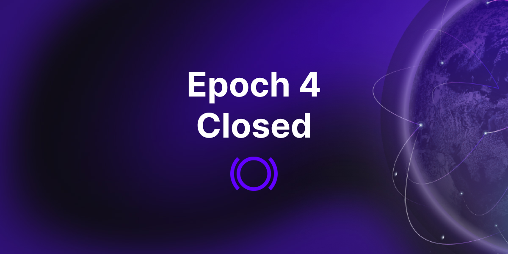
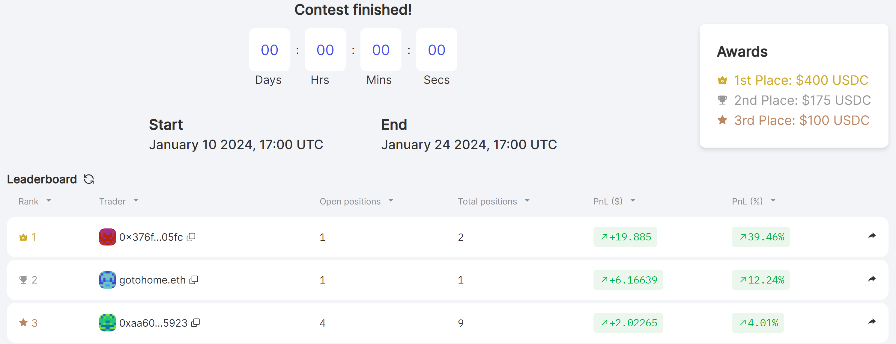
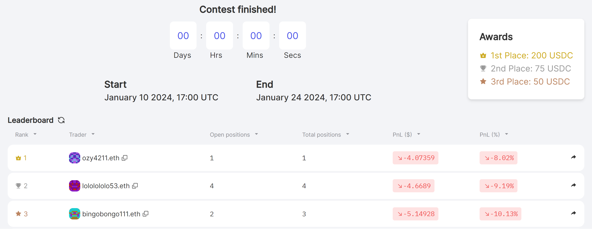

Epoch 4 of Panoptic's beta launch on Avalanche has ended. Thank you to every participant who contributed to this epoch's success. Your active participation is pivotal in shaping the DeFi options trading landscape!

Following our [earlier announcement](https://panoptic.xyz/blog/panoptic-beta-launch-epoch-four), this conclusion marks a planned transition. The valuable insights gathered propel us towards continual refinement and enhancement of the trading experience for Epoch 5.

### 📅 Save the Date!
[Epoch 5](https://panoptic.xyz/blog/panoptic-beta-launch-epoch-five) begins on January 25, 2024. Panoptic's beta platform will launch on OP (Optimism mainnet) and Threshold BTC (Base mainnet) with $2,000 in prizes for the top performing participants.

### Engage Now

Don't hold off until Epoch 5! Participate in our [December Nutcracker](https://panoptic.xyz/blog/panoptic-demo-launch) competition on Base now. There's over $10,000 in NFT prizes including a Milady, Lil Pudgy, and mfer. [Join](https://beta.panoptic.xyz) now!

## Epoch 4's Winners

We're thrilled to announce the winners of our Epoch 4 trading competition. A total of $1,000 in monetary prizes will be distributed to the best traders. Additionally, the top five traders of each market will each receive the prestigious Top Trader POAP.

Congratulations to these traders who showcased their incredible talent!

### AVAX Options Contest
-   🥇 1st Place: 0x376f59d57c4db76e0da71e9952898cce419d05fc ($400 + Top Trader POAP)
-   🥈 2nd Place: gotohome.eth ($175 + Top Trader POAP)
-   🥉 3rd Place: 0xaa60084b1170bce4b6aaa1c56c1aa5f3dca85923 ($100 + Top Trader POAP)
-   4️⃣ 4th Place: dalle21.eth (Top Trader POAP)
-   5️⃣ 5th Place: 0xa0282114514e6e7fa900af95d375ef0449413c5f (Top Trader POAP)

### JOE Options Contest
-   🥇 1st Place: ozy4211.eth ($200 + Top Trader POAP)
-   🥈 2nd Place: lololololo53.eth ($75 + Top Trader POAP)
-   🥉 3rd Place: bingobongo111.eth ($50 + Top Trader POAP)
-   4️⃣ 4th Place: artcollector88.eth (Top Trader POAP)
-   5️⃣ 5th Place: briller.eth (Top Trader POAP)

*Note: The top Joe traders are in the red because both Joe and Avax prices saw an average -13% drop (in USD) over the contest period.*

Epoch 4 saw a lot of price action in the crypto markets. Check out our [analysis](https://x.com/Panoptic_xyz/status/1749946671646273650?s=20) of how the top traders used puts to go short and straddles to collect juicy streamia (streaming premia) fees in the trading arena.
    

Winners, claim your POAP [here](https://poap.delivery/panoptic-epoch-4-top-trader)! Additionally, the first 100 Epoch 4 participants can grab their Epoch 4 POAP [here](https://poap.delivery/panoptic-epoch-4). 

*Note: All POAPs will be available for claiming once they are fully processed by the POAP team. This process may take up to 24 hours.*

  

## What's Next?
The Panoptic team is already incorporating your feedback from Epoch 4 and prepping for Epoch 5. Stay tuned to our [social media](https://linktr.ee/panopticxyz) channels for upcoming competition details!

_Join the growing community of Panoptimists and be the first to hear our latest updates by following us on our [social media platforms](https://links.panoptic.xyz/all). To learn more about Panoptic and all things DeFi options, check out our [docs](https://panoptic.xyz/docs/intro) and head to our [website](https://panoptic.xyz/)._
