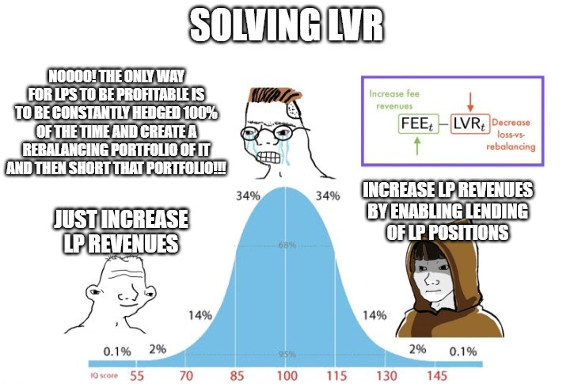
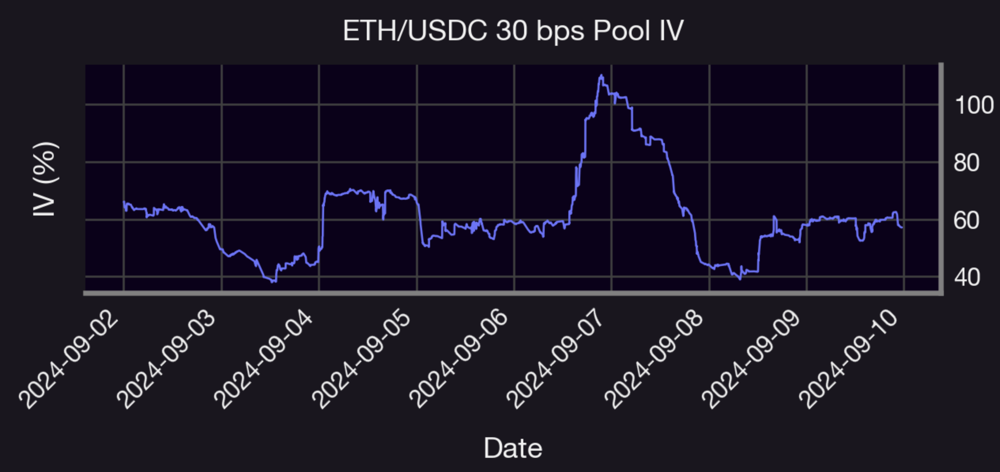
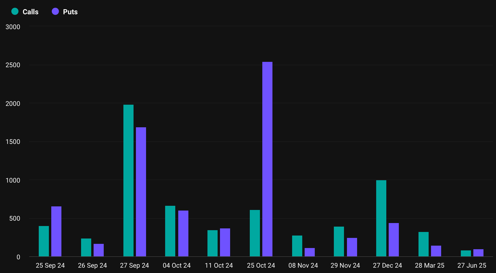

Welcome Panoptimists to the October edition of the Panoptic Newsletter, where we provide industry insights, research recaps, and Panoptic-specific content to keep you updated on our DeFi-native options platform.

  

If you want future newsletters sent directly to your email, signup on our [website](https://panoptic.xyz/).

  

## About Panoptic

Discover the future of trading with Panoptic, your gateway to perpetual options in DeFi. Our cutting-edge platform empowers you to manage risk effectively and trade with unprecedented flexibility. Join us and be part of a secure, decentralized revolution in options trading, tailored for both crypto newcomers and experienced traders.

  

## Panoptic Highlights

### Panoptic's Approach to Loss-Versus-Rebalancing (LVR)

Panoptic has redefined how liquidity providers (LPs) navigate the challenges of Loss-Versus-Rebalancing (LVR) in Uniswap pools. LVR represents the difference between an LP's performance, excluding fees, and a rebalancing portfolio that buys low and sells high to hedge against market fluctuations. LPs are short convexity, meaning they suffer during periods of high volatility due to adverse price swings. This volatility amplifies LVR, which increases LPs' overall risk. However, Panoptic has [flipped this dynamic](/research/panoptic-solves-lvr) by focusing on boosting LP returns, offering new mechanisms to offset LVR without complicated interventions like speed bumps or auctions.

Panoptic's solution to LVR centers around increasing revenue for LPs by introducing the first-ever lending market for Uniswap LP tokens. Through this market, LPs can lend their tokens to option buyers and generate additional income, compensating for LVR's impact. LPs can also opt for passive participation, effectively eliminating LVR while still earning compounding returns. Additionally, Panoptic introduces the ability to short LP positions, transforming the burden of LVR into "Gains-Versus-Rebalancing" (GVR), where users can exploit high volatility for profits. By viewing liquidity provision through the lens of options trading, Panoptic turns volatility into a strategic advantage, revolutionizing LP strategies in DeFi.

  

### IV Conversation

On September 7, the implied volatility (IV) for the ETH-USDC 30 bps Uniswap v3 pool spiked significantly, as shown in the graph below. This surge reflects heightened market uncertainty as threats of war continue to loom along with a disappointing jobs report, causing a ripple effect on the liquidity provider (LP) positions. Using the same methodology outlined in our [research](/research/new-formulation-implied-volatility) on Uniswap's LPs as perpetual options, this IV increase is aligned with a rise in trading volume, increasing fee collection opportunities for LPs, which parallels higher option premiums in traditional finance. This volatility shift was likely due to uncertainty in Fed rate cuts and potential geopolitical risks, amplifying risks and rewards for LPs.

  

### Shallow Dive: Why DeFi Needs Options More Than Ever

The idea that perpetual futures (perps) have entirely replaced options in the digital asset space is not only misguided, but overlooks the [unique role](https://x.com/dgt10011/status/1837278352823972147) options play in both retail and institutional markets. With the recent SEC approval of Bitcoin ETF options, the importance of options has never been more apparent. Unlike perps–which are restrictive, linear instruments with inherent liquidation risks–options offer more strategic flexibility. Bitcoin ETF options, in particular, ignite this conversation by allowing for dynamic portfolio management, providing a structured and compelling alternative to the volatility of perps.

  

This development underscores a fundamental need within decentralized finance (DeFi), where Panoptic is at the forefront of innovation by offering perpetual options. Options inherently enable directional bets with limited downside risk. As the market matures, demand will increase for structured derivatives that go beyond short-term speculation. The Bitcoin ETF options market marks the beginning of a wave of highly liquid alternatives that could inspire DeFi protocols like Panoptic to create parallel offerings. While perps have their place, they are no substitute for the more advanced portfolio hedging and flexibility that options provide. For crypto markets to scale and attract institutional traction, options—far from being obsolete—are a cornerstone for long-term, sustainable growth.

  
  

## Market Overview

### Election Uncertainty Drives Massive Put Skew for October 2024 Bitcoin Options

The [BTC options](https://www.deribit.com/statistics/BTC/metrics/options) skew for the expiration date of October 25, 2024, shows a significant imbalance between puts and calls, indicating heavy positioning toward downside risk. There are approximately 609 call contracts with a notional value of $38.5 million, while puts drastically outweigh them with 2,540 put contracts, commanding a notional value of $160.4 million. This represents more than a 4x difference in contract volume in favor of puts.

This setup is particularly important given the timing—just weeks before the 2024 U.S. Presidential election. Historically, markets see heightened volatility leading up to elections, and this large notional exposure to puts suggests that market participants are bracing for significant downside risk or uncertainty. The stark contrast in positioning could indicate that traders and investors are concerned about the political and macroeconomic landscape, and they are hedging accordingly.

  
  
  

## Panoptic in the Media

### Spotlights

#### Panoptic joins Arrakis and Uniswap to discuss Uniswap Hooks at Token2049

Panoptic, alongside Arrakis Finance and Uniswap Foundation, hosted an exciting event at Token2049 in Singapore. It was a great opportunity to connect with DeFi builders and enthusiasts, sharing insights and fostering excitement for the evolution of onchain finance.

<blockquote class="twitter-tweet">
🪝 If you’re headed to Token2049, we’ll be hosting a deep dive on v4 hooks with <a href="https://twitter.com/ArrakisFinance?ref_src=twsrc%5Etfw">@ArrakisFinance</a> and <a href="https://twitter.com/Panoptic_xyz?ref_src=twsrc%5Etfw">@Panoptic_xyz</a>, with talks from <a href="https://twitter.com/saucepoint?ref_src=twsrc%5Etfw">@saucepoint</a>, <a href="https://twitter.com/guil_lambert?ref_src=twsrc%5Etfw">@guil_lambert</a>, <a href="https://twitter.com/kassandraETH?ref_src=twsrc%5Etfw">@kassandraETH</a>, <a href="https://twitter.com/Derekmw23?ref_src=twsrc%5Etfw">@Derekmw23</a>, <a href="https://twitter.com/kapursanat?ref_src=twsrc%5Etfw">@kapursanat</a> and more.  Happening 9/19. RSVP here: <a href="https://t.co/ziheLgptPR">https://t.co/ziheLgptPR</a>
&mdash; Uniswap Foundation (@UniswapFND) <a href="https://twitter.com/UniswapFND/status/1831707998114476488?ref_src=twsrc%5Etfw">September 5, 2024</a></blockquote> 

#### Panoptic Founder Spotlight: Guillaume Lambert's Insights on DeFi Options

In a chat with Panoptic, the founder of Union discovers the mind-blowing insight that options are the fourth key pillar in DeFi.

<blockquote class="twitter-tweet">
.<a href="https://twitter.com/Panoptic_xyz?ref_src=twsrc%5Etfw">@Panoptic_xyz</a> and <a href="https://twitter.com/guil_lambert?ref_src=twsrc%5Etfw">@guil_lambert</a> blowing my mind about hedging and options being the 4th pillar in DeFi. <a href="https://t.co/ThAS99W8aj">pic.twitter.com/ThAS99W8aj</a>
&mdash; 0xkaiserkarel (@0xkaiserkarel) <a href="https://twitter.com/0xkaiserkarel/status/1838818037467877694?ref_src=twsrc%5Etfw">September 25, 2024</a></blockquote> 
  

#### Final Audit Complete – Panoptic Launch Imminent

The final audit of Panoptic's smart contracts is live with Code4rena, marking a major milestone towards launch. Invariant testing significantly optimized the platform, delivering incredible results, and we couldn't be prouder of the entire team for their relentless efforts in bringing us closer to launching decentralized options.

<blockquote class="twitter-tweet">
The final audit of the Panoptic smart contracts is live on <a href="https://twitter.com/code4rena?ref_src=twsrc%5Etfw">@code4rena</a>.  Invariant testing drove the latest changes (dat ROI was insane!)  I’m extremely proud of the whole team —huge thanks to <a href="https://twitter.com/namedserver?ref_src=twsrc%5Etfw">@namedserver</a>, <a href="https://twitter.com/PeakyCryptos?ref_src=twsrc%5Etfw">@PeakyCryptos</a>, <a href="https://twitter.com/flevestanagan?ref_src=twsrc%5Etfw">@flevestanagan</a> for pushing it across the finish line! <a href="https://t.co/h5mHKZyBnl">pic.twitter.com/h5mHKZyBnl</a>
&mdash; GEE-yohm LAMB-bear (@guil_lambert) <a href="https://twitter.com/guil_lambert/status/1839617730229502171?ref_src=twsrc%5Etfw">September 27, 2024</a></blockquote> 

  

## Up Next

Panoptic will be undergoing a final smart contract audit and a major UI update in preparation for its upcoming launch. Subscribe so you don’t miss any future announcements!

  
_Join the growing community of Panoptimists and be the first to hear our latest updates by following us on our [social media platforms](https://links.panoptic.xyz/all). To learn more about Panoptic and all things DeFi options, check out our [docs](https://panoptic.xyz/docs/intro) and head to our [website](https://panoptic.xyz/)._