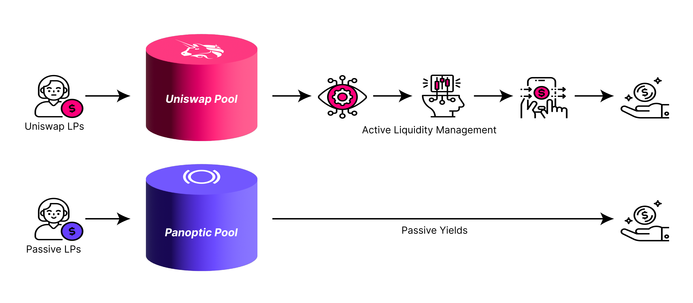
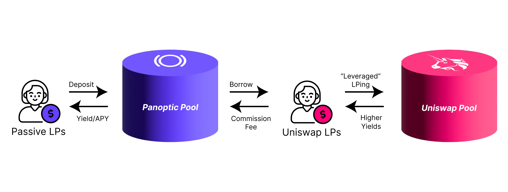

When providing liquidity on [Uniswap V3](/blog/passive-liquidity-pools), users need to actively manage their positions, choose their price range, rebalance when it goes out of range, and often suffer impermanent loss.

At Panoptic, we provide a [passive solution](/blog/panoptic-awarded-uniswap-foundation-grant) to provide liquidity without the hassle of constant management. Liquidity providers (LPs) have the opportunity to provide single-sided liquidity for any token, in any quantity, to any pool. Passive LPs delegate the more difficult responsibilities to active LPs while passively collecting yield. Think of it like Aave, but instead of lending to anyone, you're lending to Uniswap LPs and options buyers—that means no [LVR](https://panoptic.xyz/research/panoptic-solves-lvr) worries, no IL, and single-sided deposits with auto-compounded fees.

## Under the Hood

When you provide passive liquidity, your deposited tokens serve as capital for others to borrow and deploy into Uniswap. In return for providing liquidity, passive LPs receive yield on their tokens.

Passive liquidity rewards are automatically reinvested and auto-compounded so that you earn yield on your yield.

## Earn Passively

While a plethora of yield opportunities exist in crypto, Panoptic is bringing passive yield to Uniswap. Panoptic offers a unique value proposition for LPs: lend your tokens to active LPs to earn passive rewards.

A distinguishing factor of Panoptic’s platform is that passive liquidity cannot be deployed anywhere besides Uniswap. This means that borrowed funds can’t be exchanged for a house or a car, for example, but can only be used to make markets in Uniswap.

## Where Does the Yield Come From?

The yield generated for passive LPs originates from active LPs who borrow passive liquidity to deploy at a specific price range in Uniswap. Active LPs pay a [percentage fee](/docs/panoptic-protocol/commission) on the amount of liquidity borrowed, providing passive LPs with a steady source of income. In addition, option buyers who [short](/docs/terms/short) the LP tokens of active LPs also pay a percentage fee to passive LPs.

## What Factors Affect Yield?

The amount of yield a passive LP receives depends on two main factors:

1.  The share of tokens deposited by a passive LP in a Panoptic pool – the more tokens, the greater the proportion of pool rewards captured.
2.  The volume of LP tokens created and shorted in a Uniswap pool through Panoptic – the more volume, the more passive LPs will earn.
    

By taking these two factors into consideration, deposit share and active LP volume, passive LPs can assess their potential earnings and optimize their strategy.

## What Are the Risks?

When considering the associated risks, it is important to acknowledge the potential loss of funds through pool debt. This occurs when there is extreme price volatility where positions may not be [liquidated](/docs/panoptic-protocol/liquidations) promptly, resulting in accumulated debt within the pool.

This risk can be mitigated by exercising caution in choosing pools with greater stability. Blue-chip Uniswap pools and pools with greater liquidity can help minimize this risk. By carefully selecting which markets to participate in, passive LPs can sleep soundly while earning passive rewards on their liquidity.

*Join the growing community of Panoptimists and be the first to hear our latest updates by following us on our [social media platforms](https://links.panoptic.xyz/all). To learn more about Panoptic and all things DeFi options, check out our [docs](https://panoptic.xyz/docs/intro) and head to our [website](https://panoptic.xyz/).*
