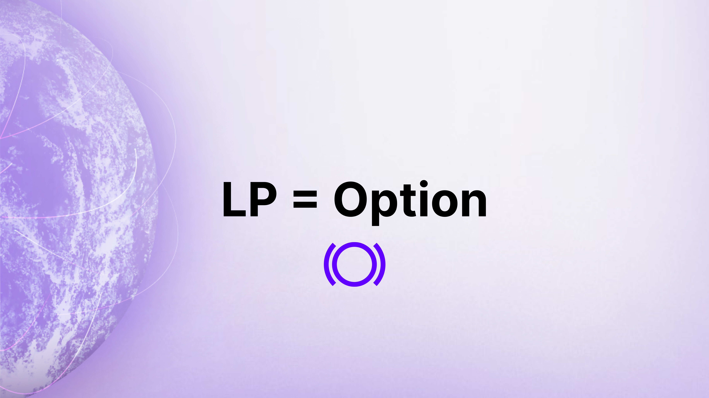
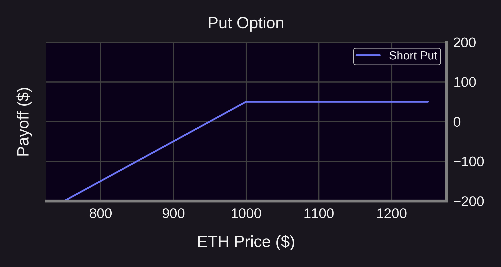
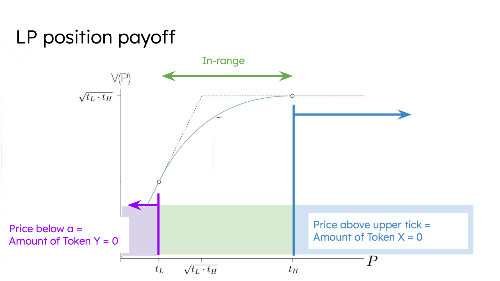
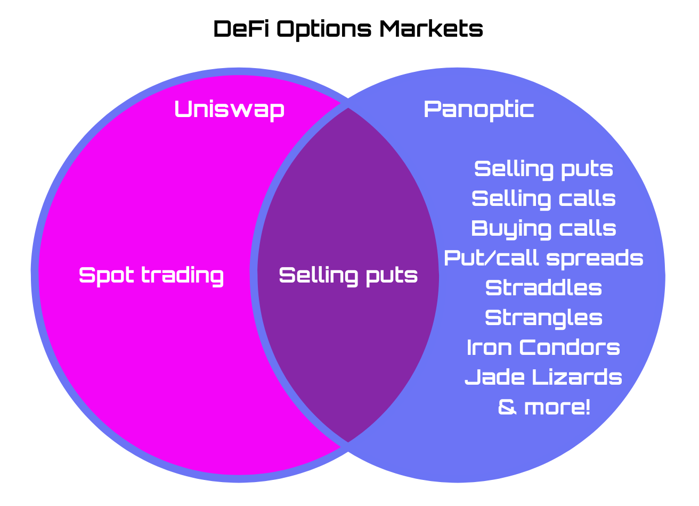
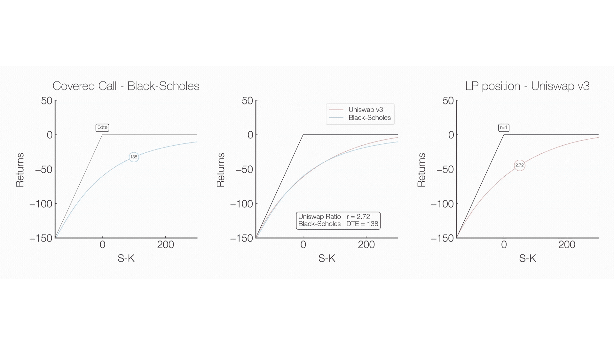

“I don’t know how much I’m making” – it's a common complaint from liquidity providers (LPs) on Uniswap. Why? Because after putting in X ETH and Y USDC, they often come back with completely different amounts, making it difficult to assess if they made a profit or incurred a loss.

This uncertainty arises from the difficulty in calculating LP positions' profit and loss (PnL). But here’s the exciting part: Guillaume Lambert, the mind behind Panoptic, [cracked the code](https://lambert-guillaume.medium.com/pricing-uniswap-v3-lp-positions-towards-a-new-options-paradigm-dce3e3b50125). He discovered that **LP** $\approx$ **options**. Here’s the core formula:  
  
$$
LP = Option + \rho
$$

Where $\rho$ is the big formula below.

  
  
Yup, you read that right. Erf.

## So What’s the Big Deal?

We’ll skip the ρ part for now—it involves some heavy math. Let’s focus on understanding the link between LP positions and options trading. By recognizing this relationship, LPs can better understand how much they’re making (or losing), manage their positions, and potentially increase profits.

To illustrate, consider the payoff graph of an LP position compared to a put option (left side of the image below). Don’t they look strikingly similar?

  

This connection allows us to view LPing through the lens of options trading, and it opens up a whole new way to think about risk management and fee generation in Uniswap.

Let’s rewind a bit and start with the basics.

## Uniswap & AMMs: The Basics

  

Uniswap is the leading decentralized exchange (DEX) that popularized the Automated Market Maker (AMM) model. AMMs replace traditional order books with liquidity pools, letting users trade against these decentralized pools. In Uniswap v3, LPs can provide concentrated liquidity, allowing them to allocate capital within specific price ranges for improved capital efficiency.

While this approach enhances returns, it also requires LPs to carefully manage their positions and set the right price ranges to avoid losses.

## Put Options: Risk Management Tools

  

A put option gives the holder the right (but not the obligation) to sell an asset at a specific price (the strike price). For investors, this offers flexibility and a way to hedge against price declines.

When selling a put option, the payoff structure flips—limited profit potential on the upside with potentially significant downside risk. This is where the LP analogy comes in.

## LPs Are Options Sellers

The similarity between LP positions and selling put options is striking. Essentially, liquidity provision mimics selling exotic options (specifically perpetual options that never expire).

  

For example, if you're providing liquidity in the ETH/USDC pool:
-   If ETH’s price exceeds your upper range → your position converts to USDC.
-   If ETH’s price drops below your lower range → your position converts back to ETH.

This structure mirrors the payoff of a put option. In fact, a one-tick-wide LP position looks exactly like an expiring put option. The difference is that, in Uniswap, liquidity providers receive [continuous option premiums](https://panoptic.xyz/docs/product/streamia) in the form of spot trading fees, rather than upfront payments.

  

## The Future: Buying Options From Uniswap

  

So, Uniswap allows you to sell puts (by providing liquidity), but what about buying puts or trading call options? Enter Panoptic.

  

With Panoptic, users can not only provide liquidity (i.e., sell puts) but also buy puts and calls for more advanced trading strategies. This unlocks the full potential of options trading, enabling a multitude of new strategies never before seen in DeFi:

-   Hedging downside risks with put options.
-   Capturing upside potential with call options.
-   Trading volatility with straddles and strangles.
-   [Synthetic perps](https://panoptic.xyz/docs/trading/multi-leg-strategies#synthetic-positions) with embedded leverage.
-   Spreads, iron condors, jade lizards, and [more](https://panoptic.xyz/research/essential-options-strategies-to-know)!
    

## Expanding the Options Ecosystem

Panoptic’s [perpetual options](https://panoptic.xyz/docs/trading/perpetual-options) offer unique features compared to traditional options:

1.  No expiration: Continuous trading without the hassle of rolling over positions.
2.  Real-time pricing: Derived from Uniswap's trading activity.
3.  Streaming Premia: Premia starts at zero and accumulates over each block.

  

For LPs, this means that in addition to earning fees (akin to option premiums), they face similar risks to option sellers. However, these risks can be better managed thanks to the flexibility of perpetual options.

Panoptic is fully embracing the LP = Options concept, effectively transforming Uniswap into an options clearinghouse. Panoptic has even identified key metrics for LP positions, including an equivalent for [implied volatility](https://panoptic.xyz/research/new-formulation-implied-volatility), a [time-to-expiration (DTE)](https://panoptic.xyz/docs/product/timescales) counterpart, and a [vega-like Greek](https://panoptic.xyz/docs/product/spread)—redefining them as perpetual options.

*LP = Options* is more than a novel idea–it's the future of decentralized finance. By bridging these two concepts, Panoptic is creating a more efficient, flexible, and powerful trading ecosystem for all.

*Join the growing community of Panoptimists and be the first to hear our latest updates by following us on our [social media platforms](https://links.panoptic.xyz/all). To learn more about Panoptic and all things DeFi options, check out our [docs](https://panoptic.xyz/docs/intro) and head to our [website](https://panoptic.xyz/).*
