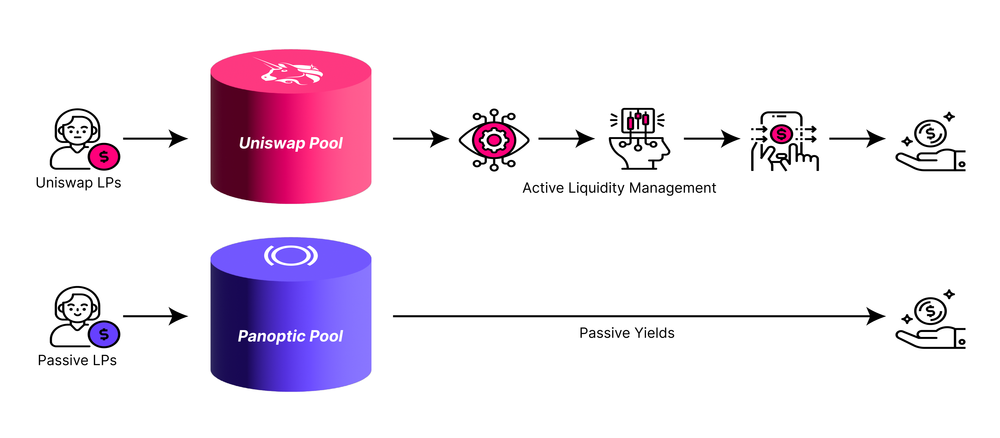
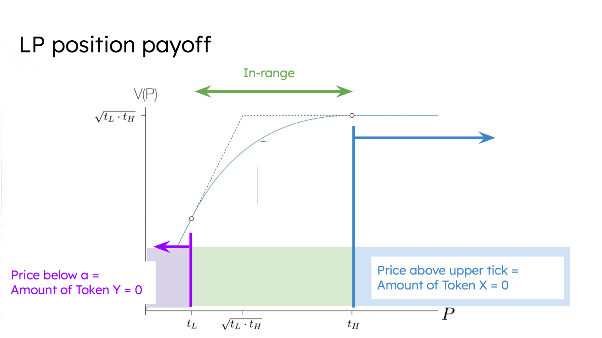
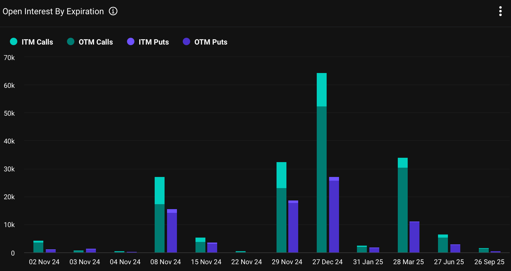

Welcome Panoptimists to the November edition of the Panoptic Newsletter, where we provide industry insights, research recaps, and Panoptic-specific content to keep you updated on our DeFi-native options platform.

If you want future newsletters sent directly to your email, signup on our [website](https://panoptic.xyz/). 

## About Panoptic

Discover the future of trading with Panoptic, your gateway to perpetual options in DeFi. Our cutting-edge platform empowers you to manage risk effectively and trade with unprecedented flexibility. Join us and be part of a secure, decentralized revolution in options trading, tailored for both crypto newcomers and experienced traders.

## Panoptic Highlights

### Bringing Passive Liquidity to Uniswap

Panoptic [introduces](https://panoptic.xyz/blog/bringing-passive-liquidity-to-uniswap) a seamless way for liquidity providers (LPs) to earn rewards without actively managing their positions on Uniswap V3. Instead of constantly monitoring and rebalancing price ranges, passive LPs deposit tokens into a pool, allowing active LPs to borrow and deploy the liquidity. This setup allows passive LPs to collect yield without worrying about impermanent loss (IL) or loss-versus-rebalancing (LVR). It functions similarly to a lending model like Aave but where borrowers are LPs in Uniswap pools and lenders have single-sided deposits that are auto-compounded to maximize returns.

The yield for passive LPs is generated through fees paid by active LPs and option buyers who short LP tokens. Active LPs deploy the borrowed liquidity to specific Uniswap price ranges and pay a percentage fee on the amount borrowed. Passive LP earnings depend on their share of deposited tokens and the volume of LP tokens created and shorted in the pool. While potential risks include price volatility that could lead to pool debt, participating in more stable, blue-chip Uniswap pools can help mitigate these risks.

  

### Shallow Dive: LP = Options

"I don’t know how much I’m making" – it’s a familiar complaint for Uniswap liquidity providers (LPs). The issue stems from the unpredictable shifts in the assets they receive upon withdrawing their position. After initially depositing X ETH and Y USDC, LPs often withdraw with very different amounts, complicating the calculation of their profit or loss (PnL). This challenge arises from fluctuations in asset prices and the structure of Automated Market Makers (AMMs) like Uniswap.

Here’s where professor Guillaume Lambert, founder of Panoptic, made a breakthrough: he recognized that LP positions function similarly to options, encapsulated by the formula [LP ≈ options](https://panoptic.xyz/blog/uniswap-lp-equals-options). This insight allows LPs to analyze their positions with the same tools and strategies as options traders, helping them predict profits, manage risk, and refine their approach.

The underlying mechanics show that liquidity provision in an ETH/USDC pool, for instance, mirrors selling a put option. If ETH’s price rises beyond a provider’s chosen range, their position shifts to USDC; if it falls below, they hold ETH. In this setup, LPs gain continuous trading fees (resembling option premiums), unlike standard options which pay upfront. This unique blend of liquidity provision and options dynamics, particularly through Panoptic’s perpetual options platform, lets LPs not only provide liquidity but also buy options, unlocking diverse strategies such as hedging, volatility trading, and leveraged plays. Panoptic is thus reshaping DeFi’s future by merging options strategies with AMM liquidity, offering LPs sophisticated tools for better risk management and profit potential.

## Market Overview

### December 27 Options Data Reveals Strong Bullish Positioning Heading into 2025

Looking at the December 27 options [data](https://www.deribit.com/statistics/BTC/metrics/options), there's significant bullish sentiment heading into the new year. Total call open interest for this expiration date is around 64,500, with a notable 81% of these being out-of-the-money (OTM) calls, a clear indication of investors expecting potential upside movement. This is backed by a high notional value for calls at approximately $4.5 billion, compared to puts which hold a lesser $1.9 billion notional value.

The put-call ratio, calculated by dividing total puts (27,000) by total calls (64,500), yields a low ratio, which generally signals bullish market sentiment. Given the substantial weighting towards calls, particularly OTM positions, it appears investors are positioned for upward price action by year-end, which could set a bullish tone for early 2025.

## Spotlights

### Hitting the Sweet Spot: Panoptic x Arrakis Finance at Permissionless

At Permissionless, we [teamed up](https://x.com/Panoptic_xyz/status/1845863010134585427) with Arrakis Finance to host an unforgettable Top Golf side event, where guests could unwind, network, and enjoy some friendly competition. With swings that might need as much rebalancing as some LP positions, it was a fun and relaxing break from the usual intensity of DeFi markets.

### Panoptic Wraps Up Audits with No Major Issues, Final Review Underway for Uniswap Integration

Panoptic has successfully completed two rigorous audits, a public audit with [Cantina](https://x.com/cantinaxyz/status/1852768148266832005) and a private, invitation-only review with [Code4rena](https://x.com/Panoptic_xyz/status/1846640209091613043), both confirming zero medium or high-severity issues. Meanwhile, an additional [private audit](https://x.com/Panoptic_xyz/status/1851685588916932906) with Cantina focused on Uniswap V3 and V4 integrations is ongoing and set to conclude on November 8. As Panoptic’s perpetual options near launch, this auditing process underscores our commitment to security.

### Panoptic Expanding to Unichain: Unlocking Advanced LP Strategies and Options

We’re excited to announce that Panoptic will be [building on Unichain](https://x.com/Panoptic_xyz/status/1844476885130150072), offering cutting-edge liquidity provision strategies and options to the newly unveiled platform. Congratulations to Uniswap on their Unichain launch—we can’t wait to be part of this next chapter!

## Up Next

Panoptic is coming to Ethereum mainnet soon! Subscribe so you don’t miss any future announcements.

_Join the growing community of Panoptimists and be the first to hear our latest updates by following us on our [social media platforms](https://links.panoptic.xyz/all). To learn more about Panoptic and all things DeFi options, check out our [docs](https://panoptic.xyz/docs/intro) and head to our [website](https://panoptic.xyz/)._