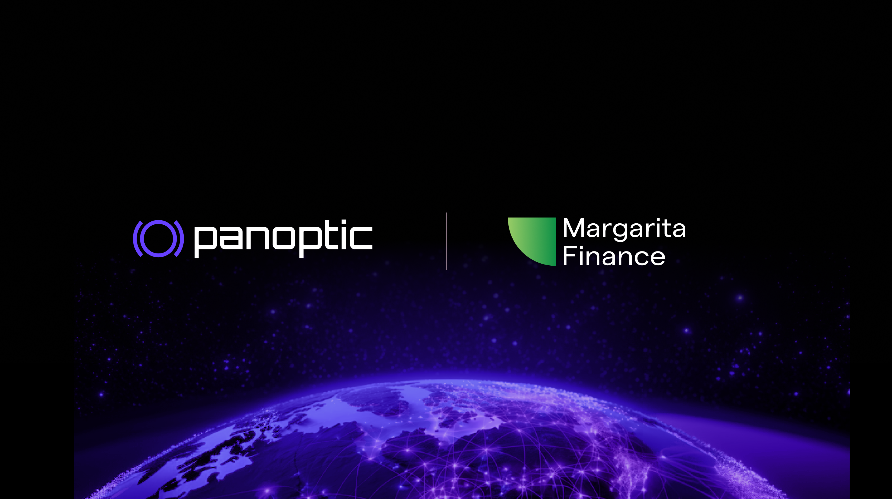

## Revolutionizing DeFi Structured Products

Panoptic is excited to announce its partnership with Margarita Finance to bring a new level of accessibility, customization, and sophistication to decentralized finance (DeFi) through structured products.

### The Vision

By combining Margarita Finance's expertise in structured products with Panoptic's cutting-edge on-chain options and derivatives protocol, this partnership seeks to bridge the gap between traditional finance's complexity and DeFi's efficiency. The goal is to democratize sophisticated investment strategies while reducing fees and settlement times.

### Key Innovations

1.  On-chain Structured Products: Margarita Finance will integrate Panoptic's on-chain options, enabling the creation of fully permissionless structured investment products.
2.  Customization: Users can tailor investments based on various crypto assets, APY targets, lock-up periods, and investment amounts.
3.  24/7 Accessibility: The integration allows for seamless, round-the-clock interaction with structured products in a truly decentralized environment.

### Benefits for Users

-   Higher Potential Yields: Opportunity to earn more than traditional staking yields.
-   Risk Management: Tools and trading strategies for users to enhance profitability.
-   Expanded Asset Range: Access to any tokens available on Uniswap.
-   No Issuer Risk: Full decentralization removes counterparties and issuer insolvency risk.

## About Margarita Finance: Onchain Structured Products

Margarita Finance recently introduced its structured products at [Solana Breakpoint](https://www.youtube.com/watch?v=muuTvka0_Hk) in Singapore, unveiling a platform that enables users to craft custom products with Bitcoin, Ethereum, or Solana. The lineup of underlying assets will continue to expand, offering even more choices over time. Margarita Finance provides an elevated yield compared to traditional staking, allowing investors to tailor their investment horizon, risk-return profile, and amount in real-time.  
  
The inaugural product from Margarita Finance, "[Yield Boosters](https://www.app.margarita.finance/)," introduces a customizable solution akin to Barrier Reverse Convertibles in traditional finance, designed to maximize returns beyond standard staking.

Yield generation is driven by capturing option premia in the market, with users selecting:
-   Their preferred crypto asset    
-   Desired lock-up period
-   Target yield

The platform then crafts an options-based approach to meet the target yield. Currently, users can invest into structured products with USDC, while obtaining exposure to BTC, ETH, and SOL.

## About Panoptic: Onchain Perpetual Options 

Panoptic introduces perpetual options trading built on Uniswap. Designed to be intuitive to use, the decentralized, permissionless platform enables traders to enhance profitability. Backed by Uniswap Labs and Coinbase Ventures, Panoptic provides tools for perp trading as well as simple and complex options strategies on any asset.

Panoptic offers users:
-   A market-driven solution for options trading
-   Tools for simple and complex option strategies
-   An interactive trading interface for perps traders, options traders, and institutional investors

This partnership between Margarita Finance and Panoptic marks a significant milestone in DeFi innovation for secure, customizable, and permissionless financial products. As the DeFi landscape continues to evolve, this collaboration promises to open up new investment possibilities and drive the industry forward.

*Join the growing community of Panoptimists and be the first to hear our latest updates by following us on our [social media platforms](https://links.panoptic.xyz/all). To learn more about Panoptic and all things DeFi options, check out our [docs](https://panoptic.xyz/docs/intro) and head to our [website](https://panoptic.xyz/).*