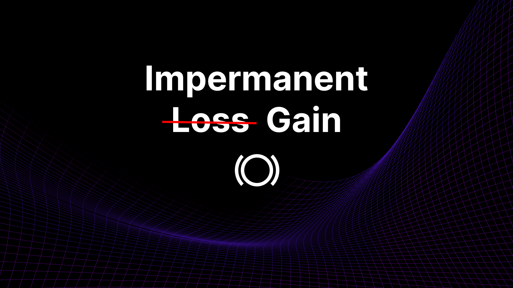
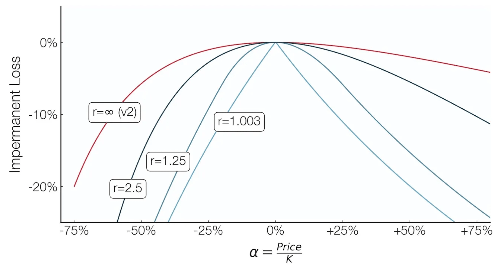
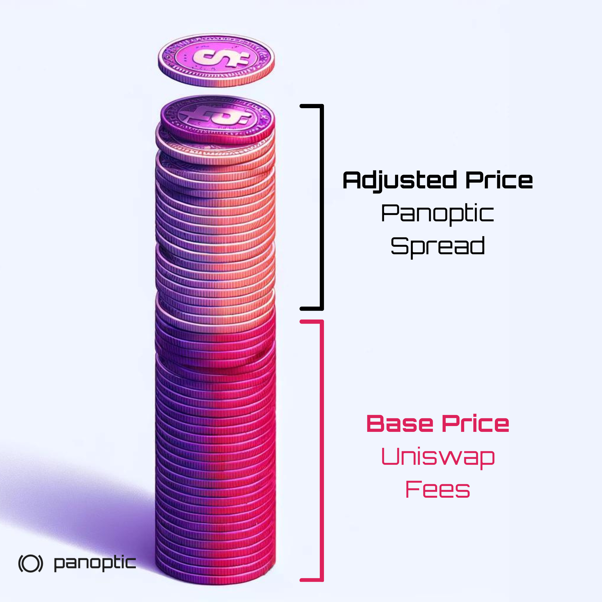
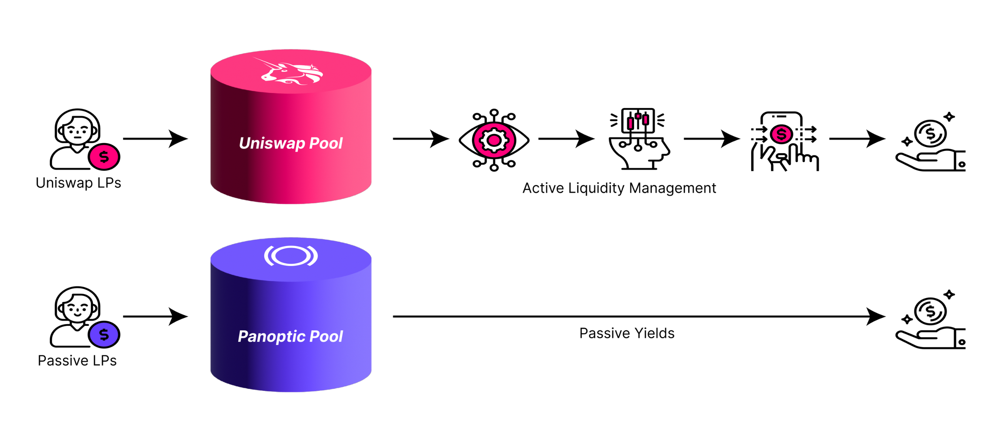
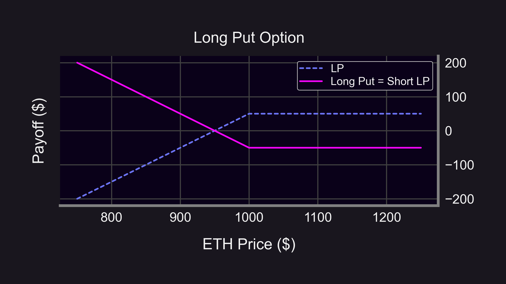
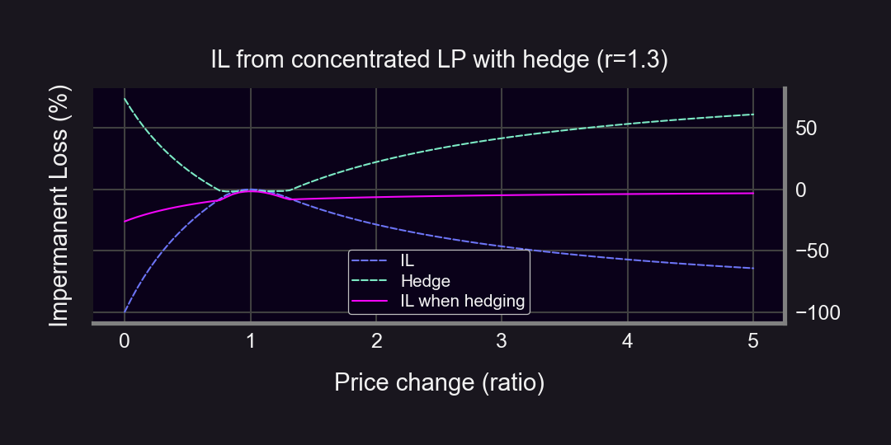
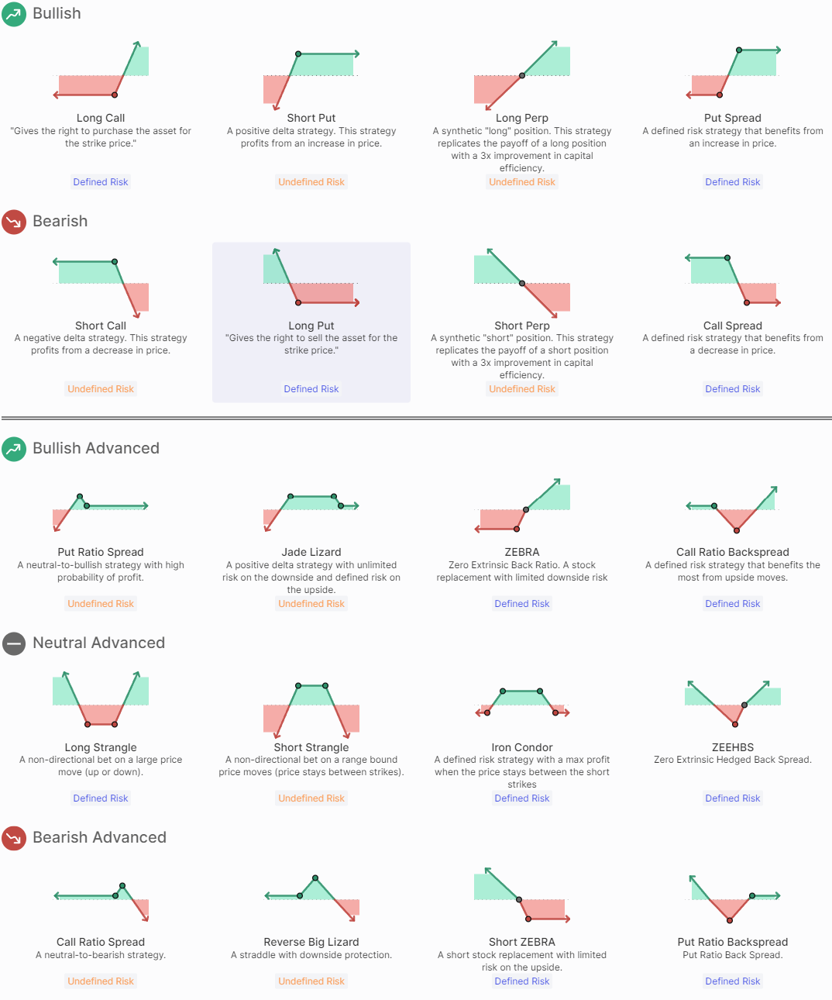

Impermanent Loss (IL) has long been a core problem of liquidity providers in DeFi. IL is a phenomenon that occurs when the price ratio of tokens in a liquidity pool changes. When users provide liquidity to a traditional automated market maker (AMM) like Uniswap, they’re exposed to IL whenever the prices of the paired assets diverge from their initial ratio. This divergence can result in your share of the pool being worth less than if you had simply held the assets separately.

IL is a significant concern for liquidity providers because it can eat into, or even exceed, the fees earned from providing liquidity. This risk often deters potential LPs from participating in DeFi protocols, limiting overall liquidity and market efficiency.

  

Panoptic addresses IL by offering several strategies: LPs can reduce IL with extra yield from lending out LP tokens, avoid it through [passive, single-sided liquidity](https://panoptic.xyz/blog/bringing-passive-liquidity-to-uniswap), or profit from it by shorting an LP position. Shorting LP tokens, a key feature of Panoptic, essentially reverses the traditional role of providing liquidity, allowing LPs to capitalize on downward price movements rather than suffer losses from them. By implementing these strategies, Panoptic provides LPs with safe and efficient ways to navigate the challenges of impermanent loss in decentralized finance.

  

## Increased Revenue From Lending LP Tokens

Panoptic's options markets create an additional revenue stream for liquidity providers. By lending out their LP positions through Panoptic, providers can earn extra fees from options buyers.

  

Through extensive [research](https://lambert-guillaume.medium.com/uniswap-v3-lp-tokens-as-perpetual-put-and-call-options-5b66219db827), Panoptic found that LPing is essentially the same as selling a put option. However, in order to truly “sell” your option, somebody has to be able to “buy” it. Panoptic enables the buying of options by allowing other users to borrow and short your LP position. The options buyers compensate LPs with the fees they would have earned in Uniswap plus an [additional amount](https://panoptic.xyz/docs/product/spread).

  

  

These extra fees act as a buffer against potential losses from impermanent loss. As options buyers pay [premiums](https://panoptic.xyz/blog/streamia-defi-native-options-pricing) to borrow liquidity, LPs receive these extra fees which can offset or even outweigh the negative impact of impermanent loss during periods of price volatility. This mechanism allows LPs to maintain more stable returns and reduce the risk associated with providing liquidity.

## Passive, Single-Sided LPing

Panoptic users can choose to provide single-sided liquidity and [earn passive yield](https://panoptic.xyz/blog/bringing-passive-liquidity-to-uniswap) on their tokens. This approach allows users to provide liquidity for just one asset in a pair, eliminating exposure to IL altogether.

  

  

By lending out tokens to support Uniswap liquidity pools, passive LPs earn fees from borrowers. Passive LPs essentially provide liquidity to liquidity providers – LPception! 🤯 That means no need to make complicated decisions such as choosing a price range or rebalancing an out-of-range position. This is a game-changer for risk-averse participants who want to earn yield without worrying about the complexities of managing a two-token position.

## Shorting LP Tokens for Impermanent Gain

Panoptic introduces the ability to short LP tokens. By doing so, users can effectively create a position that benefits from impermanent gain – the inverse of impermanent loss. This allows traders to hedge against IL or even profit from it, turning a traditional DeFi risk into a potential opportunity. By shorting LP positions, users can also benefit from [Gains-Versus-Rebalancing](https://panoptic.xyz/research/panoptic-solves-lvr#solution-3-users-can-short-uniswap-lp-positions) (GVR).

  

  

Panoptic discovered that shorting an LP token is essentially the same as [buying a put option](http://paper.panoptic.xyz). A long put option has downside protection and can help protect against downward movements that contribute to IL. By shorting LP tokens, users can benefit off price decreases and lock in profits at any time, turning impermanent loss into permanent gains.

  

## Hedging LP Tokens

Panoptic makes it easy to [hedge](https://panoptic.xyz/research/hedge-with-panoptic-options) your LP positions. Delta-neutral LPing and perfectly hedged LP positions can be created via the Panoptic interface with just one-click by selecting a [strangle](https://panoptic.xyz/research/defi-option-strangle-straddle) or [long put](https://panoptic.xyz/research/defi-put-options-uniswap-backtest). By hedging their LP positions, users can reduce or eliminate IL.

  

## Conclusion

By addressing the IL problem, Panoptic is making LPing easier for everyone. Users who [left](https://panoptic.xyz/blog/passive-liquidity-pools) Uniswap v3 can participate again without the fear of suffering IL.

  

By offering tools to hedge against IL, generate additional fees, eliminate IL through single-sided LPing, and even profit from IL by shorting LP positions, Panoptic is paving the way for a more accessible, efficient, and user-friendly DeFi ecosystem.

  
_Join the growing community of Panoptimists and be the first to hear our latest updates by following us on our [social media platforms](https://links.panoptic.xyz/all). To learn more about Panoptic and all things DeFi options, check out our [docs](https://panoptic.xyz/docs/intro) and head to our [website](https://panoptic.xyz/)._